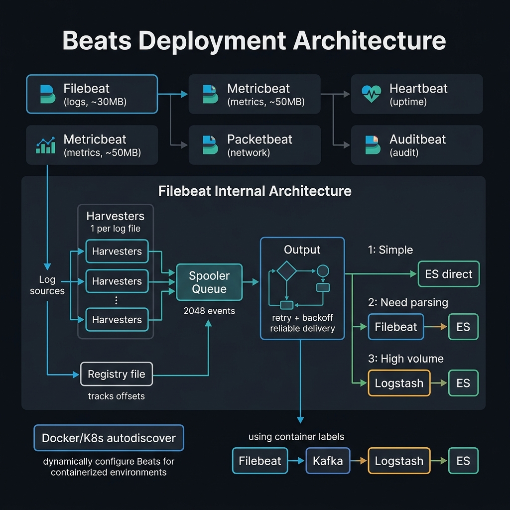

<!-- tags: elk-stack, observability, filebeat -->
# 📦 Filebeat & Metricbeat

> Beats agents: lightweight data shippers for logs and metrics

📅 Created: 2026-03-23 · 🔄 Updated: 2026-04-20 · ⏱️ 10 min read

| Aspect         | Detail                             |
| -------------- | ---------------------------------- |
| **Language**   | Go — lightweight, low resource     |
| **Filebeat**   | Ship log files → Logstash / ES     |
| **Metricbeat** | Ship system/container metrics → ES |
| **Memory**     | Filebeat ~30MB, Metricbeat ~50MB   |

---

## 0. TEMPLATE

> Minimal Filebeat + Metricbeat configs.

```yaml
# ── Filebeat minimal ───────────────────────────────────────────
filebeat.inputs:
    - type: log
      paths: ['/var/log/app/*.log']
output.elasticsearch:
    hosts: ['localhost:9200']
```

```yaml
# ── Metricbeat minimal ─────────────────────────────────────────
metricbeat.modules:
    - module: system
      metricsets: [cpu, memory, filesystem, network]
      period: 10s
output.elasticsearch:
    hosts: ['localhost:9200']
```

---

## 1. DEFINE

Think of log shipping as the easiest step to underestimate until logs start getting lost, duplicated, or parsed incorrectly. Beats is the input pipe that must be durable before search has a chance to shine.


### Beats Family Comparison

| Beat           | Collects          | RAM footprint  | Default output  |
| -------------- | ----------------- | -------------- | --------------- |
| **Filebeat**   | Log files         | ~30MB          | ES / Logstash   |
| **Metricbeat** | System + service  | ~50MB          | ES              |
| **Packetbeat** | Network packets   | ~60MB          | ES              |
| **Heartbeat**  | Uptime (HTTP/TCP) | ~20MB          | ES              |
| **Auditbeat**  | Audit events      | ~40MB          | ES              |

### Filebeat vs Logstash

| Aspect           | Filebeat              | Logstash                |
| ---------------- | --------------------- | ----------------------- |
| **Resource**     | ~30MB RAM, Go binary  | ~1GB RAM, JVM           |
| **Processing**   | Basic (modules)       | Advanced (grok, ruby)   |
| **Install**      | Agent on each server  | Centralized server      |
| **Buffering**    | Disk-based registry   | Memory + persistent Q   |
| **Best for**     | Collecting + shipping | Heavy parsing + routing |
| **Typical flow** | Filebeat → Logstash   | Receives from Filebeat  |

### Output Options

| Output          | When to use                      |
| --------------- | ------------------------------ |
| `elasticsearch` | Simple setup, Filebeat modules |
| `logstash`      | Need parsing/enrichment        |
| `kafka`         | High-volume buffering          |
| `redis`         | Legacy buffering               |
| `file`          | Debug, archive                 |

---

Those failure modes sound easy to avoid. But there is a trap: Filebeat not sending data because output is unreachable = log loss, and metricbeat module misconfigured = metrics missing. That trap appears in PITFALLS.

## 2. VISUAL

Definitions only lock vocabulary. The visual below shows the actual operational flow where containers, pods, log pipelines, and shell commands start hitting production.



### Filebeat Architecture

```text
┌─────────────────────────────────────────────────────────────┐
│                    Filebeat Process                          │
├─────────────────────────────────────────────────────────────┤
│                                                             │
│  ┌────────────────────────┐                                 │
│  │      Harvesters        │    1 harvester per log file     │
│  │  ┌──────────────────┐  │                                 │
│  │  │ /var/log/app.log │──┤    Read line by line            │
│  │  └──────────────────┘  │    Track offset in registry     │
│  │  ┌──────────────────┐  │                                 │
│  │  │ /var/log/err.log │──┤                                 │
│  │  └──────────────────┘  │                                 │
│  └───────────┬────────────┘                                 │
│              │                                              │
│  ┌───────────▼────────────┐                                 │
│  │     Spooler Queue      │    Internal memory buffer       │
│  │    (2048 events max)   │    Batch events together        │
│  └───────────┬────────────┘                                 │
│              │                                              │
│  ┌───────────▼────────────┐                                 │
│  │     Output             │    Send to ES or Logstash       │
│  │  (with retry + backoff)│    Retry on failure             │
│  └────────────────────────┘                                 │
│                                                             │
│  Registry: data/registry/filebeat/log.json                  │
│  Tracks: file path, offset, last read time                  │
└─────────────────────────────────────────────────────────────┘
```

### Output Decision

```text
Log files
  │
  ├── Simple logs + ES modules exist?
  │   └── YES → Filebeat ──────────────▶ Elasticsearch
  │                                       (use modules)
  │
  ├── Need parsing/enrichment?
  │   └── YES → Filebeat ──▶ Logstash ──▶ Elasticsearch
  │                          (grok, etc)
  │
  └── Very high volume (>100K/s)?
      └── YES → Filebeat ──▶ Kafka ──▶ Logstash ──▶ ES
                             (buffer)
```

---

## 3. CODE

The flow above gives you intuition; the section below is what the team will actually copy, review, and own when it goes live.


### Example 1: Basic — Filebeat Log Collection

> **Goal**: Collect application logs.
> **Requires**: Filebeat installed/Docker.
> **Result**: Logs automatically shipped to ES.

```yaml
# filebeat.yml — Application log collection
# ═══════════════════════════════════════════════════════════════

# ✅ Inputs: define sources
filebeat.inputs:
    # ── Application logs (JSON format) ──────────────────────────
    - type: log
      id: app-logs
      enabled: true
      paths:
          - /var/log/app/*.log
          - /var/log/app/**/*.log # ✅ Recursive
      # ✅ JSON parsing
      json.keys_under_root: true # JSON fields → root level
      json.add_error_key: true # Add error.message if parse fails
      json.message_key: 'msg' # Use "msg" field as main message
      # ✅ Multiline — stack traces
      multiline.type: pattern
      multiline.pattern: '^\s+(at |\.{3}|Caused by)'
      multiline.negate: false
      multiline.match: after
      # ✅ Add metadata
      fields:
          type: app-log
          environment: production
      fields_under_root: true
      # ✅ Performance
      close_inactive: 5m # Close file after 5m inactive
      scan_frequency: 5s # Check for new files every 5s

    # ── Nginx access logs ───────────────────────────────────────
    - type: log
      id: nginx-access
      enabled: true
      paths:
          - /var/log/nginx/access.log
      fields:
          type: nginx-access
      fields_under_root: true

    # ── Nginx error logs ────────────────────────────────────────
    - type: log
      id: nginx-error
      enabled: true
      paths:
          - /var/log/nginx/error.log
      fields:
          type: nginx-error
      fields_under_root: true

# ✅ Processors — lightweight transformations
processors:
    - add_host_metadata: ~ # Add hostname, OS, IP
    - add_docker_metadata: ~ # Add container info (if Docker)
    - drop_fields: # ⚠️ Remove noise
          fields: ['agent.ephemeral_id', 'agent.id', 'ecs']
    - drop_event: # ⚠️ Drop health check logs
          when:
              regexp:
                  message: '^(GET|HEAD) /health'

# ✅ Output — choose one
output.logstash:
    hosts: ['logstash:5044']
    bulk_max_size: 2048 # Batch size
    loadbalance: true # ✅ Load balance if multiple hosts

# ── Alternative: direct to ES ─────────────────────────────────
# output.elasticsearch:
#   hosts: ["elasticsearch:9200"]
#   index: "app-logs-%{+yyyy.MM.dd}"
#   pipeline: "app-logs-pipeline"         # ✅ Use ES ingest pipeline

# ✅ Logging
logging.level: warning # ⚠️ Reduce noise in production
logging.to_files: true
logging.files:
    path: /var/log/filebeat
    name: filebeat
    keepfiles: 7
    permissions: 0644
```

```bash
# ✅ Test config
filebeat test config -e
# ✅ Test output connectivity
filebeat test output
# ✅ Run
filebeat -e -c filebeat.yml
# ✅ Docker
docker run -d --name filebeat \
  -v $(pwd)/filebeat.yml:/usr/share/filebeat/filebeat.yml:ro \
  -v /var/log:/var/log:ro \
  docker.elastic.co/beats/filebeat:8.13.0
```

> **Result**: Multi-source log collection, JSON parsing, multiline, processors.
> **Note**: `close_inactive` releases file descriptors — important when monitoring many files.

---

Filebeat setup is covered. But Metricbeat needs module enablement — time to collect.

### Example 2: Intermediate — Metricbeat System Monitoring

> **Goal**: Monitor system + Docker + custom services.
> **Requires**: Metricbeat installed/Docker.
> **Result**: Infrastructure metrics in Kibana.

```yaml
# metricbeat.yml — System + Docker + Service monitoring
# ═══════════════════════════════════════════════════════════════

metricbeat.modules:
    # ── System metrics ──────────────────────────────────────────
    - module: system
      metricsets:
          - cpu # ✅ CPU usage
          - memory # ✅ RAM usage
          - filesystem # ✅ Disk usage
          - network # ✅ Network I/O
          - process # ✅ Process list
          - process_summary # ✅ Process counts
          - load # ✅ System load average
          - diskio # ✅ Disk I/O
      period: 10s # ✅ Collect every 10s
      processes: ['.*'] # Monitor all processes
      process.include_top_n:
          by_cpu: 10 # Top 10 CPU-consuming processes
          by_memory: 10 # Top 10 memory-consuming processes

    # ── Docker metrics ──────────────────────────────────────────
    - module: docker
      metricsets:
          - container # ✅ Container stats
          - cpu # ✅ Container CPU
          - memory # ✅ Container memory
          - network # ✅ Container network
          - diskio # ✅ Container disk I/O
          - healthcheck # ✅ Health status
      hosts: ['unix:///var/run/docker.sock']
      period: 15s

    # ── Elasticsearch metrics ───────────────────────────────────
    - module: elasticsearch
      metricsets:
          - node # ✅ Node stats
          - node_stats # ✅ Detailed stats
          - cluster_stats # ✅ Cluster overview
          - index # ✅ Index stats
      hosts: ['http://elasticsearch:9200']
      period: 30s

    # ── Nginx metrics (via stub_status) ─────────────────────────
    - module: nginx
      metricsets: ['stubstatus']
      hosts: ['http://nginx:80']
      server_status_path: '/nginx_status' # ✅ Requires nginx stub_status
      period: 10s

# ✅ Processors
processors:
    - add_host_metadata: ~
    - add_docker_metadata: ~
    - add_cloud_metadata: ~ # ✅ AWS/GCP/Azure metadata

# ✅ Output
output.elasticsearch:
    hosts: ['elasticsearch:9200']
    index: 'metricbeat-%{[agent.version]}-%{+yyyy.MM.dd}'

# ✅ Kibana — auto-load dashboards
setup.kibana:
    host: 'kibana:5601'

setup.dashboards:
    enabled: true # ✅ Auto-import dashboards on start

# ✅ ILM
setup.ilm:
    enabled: true # ✅ Auto-manage index lifecycle
    rollover_alias: 'metricbeat'

logging.level: warning
```

```bash
# ✅ Load pre-built dashboards
metricbeat setup --dashboards

# ✅ Run
metricbeat -e -c metricbeat.yml

# ✅ Docker — needs special permissions for system metrics
docker run -d --name metricbeat \
  --user=root \
  --volume=$(pwd)/metricbeat.yml:/usr/share/metricbeat/metricbeat.yml:ro \
  --volume=/var/run/docker.sock:/var/run/docker.sock:ro \
  --volume=/proc:/hostfs/proc:ro \
  --volume=/sys/fs/cgroup:/hostfs/sys/fs/cgroup:ro \
  --volume=/:/hostfs:ro \
  --net=host \
  docker.elastic.co/beats/metricbeat:8.13.0 \
  metricbeat -e -system.hostfs=/hostfs
```

> **Result**: System, Docker, ES, nginx monitoring with auto-loaded dashboards.
> **Note**: Docker Metricbeat needs `--net=host` and `hostfs` mounts to read host metrics.

---

Metricbeat is covered. But multi-output needs routing — time to split the flow.

### Example 3: Advanced — Filebeat Modules + Autodiscover

> **Goal**: Zero-config log parsing with built-in modules.
> **Requires**: Filebeat 8.x.
> **Result**: Automatic parsing + dashboards for common services.

```yaml
# filebeat-modules.yml — Module-based configuration
# ═══════════════════════════════════════════════════════════════

# ✅ Enable modules — auto parsing for common services
filebeat.modules:
    # ── Nginx module ───────────────────────────────────────────
    - module: nginx
      access:
          enabled: true
          var.paths: ['/var/log/nginx/access.log']
      error:
          enabled: true
          var.paths: ['/var/log/nginx/error.log']

    # ── System module (syslog + auth) ─────────────────────────
    - module: system
      syslog:
          enabled: true
      auth:
          enabled: true

    # ── PostgreSQL module ──────────────────────────────────────
    - module: postgresql
      log:
          enabled: true
          var.paths: ['/var/log/postgresql/*.log']

# ═══════════════════════════════════════════════════════════════
# ✅ Docker Autodiscover — auto-detect containers
# ═══════════════════════════════════════════════════════════════
filebeat.autodiscover:
    providers:
        - type: docker
          hints.enabled: true # ✅ Use Docker labels as hints
          hints.default_config:
              type: container
              paths:
                  - /var/lib/docker/containers/${data.container.id}/*.log

# Docker labels on containers to configure Filebeat:
# docker run --label co.elastic.logs/module=nginx
#            --label co.elastic.logs/fileset.stdout=access
#            --label co.elastic.logs/fileset.stderr=error
#            nginx

# ═══════════════════════════════════════════════════════════════
# ✅ Kubernetes Autodiscover
# ═══════════════════════════════════════════════════════════════
# filebeat.autodiscover:
#   providers:
#     - type: kubernetes
#       node: ${NODE_NAME}
#       hints.enabled: true
#       hints.default_config:
#         type: container
#         paths:
#           - /var/log/containers/*${data.kubernetes.container.id}.log

output.elasticsearch:
    hosts: ['elasticsearch:9200']
    # ✅ Modules auto-create index names
    # nginx-access → filebeat-8.13.0-nginx-access-*

setup.kibana:
    host: 'kibana:5601'

setup.dashboards:
    enabled: true # ✅ Modules come with pre-built dashboards
```

```bash
# ✅ List available modules
filebeat modules list

# ✅ Enable module
filebeat modules enable nginx system postgresql

# ✅ Setup (index templates + dashboards + ILM)
filebeat setup -e

# ✅ Run with modules
filebeat -e -c filebeat-modules.yml
```

> **Result**: Zero-config parsing + dashboards for nginx, system, postgresql.
> **Note**: Modules use ES Ingest Pipelines — no Logstash needed.

---

You have covered Filebeat, Metricbeat, and routing. Now comes the dangerous part: unreachable output and wrong module config — the trap set up from the beginning.

## 4. PITFALLS

Mistakes rarely come from syntax; they come from operational boundary assumptions and forgotten failure modes. The table below collects exactly those errors.


| #   | Mistake                                      | Fix                                                 |
| --- | -------------------------------------------- | --------------------------------------------------- |
| 1   | Filebeat: "too many open files"              | Increase `ulimit -n`, reduce `close_inactive`       |
| 2   | Registry too large (many rotated files)      | Set `clean_inactive`, `clean_removed`               |
| 3   | Metricbeat: permission denied (Docker sock)  | Run as root or add to docker group                  |
| 4   | Duplicate logs after restart                 | Check registry integrity, set `clean_removed: true` |
| 5   | Multiline merge incorrect                    | Test pattern, check `negate` + `match` combination  |
| 6   | Autodiscover not detecting container         | Check Docker labels format: `co.elastic.logs/...`   |

---

You have covered Filebeat & Metricbeat and the traps. The resources below help go deeper.

## 5. REF

| Resource             | Link                                                                                                                                                                 |
| -------------------- | -------------------------------------------------------------------------------------------------------------------------------------------------------------------- |
| Filebeat Reference   | [elastic.co/guide/en/beats/filebeat](https://www.elastic.co/guide/en/beats/filebeat/current/index.html)                                                              |
| Metricbeat Reference | [elastic.co/guide/en/beats/metricbeat](https://www.elastic.co/guide/en/beats/metricbeat/current/index.html)                                                          |
| Filebeat Modules     | [elastic.co/guide/en/beats/filebeat/current/filebeat-modules.html](https://www.elastic.co/guide/en/beats/filebeat/current/filebeat-modules.html)                     |
| Autodiscover         | [elastic.co/guide/en/beats/filebeat/current/configuration-autodiscover.html](https://www.elastic.co/guide/en/beats/filebeat/current/configuration-autodiscover.html) |
| Beats Docker         | [elastic.co/guide/en/beats/filebeat/current/running-on-docker.html](https://www.elastic.co/guide/en/beats/filebeat/current/running-on-docker.html)                   |

---

## 6. RECOMMEND

The resources below connect directly to the pressures that typically appear right after you apply these concepts to a real system.


| Extension                   | When                          | Reason                        |
| --------------------------- | ----------------------------- | ----------------------------- |
| **Elastic Agent**           | Replace multiple Beats        | Single agent, Fleet-managed   |
| **Fleet / Kibana Fleet**    | Manage many agents            | Centralized config management |
| **Heartbeat**               | Uptime monitoring             | HTTP/TCP/ICMP checks          |
| **OpenTelemetry Collector** | Vendor-neutral                | CNCF standard, multi-backend  |
| **Fluent Bit**              | Kubernetes, ultra-lightweight | ~5MB RAM, CNCF project        |

---

## 🃏 Quick Reference

| #   | Command / Config                | Description            |
| --- | ------------------------------- | ---------------------- |
| 1   | `filebeat test config -e`       | Validate config        |
| 2   | `filebeat test output`          | Test connectivity      |
| 3   | `filebeat modules list`         | List modules           |
| 4   | `filebeat modules enable nginx` | Enable module          |
| 5   | `filebeat setup --dashboards`   | Load dashboards        |
| 6   | `metricbeat setup -e`           | Setup templates        |
| 7   | `close_inactive: 5m`            | Release file handles   |
| 8   | `scan_frequency: 10s`           | New file detection     |
| 9   | `output.logstash`               | Ship to Logstash       |
| 10  | `output.elasticsearch`          | Ship direct to ES      |

---

## 🔍 Debug Checklist

| # | Symptom | Root cause | Diagnostic command |
|---|---------|------------|-------------------|
| 1 | Filebeat not sending data | Output ES unreachable | `filebeat test output` |
| 2 | Filebeat duplicate events | Registry file deleted/reset | Check `~/.filebeat/registry/` |
| 3 | Filebeat missing log lines | Harvester not keeping up — `filebeat.inputs.scan_frequency` too large | Reduce to `scan_frequency: 5s` |
| 4 | Metricbeat module not showing metrics | Module not enabled | `metricbeat modules enable system docker` |
| 5 | Beats → Logstash TLS error | Cert mismatch | Check `ssl.certificate_authorities` in beats config |
| 6 | High memory usage Filebeat | Too many prospectors (file patterns) | Consolidate patterns, use `paths: ["/var/log/**/*.log"]` |
| 7 | Elastic Agent enrollment fail | Fleet Server URL wrong | Check `kibana.fleet.hosts` setting |

---

## 🎯 Interview Angle

**Related system design / technical questions:**
- *"When to use Filebeat directly to ES, when to add Logstash in between?"*
- *"How does Elastic Agent differ from individual Beats (Filebeat, Metricbeat)?"*
- *"How does back-pressure handling in Beats work when downstream is slow?"*

**Key talking points interviewers expect:**

| Topic | Talking point |
|-------|---------------|
| Filebeat vs Logstash | Filebeat = collect + ship (lightweight); Logstash = parse + enrich + route (heavyweight); not exclusive — often used together |
| Beats → ES direct | Use when log format is standard (modules), ES Ingest Pipeline is sufficient; simpler, fewer components |
| Beats → Logstash → ES | Use when complex grok is needed, multi-source routing, Ruby transformations, or fan-out to multiple outputs |
| Elastic Agent | Single agent replacing multiple Beats; Fleet-managed (centralized config); supports Integrations catalog |
| Back-pressure | Filebeat has internal queue + retry with exponential backoff; when queue is full → pause harvesting (no data loss) |
| High-volume pipeline | Filebeat → Kafka (buffer) → Logstash → ES; Kafka serves as decoupler and absorbs traffic spikes |

**Common follow-up questions:**
- *"What is the Filebeat registry and why is it important?"* → Registry stores the offset of each file read → ensures no data loss and no duplicate after restart; losing registry = duplicate events
- *"How to scale Filebeat in Kubernetes?"* → Run as DaemonSet (1 pod per node) → mount host `/var/log` → use autodiscover with K8s hints
- *"Elastic Agent Fleet vs Ansible/Puppet for managing Beats config?"* → Fleet = real-time policy push, built-in version management, integrated Kibana UI; Ansible = more flexible but requires separate tooling

---

**Links**: [← Kibana Dashboard](./01-kibana-dashboard.md) · [→ ELK Overview](../fundamental/01-elk-overview.md)

