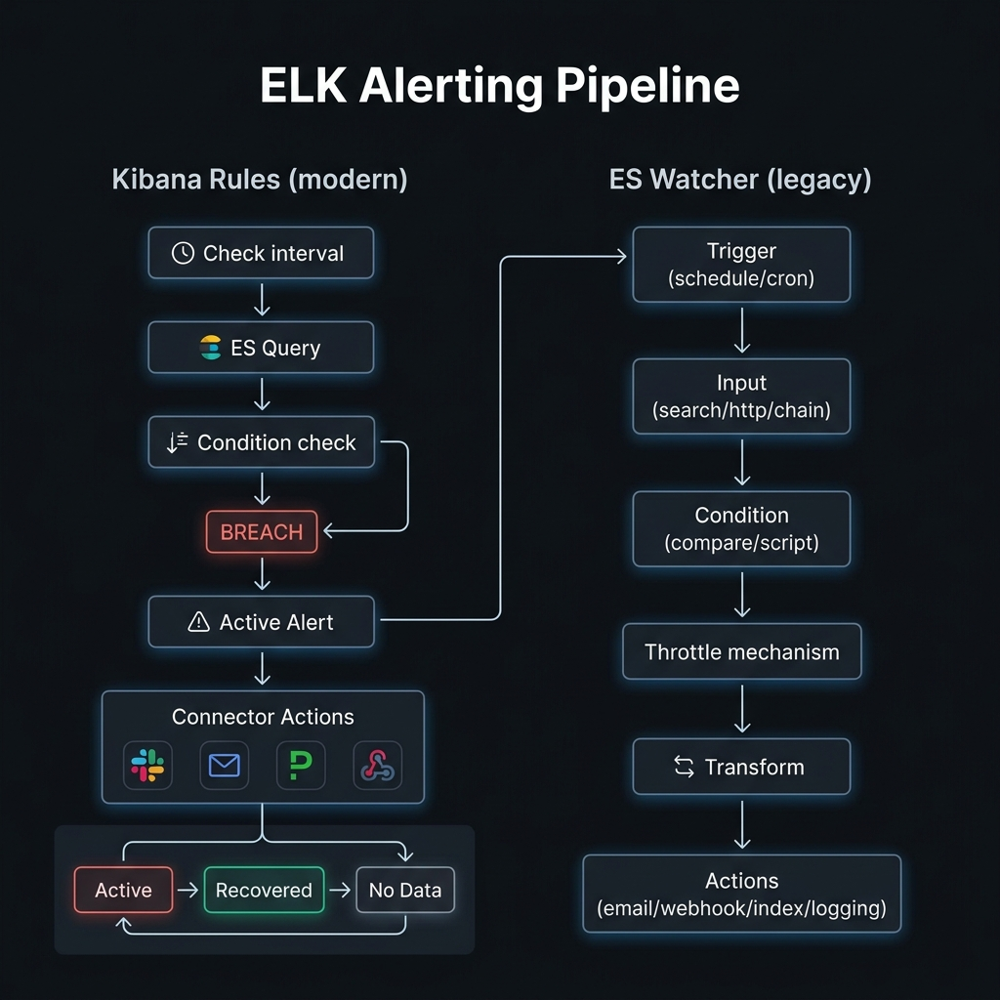

<!-- tags: elk-stack, observability, kibana -->
# 🔔 Kibana Alerting & Watcher

> Kibana Rules, Connectors, Actions, Watcher — automated alerts when data breaches thresholds

📅 Created: 2026-03-24 · 🔄 Updated: 2026-04-20 · ⏱️ 12 min read

| Aspect            | Detail                                                          |
| ----------------- | --------------------------------------------------------------- |
| **Alerting engine** | Kibana Rules (modern) + ES Watcher (legacy)                   |
| **Check interval** | Configurable per rule (min 1 min)                              |
| **Connectors**    | Email, Slack, PagerDuty, Webhook, ServiceNow                    |
| **Alert types**   | Threshold, Index Threshold, ES Query, Log Threshold, Anomaly    |

---

## 0. TEMPLATE

> Basic Watcher and Kibana Rule via API — use as a skeleton.

```bash
# ── Watcher (Elasticsearch) ──────────────────────────────────────
# Create a watcher
curl -X PUT 'localhost:9200/_watcher/watch/error-spike' \
  -H 'Content-Type: application/json' -u elastic:changeme \
  -d '{
    "trigger": { "schedule": { "interval": "5m" } },
    "input": {
      "search": {
        "request": {
          "indices": ["logs-*"],
          "body": {
            "query": {
              "bool": {
                "filter": [
                  { "term": { "level.keyword": "ERROR" } },
                  { "range": { "@timestamp": { "gte": "now-5m" } } }
                ]
              }
            }
          }
        }
      }
    },
    "condition": { "compare": { "ctx.payload.hits.total.value": { "gt": 100 } } },
    "actions": {
      "send_email": {
        "email": {
          "to": ["oncall@company.com"],
          "subject": "ERROR spike detected: {{ctx.payload.hits.total.value}} errors in 5m"
        }
      }
    }
  }'

# Check watcher status
curl 'localhost:9200/_watcher/watch/error-spike' -u elastic:changeme
curl -X POST 'localhost:9200/_watcher/watch/error-spike/_execute' -u elastic:changeme  # Test
```

---

## 1. DEFINE

Think of alerting as only useful when it cuts the right signal into action, not when it adds more noise. This lesson exists to maintain that distance.


### Kibana Rules (Modern, UI-driven)

Kibana Rules is the default alerting method since Kibana 7.7+:

| Component | Description |
| ---------- | ----- |
| **Rule type** | Rule type: Index Threshold, ES Query, Log Threshold, Metrics Threshold, Uptime |
| **Check interval** | How often Kibana runs the check query (e.g. every 1 minute) |
| **Connector** | Channel to send notification: Email, Slack, PagerDuty, Webhook |
| **Alert lifecycle** | Active → Recovered → No Data — each transition can trigger a separate action |
| **Throttle** | Suppress repeated alerts within a time window (e.g. no more than once per hour) |

**Common rule types:**

| Rule type | Triggers when | Use case |
| --------- | ----------- | -------- |
| **Index Threshold** | Aggregation (count/avg/sum) exceeds threshold | Error count > 100 in 5 minutes |
| **ES Query** | ES query returns results | Find specific patterns in logs |
| **Log Threshold** | Log line count exceeds threshold | Log rate anomaly |
| **Metrics Threshold** | CPU/Memory/Disk exceeds limit | Host CPU > 90% for 10 minutes |
| **Anomaly Detection** | ML anomaly score exceeds threshold | Unusual traffic pattern |

### ES Watcher (Legacy, API-driven)

Watcher is the original alerting engine of Elasticsearch — more complex but more flexible:

| Component | Description |
| ---------- | ----- |
| **Trigger** | When the watch runs — `schedule` (cron/interval) |
| **Input** | What data to fetch — `search`, `http`, `simple`, `chain` |
| **Condition** | Evaluate data — `compare`, `script`, `array_compare` |
| **Transform** | Reshape data before sending to action (optional) |
| **Actions** | What to do when condition = true — `email`, `webhook`, `index`, `slack` |

### Kibana Rules vs Watcher

| Aspect | Kibana Rules | Watcher |
| ------ | ------------ | ------- |
| **Interface** | Kibana UI | REST API / JSON |
| **Ease of use** | Easy (form-based) | Medium (JSON config) |
| **Flexibility** | Standard thresholds | Arbitrary logic (script, chain input) |
| **Data source** | ES indices | ES indices + external HTTP |
| **Actions** | Connector ecosystem (Slack, PD, etc.) | email, webhook, index, Jira |
| **Best for** | Ops dashboards, standard alerts | Automated workflows, complex logic |
| **Scheduling** | Interval (min 1m) | Cron + interval |

---

Those failure modes sound basic. But there is a trap: a rule sending alerts every check interval = inbox flood, and missing throttle = noise overwhelm. That trap appears in PITFALLS.

## 2. VISUAL

Definitions only lock vocabulary. The visual below shows the actual operational flow where containers, pods, log pipelines, and shell commands start hitting production.




```text
Kibana Alerting Rule lifecycle:

Check every N min
      │
      ▼
  [ES Query] ─── result ──▶ [Condition check]
                                    │
                          ┌─────────┴──────────┐
                       BREACH              OK / No Data
                          │                    │
                          ▼                    ▼
                   [ACTIVE alert]      [Recovered / Flapping]
                          │
                          ▼
                  [Connector Actions]
                  ├── Slack message
                  ├── Email
                  ├── PagerDuty incident
                  └── Webhook (custom)
```

```text
Watcher execution pipeline:

  ┌──────────────────────────────────────────────────────┐
  │                    ES Watcher                         │
  │                                                       │
  │  TRIGGER (schedule)                                   │
  │      │                                                │
  │      ▼                                                │
  │  INPUT (search / http / chain)                        │
  │      │  ctx.payload = query results                   │
  │      ▼                                                │
  │  CONDITION (compare / script)                         │
  │      │                                                │
  │    true ──▶ TRANSFORM (optional)                     │
  │                    │  reshape ctx.payload             │
  │                    ▼                                  │
  │              ACTIONS                                  │
  │              ├── email                                │
  │              ├── webhook → Slack/PagerDuty            │
  │              ├── index  → write alert to ES           │
  │              └── logging                              │
  └──────────────────────────────────────────────────────┘
```

---

## 3. CODE

The flow above gives you intuition; the section below is what the team will actually copy, review, and own when it goes live.


### Example 1: Basic — Kibana Index Threshold Rule via API

> **Goal**: Create an alert rule when error count exceeds threshold.
> **Requires**: Kibana 8.x with Alerting plugin.
> **Result**: Automated Slack alert when errors spike.

```bash
# ── Create Slack connector first ────────────────────────────────
curl -X POST 'localhost:5601/api/actions/connector' \
  -H 'Content-Type: application/json' \
  -H 'kbn-xsrf: true' \
  -u elastic:changeme \
  -d '{
    "name": "ops-slack",
    "connector_type_id": ".slack",
    "config": {},
    "secrets": {
      "webhookUrl": "https://hooks.slack.com/services/T000/B000/xxxx"
    }
  }'
# Response: {"id": "connector-id-abc", "name": "ops-slack", ...}

# ── Create Index Threshold rule ──────────────────────────────────
curl -X POST 'localhost:5601/api/alerting/rule' \
  -H 'Content-Type: application/json' \
  -H 'kbn-xsrf: true' \
  -u elastic:changeme \
  -d '{
    "name": "High Error Rate Alert",
    "rule_type_id": ".index-threshold",
    "consumer": "alerts",
    "schedule": { "interval": "1m" },
    "params": {
      "index": ["logs-*"],
      "timeField": "@timestamp",
      "aggType": "count",
      "groupBy": "all",
      "termSize": 5,
      "timeWindowSize": 5,
      "timeWindowUnit": "m",
      "thresholdComparator": ">",
      "threshold": [100],
      "filterKuery": "level.keyword: \"ERROR\""
    },
    "actions": [
      {
        "id": "connector-id-abc",
        "group": "threshold met",
        "params": {
          "message": "🚨 ERROR spike: {{context.value}} errors in last 5m (threshold: 100)\nService: {{context.conditions}}"
        }
      },
      {
        "id": "connector-id-abc",
        "group": "recovered",
        "params": {
          "message": "✅ Error rate recovered: {{context.value}} errors in last 5m"
        }
      }
    ],
    "throttle": "1h",
    "notify_when": "onThrottleInterval"
  }'

# ── Check active rules ─────────────────────────────────────────
curl 'localhost:5601/api/alerting/rules/_find?per_page=20&sort_field=name' \
  -H 'kbn-xsrf: true' \
  -u elastic:changeme | jq '.data[].name'

# ── Mute/unmute rule ────────────────────────────────────────────
curl -X POST 'localhost:5601/api/alerting/rule/{rule-id}/_mute_all' \
  -H 'kbn-xsrf: true' \
  -u elastic:changeme

curl -X POST 'localhost:5601/api/alerting/rule/{rule-id}/_unmute_all' \
  -H 'kbn-xsrf: true' \
  -u elastic:changeme
```

> **Result**: Slack connector, Index Threshold rule with throttle, recovered action.
> **Note**: `notify_when: "onThrottleInterval"` = only sends every throttle interval. `"onActiveAlert"` = sends every check — easily causes alert storms.

---

Basic alert is covered. But multi-condition needs composition — time to combine.

### Example 2: Intermediate — Watcher with Email Action for Error Spike

> **Goal**: More complex Watcher with multiple conditions and email.
> **Requires**: ES with X-Pack Alerting (Watcher).
> **Result**: Fine-grained control, custom email template.

```bash
# ── Watcher: alert when error spike in 5 minutes ──────────────
curl -X PUT 'localhost:9200/_watcher/watch/error-spike-watcher' \
  -H 'Content-Type: application/json' \
  -u elastic:changeme \
  -d '{
    "trigger": {
      "schedule": { "interval": "5m" }
    },
    "input": {
      "search": {
        "request": {
          "indices": ["logs-*"],
          "body": {
            "size": 0,
            "query": {
              "bool": {
                "filter": [
                  { "term": { "level.keyword": "ERROR" } },
                  { "range": { "@timestamp": { "gte": "now-5m", "lte": "now" } } }
                ]
              }
            },
            "aggs": {
              "by_service": {
                "terms": { "field": "service.keyword", "size": 10 },
                "aggs": {
                  "error_count": { "value_count": { "field": "@timestamp" } }
                }
              }
            }
          }
        }
      }
    },
    "condition": {
      "compare": {
        "ctx.payload.hits.total.value": { "gt": 50 }
      }
    },
    "throttle_period": "30m",
    "actions": {
      "notify_email": {
        "throttle_period": "30m",
        "email": {
          "profile": "standard",
          "to": ["oncall@company.com", "dev-leads@company.com"],
          "subject": "🚨 [{{ctx.metadata.name}}] ERROR spike: {{ctx.payload.hits.total.value}} errors",
          "body": {
            "html": "<h2>Error Spike Detected</h2><p>Total errors in last 5 minutes: <strong>{{ctx.payload.hits.total.value}}</strong></p><p>Threshold: 50</p><p>Time: {{ctx.execution_time}}</p><p>Check Kibana for details.</p>"
          }
        }
      },
      "log_alert": {
        "logging": {
          "text": "ALERT: error-spike-watcher triggered. Count={{ctx.payload.hits.total.value}}"
        }
      }
    }
  }'

# ── Test watcher manually (do not wait for schedule) ────────────────
curl -X POST 'localhost:9200/_watcher/watch/error-spike-watcher/_execute' \
  -H 'Content-Type: application/json' \
  -u elastic:changeme \
  -d '{
    "trigger_data": {
      "triggered_time": "now",
      "scheduled_time": "now"
    },
    "action_modes": {
      "notify_email": "force_execute"
    },
    "ignore_condition": true
  }'
# ✅ ignore_condition=true → force execute even if condition is false

# ── View watch execution history ─────────────────────────────────
curl 'localhost:9200/.watcher-history-*/_search?pretty' \
  -H 'Content-Type: application/json' \
  -u elastic:changeme \
  -d '{
    "size": 5,
    "sort": [{ "@timestamp": "desc" }],
    "query": {
      "term": { "watch_id": "error-spike-watcher" }
    },
    "_source": ["watch_id", "state", "@timestamp", "result.condition", "result.actions"]
  }'

# ── Enable / Disable watcher ────────────────────────────────────
curl -X PUT 'localhost:9200/_watcher/watch/error-spike-watcher/_deactivate' -u elastic:changeme
curl -X PUT 'localhost:9200/_watcher/watch/error-spike-watcher/_activate' -u elastic:changeme
```

> **Result**: Watcher with aggregation input, throttle, email HTML, force-execute testing, history query.
> **Note**: Watcher needs email account configured in `elasticsearch.yml` (`xpack.notification.email.account`). Missing config → action fails silently.

---

Multi-condition is covered. But notification routing needs a channel — time to dispatch.

### Example 3: Advanced — Watcher with Transform + Slack Webhook + Throttle

> **Goal**: Watcher with data transform, Slack webhook, per-service breakdown.
> **Requires**: ES Watcher + Slack webhook URL.
> **Result**: Rich Slack notification with full context, alert storm protection.

```bash
# ── Advanced Watcher: transform + Slack webhook ─────────────────
curl -X PUT 'localhost:9200/_watcher/watch/service-error-breakdown' \
  -H 'Content-Type: application/json' \
  -u elastic:changeme \
  -d '{
    "trigger": {
      "schedule": {
        "cron": "0 */5 * * * ?"
      }
    },
    "input": {
      "chain": {
        "inputs": [
          {
            "error_count": {
              "search": {
                "request": {
                  "indices": ["logs-*"],
                  "body": {
                    "size": 0,
                    "query": {
                      "bool": {
                        "filter": [
                          { "term": { "level.keyword": "ERROR" } },
                          { "range": { "@timestamp": { "gte": "now-5m" } } }
                        ]
                      }
                    },
                    "aggs": {
                      "by_service": {
                        "terms": { "field": "service.keyword", "size": 5, "order": { "_count": "desc" } }
                      }
                    }
                  }
                }
              }
            }
          }
        ]
      }
    },
    "condition": {
      "script": {
        "lang": "painless",
        "source": "return ctx.payload.error_count.hits.total.value > 20;"
      }
    },
    "transform": {
      "script": {
        "lang": "painless",
        "source": "def buckets = ctx.payload.error_count.aggregations.by_service.buckets; def lines = []; for (def b : buckets) { lines.add(b.key + \": \" + b.doc_count + \" errors\"); } return [\"total\": ctx.payload.error_count.hits.total.value, \"services\": lines.join(\"\\n\"), \"time\": ctx.execution_time];"
      }
    },
    "throttle_period": "1h",
    "actions": {
      "slack_notification": {
        "throttle_period": "1h",
        "webhook": {
          "method": "POST",
          "url": "https://hooks.slack.com/services/T000/B000/xxxx",
          "body": "{\"text\": \"🚨 *ERROR Spike* — {{ctx.payload.total}} errors in last 5 min\\n\\n*Top services:*\\n{{ctx.payload.services}}\\n\\n_Time: {{ctx.payload.time}}_\"}"
        }
      },
      "index_alert": {
        "index": {
          "index": "alerts-history",
          "doc_id": "{{ctx.watch_id}}-{{ctx.execution_time}}"
        }
      }
    }
  }'

# ── Watcher stats — health check ───────────────────────────────
curl 'localhost:9200/_watcher/stats?pretty' -u elastic:changeme
# Check: watcher_state, watch_count, execution_thread_pool

# ── List all watches ────────────────────────────────────────────
curl 'localhost:9200/_watcher/watch?pretty' -u elastic:changeme

# ── Delete watcher ──────────────────────────────────────────────
curl -X DELETE 'localhost:9200/_watcher/watch/service-error-breakdown' -u elastic:changeme
```

> **Result**: Chain input, Painless script condition, transform to reshape data, Slack webhook with formatted message, index action to store alert history.
> **Note**: `chain` input: each input's results are accessible via `ctx.payload.<input_name>`. Transform overwrites `ctx.payload` — after transform, actions use the transformed payload.

---

You have covered basic alert, composition, and routing. Now comes the dangerous part: alert flood and missing throttle — the trap set up from the beginning.

## 4. PITFALLS

Mistakes rarely come from syntax; they come from operational boundary assumptions and forgotten failure modes. The table below collects exactly those errors.


| # | Mistake | Root cause | Fix |
|---|---------|------------|-----|
| 1 | Rule sends alert every check interval — inbox flooded | Missing throttle config | Set `throttle: "1h"` and `notify_when: "onThrottleInterval"` |
| 2 | Watcher input returns 0 results despite data existing | Wrong index pattern or time range filter | Use `_execute` API with `ignore_condition: true` to debug query independently |
| 3 | Connector fails silently — no notification received | Auth wrong (Slack token expired) or network | Kibana → Stack Management → Rules → Alert history to view connector errors |
| 4 | Alert storm — many rules trigger at once, flood channel | Synchronized check intervals, overly sensitive conditions | Stagger check intervals (+/- 30s offset), add secondary conditions, increase throttle |
| 5 | "No data" state not handled → no alert when data pipeline stops | Rule not configured with `no_data` action | Set action for group `noData` in Kibana Rules to alert when data is missing |

---

You have covered Alerting and the traps. The resources below help go deeper.

## 5. REF

- [Kibana Alerting Getting Started](https://www.elastic.co/guide/en/kibana/current/alerting-getting-started.html)
- [Kibana Alerting API](https://www.elastic.co/guide/en/kibana/current/alerting-apis.html)
- [Elasticsearch Watcher](https://www.elastic.co/guide/en/elasticsearch/reference/current/xpack-alerting.html)
- [Watcher Actions Reference](https://www.elastic.co/guide/en/elasticsearch/reference/current/actions.html)
- [Connectors and Actions](https://www.elastic.co/guide/en/kibana/current/action-types.html)

---

## 6. RECOMMEND

The resources below connect directly to the pressures that typically appear right after you apply these concepts to a real system.


| Technique | Use case | Link |
| -------- | -------- | ---- |
| **Elastic Observability Alerts** | APM + Logs + Metrics alerting centralized in a single UI | [Observability docs](https://www.elastic.co/guide/en/observability/current/create-alerts.html) |
| **PagerDuty / OpsGenie connector** | On-call rotation, escalation policies, incident dedup | [PagerDuty connector](https://www.elastic.co/guide/en/kibana/current/pagerduty-action-type.html) |
| **Alert-as-code with Terraform** | Manage Watcher configs in Git, review via PR | [Terraform elastic provider](https://registry.terraform.io/providers/elastic/ec/latest) |
| **SLO Alerting** | Alert when error budget burn rate exceeds threshold | [Kibana SLO docs](https://www.elastic.co/guide/en/observability/current/slo.html) |
| **ML Anomaly Detection Rules** | Alert based on anomaly score instead of fixed threshold | [ML Alerting](https://www.elastic.co/guide/en/machine-learning/current/ml-configuring-alerts.html) |

---

## 🃏 Quick Reference

| # | Pattern | Command/Rule |
|---|---------|-------------|
| 1 | Create Watcher | `PUT /_watcher/watch/{id}` |
| 2 | Test Watcher | `POST /_watcher/watch/{id}/_execute` with `"ignore_condition": true` |
| 3 | Deactivate Watcher | `PUT /_watcher/watch/{id}/_deactivate` |
| 4 | Watcher history | `GET /.watcher-history-*/_search` sort by `@timestamp` desc |
| 5 | Watcher stats | `GET /_watcher/stats` |
| 6 | Kibana rule API | `POST /api/alerting/rule` with `rule_type_id` + `params` + `actions` |
| 7 | List Kibana rules | `GET /api/alerting/rules/_find` |
| 8 | Throttle rule | `"throttle": "1h"` + `"notify_when": "onThrottleInterval"` |
| 9 | Test connector | Kibana UI → Stack Management → Connectors → Test |
| 10 | Suppress alert | `POST /api/alerting/rule/{id}/_mute_all` |

---

## 🔍 Debug Checklist

| # | Symptom | Root cause | Diagnostic command |
|---|---------|------------|-------------------|
| 1 | Watcher not triggering on schedule | Watcher deactivated or Watcher service stopped | `GET /_watcher/stats` check `watcher_state`; `GET /_watcher/watch/{id}` check `status.state` |
| 2 | Watcher triggers but does not send email/Slack | Condition = false, or action config wrong (email account not set up) | `_execute` with `"ignore_condition": true, "action_modes": {"*": "force_execute"}` |
| 3 | Kibana rule "Error" state | Connector auth expired or ES query syntax wrong | Kibana → Stack Management → Rules → click rule → view error message |
| 4 | Alert sent continuously — no throttle | `notify_when: "onActiveAlert"` instead of `onThrottleInterval` | Edit rule: change `notify_when` + set `throttle` |
| 5 | "No data" but rule does not alert | No action configured for `noData` group | Add action with `"group": "noData"` in rule config |
| 6 | Watcher history index full → disk pressure | `.watcher-history-*` index has no ILM | Set ILM policy for `.watcher-history-*` to delete after N days |
| 7 | Slack message sent but format broken | Mustache template syntax error in `body` | Check template in Watcher `_execute` response, escape JSON characters correctly |

---

## 🎯 Interview Angle

**Related system design / technical questions:**
- *"How would you set up alerting for a Go service using ELK?"*
- *"Kibana Rules vs Watcher — when to choose which?"*
- *"What is alert fatigue and how to solve it?"*

**Key talking points interviewers expect:**

| Topic | Talking point |
|-------|---------------|
| Alert lifecycle | Active (threshold breach) → Recovered (back to normal) → No Data (pipeline issue). Each state should have its own action — especially "Recovered" and "No Data" are often forgotten |
| Throttle vs dedup | Throttle = suppress repeated alerts within a time window. Dedup = merge multiple alerts of the same type into 1 incident (PagerDuty / OpsGenie) |
| Kibana Rules vs Watcher | Rules = UI-friendly, connector ecosystem, standard thresholds → fits ops teams. Watcher = programmatic, complex logic (script, chain input), CI/CD → fits platform teams |
| Alert fatigue | Too many alerts → team starts ignoring → dangerous. Solutions: severity routing (P1/P2/P3), throttle, group alerts, SLO-based alerting instead of symptom-based |
| SLO alerting | Alert when error budget burn rate exceeds threshold (e.g. 5% error budget burned in 1 hour = alert immediately) — more precise than fixed threshold |
| Go service integration | Structured JSON logs → Filebeat → ES. Kibana Rule: `level.keyword = "ERROR"` count > threshold → Slack/PagerDuty. Supplement: APM tracing for latency alerts |

**Common follow-up questions:**
- *"How to test an alerting rule in a staging environment?"* → Watcher: `_execute` API with `ignore_condition: true`. Kibana Rules: snooze and run manually; or create test index with synthetic data exceeding threshold
- *"Does Watcher work when the ES cluster itself is down?"* → No — Watcher runs inside ES. Need external monitoring (Heartbeat + uptime alerts, or cloud-native monitoring) to catch ES downtime

---

**Links**: [← Filebeat & Metricbeat](./02-filebeat-metricbeat.md) · [← ELK Overview](../fundamental/01-elk-overview.md)

