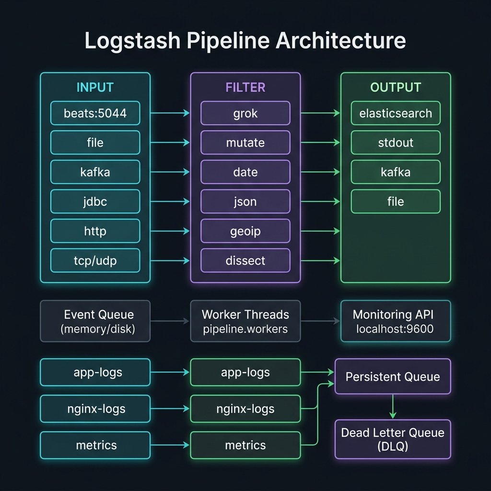

<!-- tags: elk-stack, observability, logstash -->
# 🔧 Logstash Pipeline Architecture

> Input → Filter → Output: Logstash data processing pipeline

📅 Created: 2026-03-23 · 🔄 Updated: 2026-04-20 · ⏱️ 12 min read

| Aspect           | Detail                                   |
| ---------------- | ---------------------------------------- |
| **Architecture** | Input → Filter → Output (plugins-based)  |
| **Runtime**      | JRuby on JVM                             |
| **Concurrency**  | Pipeline workers (default = CPU cores)   |
| **Input types**  | Beats, file, TCP, UDP, HTTP, Kafka, JDBC |
| **Port**         | 5044 (Beats), 9600 (Monitoring API)      |

---

## 0. TEMPLATE

> Minimal Logstash pipeline.

```ruby
# ── Basic pipeline: Beats → ES ──────────────────────────────────
input  { beats { port => 5044 } }
filter { }
output { elasticsearch { hosts => ["http://localhost:9200"] index => "logs-%{+YYYY.MM.dd}" } }
```

```bash
# ── Run Logstash ────────────────────────────────────────────────
bin/logstash -f pipeline.conf --config.reload.automatic
# ── Test config ─────────────────────────────────────────────────
bin/logstash -f pipeline.conf --config.test_and_exit
# ── Monitor ─────────────────────────────────────────────────────
curl localhost:9600/_node/stats/pipelines?pretty
```

---

## 1. DEFINE

Think of a logstash pipeline as the place where raw events get parsed, enriched, and routed. If this middle layer is fuzzy, the rest of ELK will always carry dirty data.


### Pipeline Stages

| Stage      | Role                     | Common plugins                      |
| ---------- | ------------------------ | ----------------------------------- |
| **Input**  | Collect data             | beats, file, kafka, jdbc, http, tcp |
| **Filter** | Parse, transform, enrich | grok, mutate, date, json, geoip     |
| **Output** | Send data out            | elasticsearch, file, stdout, kafka  |

### Input Plugins

| Plugin    | Source               | When to use              |
| --------- | -------------------- | ------------------------ |
| `beats`   | Filebeat, Metricbeat | Standard log collection  |
| `file`    | Local file           | Legacy log files         |
| `kafka`   | Kafka topic          | Event streaming          |
| `jdbc`    | Database             | Sync DB to ES            |
| `http`    | HTTP POST            | Webhooks, API events     |
| `tcp/udp` | Network socket       | Syslog, custom protocols |
| `stdin`   | Terminal             | Testing/debugging        |

### Filter Plugins

| Plugin      | Function                        | Example                      |
| ----------- | ------------------------------- | ---------------------------- |
| `grok`      | Parse unstructured → structured | Nginx, Apache logs           |
| `json`      | Parse JSON strings              | Application JSON logs        |
| `mutate`    | Add/remove/rename fields        | Cleanup, transform           |
| `date`      | Parse date strings              | Set @timestamp               |
| `geoip`     | IP → location coordinates       | Map visualizations           |
| `dissect`   | Fast split by delimiter         | Simpler than grok, 2x faster |
| `ruby`      | Custom Ruby code                | Complex transformations      |
| `drop`      | Drop events                     | Filter noise                 |
| `translate` | Lookup table                    | Enrich with metadata         |

### Performance Tuning

| Setting                | Default   | Description                    |
| ---------------------- | --------- | ------------------------------ |
| `pipeline.workers`     | CPU cores | Parallel filter/output threads |
| `pipeline.batch.size`  | 125       | Events per batch               |
| `pipeline.batch.delay` | 50ms      | Max wait for batch fill        |
| `queue.type`           | memory    | `persisted` for durability     |
| `queue.max_bytes`      | 1024mb    | Persistent queue size          |

---

Those failure modes sound familiar. But there is a trap: Logstash not receiving events because of wrong input plugin config = data gap, and wrong pipeline filter order = corrupted transforms. That trap appears in PITFALLS.

## 2. VISUAL

Theory sounds clean on paper. The visual below pulls it into the real operational context where latency, failure, and ownership are no longer abstract.



### Pipeline Architecture

```text
┌─────────────────────────────────────────────────────────────────┐
│                    Logstash Pipeline                             │
├─────────────────────────────────────────────────────────────────┤
│                                                                 │
│  ┌─────────────┐     ┌──────────────────┐     ┌─────────────┐  │
│  │   INPUTS     │     │     FILTERS      │     │   OUTPUTS   │  │
│  │             │     │                  │     │             │  │
│  │ beats:5044 ─┤     │ grok ────────────┤     │├─ elasticsearch│
│  │ file ───────┤ ──▶ │ mutate ──────────┤ ──▶ │├─ stdout     │  │
│  │ kafka ──────┤     │ date ────────────┤     │├─ kafka      │  │
│  │ http ───────┤     │ geoip ───────────┤     │├─ file       │  │
│  │             │     │ json ────────────┤     │             │  │
│  └─────────────┘     └──────────────────┘     └─────────────┘  │
│         │                    │                       │          │
│    Event Queue          Worker Threads          Output Queue    │
│   (memory/disk)       (pipeline.workers)                       │
│                                                                 │
├─────────────────────────────────────────────────────────────────┤
│  Monitoring API: localhost:9600                                  │
└─────────────────────────────────────────────────────────────────┘
```

### Multiple Pipelines

```text
logstash.yml:
  pipeline.id: main

pipelines.yml:                          ← Run multiple pipelines in parallel
┌────────────────────────────┐
│ Pipeline: app-logs         │  beats:5044 → grok → ES (app-logs-*)
├────────────────────────────┤
│ Pipeline: nginx-logs       │  file:/var/log/nginx → grok → ES (nginx-*)
├────────────────────────────┤
│ Pipeline: metrics          │  beats:5045 → mutate → ES (metrics-*)
└────────────────────────────┘
```

---

## 3. CODE

The diagrams have shown the main path. The code/manifests/commands below pull it down to the artifact level that on-call or reviewers actually use.


### Example 1: Basic — Simple Pipeline

> **Goal**: Basic pipeline receiving logs from Beats.
> **Requires**: Logstash + Filebeat running.
> **Result**: Complete data flow.

```ruby
# logstash/pipeline/01-basic.conf
# ── Simple Beats → Elasticsearch pipeline ─────────────────────

input {
  beats {
    port => 5044                        # ✅ Receive from Filebeat/Metricbeat
    type => "beats"
  }

  # ✅ Stdin for testing
  stdin {
    codec => json                       # ⚠️ Input must be JSON format
    type => "stdin"
  }
}

filter {
  # ✅ Add metadata
  mutate {
    add_field => {
      "pipeline" => "basic"
      "environment" => "development"
    }
  }

  # ✅ Parse JSON message if it is JSON
  if [message] =~ /^\{/ {
    json {
      source => "message"
      target => "parsed"
    }
    # ✅ If parse OK → move fields to root
    if "_jsonparsefailure" not in [tags] {
      mutate {
        rename => {
          "[parsed][level]"   => "level"
          "[parsed][service]" => "service"
          "[parsed][msg]"     => "log_message"
        }
        remove_field => ["parsed", "message"]
      }
    }
  }

  # ✅ Add timestamp processing
  if [timestamp] {
    date {
      match => ["timestamp", "ISO8601", "yyyy-MM-dd HH:mm:ss"]
      target => "@timestamp"
      remove_field => ["timestamp"]
    }
  }
}

output {
  # ✅ Output to Elasticsearch
  elasticsearch {
    hosts => ["http://elasticsearch:9200"]
    index => "logs-%{+YYYY.MM.dd}"       # Index by day
    action => "index"
  }

  # ✅ Debug output (comment out in production)
  stdout {
    codec => rubydebug                   # Pretty print events
  }
}
```

```bash
# ✅ Test pipeline
echo '{"level":"info","service":"api","msg":"request handled","timestamp":"2026-03-23T12:00:00Z"}' | \
  bin/logstash -f 01-basic.conf

# ✅ Test config syntax
bin/logstash -f 01-basic.conf --config.test_and_exit
```

> **Result**: Basic pipeline: JSON parsing, field extraction, date processing.
> **Note**: `rubydebug` output is very verbose — only use when debugging.

---

Basic pipeline is covered. But multi-pipeline needs isolation — time to separate.

### Example 2: Intermediate — Multi-Source Pipeline

> **Goal**: Pipeline processing multiple log types (app, nginx, syslog).
> **Requires**: Multiple log sources.
> **Result**: Conditional processing per source type.

```ruby
# logstash/pipeline/02-multi-source.conf
# ── Multi-source pipeline with conditional processing ────────

input {
  beats {
    port => 5044
  }

  # ✅ TCP input for syslog
  tcp {
    port => 5000
    codec => line
    type => "syslog"
  }
}

filter {
  # ═══════════════════════════════════════════════════════════
  # ✅ Route 1: Application JSON logs
  # ═══════════════════════════════════════════════════════════
  if [fields][type] == "app-log" or [type] == "app" {
    json {
      source => "message"
      target => "app"
    }

    mutate {
      add_field => { "log_type" => "application" }
      rename => {
        "[app][level]"      => "level"
        "[app][service]"    => "service"
        "[app][trace_id]"   => "trace_id"
        "[app][duration_ms]" => "duration_ms"
      }
    }

    # ✅ Categorize by level
    if [level] == "error" or [level] == "fatal" {
      mutate { add_tag => ["alert"] }
    }
  }

  # ═══════════════════════════════════════════════════════════
  # ✅ Route 2: Nginx access logs
  # ═══════════════════════════════════════════════════════════
  else if [fields][type] == "nginx" {
    grok {
      match => {
        "message" => '%{IPORHOST:client_ip} - %{DATA:user} \[%{HTTPDATE:nginx_timestamp}\] "%{WORD:method} %{URIPATHPARAM:request} HTTP/%{NUMBER:http_version}" %{NUMBER:status:int} %{NUMBER:bytes:int} "%{DATA:referrer}" "%{DATA:user_agent}"'
      }
      tag_on_failure => ["_grokparsefailure_nginx"]
    }

    if "_grokparsefailure_nginx" not in [tags] {
      date {
        match => ["nginx_timestamp", "dd/MMM/yyyy:HH:mm:ss Z"]
        target => "@timestamp"
      }

      # ✅ GeoIP enrichment
      geoip {
        source => "client_ip"
        target => "geo"
        fields => ["city_name", "country_name", "latitude", "longitude"]
      }

      # ✅ User agent parsing
      useragent {
        source => "user_agent"
        target => "ua"
      }

      mutate {
        add_field => { "log_type" => "nginx" }
        remove_field => ["nginx_timestamp"]
        convert => { "bytes" => "integer" }
      }
    }
  }

  # ═══════════════════════════════════════════════════════════
  # ✅ Route 3: Syslog
  # ═══════════════════════════════════════════════════════════
  else if [type] == "syslog" {
    grok {
      match => {
        "message" => "%{SYSLOGTIMESTAMP:syslog_ts} %{SYSLOGHOST:hostname} %{SYSLOGPROG:program}: %{GREEDYDATA:syslog_message}"
      }
    }

    date {
      match => ["syslog_ts", "MMM  d HH:mm:ss", "MMM dd HH:mm:ss"]
      target => "@timestamp"
    }

    mutate {
      add_field => { "log_type" => "syslog" }
      remove_field => ["syslog_ts"]
    }
  }

  # ═══════════════════════════════════════════════════════════
  # ✅ Common: cleanup for all routes
  # ═══════════════════════════════════════════════════════════
  mutate {
    remove_field => ["agent", "ecs", "host", "input", "log"]  # ⚠️ Remove Beats metadata noise
  }
}

output {
  # ✅ Route output by log_type
  if [log_type] == "application" {
    elasticsearch {
      hosts => ["http://elasticsearch:9200"]
      index => "app-logs-%{+YYYY.MM.dd}"
    }
  } else if [log_type] == "nginx" {
    elasticsearch {
      hosts => ["http://elasticsearch:9200"]
      index => "nginx-logs-%{+YYYY.MM.dd}"
    }
  } else {
    elasticsearch {
      hosts => ["http://elasticsearch:9200"]
      index => "other-logs-%{+YYYY.MM.dd}"
    }
  }

  # ✅ Alert errors to separate index
  if "alert" in [tags] {
    elasticsearch {
      hosts => ["http://elasticsearch:9200"]
      index => "alerts-%{+YYYY.MM.dd}"
    }
  }
}
```

> **Result**: Multi-source routing: app JSON, nginx grok, syslog — each type processed separately.
> **Note**: Use `if/else if` for routing — avoid unnecessary processing.

---

Multi-pipeline is covered. But persistent queue needs config — time to protect data.

### Example 3: Advanced — Multiple Pipelines + Dead Letter Queue

> **Goal**: Production-grade pipeline configuration.
> **Requires**: Logstash 8.x.
> **Result**: Isolation, error handling, monitoring.

```yaml
# logstash/config/pipelines.yml
# ── Multiple pipelines — isolation per source ──────────────────

- pipeline.id: app-pipeline
  path.config: '/usr/share/logstash/pipeline/app.conf'
  pipeline.workers: 4
  pipeline.batch.size: 250
  queue.type: persisted # ✅ Durable queue — survive restart
  queue.max_bytes: 1gb
  dead_letter_queue.enable: true # ✅ DLQ cho failed events

- pipeline.id: nginx-pipeline
  path.config: '/usr/share/logstash/pipeline/nginx.conf'
  pipeline.workers: 2
  pipeline.batch.size: 125

- pipeline.id: dlq-pipeline
  path.config: '/usr/share/logstash/pipeline/dlq.conf'
  pipeline.workers: 1
```

```ruby
# logstash/pipeline/dlq.conf
# ── Dead Letter Queue processor — retry failed events ──────────

input {
  dead_letter_queue {
    path => "/usr/share/logstash/data/dead_letter_queue"
    pipeline_id => "app-pipeline"        # ✅ DLQ from app-pipeline
    commit_offsets => true
  }
}

filter {
  # ✅ Tag as DLQ retry
  mutate {
    add_field => { "dlq_retry" => true }
    add_tag => ["dlq_reprocessed"]
  }

  # ✅ Log failure reason
  ruby {
    code => '
      event.set("dlq_reason", event.get("[@metadata][dead_letter_queue][reason]"))
      event.set("dlq_plugin_type", event.get("[@metadata][dead_letter_queue][plugin_type]"))
    '
  }
}

output {
  elasticsearch {
    hosts => ["http://elasticsearch:9200"]
    index => "dlq-retry-%{+YYYY.MM.dd}"
  }
}
```

```bash
# ── Monitoring commands ────────────────────────────────────────

# ✅ Pipeline stats
curl -s localhost:9600/_node/stats/pipelines?pretty | jq '
  .pipelines | to_entries[] | {
    pipeline: .key,
    events_in: .value.events.in,
    events_out: .value.events.out,
    events_filtered: .value.events.filtered
  }
'

# ✅ Hot threads (debug performance)
curl -s localhost:9600/_node/hot_threads?pretty

# ✅ Pipeline reload (no restart)
curl -s localhost:9600/_node/stats/reloads?pretty
```

> **Result**: Multi-pipeline isolation, persisted queue, DLQ error handling.
> **Note**: `queue.type: persisted` increases disk I/O but ensures no data loss.

---

You have covered pipeline, multi-pipeline, and persistent queue. Now comes the dangerous part: wrong input config and filter order — the trap set up from the beginning.

## 4. PITFALLS

Mistakes rarely come from syntax; they come from operational boundary assumptions and forgotten failure modes. The table below collects exactly those errors.


| #   | Mistake                            | Fix                                             |
| --- | ---------------------------------- | ----------------------------------------------- |
| 1   | Logstash OOM: heap too small       | Set `LS_JAVA_OPTS=-Xms512m -Xmx512m` (min 256m) |
| 2   | Pipeline not reloading config      | Enable `config.reload.automatic: true`          |
| 3   | Grok match failure → event dropped | Add `tag_on_failure` → route failures to DLQ    |
| 4   | Single pipeline for all sources    | Split into multiple pipelines → isolation + tuning |
| 5   | Memory queue loses data on restart | Use `queue.type: persisted`                     |
| 6   | `@timestamp` wrong timezone        | Set `timezone => "UTC"` in date filter          |

---

You have covered Pipeline Architecture and the traps. The resources below help go deeper.

## 5. REF

| Resource           | Link                                                                                                                                     |
| ------------------ | ---------------------------------------------------------------------------------------------------------------------------------------- |
| Logstash Reference | [elastic.co/guide/en/logstash/current](https://www.elastic.co/guide/en/logstash/current/index.html)                                      |
| Input Plugins      | [elastic.co/guide/en/logstash/current/input-plugins.html](https://www.elastic.co/guide/en/logstash/current/input-plugins.html)           |
| Filter Plugins     | [elastic.co/guide/en/logstash/current/filter-plugins.html](https://www.elastic.co/guide/en/logstash/current/filter-plugins.html)         |
| Performance Tuning | [elastic.co/guide/en/logstash/current/performance-tuning.html](https://www.elastic.co/guide/en/logstash/current/performance-tuning.html) |
| Multiple Pipelines | [elastic.co/guide/en/logstash/current/multiple-pipelines.html](https://www.elastic.co/guide/en/logstash/current/multiple-pipelines.html) |

---

## 6. RECOMMEND

The resources below connect directly to the pressures that typically appear right after you apply these concepts to a real system.


| Extension                | When                          | Reason                            |
| ------------------------ | ----------------------------- | --------------------------------- |
| **Vector (Datadog)**     | Logstash too heavy (JVM)      | Rust-based, 10x less memory       |
| **Fluentd / Fluent Bit** | Kubernetes native             | CNCF project, K8s DaemonSet       |
| **Kafka as buffer**      | High volume (> 100K events/s) | Decouple producers from consumers |
| **Logstash Monitoring**  | Production visibility         | Kibana Stack Monitoring           |
| **Pipeline-to-Pipeline** | Internal event routing        | Distribute → Process → Collect    |

---

## 🃏 Quick Reference

| #   | Config                                        | Description     |
| --- | --------------------------------------------- | --------------- |
| 1   | `input { beats { port => 5044 } }`            | Receive from Beats |
| 2   | `filter { grok { match => {...} } }`          | Parse logs      |
| 3   | `output { elasticsearch { hosts => [...] } }` | Send to ES      |
| 4   | `if [field] == "value" { ... }`               | Conditional     |
| 5   | `mutate { add_field => {...} }`               | Add field       |
| 6   | `date { match => [...] }`                     | Parse timestamp |
| 7   | `json { source => "message" }`                | Parse JSON      |
| 8   | `--config.test_and_exit`                      | Test config     |
| 9   | `--config.reload.automatic`                   | Auto reload     |
| 10  | `curl localhost:9600/_node/stats`             | Monitor stats   |

---

## 🔍 Debug Checklist

| # | Symptom | Root cause | Diagnostic command |
|---|---------|------------|-------------------|
| 1 | Logstash not receiving events | Input plugin config wrong | `bin/logstash --config.test_and_exit -f pipeline.conf` |
| 2 | Events being dropped | Output ES unavailable, retry exhausted | Check `logstash.log` + `dead_letter_queue` stats |
| 3 | Low pipeline throughput | `pipeline.workers` default (1) | Increase `pipeline.workers: 4` in `pipelines.yml` |
| 4 | JVM OutOfMemoryError | Pipeline queue in-memory full | Enable `queue.type: persisted` |
| 5 | Config reload not applying | `config.reload.automatic: true` not enabled | `kill -HUP $(cat logstash.pid)` |
| 6 | Multiple pipeline conflict | Duplicate pipeline IDs | Check `pipelines.yml` |
| 7 | Logstash using too much CPU | Complex regex filter running on all events | Use `if` condition to filter early |

---

## 🎯 Interview Angle

**Related system design / technical questions:**
- *"What is the difference between Logstash, Beats, and Fluentd — when to use which?"*
- *"How does a persistent queue differ from an in-memory queue? What are the trade-offs?"*
- *"When should you use multiple pipelines instead of a single pipeline?"*

**Key talking points interviewers expect:**

| Topic | Talking point |
|-------|---------------|
| Logstash vs Beats | Beats = lightweight shipper (Go, ~30MB); Logstash = heavy processor (JVM, ~1GB) — often used together |
| Logstash vs Fluentd | Fluentd = Ruby/C, CNCF, K8s-native; Logstash = stronger filtering but heavier |
| Persistent queue | Ensures at-least-once delivery when ES is down; trade-off: increases disk I/O |
| In-memory queue | Faster but loses data if Logstash crashes — only use for non-critical data |
| Multiple pipelines | Isolation (pipeline A failure does not affect B), per-pipeline tuning, security |
| Scaling Logstash | Vertical: increase `pipeline.workers`; Horizontal: add nodes + load balancer in front |

**Common follow-up questions:**
- *"How does Dead Letter Queue work?"* → DLQ stores events that the output could not process after retry; can be reprocessed with the `dead_letter_queue` input plugin
- *"How to monitor Logstash performance?"* → `curl localhost:9600/_node/stats/pipelines` + Kibana Stack Monitoring
- *"Why does Logstash need more RAM than Beats?"* → JVM overhead + in-memory event queues + plugin ecosystem

---

**Links**: [← Mapping & Analyzer](../elasticsearch/03-mapping-analyzer.md) · [→ Grok & Filters](./02-grok-filters.md)

