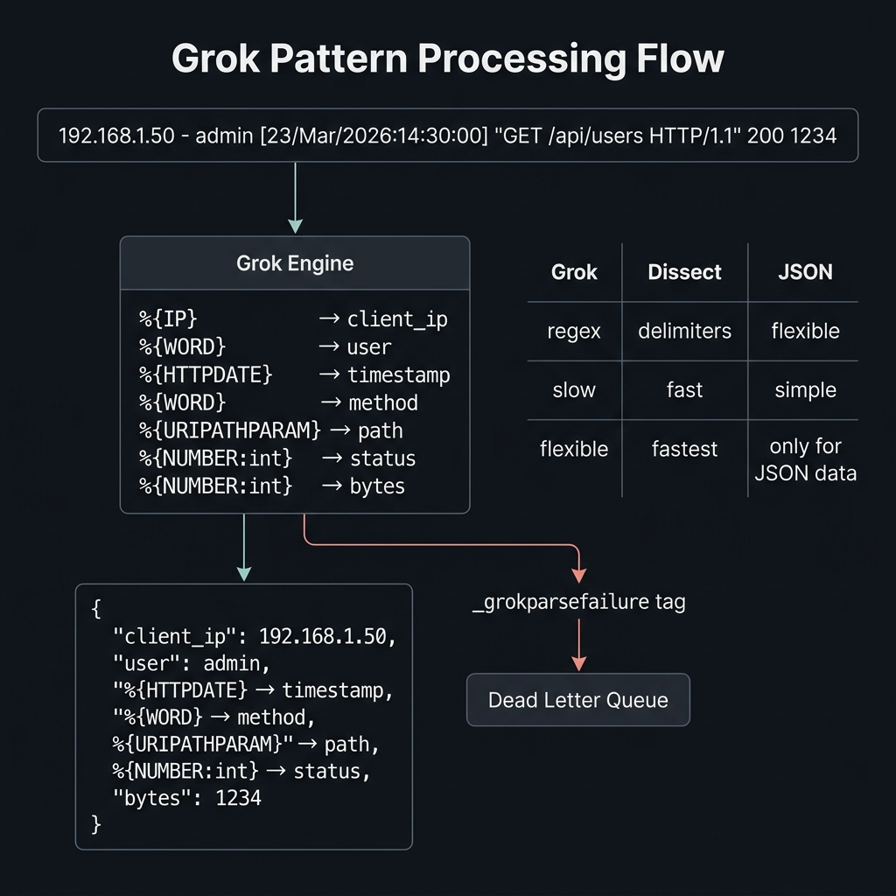

<!-- tags: elk-stack, observability -->
# 🔬 Grok Patterns & Filters

> Logstash Grok: parse unstructured logs into structured data

📅 Created: 2026-03-23 · 🔄 Updated: 2026-04-20 · ⏱️ 11 min read

| Aspect          | Detail                                       |
| --------------- | -------------------------------------------- |
| **Syntax**      | `%{PATTERN:field_name:type}`                 |
| **Built-in**    | 120+ patterns (IP, TIMESTAMP, URI, etc.)     |
| **Alternative** | `dissect` (faster, delimiter-based)          |
| **Use case**    | Parse nginx, apache, syslog, custom app logs |

---

## 0. TEMPLATE

> Copy-paste grok patterns for common log formats.

```ruby
# ── Nginx Access Log ────────────────────────────────────────────
grok { match => { "message" => '%{IPORHOST:client_ip} - %{DATA:user} \[%{HTTPDATE:timestamp}\] "%{WORD:method} %{URIPATHPARAM:request} HTTP/%{NUMBER:http_version}" %{NUMBER:status:int} %{NUMBER:bytes:int} "%{DATA:referrer}" "%{DATA:user_agent}"' } }

# ── Apache Combined ────────────────────────────────────────────
grok { match => { "message" => "%{COMBINEDAPACHELOG}" } }

# ── Syslog ──────────────────────────────────────────────────────
grok { match => { "message" => "%{SYSLOGTIMESTAMP:ts} %{SYSLOGHOST:host} %{SYSLOGPROG:prog}: %{GREEDYDATA:msg}" } }

# ── JSON fallback ──────────────────────────────────────────────
json { source => "message" }
```

---

## 1. DEFINE

Think of the grok filter as where the pipeline starts being "close enough is good enough" until the log format changes slightly and all parsing breaks in a cascade. This is about that fragile point.


### Grok Syntax

```text
%{PATTERN_NAME:field_name:data_type}
     │              │          │
     │              │          └── Optional: int, float (default: string)
     │              └── Field name in output
     └── Built-in or custom pattern
```

### Essential Built-in Patterns

| Pattern                | Matches                  | Example                      |
| ---------------------- | ------------------------ | ---------------------------- |
| `%{IP}`                | IPv4 address             | `192.168.1.1`                |
| `%{IPORHOST}`          | IP or hostname           | `192.168.1.1`, `example.com` |
| `%{NUMBER}`            | Integer or float         | `42`, `3.14`                 |
| `%{WORD}`              | Word (no spaces)         | `GET`, `error`               |
| `%{DATA}`              | Any text (non-greedy)    | Match until next pattern     |
| `%{GREEDYDATA}`        | Any text (greedy)        | Match everything remaining   |
| `%{HTTPDATE}`          | Apache/Nginx date format | `23/Mar/2026:12:00:00 +0700` |
| `%{TIMESTAMP_ISO8601}` | ISO 8601                 | `2026-03-23T12:00:00Z`       |
| `%{SYSLOGTIMESTAMP}`   | Syslog date              | `Mar 23 12:00:00`            |
| `%{URIPATHPARAM}`      | URI path + params        | `/api/users?page=1`          |
| `%{QUOTEDSTRING}`      | Quoted string            | `"hello world"`              |
| `%{UUID}`              | UUID                     | `550e8400-e29b-41d4-...`     |
| `%{EMAILADDRESS}`      | Email                    | `user@example.com`           |
| `%{LOGLEVEL}`          | Log level                | `INFO`, `ERROR`, `WARN`      |

### Grok vs Dissect vs JSON

| Feature         | Grok         | Dissect           | JSON      |
| --------------- | ------------ | ----------------- | --------- |
| **Speed**       | Slow (regex) | Fast (delimiter)  | Fast      |
| **Flexibility** | Very high    | Medium            | JSON only |
| **Complexity**  | High (regex) | Low               | Very low  |
| **Use case**    | Unstructured | Simple delimiters | JSON logs |
| **CPU**         | High         | Low               | Low       |

---

Those failure modes are clear. But there is a trap: grok parse failures creating _grokparsefailure tags = data quality drop, and patterns too greedy = CPU spike. That trap appears in PITFALLS.

## 2. VISUAL

Definitions only lock vocabulary. The visual below shows the actual operational flow where containers, pods, log pipelines, and shell commands start hitting production.



### Grok Processing Flow

```text
Input: '192.168.1.50 - admin [23/Mar/2026:14:30:00 +0700] "GET /api/users HTTP/1.1" 200 1234'

Pattern: '%{IP:client} - %{WORD:user} \[%{HTTPDATE:ts}\] "%{WORD:method} %{URIPATHPARAM:path} HTTP/%{NUMBER}" %{NUMBER:status:int} %{NUMBER:bytes:int}'

                    ┌─────────────────────────────────────────┐
                    │              Grok Engine                 │
                    │                                         │
   Input ──────────▶│  %{IP}        → client: "192.168.1.50" │
                    │  %{WORD}      → user: "admin"           │
                    │  %{HTTPDATE}  → ts: "23/Mar/2026:..."   │
                    │  %{WORD}      → method: "GET"           │
                    │  %{URIPATHPARAM} → path: "/api/users"   │
                    │  %{NUMBER:int} → status: 200            │
                    │  %{NUMBER:int} → bytes: 1234            │
                    │                                         │
                    └───────────────┬─────────────────────────┘
                                    │
                                    ▼
                    {
                      "client": "192.168.1.50",
                      "user": "admin",
                      "ts": "23/Mar/2026:14:30:00 +0700",
                      "method": "GET",
                      "path": "/api/users",
                      "status": 200,         ← integer
                      "bytes": 1234          ← integer
                    }
```

---

## 3. CODE

The diagrams have shown the main path. The code/manifests/commands below pull it down to the artifact level that on-call or reviewers actually use.


### Example 1: Basic — Common Log Formats

> **Goal**: Parse nginx, syslog, and custom app logs.
> **Requires**: Logstash running.
> **Result**: Structured fields from raw log lines.

```ruby
# logstash/pipeline/grok-basic.conf
# ── Parse common log formats ──────────────────────────────────

input {
  beats { port => 5044 }
}

filter {
  # ✅ Route 1: Nginx access logs
  if [fields][type] == "nginx-access" {
    grok {
      match => {
        "message" => '%{IPORHOST:client_ip} - %{DATA:remote_user} \[%{HTTPDATE:timestamp}\] "%{WORD:method} %{URIPATHPARAM:request} HTTP/%{NUMBER:http_version}" %{NUMBER:status:int} %{NUMBER:body_bytes:int} "%{DATA:referrer}" "%{DATA:user_agent}"'
      }
      tag_on_failure => ["_grok_nginx_fail"]
    }

    # ✅ Parse timestamp
    if "_grok_nginx_fail" not in [tags] {
      date {
        match => ["timestamp", "dd/MMM/yyyy:HH:mm:ss Z"]
        target => "@timestamp"
        remove_field => ["timestamp"]
      }

      # ✅ Categorize HTTP status
      if [status] >= 500 {
        mutate { add_field => { "status_class" => "5xx_error" } }
      } else if [status] >= 400 {
        mutate { add_field => { "status_class" => "4xx_client" } }
      } else if [status] >= 300 {
        mutate { add_field => { "status_class" => "3xx_redirect" } }
      } else {
        mutate { add_field => { "status_class" => "2xx_success" } }
      }

      # ✅ Extract URL path without query params
      grok {
        match => { "request" => "%{URIPATH:url_path}(?:%{URIPARAM:url_params})?" }
      }
    }
  }

  # ✅ Route 2: Nginx error logs
  else if [fields][type] == "nginx-error" {
    grok {
      match => {
        "message" => "%{DATA:timestamp} \[%{LOGLEVEL:level}\] %{NUMBER:pid}#%{NUMBER:tid}: %{GREEDYDATA:error_message}"
      }
    }
  }

  # ✅ Route 3: Go application logs (structured)
  else if [fields][type] == "go-app" {
    # ✅ Try JSON first
    json {
      source => "message"
      target => "app"
      tag_on_failure => ["_jsonparsefailure"]
    }

    # ✅ Fallback: parse text format
    if "_jsonparsefailure" in [tags] {
      grok {
        match => {
          "message" => "%{TIMESTAMP_ISO8601:timestamp}\s+%{LOGLEVEL:level}\s+\[%{DATA:service}\]\s+%{GREEDYDATA:log_message}"
        }
        overwrite => ["tags"]
      }
    } else {
      mutate {
        rename => {
          "[app][level]"   => "level"
          "[app][msg]"     => "log_message"
          "[app][service]" => "service"
          "[app][error]"   => "error"
        }
        remove_field => ["app"]
      }
    }
  }
}

output {
  elasticsearch {
    hosts => ["http://elasticsearch:9200"]
    index => "%{[fields][type]}-%{+YYYY.MM.dd}"
  }
}
```

> **Result**: Parse nginx access/error + Go app logs (JSON + text fallback).
> **Note**: Always have a fallback — grok failures happen frequently when log format changes.

---

Basic grok is covered. But custom patterns need a library — time to create one.

### Example 2: Intermediate — Custom Patterns + Enrichment

> **Goal**: Custom grok patterns + GeoIP + UserAgent enrichment.
> **Requires**: GeoIP database, custom pattern files.
> **Result**: Rich metadata for analysis.

```ruby
# logstash/pipeline/grok-enrichment.conf
# ── Custom patterns + Data enrichment ─────────────────────────

input {
  beats { port => 5044 }
}

filter {
  # ════════════════════════════════════════════════════════
  # ✅ Custom Grok Patterns (inline)
  # ════════════════════════════════════════════════════════
  # Pattern: 2026-03-23 14:30:00.123 [INFO] [user-service] [req-abc123] User logged in (45ms)
  grok {
    match => {
      "message" => "%{TIMESTAMP_ISO8601:timestamp}\s+\[%{LOGLEVEL:level}\]\s+\[%{DATA:service}\]\s+\[%{DATA:request_id}\]\s+%{GREEDYDATA:log_message}(?:\s+\(%{NUMBER:duration_ms:int}ms\))?"
    }
    # ✅ Custom pattern definitions (inline instead of file)
    pattern_definitions => {
      "SERVICE_NAME" => "[a-zA-Z0-9_-]+"
      "REQUEST_ID"   => "[a-zA-Z0-9_-]+"
    }
  }

  # ✅ Parse timestamp
  date {
    match => ["timestamp", "ISO8601", "yyyy-MM-dd HH:mm:ss.SSS"]
    target => "@timestamp"
    timezone => "Asia/Ho_Chi_Minh"        # ⚠️ Set timezone correctly
    remove_field => ["timestamp"]
  }

  # ════════════════════════════════════════════════════════
  # ✅ GeoIP Enrichment — IP → Location
  # ════════════════════════════════════════════════════════
  if [client_ip] {
    geoip {
      source => "client_ip"
      target => "geo"
      fields => [
        "city_name", "country_name", "country_code2",
        "continent_code", "latitude", "longitude",
        "region_name", "timezone"
      ]
    }

    # ✅ Create geo_point for Kibana Maps
    if [geo][latitude] and [geo][longitude] {
      mutate {
        add_field => {
          "[geo][location][lat]" => "%{[geo][latitude]}"
          "[geo][location][lon]" => "%{[geo][longitude]}"
        }
      }
      mutate {
        convert => {
          "[geo][location][lat]" => "float"
          "[geo][location][lon]" => "float"
        }
      }
    }
  }

  # ════════════════════════════════════════════════════════
  # ✅ User Agent Parsing
  # ════════════════════════════════════════════════════════
  if [user_agent] and [user_agent] != "-" {
    useragent {
      source => "user_agent"
      target => "ua"
    }
  }

  # ════════════════════════════════════════════════════════
  # ✅ Performance tagging
  # ════════════════════════════════════════════════════════
  if [duration_ms] {
    if [duration_ms] > 1000 {
      mutate { add_tag => ["slow_request"] }
    }
    if [duration_ms] > 5000 {
      mutate { add_tag => ["very_slow_request"] }
    }
  }

  # ✅ Sensitive data masking
  if [log_message] =~ /password|token|secret|api.key/i {
    mutate {
      gsub => [
        "log_message", '(?i)(password|token|secret|api.key)[=:]\s*"?[^\s"]+', '\1=***REDACTED***'
      ]
    }
  }

  # ✅ Cleanup
  mutate {
    lowercase => ["level"]
    remove_field => ["message", "agent", "ecs"]
  }
}

output {
  elasticsearch {
    hosts => ["http://elasticsearch:9200"]
    index => "%{service}-%{+YYYY.MM.dd}"
  }
}
```

> **Result**: Custom patterns, GeoIP → Maps, UA parsing, slow query tagging, data masking.
> **Note**: GeoIP database needs periodic updates (MaxMind GeoLite2). Elasticsearch 8.x bundles it.

---

Custom patterns are covered. But the dissect filter is faster for structured logs — time to use it.

### Example 3: Advanced — Dissect + Ruby for Complex Parsing

> **Goal**: High-performance parsing with dissect + custom Ruby.
> **Requires**: Complex log formats.
> **Result**: 2-5x faster than grok for simple formats.

```ruby
# logstash/pipeline/advanced-parsing.conf
# ── Dissect (fast) + Ruby (flexible) ──────────────────────────

input {
  beats { port => 5044 }
}

filter {
  # ════════════════════════════════════════════════════════
  # ✅ Dissect — 5x faster than grok for delimiter-based
  # ════════════════════════════════════════════════════════
  if [fields][type] == "access-log" {
    dissect {
      mapping => {
        "message" => '%{client_ip} - %{user} [%{timestamp}] "%{method} %{request} HTTP/%{http_ver}" %{status} %{bytes} "%{referrer}" "%{user_agent}"'
      }
    }

    # ✅ Convert types (dissect = all strings)
    mutate {
      convert => {
        "status" => "integer"
        "bytes"  => "integer"
      }
    }
  }

  # ════════════════════════════════════════════════════════
  # ✅ Ruby filter — complex transformations
  # ════════════════════════════════════════════════════════
  ruby {
    code => '
      # ✅ Calculate request rate category
      status = event.get("status")
      if status
        case status
        when 200..299 then event.set("status_group", "success")
        when 300..399 then event.set("status_group", "redirect")
        when 400..499 then event.set("status_group", "client_error")
        when 500..599 then event.set("status_group", "server_error")
        end
      end

      # ✅ Extract API version from path
      request = event.get("request")
      if request
        if match = request.match(%r{/api/(v\d+)/})
          event.set("api_version", match[1])
        end

        # Extract resource name
        parts = request.split("?").first.split("/").reject(&:empty?)
        if parts.length >= 2
          event.set("api_resource", parts.last.gsub(/\d+/, ":id"))
        end
      end

      # ✅ Parse response time from X-Response-Time header
      duration = event.get("duration_ms")
      if duration
        percentile = case duration.to_i
                     when 0..100   then "p50"
                     when 101..500 then "p90"
                     when 501..1000 then "p95"
                     else "p99"
                     end
        event.set("latency_bucket", percentile)
      end
    '
  }

  # ════════════════════════════════════════════════════════
  # ✅ Translate — lookup table enrichment
  # ════════════════════════════════════════════════════════
  translate {
    source => "status"
    target => "status_description"
    dictionary => {
      "200" => "OK"
      "201" => "Created"
      "301" => "Moved Permanently"
      "302" => "Found"
      "400" => "Bad Request"
      "401" => "Unauthorized"
      "403" => "Forbidden"
      "404" => "Not Found"
      "500" => "Internal Server Error"
      "502" => "Bad Gateway"
      "503" => "Service Unavailable"
    }
    fallback => "Unknown"
  }
}

output {
  elasticsearch {
    hosts => ["http://elasticsearch:9200"]
    index => "access-%{+YYYY.MM.dd}"
  }
}
```

> **Result**: High-performance parsing, complex Ruby transformations, lookup enrichment.
> **Note**: Ruby filter is powerful but slow — only use when grok/dissect/mutate are not enough.

---

You have covered basic grok, custom patterns, and dissect. Now comes the dangerous part: parse failure tags and greedy patterns — the trap set up from the beginning.

## 4. PITFALLS

Knowing how to do it right is only half the story. The other half is the places where it is very easy to get almost right and then pay the price when the cluster or operating system shakes.


| #   | Mistake                      | Fix                                               |
| --- | ---------------------------- | ------------------------------------------------- |
| 1   | Grok pattern too complex     | Use `dissect` for simple delimiters (5x faster)   |
| 2   | `GREEDYDATA` in middle of pattern | Avoid — causes backtracking, very slow         |
| 3   | Grok failure → event lost    | Set `tag_on_failure`, route failures              |
| 4   | Not testing pattern first    | Use [grokdebugger.com](https://grokdebugger.com) |
| 5   | GeoIP for private IPs        | GeoIP does not resolve `10.x`, `192.168.x` → skip |
| 6   | Ruby filter in hot path      | Ruby = slowest — use for edge cases only          |

---

You have covered Grok Filters and the traps. The resources below help go deeper.

## 5. REF

| Resource                | Link                                                                                                                                               |
| ----------------------- | -------------------------------------------------------------------------------------------------------------------------------------------------- |
| Grok Patterns Full List | [github.com/elastic/logstash/patterns](https://github.com/elastic/logstash/tree/main/patterns)                                                     |
| Grok Debugger (Online)  | [grokdebugger.com](https://grokdebugger.com/)                                                                                                      |
| Kibana Grok Debugger    | Built-in: Kibana → Dev Tools → Grok Debugger                                                                                                       |
| Dissect Plugin          | [elastic.co/guide/en/logstash/current/plugins-filters-dissect.html](https://www.elastic.co/guide/en/logstash/current/plugins-filters-dissect.html) |
| GeoIP Filter            | [elastic.co/guide/en/logstash/current/plugins-filters-geoip.html](https://www.elastic.co/guide/en/logstash/current/plugins-filters-geoip.html)     |

---

## 6. RECOMMEND

The resources below connect directly to the pressures that typically appear right after you apply these concepts to a real system.


| Extension                 | When                     | Reason                               |
| ------------------------- | ------------------------ | ------------------------------------ |
| **Ingest Pipelines (ES)** | Simple transforms        | Process in ES, no Logstash needed    |
| **Elastic Common Schema** | Multi-source correlation | Standardize field names              |
| **JDBC Filter**           | Enrich from database     | Lookup user info, geo data           |
| **Fingerprint Filter**    | Deduplication            | Hash-based duplicate detection       |
| **Metrics Filter**        | Rate monitoring          | Count events per pattern             |

---

## 🃏 Quick Reference

| #   | Pattern                      | Use case               |
| --- | ---------------------------- | ---------------------- |
| 1   | `%{IP:field}`                | IPv4 address           |
| 2   | `%{NUMBER:field:int}`        | Integer number         |
| 3   | `%{WORD:field}`              | Single word            |
| 4   | `%{DATA:field}`              | Non-greedy any         |
| 5   | `%{GREEDYDATA:field}`        | Greedy any (end of line) |
| 6   | `%{HTTPDATE:field}`          | Nginx/Apache date      |
| 7   | `%{TIMESTAMP_ISO8601:field}` | ISO date               |
| 8   | `%{COMBINEDAPACHELOG}`       | Full Apache log        |
| 9   | `%{SYSLOGTIMESTAMP:field}`   | Syslog date            |
| 10  | `tag_on_failure => [...]`    | Handle failures        |

---

## 🔍 Debug Checklist

| # | Symptom | Root cause | Diagnostic command |
|---|---------|------------|-------------------|
| 1 | Grok parse fail → `_grokparsefailure` tag | Pattern does not match log format | `bin/logstash -e 'input{stdin{}} filter{grok{...}} output{stdout{}}'` test manually |
| 2 | Grok too slow | Catastrophic backtracking in regex | Use `dissect` instead of grok for structured logs |
| 3 | Timestamp wrong timezone | Date filter format mismatch | `date { match => ["timestamp", "dd/MMM/yyyy:HH:mm:ss Z"] }` |
| 4 | Field `message` still exists after grok | Missing `remove_field => ["message"]` | Add to grok config |
| 5 | Custom pattern not loading | File path wrong | `patterns_dir => ["/etc/logstash/patterns"]` |
| 6 | mutate rename/convert not working | Field name contains dots `.` | Use `[nested][field]` syntax |
| 7 | `_dateparsefailure` tag | Date format mismatch | Test with `GET /_analyze` or Grok Debugger in Kibana |

---

## 🎯 Interview Angle

**Related system design / technical questions:**
- *"When to use grok, when to use dissect, when to use json filter?"*
- *"What is the workflow to test and validate a grok pattern before deploying to production?"*
- *"How to handle multi-line logs (e.g. Java stack traces) in Logstash?"*

**Key talking points interviewers expect:**

| Topic | Talking point |
|-------|---------------|
| Grok vs dissect | Grok = regex-based, flexible for unstructured logs; dissect = delimiter-based, 2-5x faster for structured logs |
| Grok vs json filter | JSON filter is fastest for JSON logs; grok should only be used when logs are not JSON/structured |
| Grok testing workflow | Grok Debugger (Kibana Dev Tools) → test with sample → deploy; avoid testing directly on production |
| Performance tuning | Avoid `GREEDYDATA` in the middle of patterns; use `if` to route early; prefer dissect for access logs |
| Multi-line logs | Use `multiline` codec at input (Filebeat) or `multiline` codec in Logstash input |
| Custom patterns | Define in files (`patterns_dir`) or inline (`pattern_definitions`) for reusability |

**Common follow-up questions:**
- *"What is catastrophic backtracking in the context of grok?"* → Regex engine tries too many combinations when pattern is ambiguous, CPU usage spikes → use dissect or anchor pattern carefully
- *"How to debug `_grokparsefailure`?"* → Tag failed events → route to separate index → analyze sample logs → fix pattern in Grok Debugger
- *"How does ECS (Elastic Common Schema) relate to grok?"* → ECS standardizes field names (e.g. `client.ip` instead of `client_ip`) — should be followed when writing new grok patterns

---

**Links**: [← Pipeline Architecture](./01-pipeline-architecture.md) · [→ Kibana Dashboard](../kibana-beats/01-kibana-dashboard.md)

