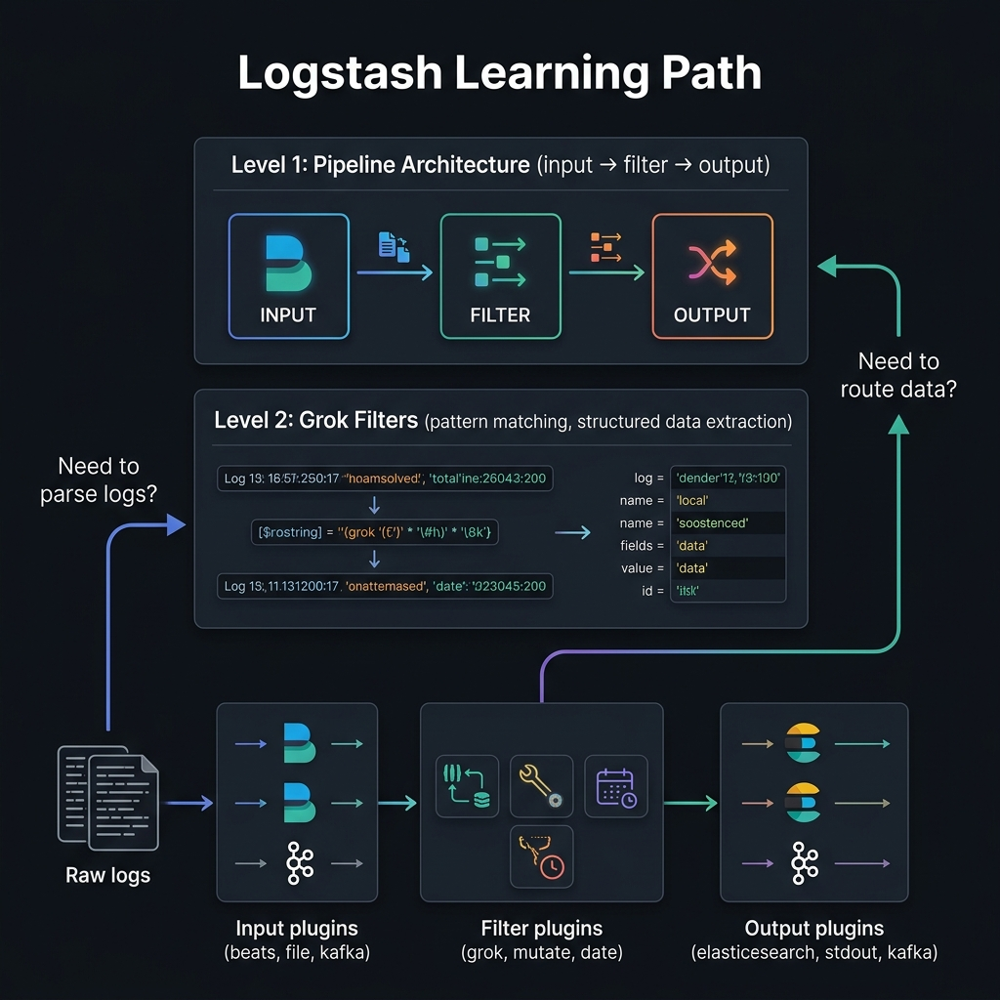
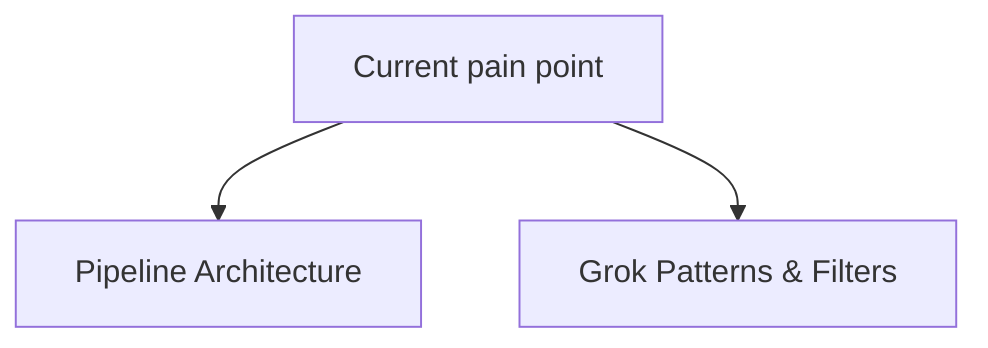
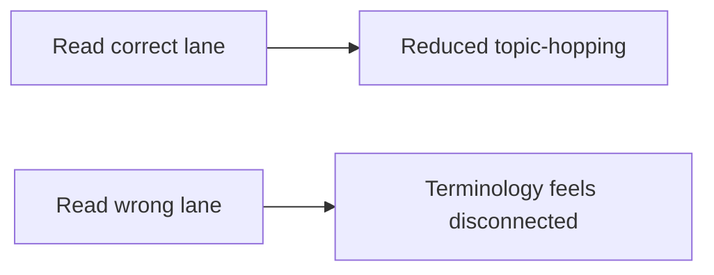

<!-- tags: overview -->
# Logstash

> Lane for pipeline architecture and filter/transformation before data enters Elasticsearch.

| Aspect | Detail |
| --- | --- |
| **Concept** | Navigation hub for `Logstash` |
| **Audience** | SRE, observability engineer, data pipeline engineer |
| **Primary style** | Concept-First router |
| **Entry point** | Open when the pain point sits at parsing, enrichment, or routing log events. |

📅 Updated: 2026-04-20 · ⏱️ 6 min read

---

## 1. DEFINE

`Logstash` appears right when observability data stops being a few manual log lines and becomes a pipeline with real operational cost.

A log pipeline usually breaks where the parser assumes data will always be clean. The Logstash lane exists to look straight at the middle segment: where raw events get transformed into searchable data.

This hub does not replace each detail article. It exists to help readers open the right lane before getting lost in tool-specific syntax or diagrams. Reading in the right order removes the feeling of "knowing many keywords but still unable to route a real problem."

### Signals & Boundaries

- Open this hub when you know the issue lies within `Logstash` but are unsure which article to read first.
- Use the coverage map to route by pain point instead of file order.
- Return to this hub after each article to choose the next step with intent.

### Coverage Map

| Entry | Role |
| --- | --- |
| [Logstash Pipeline Architecture](01-pipeline-architecture.md) | Entry point for the `Logstash Pipeline Architecture` lane |
| [Grok Patterns & Filters](02-grok-filters.md) | Entry point for the `Grok Patterns & Filters` lane |

---

## 2. VISUAL

The definition locked the hub's scope. The visual below helps route quickly by lane instead of scrolling a dry link list.





*Figure: This hub works as a router, not a catalog to browse through.*



*Figure: The real value of a router-style README is keeping readers on track from the start.*

---

## 3. CODE

The diagram showed the routing rhythm. The artifact below turns the hub into a short worksheet so teams or learners pick the right entry on their own.

### Problem 1: Basic — Route lane before reading deep

> **Goal**: Prevent learning or review from sliding into "any article will do."
> **Approach**: Choose lane by current pain point.
> **Example**: Pick the right cluster to read within `Logstash`.
> **Complexity**: Basic

```yaml
router:
  module: Logstash
  rule: "choose lane by pain point, not by which name sounds familiar"
  suggested_path:
  - 01-pipeline-architecture.md
  - 02-grok-filters.md
```

This artifact does not solve the problem for the reader; it only cuts wrong lanes before time is burned on articles that do not serve the actual goal.

---

## 4. PITFALLS

When a hub/router is misused, readers can still read individual articles but the overall understanding becomes fragmented.

| # | Severity | Mistake | Consequence | Fix |
| --- | --- | --- | --- | --- |
| 1 | 🔴 Fatal | Reading by file order without routing by pain point | Accumulates terminology but does not solve the right problem | Use coverage map before opening a detail article |
| 2 | 🟡 Common | Treating README as a pure link catalog | Loses the hub's navigation role | Always ask "which lane is my pain in?" |
| 3 | 🔵 Minor | Not returning to hub after finishing an article | Jumps to adjacent article by gut feeling | Return to README to pick the next step |

---

## 5. REF

| Resource | Type | Link | Note |
| --- | --- | --- | --- |
| Logstash Pipeline Architecture | Internal | [Logstash Pipeline Architecture](01-pipeline-architecture.md) | Directly related entry point |
| Grok Patterns & Filters | Internal | [Grok Patterns & Filters](02-grok-filters.md) | Directly related entry point |

---

## 6. RECOMMEND

Once you know which lane you stand in, the next step is opening the first article of that lane instead of wandering into another topic.

| Next step | When | Reason | File/Link |
| --- | --- | --- | --- |
| Logstash Pipeline Architecture | When pain point matches this lane | Continue the right cluster instead of reading loosely | [Logstash Pipeline Architecture](01-pipeline-architecture.md) |
| Grok Patterns & Filters | When pain point matches this lane | Continue the right cluster instead of reading loosely | [Grok Patterns & Filters](02-grok-filters.md) |
