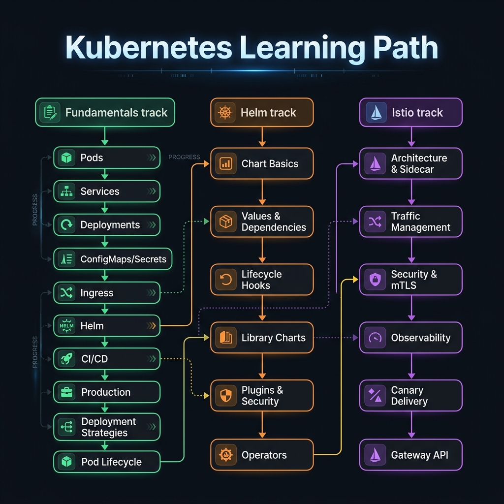
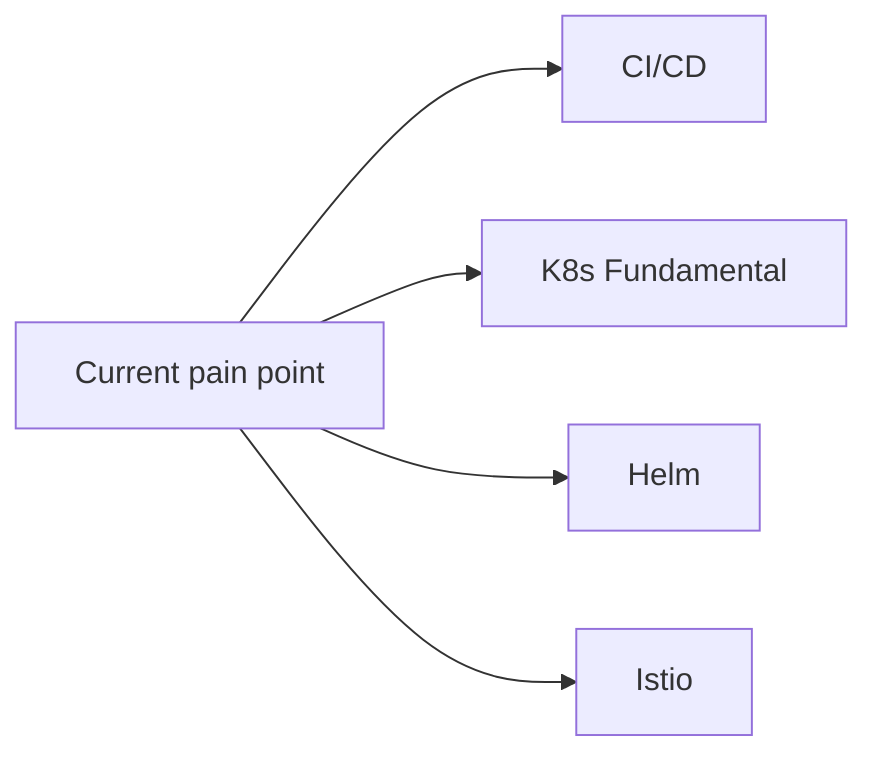

<!-- tags: overview -->
# Kubernetes

> Hub for the core lanes of Kubernetes: fundamentals, CI/CD, Helm, and Istio.

| Aspect | Detail |
| --- | --- |
| **Concept** | Navigation hub for `Kubernetes` |
| **Audience** | Platform engineer, DevOps engineer, backend engineer |
| **Primary style** | Concept-First router |
| **Entry point** | Open when you know the problem lives in Kubernetes but are unsure whether it belongs to the foundation, delivery, packaging, or service mesh lane. |

📅 Updated: 2026-04-20 · ⏱️ 6 min read

---

## 1. DEFINE

Picture Kubernetes appearing while the cluster is under a specific operational pressure and you can no longer answer with generic YAML.

A K8s cluster rarely fails because of missing YAML. It fails because the team answered the wrong question: is this a workload issue, a rollout issue, a packaging issue, or a traffic control issue? This hub exists to route the right pressure before you open a detail article.

This hub does not replace individual articles. It exists to help you open the right lane before wandering into tools, syntax, or specific diagrams. Reading in the right order reduces the feeling of "knowing many keywords but still unable to route the real problem."

### Signals & Boundaries

- Open this hub when you know the issue lives inside `Kubernetes` but are unsure which article to read first.
- Use the coverage map to route by pain point, not by file order.
- Return here after each article to pick the next step with intention.

### Coverage Map

| Entry | Role |
| --- | --- |
| [CI/CD — Continuous Integration & Deployment for K8s](cicd/README.md) | Entry point for lane `CI/CD` |
| [K8s Fundamental — Core Concepts & Deployment](fundamental/README.md) | Entry point for lane `K8s Fundamental` |
| [Helm — Package Manager for Kubernetes](helm/README.md) | Entry point for lane `Helm` |
| [Istio — Service Mesh for Microservices](istio/README.md) | Entry point for lane `Istio` |

---

## 2. VISUAL

The definition locked the hub's scope. The visual below helps route by lane instead of scrolling a dry link list.





*Figure: This hub works as a router, not a catalog. Route by current operational pressure — workload issues go to Fundamental, delivery to CI/CD, packaging to Helm, traffic to Istio.*

---

## 3. CODE

The diagram showed the routing rhythm. The artifact below turns the hub into a short worksheet so the team or learner can pick the right entry gate.

### Problem 1: Basic — Route the lane before reading deep

> **Goal**: Prevent study or review from drifting into "open whichever article looks interesting."
> **Approach**: Choose lane by current pain point.
> **Example**: Pick the right cluster to read in `Kubernetes`.
> **Complexity**: Basic

```yaml
router:
  module: Kubernetes
  rule: "choose lane by pain point, not by familiar name"
  suggested_path:
  - cicd/README.md
  - fundamental/README.md
  - helm/README.md
  - istio/README.md
```

This artifact does not solve the problem for you. It trims wrong lanes before your time is spent on articles that do not serve your current goal.

---

## 4. PITFALLS

| # | Severity | Mistake | Consequence | Fix |
| --- | --- | --- | --- | --- |
| 1 | 🔴 Fatal | Reading by file order instead of routing by pain point | Accumulates terminology without solving the real problem | Use the coverage map before opening a detail article |
| 2 | 🟡 Common | Treating the README as a pure link catalog | Loses the hub's routing purpose | Always ask "which lane matches my current pain?" |
| 3 | 🔵 Minor | Finishing an article without returning to the hub | Jumps to an adjacent article by instinct | Return to the README to pick the next step |

---

## 5. REF

| Resource | Type | Link | Notes |
| --- | --- | --- | --- |
| CI/CD for K8s | Internal | [CI/CD](cicd/README.md) | Directly related entry point |
| K8s Fundamental | Internal | [K8s Fundamental](fundamental/README.md) | Directly related entry point |
| Helm | Internal | [Helm](helm/README.md) | Directly related entry point |
| Istio | Internal | [Istio](istio/README.md) | Directly related entry point |

---

## 6. RECOMMEND

Once you know which lane you are in, the next step is to open the first article of that lane instead of wandering into a new topic.

| Next step | When | Reason | File/Link |
| --- | --- | --- | --- |
| CI/CD | When the pain point is delivery pipeline, GitOps, or ArgoCD | Continue into the right cluster | [CI/CD](cicd/README.md) |
| K8s Fundamental | When the pain point is pods, deployments, services, or storage | Continue into the right cluster | [K8s Fundamental](fundamental/README.md) |
| Helm | When the pain point is chart packaging, values management, or hooks | Continue into the right cluster | [Helm](helm/README.md) |
| Istio | When the pain point is service mesh, mTLS, traffic control, or canary delivery | Continue into the right cluster | [Istio](istio/README.md) |
