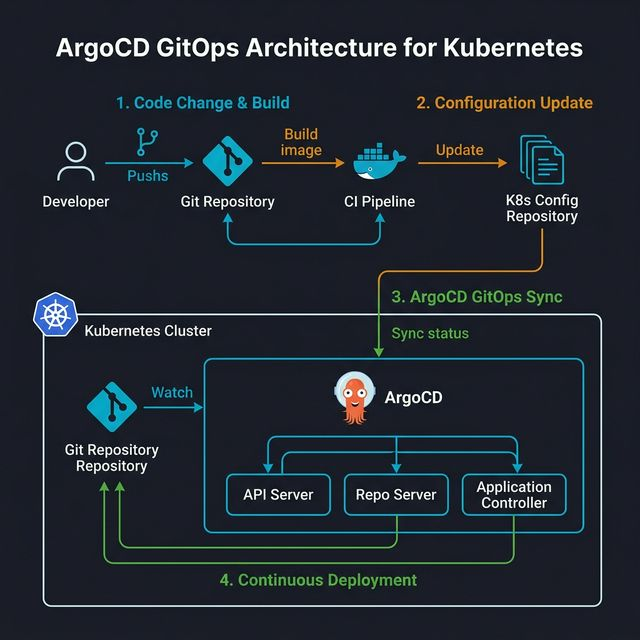

<!-- tags: kubernetes, k8s, argocd, gitops -->
# 🔄 ArgoCD — GitOps for Kubernetes

> Deploy applications using the GitOps model: Git is the source of truth, ArgoCD auto-syncs to the K8s cluster.

📅 Created: 2026-03-23 · 🔄 Updated: 2026-04-20 · ⏱️ 25 min read

| Aspect         | Detail                                    |
| -------------- | ----------------------------------------- |
| **Pattern**    | Pull-based GitOps (Declarative CD)        |
| **Use case**   | Automated K8s deployment, drift detection |
| **Components** | API Server, Repo Server, App Controller   |
| **Supports**   | Helm, Kustomize, Jsonnet, plain YAML      |

---

## 1. DEFINE

Picture GitOps only having value when Git truly becomes the source of truth and the sync loop is reliable enough to replace the human operator. ArgoCD is the story of how that trust is enforced by tooling.


### What is GitOps?

GitOps is a methodology for managing infrastructure and application deployment using **Git as the single source of truth**. Every change on the cluster originates from a Git commit.

| Concept          | Description                                              |
| ---------------- | ------------------------------------------------------- |
| **Declarative**  | Describe desired state in Git                            |
| **Versioned**    | Every change has Git history, audit trail               |
| **Automated**    | Agent auto-syncs desired state → live state             |
| **Self-healing** | Auto-detects drift and reconciles back to Git state     |

### Push-based vs Pull-based Deployment

| Feature             | Push-based (CI Deploy)        | Pull-based (GitOps/ArgoCD)        |
| ------------------- | ----------------------------- | --------------------------------- |
| **Trigger**         | CI pipeline push `kubectl`    | Cluster agent poll Git repo       |
| **K8s credentials** | CI server needs cluster access | Only in-cluster agent has access  |
| **Security**        | Credentials outside cluster    | Credentials never exposed         |
| **Drift detection** | ❌ None                       | ✅ Auto-detect + fix              |
| **Audit trail**     | CI logs                       | Git history = complete audit      |
| **Rollback**        | Re-run pipeline               | `git revert` → auto-sync          |
| **Tools**           | Jenkins, GitLab CI push       | ArgoCD, Flux CD                   |

### ArgoCD Architecture

| Component                     | Role                                                     |
| ----------------------------- | -------------------------------------------------------- |
| **API Server**                | gRPC/REST API for Web UI, CLI, CI/CD integration         |
| **Repository Server**         | Clone and cache Git repos, generate K8s manifests        |
| **Application Controller**    | Watch Git + cluster state, detect drift, trigger sync    |
| **Redis**                     | Cache for API Server and Controller                      |
| **Dex**                       | SSO authentication (OIDC, LDAP, SAML)                    |
| **ApplicationSet Controller** | Manage multiple Applications at once (multi-cluster)     |

### Core Concepts

| Concept           | Description                                                        |
| ----------------- | ------------------------------------------------------------------ |
| **Application**   | CRD representing 1 app: source (Git) → destination (cluster/ns)    |
| **Project**       | Group Applications, RBAC scope (cluster, namespace, repo whitelist) |
| **Sync**          | Process of applying desired state from Git onto cluster             |
| **Sync Status**   | `Synced` (matches Git) / `OutOfSync` (drift detected)              |
| **Health Status** | `Healthy` / `Progressing` / `Degraded` / `Missing`                 |
| **Prune**         | Delete resources on cluster no longer present in Git               |
| **Self-Heal**     | Auto-revert manual changes on cluster back to Git state            |

### Failure Modes

| Mistake                         | Cause                              | Fix                                     |
| ------------------------------- | ---------------------------------- | --------------------------------------- |
| Sync loop (continuously syncing)| Server-side defaults modify YAML   | Ignore differences or fix manifest      |
| OutOfSync after sync             | Mutating webhooks add fields       | `ignoreDifferences` in Application      |
| Repo clone timeout               | Git repo too large / slow network  | Shallow clone, increase timeout         |
| OOM on repo-server               | Too many apps or large repo        | Increase memory limit, sharding         |
| RBAC denied                      | Project restrictions               | Configure correct sourceRepos, destinations |

---

Those failure modes sound familiar. But there is a trap: auto-sync without policy means uncontrolled deploys, and a Git repo containing plaintext secrets means a data breach. That trap appears in PITFALLS.

## 2. VISUAL

Concepts have names now. The diagrams below reveal the more important part: how requests, workloads, or signals flow through these layers.




### ArgoCD Workflow Overview

```
  Developer                          Git Repository                    ArgoCD (in-cluster)                K8s Cluster
     │                                    │                                  │                               │
     │  git push (code change)            │                                  │                               │
     │───────────────────────────────────►│                                  │                               │
     │                                    │                                  │                               │
     │  CI Pipeline: build + push image   │                                  │                               │
     │───────────────────────────────────►│ update image tag                 │                               │
     │                                    │ in k8s manifests                 │                               │
     │                                    │                                  │                               │
     │                                    │  ┌──────────────────────┐       │                               │
     │                                    │  │ ArgoCD polls Git     │       │                               │
     │                                    │◄─┤ every 3 min (default)│       │                               │
     │                                    │  │ or webhook trigger   │       │                               │
     │                                    │  └──────────────────────┘       │                               │
     │                                    │                                  │                               │
     │                                    │  detect: OutOfSync              │                               │
     │                                    │──────────────────────────────────►│                               │
     │                                    │                                  │  kubectl apply                │
     │                                    │                                  │──────────────────────────────►│
     │                                    │                                  │                               │
     │                                    │                                  │  health check                 │
     │                                    │                                  │◄──────────────────────────────│
     │                                    │                                  │                               │
     │  ArgoCD UI: Synced ✅ Healthy ✅   │                                  │                               │
     │◄──────────────────────────────────────────────────────────────────────│                               │
```

### ArgoCD Components Architecture

```
┌─────────────────────────────────────────────────────────────┐
│                    ArgoCD Namespace                         │
│                                                             │
│  ┌──────────────┐    ┌─────────────────┐    ┌────────────┐ │
│  │  API Server   │    │  Repo Server     │    │  Redis     │ │
│  │              │    │                 │    │            │ │
│  │ • Web UI     │◄──►│ • Clone Git     │    │ • Cache    │ │
│  │ • REST/gRPC  │    │ • Generate YAML │    │ • Sessions │ │
│  │ • Auth/RBAC  │    │ • Helm template │    │            │ │
│  │ • Webhooks   │    │ • Kustomize     │    │            │ │
│  └──────┬───────┘    └────────┬────────┘    └────────────┘ │
│         │                     │                             │
│  ┌──────▼─────────────────────▼────────┐                   │
│  │       Application Controller        │                   │
│  │                                     │                   │
│  │ • Watch Git repos (poll / webhook)  │                   │
│  │ • Compare desired vs live state     │                   │
│  │ • Trigger sync when OutOfSync       │                   │
│  │ • Health assessment                 │                   │
│  │ • Self-healing (revert drift)       │                   │
│  └──────────────────┬──────────────────┘                   │
│                     │                                       │
│  ┌──────────────────▼──────────────────┐                   │
│  │    ApplicationSet Controller        │                   │
│  │                                     │                   │
│  │ • Git Generator (multi-app)         │                   │
│  │ • Cluster Generator (multi-cluster) │                   │
│  │ • Matrix/Merge generators           │                   │
│  └─────────────────────────────────────┘                   │
└─────────────────────────────────────────────────────────────┘
         │
         │ kubectl apply / delete
         ▼
┌─────────────────────┐
│   Target Cluster    │
│                     │
│ Namespace: staging  │
│ Namespace: prod     │
│ ...                 │
└─────────────────────┘
```

### Git Repository Structure (Best Practice)

```
# ✅ Separate app code repo and K8s config repo

app-repo/                          k8s-config-repo/
├── cmd/                           ├── base/
│   └── server/                    │   ├── deployment.yaml
│       └── main.go                │   ├── service.yaml
├── internal/                      │   ├── configmap.yaml
├── Dockerfile                     │   └── kustomization.yaml
├── .gitlab-ci.yml                 ├── overlays/
│   (CI: build + push image        │   ├── staging/
│    → update k8s-config-repo)     │   │   ├── kustomization.yaml
└── go.mod                         │   │   └── patches/
                                   │   │       └── replicas.yaml
                                   │   └── production/
                                   │       ├── kustomization.yaml
                                   │       ├── patches/
                                   │       │   ├── replicas.yaml
                                   │       │   └── resources.yaml
                                   │       └── secrets/
                                   │           └── sealed-secret.yaml
                                   └── argocd/
                                       ├── project.yaml
                                       ├── app-staging.yaml
                                       └── app-production.yaml
```

---

## 3. CODE

The diagrams showed the main flow. Code/config below pulls it down to the artifact level that on-call or reviewers must actually use.


### Example 1: Basic — Install ArgoCD and create the first Application

> **Goal**: Install ArgoCD on a K8s cluster, create the first Application deployed from Git
> **Requires**: K8s cluster (minikube/kind), kubectl, argocd CLI
> **Outcome**: ArgoCD running + auto-sync app from Git

```bash
#!/bin/bash
# ============================================
# ArgoCD Installation — Quick Start
# ============================================

# ✅ Step 1: Create namespace and install ArgoCD
kubectl create namespace argocd
kubectl apply -n argocd -f \
  https://raw.githubusercontent.com/argoproj/argo-cd/stable/manifests/install.yaml

# ✅ Step 2: Wait for pods ready
kubectl wait --for=condition=available deployment/argocd-server \
  -n argocd --timeout=300s

# ✅ Step 3: Get admin password
ARGOCD_PASS=$(kubectl -n argocd get secret argocd-initial-admin-secret \
  -o jsonpath="{.data.password}" | base64 -d)
echo "ArgoCD admin password: $ARGOCD_PASS"

# ✅ Step 4: Port-forward to access UI
kubectl port-forward svc/argocd-server -n argocd 8080:443 &

# ✅ Step 5: Login via CLI
argocd login localhost:8080 \
  --username admin \
  --password "$ARGOCD_PASS" \
  --insecure

# ✅ Step 6: Change password (recommended)
argocd account update-password \
  --current-password "$ARGOCD_PASS" \
  --new-password "MySecureP@ss123"

# ✅ Step 7: Create Application from CLI
argocd app create go-api \
  --repo https://github.com/myteam/k8s-config.git \
  --path k8s/overlays/staging \
  --dest-server https://kubernetes.default.svc \
  --dest-namespace staging \
  --sync-policy automated \
  --auto-prune \
  --self-heal

# ✅ Step 8: Check status
argocd app get go-api
argocd app sync go-api  # Manual sync if needed
```

> **✅ Outcome**: ArgoCD installed, Application auto-syncs from Git repo.
> **⚠️ Note**: Always change admin password and configure SSO for production.

---

ArgoCD setup is covered. But sync policy needs auto-prune — time to configure.

### Example 2: Intermediate — Application CRD with Kustomize and multi-environment

> **Goal**: Manage staging/production with Kustomize overlays, ArgoCD Application CRD
> **Requires**: Git repo with Kustomize structure, ArgoCD installed
> **Outcome**: Declarative multi-env deployment with auto-sync

```yaml
# base/deployment.yaml
# ✅ Base deployment — shared across all environments
apiVersion: apps/v1
kind: Deployment
metadata:
    name: go-api
    labels:
        app: go-api
spec:
    replicas: 1 # ⚠️ Overridden by overlay
    selector:
        matchLabels:
            app: go-api
    template:
        metadata:
            labels:
                app: go-api
        spec:
            containers:
                - name: api
                  image: registry.example.com/go-api:latest # ⚠️ Overridden by CI
                  ports:
                      - containerPort: 8080
                  resources:
                      requests:
                          cpu: 100m
                          memory: 128Mi
                      limits:
                          cpu: 500m
                          memory: 256Mi
                  readinessProbe:
                      httpGet:
                          path: /health
                          port: 8080
                      initialDelaySeconds: 5
                      periodSeconds: 10
                  livenessProbe:
                      httpGet:
                          path: /health
                          port: 8080
                      initialDelaySeconds: 15
                      periodSeconds: 20
```

```yaml
# base/service.yaml
apiVersion: v1
kind: Service
metadata:
    name: go-api
spec:
    selector:
        app: go-api
    ports:
        - port: 80
          targetPort: 8080
    type: ClusterIP
```

```yaml
# base/kustomization.yaml
apiVersion: kustomize.config.k8s.io/v1beta1
kind: Kustomization
resources:
    - deployment.yaml
    - service.yaml
commonLabels:
    managed-by: argocd
```

```yaml
# overlays/staging/kustomization.yaml
# ✅ Staging overlay — fewer resources, lower replicas
apiVersion: kustomize.config.k8s.io/v1beta1
kind: Kustomization
resources:
    - ../../base
namespace: staging
namePrefix: stg-
patches:
    - target:
          kind: Deployment
          name: go-api
      patch: |
          - op: replace
            path: /spec/replicas
            value: 1
          - op: replace
            path: /spec/template/spec/containers/0/resources/requests/cpu
            value: "50m"
          - op: replace
            path: /spec/template/spec/containers/0/resources/requests/memory
            value: "64Mi"
          - op: replace
            path: /spec/template/spec/containers/0/resources/limits/cpu
            value: "200m"
          - op: replace
            path: /spec/template/spec/containers/0/resources/limits/memory
            value: "128Mi"
```

```yaml
# overlays/production/kustomization.yaml
# ✅ Production overlay — high resources, HA replicas
apiVersion: kustomize.config.k8s.io/v1beta1
kind: Kustomization
resources:
    - ../../base
namespace: production
patches:
    - target:
          kind: Deployment
          name: go-api
      patch: |
          - op: replace
            path: /spec/replicas
            value: 3
          - op: replace
            path: /spec/template/spec/containers/0/resources/requests/cpu
            value: "200m"
          - op: replace
            path: /spec/template/spec/containers/0/resources/requests/memory
            value: "256Mi"
          - op: replace
            path: /spec/template/spec/containers/0/resources/limits/cpu
            value: "1000m"
          - op: replace
            path: /spec/template/spec/containers/0/resources/limits/memory
            value: "512Mi"
    - target:
          kind: Deployment
          name: go-api
      patch: |
          - op: add
            path: /spec/template/spec/topologySpreadConstraints
            value:
              - maxSkew: 1
                topologyKey: kubernetes.io/hostname
                whenUnsatisfiable: DoNotSchedule
                labelSelector:
                  matchLabels:
                    app: go-api
```

```yaml
# argocd/project.yaml
# ✅ ArgoCD Project — RBAC scope for the team
apiVersion: argoproj.io/v1alpha1
kind: AppProject
metadata:
    name: go-platform
    namespace: argocd
spec:
    description: 'Go Platform Services'
    # ✅ Only allow deploy from these repos
    sourceRepos:
        - 'https://gitlab.com/myteam/k8s-config.git'
        - 'https://gitlab.com/myteam/helm-charts.git'
    # ✅ Only allow deploy into these namespaces
    destinations:
        - server: https://kubernetes.default.svc
          namespace: staging
        - server: https://kubernetes.default.svc
          namespace: production
    # ✅ Whitelist resource types
    clusterResourceWhitelist:
        - group: ''
          kind: Namespace
    namespaceResourceWhitelist:
        - group: 'apps'
          kind: Deployment
        - group: ''
          kind: Service
        - group: ''
          kind: ConfigMap
        - group: ''
          kind: Secret
        - group: 'networking.k8s.io'
          kind: Ingress
```

```yaml
# argocd/app-staging.yaml
# ✅ ArgoCD Application — Staging environment
apiVersion: argoproj.io/v1alpha1
kind: Application
metadata:
    name: go-api-staging
    namespace: argocd
    # ✅ Finalizer: cleanup when Application is deleted
    finalizers:
        - resources-finalizer.argocd.argoproj.io
spec:
    project: go-platform
    source:
        repoURL: https://gitlab.com/myteam/k8s-config.git
        targetRevision: main
        path: overlays/staging
    destination:
        server: https://kubernetes.default.svc
        namespace: staging
    syncPolicy:
        automated:
            prune: true # ✅ Delete resources no longer in Git
            selfHeal: true # ✅ Revert manual changes
        syncOptions:
            - CreateNamespace=true
            - PruneLast=true # ✅ Prune after sync completes
            - ApplyOutOfSyncOnly=true # ✅ Only apply changed resources
        retry:
            limit: 5
            backoff:
                duration: 5s
                maxDuration: 3m
                factor: 2
    # ✅ Ignore server-side defaults to avoid sync loop
    ignoreDifferences:
        - group: apps
          kind: Deployment
          jsonPointers:
              - /spec/template/metadata/annotations/kubectl.kubernetes.io~1restartedAt
```

```yaml
# argocd/app-production.yaml
# ✅ ArgoCD Application — Production environment
apiVersion: argoproj.io/v1alpha1
kind: Application
metadata:
    name: go-api-production
    namespace: argocd
    finalizers:
        - resources-finalizer.argocd.argoproj.io
    # ✅ Annotations for notifications
    annotations:
        notifications.argoproj.io/subscribe.on-sync-succeeded.slack: deploy-notifications
        notifications.argoproj.io/subscribe.on-sync-failed.slack: deploy-alerts
spec:
    project: go-platform
    source:
        repoURL: https://gitlab.com/myteam/k8s-config.git
        targetRevision: main
        path: overlays/production
    destination:
        server: https://kubernetes.default.svc
        namespace: production
    syncPolicy:
        # ⚠️ Production: NO auto-sync, require manual approval
        syncOptions:
            - CreateNamespace=true
            - PruneLast=true
            - ApplyOutOfSyncOnly=true
        retry:
            limit: 3
            backoff:
                duration: 10s
                maxDuration: 5m
                factor: 2
    ignoreDifferences:
        - group: apps
          kind: Deployment
          jsonPointers:
              - /spec/template/metadata/annotations/kubectl.kubernetes.io~1restartedAt
```

> **✅ Outcome**: Multi-env deployment with Kustomize overlays + ArgoCD Application CRD. Staging auto-syncs, Production requires manual approval.
> **⚠️ Note**: Production should NOT use auto-sync — require manual `argocd app sync` or UI approval.

---

Sync policy is covered. But multi-cluster needs ApplicationSet — time to scale.

### Example 3: Advanced — ApplicationSet for multi-service deployment

> **Goal**: Manage multiple microservices at once with ApplicationSet
> **Requires**: Multiple services in the same Git repo, ArgoCD ApplicationSet Controller
> **Outcome**: 1 template → N Applications auto-created

```yaml
# argocd/applicationset-services.yaml
# ✅ ApplicationSet — create Application for each service in Git repo
apiVersion: argoproj.io/v1alpha1
kind: ApplicationSet
metadata:
    name: platform-services
    namespace: argocd
spec:
    generators:
        # ✅ Git Directory Generator — scan folders in repo
        - git:
              repoURL: https://gitlab.com/myteam/k8s-config.git
              revision: main
              directories:
                  - path: 'services/*' # Each folder = 1 service
                  - path: 'services/legacy' # ⚠️ Exclude legacy
                    exclude: true
    template:
        metadata:
            # ✅ Application name = folder name
            name: '{{path.basename}}'
            namespace: argocd
            labels:
                team: platform
                managed-by: applicationset
        spec:
            project: go-platform
            source:
                repoURL: https://gitlab.com/myteam/k8s-config.git
                targetRevision: main
                path: '{{path}}' # ✅ Dynamic path from generator
            destination:
                server: https://kubernetes.default.svc
                namespace: '{{path.basename}}' # ✅ Each service = 1 namespace
            syncPolicy:
                automated:
                    prune: true
                    selfHeal: true
                syncOptions:
                    - CreateNamespace=true
```

```yaml
# argocd/applicationset-multi-cluster.yaml
# ✅ ApplicationSet — deploy the same app to multiple clusters
apiVersion: argoproj.io/v1alpha1
kind: ApplicationSet
metadata:
    name: go-api-multi-cluster
    namespace: argocd
spec:
    generators:
        # ✅ Cluster Generator — iterate through registered clusters
        - clusters:
              selector:
                  matchLabels:
                      env: production
    template:
        metadata:
            name: 'go-api-{{name}}' # ✅ name = cluster name
            namespace: argocd
        spec:
            project: go-platform
            source:
                repoURL: https://gitlab.com/myteam/k8s-config.git
                targetRevision: main
                path: overlays/production
            destination:
                server: '{{server}}' # ✅ server = cluster API URL
                namespace: production
            syncPolicy:
                automated:
                    prune: true
                    selfHeal: true
```

```yaml
# argocd/applicationset-matrix.yaml
# ✅ Matrix Generator — service × environment combination
apiVersion: argoproj.io/v1alpha1
kind: ApplicationSet
metadata:
    name: platform-matrix
    namespace: argocd
spec:
    generators:
        - matrix:
              generators:
                  # Generator 1: Services
                  - git:
                        repoURL: https://gitlab.com/myteam/k8s-config.git
                        revision: main
                        directories:
                            - path: 'services/*'
                  # Generator 2: Environments
                  - list:
                        elements:
                            - env: staging
                              cluster: https://kubernetes.default.svc
                              namespace-suffix: stg
                            - env: production
                              cluster: https://kubernetes.default.svc
                              namespace-suffix: prod
    template:
        metadata:
            # ✅ service-name-env → go-api-staging, go-api-production
            name: '{{path.basename}}-{{env}}'
            namespace: argocd
        spec:
            project: go-platform
            source:
                repoURL: https://gitlab.com/myteam/k8s-config.git
                targetRevision: main
                path: '{{path}}/overlays/{{env}}'
            destination:
                server: '{{cluster}}'
                namespace: '{{path.basename}}-{{namespace-suffix}}'
            syncPolicy:
                automated:
                    prune: true
                    selfHeal: true
                syncOptions:
                    - CreateNamespace=true
```

> **✅ Outcome**: 1 ApplicationSet template auto-creates N Applications. Adding a new service = adding a folder in Git → ArgoCD auto-creates the Application.
> **⚠️ Note**: ApplicationSet is powerful but needs thorough testing — a wrong template can create dozens of broken Applications.

---

### Example 4: Expert — ArgoCD Image Updater + Notifications

> **Goal**: Auto-update image tag when registry has new image + Slack notifications
> **Requires**: ArgoCD Image Updater, ArgoCD Notifications
> **Outcome**: Zero-touch deployment: push code → CI builds image → ArgoCD auto-updates + notifies

```yaml
# argocd-image-updater/install.yaml
# ✅ Install ArgoCD Image Updater
apiVersion: v1
kind: ConfigMap
metadata:
    name: argocd-image-updater-config
    namespace: argocd
data:
    # ✅ Registry configurations
    registries.conf: |
        registries:
          - name: GitLab Registry
            prefix: registry.gitlab.com
            api_url: https://registry.gitlab.com
            credentials: secret:argocd/gitlab-registry-creds#token
            default: true
          - name: Docker Hub
            prefix: docker.io
            api_url: https://registry-1.docker.io
            credentials: pullsecret:argocd/dockerhub-creds
```

```yaml
# argocd/app-with-image-updater.yaml
# ✅ Application with Image Updater annotations
apiVersion: argoproj.io/v1alpha1
kind: Application
metadata:
    name: go-api-staging
    namespace: argocd
    annotations:
        # ✅ ArgoCD Image Updater — watch image in registry
        argocd-image-updater.argoproj.io/image-list: >-
            api=registry.gitlab.com/myteam/go-api
        # ✅ Update strategy: semver — only update minor/patch
        argocd-image-updater.argoproj.io/api.update-strategy: semver
        argocd-image-updater.argoproj.io/api.allow-tags: "regexp:^v\\d+\\.\\d+\\.\\d+$"
        # ✅ Write changes to Git (the GitOps way)
        argocd-image-updater.argoproj.io/write-back-method: git
        argocd-image-updater.argoproj.io/write-back-target: kustomization
        argocd-image-updater.argoproj.io/git-branch: main
spec:
    project: go-platform
    source:
        repoURL: https://gitlab.com/myteam/k8s-config.git
        targetRevision: main
        path: overlays/staging
    destination:
        server: https://kubernetes.default.svc
        namespace: staging
    syncPolicy:
        automated:
            prune: true
            selfHeal: true
```

```yaml
# argocd-notifications/config.yaml
# ✅ ArgoCD Notifications — Slack integration
apiVersion: v1
kind: ConfigMap
metadata:
    name: argocd-notifications-cm
    namespace: argocd
data:
    # ✅ Slack service configuration
    service.slack: |
        token: $slack-token
        signingSecret: $slack-signing-secret

    # ✅ Notification templates
    template.app-sync-succeeded: |
        slack:
          attachments: |
            [{
              "color": "#18be52",
              "title": "✅ {{.app.metadata.name}} synced successfully",
              "fields": [
                {"title": "Application", "value": "{{.app.metadata.name}}", "short": true},
                {"title": "Environment", "value": "{{.app.spec.destination.namespace}}", "short": true},
                {"title": "Revision", "value": "{{.app.status.sync.revision | truncate 7}}", "short": true},
                {"title": "Images", "value": "{{range .app.status.summary.images}}{{.}}\n{{end}}", "short": false}
              ]
            }]

    template.app-sync-failed: |
        slack:
          attachments: |
            [{
              "color": "#E96D76",
              "title": "❌ {{.app.metadata.name}} sync FAILED",
              "fields": [
                {"title": "Application", "value": "{{.app.metadata.name}}", "short": true},
                {"title": "Error", "value": "{{.app.status.operationState.message}}", "short": false}
              ]
            }]

    template.app-health-degraded: |
        slack:
          attachments: |
            [{
              "color": "#f4c030",
              "title": "⚠️ {{.app.metadata.name}} health DEGRADED",
              "fields": [
                {"title": "Application", "value": "{{.app.metadata.name}}", "short": true},
                {"title": "Health", "value": "{{.app.status.health.status}}", "short": true}
              ]
            }]

    # ✅ Triggers — when to send notification
    trigger.on-sync-succeeded: |
        - when: app.status.operationState.phase in ['Succeeded']
          send: [app-sync-succeeded]
    trigger.on-sync-failed: |
        - when: app.status.operationState.phase in ['Error', 'Failed']
          send: [app-sync-failed]
    trigger.on-health-degraded: |
        - when: app.status.health.status == 'Degraded'
          send: [app-health-degraded]
```

> **✅ Outcome**: Full automation: CI pushes image → Image Updater updates Git → ArgoCD syncs → Slack notification.
> **⚠️ Note**: Image Updater writes commits to Git — configure Git credentials and branch protection accordingly.

---

You have walked through setup, sync policy, and multi-cluster. Now comes the dangerous part: uncontrolled sync and plaintext secrets — the trap set up from the beginning.

## 4. PITFALLS

Knowing the right way is only half the story. The other half is the places where it is very easy to get almost right and then pay the price when the cluster shakes.


| #   | Mistake                                 | Consequence                       | Fix                                                        |
| --- | --------------------------------------- | --------------------------------- | ---------------------------------------------------------- |
| 1   | Auto-sync production without approval   | Buggy deploy auto-pushed to prod  | Disable `automated` for prod, use manual sync              |
| 2   | Sync loop — ArgoCD continuously syncs   | CPU/memory spike, Git rate limit  | Use `ignoreDifferences` for server-side defaults           |
| 3   | Prune deletes important resource        | Downtime if resource is removed   | Annotation: `argocd.argoproj.io/sync-options: Prune=false` |
| 4   | Repo server OOM with too many apps      | Clone/render timeout              | Sharding, increase `--parallelism-limit`                   |
| 5   | Secrets stored as plain text in Git     | Security breach                   | Use Sealed Secrets or External Secrets Operator            |
| 6   | Webhook not configured                  | 3-minute delay (polling interval) | Configure GitHub/GitLab webhook → ArgoCD                   |
| 7   | ApplicationSet template wrong           | Creates many broken Applications  | Test with `--dry-run`, use `preview` mode                  |

---

You have walked through ArgoCD and its traps. The resources below help go deeper.

## 5. REF

| Resource                  | Link                                                                                                                                        |
| ------------------------- | ------------------------------------------------------------------------------------------------------------------------------------------- |
| ArgoCD Documentation      | [argo-cd.readthedocs.io](https://argo-cd.readthedocs.io/)                                                                                   |
| ArgoCD GitHub             | [github.com/argoproj/argo-cd](https://github.com/argoproj/argo-cd)                                                                          |
| ArgoCD Image Updater      | [argocd-image-updater.readthedocs.io](https://argocd-image-updater.readthedocs.io/)                                                         |
| ArgoCD Notifications      | [argo-cd.readthedocs.io/en/stable/operator-manual/notifications](https://argo-cd.readthedocs.io/en/stable/operator-manual/notifications/)   |
| ApplicationSet Docs       | [argo-cd.readthedocs.io/en/stable/operator-manual/applicationset](https://argo-cd.readthedocs.io/en/stable/operator-manual/applicationset/) |
| Kustomize                 | [kustomize.io](https://kustomize.io/)                                                                                                       |
| Sealed Secrets            | [github.com/bitnami-labs/sealed-secrets](https://github.com/bitnami-labs/sealed-secrets)                                                    |
| External Secrets Operator | [external-secrets.io](https://external-secrets.io/)                                                                                         |

---

## 6. RECOMMEND

When you have seen what this lane solves and where it commonly breaks, the documents below extend directly along the adjacent operational pressures.


| Extension                       | When                   | Reason                                  |
| ------------------------------- | ---------------------- | --------------------------------------- |
| **Flux CD**                     | Alternative GitOps     | CNCF graduated, integrates well with GitHub |
| **ArgoCD Vault Plugin**         | Secret management      | Inject secrets from HashiCorp Vault     |
| **ArgoCD Rollouts**             | Progressive delivery   | Canary/Blue-Green with analysis         |
| **Crossplane + ArgoCD**         | Infrastructure as Code | Manage cloud resources via GitOps       |
| **ArgoCD Autopilot**            | Bootstrap ArgoCD       | Manage ArgoCD config via GitOps         |
| **Prometheus + ArgoCD Metrics** | Monitoring             | Alert on sync failure, health degraded  |
| **Open Policy Agent (OPA)**     | Policy enforcement     | Control which resources can be deployed |

---

## 🔍 Debug Checklist

| # | Symptom | Cause | Debug Command |
|---|---------|-------|---------------|
| 1 | App stuck at `OutOfSync` after multiple syncs | Sync failed, resource conflict or hook error | `argocd app get <app>` + `argocd app sync <app> --force` |
| 2 | App health `Degraded` despite sync `Synced` | Pod crash, readiness probe fail, PVC pending | `argocd app get <app>` + `kubectl describe pod -n <ns>` |
| 3 | ArgoCD Image Updater not updating image | Missing annotation or wrong registry credentials | `kubectl logs -n argocd -l app.kubernetes.io/name=argocd-image-updater --tail=100` |
| 4 | ApplicationSet not creating Applications | Generator config wrong, path not matching, Git repo error | `argocd appset get <appset>` + `kubectl describe appset -n argocd <appset>` |
| 5 | RBAC denied when syncing or creating resource | Project `sourceRepos` or `destinations` not whitelisted | `argocd proj get <project>` + `argocd account can-i sync applications '<proj>/*'` |
| 6 | Infinite sync loop — ArgoCD continuously re-syncs | Mutating webhook or server-side defaults add fields to YAML | `argocd app diff <app>` to see specific drift → use `ignoreDifferences` |
| 7 | Webhook not triggering sync, waits up to 3 minutes | Webhook secret wrong, ArgoCD server URL incorrect | `kubectl logs -n argocd deployment/argocd-server` + check webhook config on GitLab/GitHub |

---

## 🃏 Quick Reference

| # | Pattern | Command / Rule |
|---|---------|----------------|
| 1 | Install ArgoCD | `kubectl create ns argocd && kubectl apply -n argocd -f https://raw.githubusercontent.com/argoproj/argo-cd/stable/manifests/install.yaml` |
| 2 | Login CLI | `argocd login <server> --username admin --password <pw> --insecure` |
| 3 | Create Application | `argocd app create <name> --repo <url> --path <path> --dest-server https://kubernetes.default.svc --dest-namespace <ns>` |
| 4 | Manual sync | `argocd app sync <name>` or `argocd app sync <name> --force` |
| 5 | Enable auto-sync + self-heal | `spec.syncPolicy.automated: {prune: true, selfHeal: true}` in Application CRD |
| 6 | Check status | `argocd app get <name>` or `argocd app list` |
| 7 | Rollback to old revision | `argocd app rollback <name> <revision-id>` (view history: `argocd app history <name>`) |
| 8 | ApplicationSet Git Generator | `directories: [{path: 'services/*'}]` → each folder auto-creates 1 Application |

---

## 🎯 Interview Angle

**Relevant system design / technical questions:**
- *"What is the difference between push-based deployment (CI pipeline using kubectl) and pull-based GitOps (ArgoCD)? When should you use each?"*
- *"How does ArgoCD auto-detect drift? How does self-healing work and when should you disable it in production?"*
- *"Design a GitOps workflow for a microservices system with 20 services deployed across 3 clusters (dev/staging/prod)."*

**Points the interviewer wants to hear:**

| Topic | Talking Point |
|-------|---------------|
| GitOps vs Push-based | Pull-based is safer because K8s credentials never leave the cluster; Git history is a complete audit trail |
| Sync policies | Auto-sync for staging, manual approval for production; `prune: true` use with caution since it deletes resources no longer in Git |
| Self-healing | Auto-reverts manual changes back to Git state; disable if the team needs direct hotfixes on the cluster |
| ApplicationSet | 1 template creates N Applications; Git Directory Generator for multi-service, Cluster Generator for multi-cluster |
| RBAC & Projects | AppProject limits sourceRepos, destinations, resource types; critical for multi-team environments |
| Drift detection | ArgoCD polls Git every 3 minutes or via webhook; `argocd app diff` shows exactly which fields changed |

**Common follow-up questions:**
- *"What is the App of Apps pattern?"* → 1 ArgoCD Application manages multiple Application YAML files in Git — bootstraps the entire cluster from 1 root app.
- *"How do you handle Secrets with GitOps?"* → Never store plain text in Git; use Sealed Secrets (encrypt before push) or External Secrets Operator (sync from Vault/AWS SM).
- *"How do you avoid sync loops?"* → Use `ignoreDifferences` to skip server-side injected fields (kubectl restart annotation, defaultMode, etc.).

---

**Links**: [← CI/CD Pipeline](../fundamental/09-cicd-pipeline.md) · [→ GitLab CI](./02-gitlab-ci.md)
