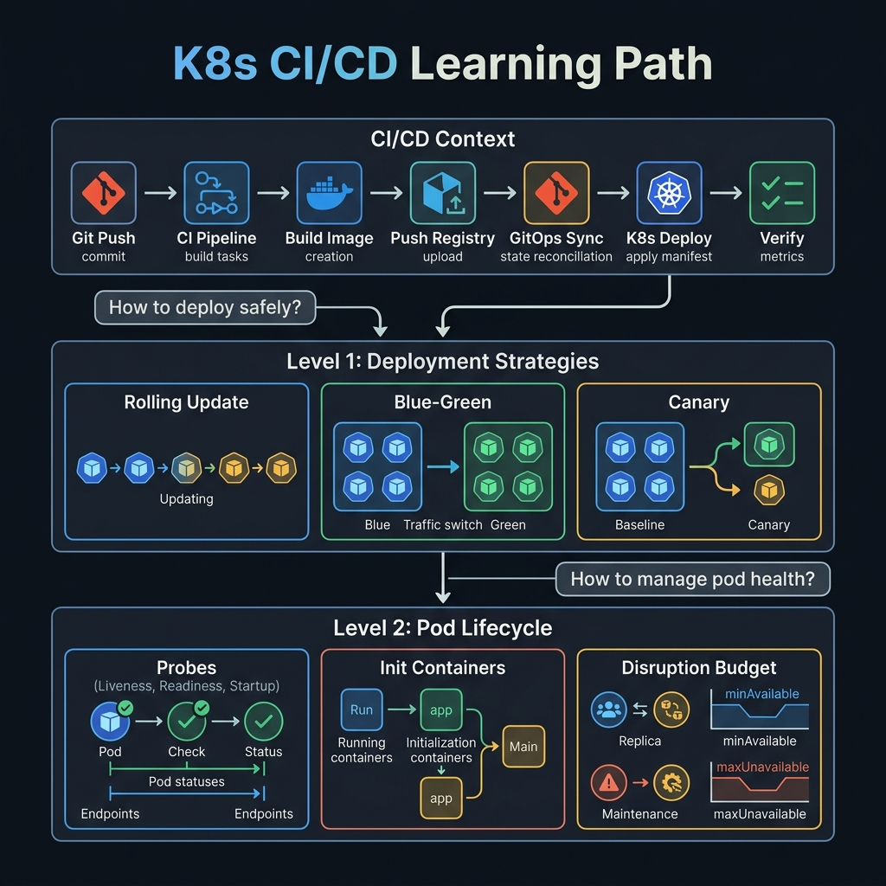

<!-- tags: overview -->
# Kubernetes CI/CD

> Lane for GitOps, ArgoCD, and pipeline deployment into the cluster.

| Aspect | Detail |
| --- | --- |
| **Concept** | Navigation hub for `Kubernetes CI/CD` |
| **Audience** | Platform engineer, DevOps engineer, release owner |
| **Primary style** | Concept-First router |
| **Entry point** | Open when the pain point lies in how changes enter the cluster and how rollout is controlled. |

📅 Updated: 2026-04-20 · ⏱️ 6 min read

---

## 1. DEFINE

Picture a late-night deploy slowing down because nobody is sure where the path from git to cluster is being controlled. At that point, CI/CD rarely fails because of a missing `kubectl apply` command; it fails because rollback is uncertain, the source of truth is vague, and every team trusts a different pipeline.

This hub does not replace each detail article. It exists to help the reader open the right lane before getting lost in tool-specific syntax or diagrams. When read in the right order, you will stop feeling like you "know many keywords but still cannot route a real problem."

### Signals & Boundaries

- Open this hub when you know the problem lies in `Kubernetes CI/CD`, but are unsure which article to read first.
- Use the coverage map to route by pain point rather than by file order.
- Return to this hub after each article to choose the next step with intention.

### Coverage Map

| Entry | Role |
| --- | --- |
| [ArgoCD — GitOps for Kubernetes](01-argocd.md) | Entry point for the `ArgoCD — GitOps for Kubernetes` lane |
| [GitLab CI/CD — Pipeline for Kubernetes](02-gitlab-ci.md) | Entry point for the `GitLab CI/CD — Pipeline for Kubernetes` lane |

---

## 2. VISUAL

The definition locked the hub's scope. The visual below routes by pain point — deployment strategies or pod lifecycle management.



### Level 1

```text
start from the current pain point
  -> ArgoCD — GitOps for Kubernetes
  -> GitLab CI/CD — Pipeline for Kubernetes
```

*Figure: This hub acts as a router, not a catalog to skim through.*

### Level 2

```text
read the right lane -> reduces jumping between articles
read the wrong lane -> the more you read, the more disconnected the terms feel
```

*Figure: The real value of a router-style README is keeping the reader on the right path from the start.*

---

## 3. CODE

### Problem 1: Basic — Route the lane before reading deep

> **Goal**: Prevent learning or review from drifting into "any article will do."
> **Approach**: Choose the lane based on the current pain point.
> **Example**: Select the right cluster of articles in `Kubernetes CI/CD`.
> **Complexity**: Basic

```yaml
router:
  module: Kubernetes CI/CD
  rule: "choose the lane by pain point, not by name familiarity"
  suggested_path:
  - 01-argocd.md
  - 02-gitlab-ci.md
```

This artifact does not solve the problem for the reader; it only cuts the wrong lanes before time is wasted on articles that do not serve the actual goal.

---

## 4. PITFALLS

When a hub/router is misused, the reader can still read each article individually, but the overall understanding will fall into a fragmented state.

| # | Severity | Mistake | Consequence | Fix |
| --- | --- | --- | --- | --- |
| 1 | 🔴 Fatal | Reading by file order without routing by pain point | Accumulate terminology without solving the real problem | Use coverage map before opening a detail article |
| 2 | 🟡 Common | Treating README as a pure link catalog | Loses the hub's routing role | Always ask "which lane am I hurting in?" |
| 3 | 🔵 Minor | Not returning to hub after reading an article | Jumping to an adjacent article by gut feeling | Return to README to choose the next step |

---

## 5. REF

| Resource | Type | Link | Note |
| --- | --- | --- | --- |
| ArgoCD — GitOps for Kubernetes | Internal | [ArgoCD — GitOps for Kubernetes](01-argocd.md) | Directly related entry point |
| GitLab CI/CD — Pipeline for Kubernetes | Internal | [GitLab CI/CD — Pipeline for Kubernetes](02-gitlab-ci.md) | Directly related entry point |

---

## 6. RECOMMEND

When you know which lane you are standing in, the next step is to open the first article of that lane rather than learning another new topic aimlessly.

| Extension | When | Reason | File/Link |
| --- | --- | --- | --- |
| ArgoCD — GitOps for Kubernetes | When pain point matches this lane | Continue on the right cluster instead of reading scattered | [ArgoCD — GitOps for Kubernetes](01-argocd.md) |
| GitLab CI/CD — Pipeline for Kubernetes | When pain point matches this lane | Continue on the right cluster instead of reading scattered | [GitLab CI/CD — Pipeline for Kubernetes](02-gitlab-ci.md) |
