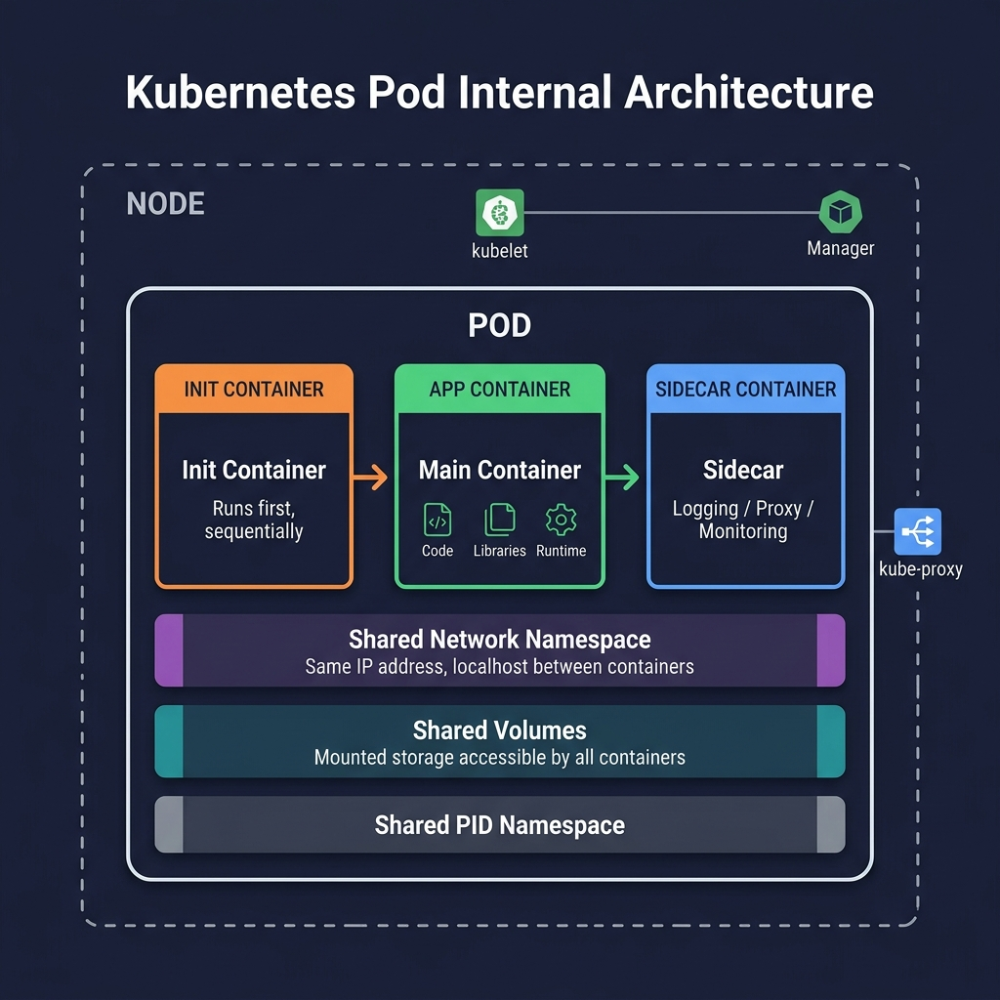

<!-- tags: kubernetes, k8s, pods, containers -->
# 📦 Pods & Containers

> Pod is the smallest deployable unit in Kubernetes — understanding Pods is understanding the K8s foundation

| Aspect           | Detail                                             |
| ---------------- | -------------------------------------------------- |
| **K8s Object**   | `v1/Pod`                                           |
| **Use case**     | Run 1+ containers sharing the same network/storage namespace  |
| **Go relevance** | Dockerfile → Image → Pod → Service                 |
| **Kubectl**      | `kubectl run`, `kubectl apply`, `kubectl get pods` |

---

## 1. DEFINE

Picture yourself deploying a new image to the cluster, but the thing actually running lives not in the image or an individual node — it lives in the Pod. If you cannot lock down what a Pod's boundary is, every K8s discussion after that drifts fast.


### What is a Pod?

**Pod** is the smallest schedulable unit in Kubernetes. A Pod contains 1 or more containers sharing:

- **Network namespace** — same IP, same port space
- **Storage volumes** — shared mounts
- **Linux namespaces** — IPC, PID (optional)

### Pod vs Container vs Node

| Concept       | Scope         | Lifecycle                           | Example                         |
| ------------- | ------------- | ----------------------------------- | ------------------------------- |
| **Container** | 1 process     | Born from an image, runs inside a Pod | Go binary `./api-server`        |
| **Pod**       | 1+ containers | Scheduled onto a Node, gets its own IP | `api-pod` with Go app + sidecar |
| **Node**      | Physical/VM   | Runs many Pods                      | Worker node `node-01`           |
| **Cluster**   | Many Nodes    | The entire infrastructure           | Production cluster              |

### Actors

| Actor                 | Role                                        |
| --------------------- | ------------------------------------------- |
| **kubelet**           | Ensures containers in the Pod run per spec  |
| **kube-scheduler**    | Selects the right Node for the Pod          |
| **Container Runtime** | Actually runs the container (containerd, CRI-O) |
| **kube-proxy**        | Manages network rules for the Pod           |

### Multi-Container Patterns

| Pattern            | Description                          | Use case                    |
| ------------------ | ------------------------------------ | --------------------------- |
| **Sidecar**        | Helper container alongside main      | Log shipper, proxy          |
| **Ambassador**     | Outbound connection proxy            | Database proxy, API gateway |
| **Init Container** | Runs before main container           | DB migration, config setup  |
| **Adapter**        | Transforms main container output     | Log format adapter          |

### Failure Modes

| Error              | Cause                              | Consequence                        |
| ------------------ | ---------------------------------- | ---------------------------------- |
| `CrashLoopBackOff` | Container crashes repeatedly       | Pod restart loop, backoff increases |
| `ImagePullBackOff` | Image does not exist or auth fails | Pod stays Pending forever          |
| `OOMKilled`        | Exceeds memory limit               | Container is killed                |
| `Evicted`          | Node runs out of resources         | Pod evicted from Node              |
| `Pending`          | No suitable Node available         | Pod waits indefinitely             |

---

Those failure modes sound familiar. But there is a trap: running a container as root = privilege escalation, and a Pod without resource limits = starving the node. That trap appears in PITFALLS.

## 2. VISUAL

Definitions only lock vocabulary. The visual below shows the actual operational flow where containers, pods, log pipelines, and shell commands start hitting production.



*Figure: A Pod is the smallest deployable unit — containers inside share the same network namespace (localhost), volumes, and PID namespace. Init containers run sequentially before the main app container starts.*


### Pod Lifecycle

```
                    ┌──────────┐
                    │ Pending  │
                    └────┬─────┘
                         │ (Scheduled to Node)
                    ┌────▼─────┐
              ┌─────│  Init    │ (Init containers run sequentially)
              │     │Containers│
              │     └────┬─────┘
              │          │ (All init done)
         fail │     ┌────▼─────┐
              │     │ Running  │◄──────── restart
              │     └────┬─────┘              │
              │          │                     │
              │    ┌─────▼─────┐     ┌────────┴─────────┐
              │    │ Succeeded │     │ CrashLoopBackOff  │
              │    │ (Job done)│     │ (Restart backoff) │
              │    └───────────┘     └──────────────────┘
              │
              └──► Failed
```

### Multi-Container Pod — Sidecar Pattern

```
┌─────────────────────────────────────────────┐
│                    POD                       │
│          Shared Network (localhost)          │
│                                              │
│  ┌──────────────┐    ┌──────────────────┐   │
│  │  Go API App  │    │  Sidecar:        │   │
│  │  :8080       │    │  Envoy Proxy     │   │
│  │              │───►│  :15001          │   │
│  │  main.go     │    │  (mTLS, tracing) │   │
│  └──────────────┘    └──────────────────┘   │
│         │                    │               │
│  ┌──────▼────────────────────▼────────────┐ │
│  │         Shared Volume: /var/log        │ │
│  │         emptyDir: {}                   │ │
│  └────────────────────────────────────────┘ │
└─────────────────────────────────────────────┘
```

---

## 3. CODE

The diagrams have shown the main path. The code/manifests/commands below pull it down to the artifact level that on-call or reviewers actually use.


### Example 1: Basic — Dockerfile + Pod manifest for a Go app

> **Goal**: Create a Docker image for a Go app and run it on K8s with a simple Pod manifest.
> **Requires**: Go 1.21+, Docker, minikube/kind.
> **Result**: Understand the Go source → Image → Pod flow.

**Step 1: Go application**

```go
// main.go — Simple HTTP server
package main

import (
	"encoding/json"
	"fmt"
	"log"
	"net/http"
	"os"
	"time"
)

// ✅ Standard API response structure
type HealthResponse struct {
	Status    string `json:"status"`
	Hostname  string `json:"hostname"`
	Timestamp string `json:"timestamp"`
	Version   string `json:"version"`
}

func main() {
	// ✅ Read port from env, default 8080
	port := os.Getenv("PORT")
	if port == "" {
		port = "8080"
	}

	// ✅ Health check endpoint — K8s will use this endpoint
	http.HandleFunc("/healthz", func(w http.ResponseWriter, r *http.Request) {
		hostname, _ := os.Hostname()
		resp := HealthResponse{
			Status:    "healthy",
			Hostname:  hostname,
			Timestamp: time.Now().Format(time.RFC3339),
			Version:   os.Getenv("APP_VERSION"),
		}
		w.Header().Set("Content-Type", "application/json")
		json.NewEncoder(w).Encode(resp)
	})

	// ✅ Main endpoint
	http.HandleFunc("/", func(w http.ResponseWriter, r *http.Request) {
		hostname, _ := os.Hostname()
		fmt.Fprintf(w, "Hello from Pod: %s\n", hostname)
	})

	log.Printf("🚀 Server starting on :%s", port)
	// ⚠️ Use ListenAndServe, do not hardcode "localhost"
	// K8s needs bind 0.0.0.0 to receive traffic from Service
	log.Fatal(http.ListenAndServe(":"+port, nil))
}
```

**Step 2: Multi-stage Dockerfile (production-grade)**

```dockerfile
# ==================== BUILD STAGE ====================
FROM golang:1.21-alpine AS builder

# ✅ Install certificates for HTTPS calls
RUN apk add --no-cache ca-certificates git

WORKDIR /app

# ✅ Copy go.mod first → cache dependencies layer
COPY go.mod go.sum* ./
RUN go mod download

COPY . .

# ✅ Build static binary — no libc dependency
# CGO_ENABLED=0: disable CGo → pure Go binary
# -ldflags="-s -w": strip debug info → reduce size
RUN CGO_ENABLED=0 GOOS=linux GOARCH=amd64 \
    go build -ldflags="-s -w" -o /app/server .

# ==================== RUNTIME STAGE ====================
FROM scratch

# ✅ Copy certificates from builder
COPY --from=builder /etc/ssl/certs/ca-certificates.crt /etc/ssl/certs/

# ✅ Copy binary
COPY --from=builder /app/server /server

# ⚠️ scratch image has no shell → cannot exec into it
# Use distroless if debugging is needed: gcr.io/distroless/static-debian12

EXPOSE 8080

# ✅ USER non-root — security best practice
USER 65534:65534

ENTRYPOINT ["/server"]
```

**Step 3: Pod manifest**

```yaml
# k8s/pod.yaml
apiVersion: v1
kind: Pod
metadata:
    name: go-api
    labels:
        app: go-api # ✅ Label so Service selector can find this Pod
        version: v1
    annotations:
        description: 'Go API server pod'
spec:
    containers:
        - name: api
          image: go-api:v1 # ✅ Image name:tag
          ports:
              - containerPort: 8080
                protocol: TCP
          env:
              - name: PORT
                value: '8080'
              - name: APP_VERSION
                value: '1.0.0'
          # ✅ Resource limits — MANDATORY for production
          resources:
              requests:
                  memory: '64Mi'
                  cpu: '100m' # 0.1 CPU core
              limits:
                  memory: '128Mi'
                  cpu: '250m' # 0.25 CPU core
          # ✅ Health checks
          livenessProbe:
              httpGet:
                  path: /healthz
                  port: 8080
              initialDelaySeconds: 5
              periodSeconds: 10
          readinessProbe:
              httpGet:
                  path: /healthz
                  port: 8080
              initialDelaySeconds: 3
              periodSeconds: 5
    # ✅ Auto-restart on crash
    restartPolicy: Always
```

```bash
# Deploy
docker build -t go-api:v1 .
minikube image load go-api:v1    # Load image into minikube
kubectl apply -f k8s/pod.yaml
kubectl get pods -w              # Watch status
kubectl logs go-api              # View logs
kubectl port-forward go-api 8080:8080  # Access locally
curl http://localhost:8080/healthz
```

> **Result**: Go app running in a K8s Pod, with health check and resource limits.
> **Note**: A standalone Pod has no self-healing — if the Node dies, the Pod is lost. Use a Deployment (next article).

📅 Created: 2026-03-20 · 🔄 Updated: 2026-04-20 · ⏱️ 15 min read

---

Basic Pod is covered. But multi-container needs sidecar — time to expand.

### Example 2: Intermediate — Init Container + Sidecar Pattern

> **Goal**: Pod with init container running DB migration before app starts, plus a sidecar log collector.
> **Requires**: PostgreSQL running, Go app needs DB.
> **Result**: Understand real-world multi-container patterns.

```yaml
# k8s/pod-advanced.yaml
apiVersion: v1
kind: Pod
metadata:
    name: go-api-advanced
    labels:
        app: go-api
spec:
    # ✅ Init Container: runs before main container
    # Used for DB migration, config check, dependency wait
    initContainers:
        # Init 1: Wait for PostgreSQL to be ready
        - name: wait-for-db
          image: busybox:1.36
          command:
              - sh
              - -c
              - |
                  echo "⏳ Waiting for PostgreSQL..."
                  until nc -z postgres-svc 5432; do
                    echo "  DB not ready, retrying in 2s..."
                    sleep 2
                  done
                  echo "✅ PostgreSQL is ready!"

        # Init 2: Run DB migration
        - name: db-migrate
          image: go-api:v1
          command: ['/server', '-migrate']
          env:
              - name: DATABASE_URL
                valueFrom:
                    secretKeyRef:
                        name: db-credentials
                        key: url

    # ✅ Main containers
    containers:
        # Main: Go API server
        - name: api
          image: go-api:v1
          ports:
              - containerPort: 8080
          env:
              - name: DATABASE_URL
                valueFrom:
                    secretKeyRef:
                        name: db-credentials
                        key: url
              - name: LOG_FORMAT
                value: 'json'
          resources:
              requests:
                  memory: '128Mi'
                  cpu: '200m'
              limits:
                  memory: '256Mi'
                  cpu: '500m'
          volumeMounts:
              - name: app-logs
                mountPath: /var/log/app # ✅ Write logs to file in shared volume

        # Sidecar: Log collector (Fluent Bit)
        - name: log-collector
          image: fluent/fluent-bit:2.2
          volumeMounts:
              - name: app-logs
                mountPath: /var/log/app # ✅ Read logs from shared volume
              - name: fluent-config
                mountPath: /fluent-bit/etc/
          resources:
              requests:
                  memory: '32Mi'
                  cpu: '50m'
              limits:
                  memory: '64Mi'
                  cpu: '100m'

    # ✅ Shared volumes
    volumes:
        - name: app-logs
          emptyDir: {} # Temporary, lost when Pod dies
        - name: fluent-config
          configMap:
              name: fluent-bit-config

    restartPolicy: Always
```

```go
// main.go extended — supports migrate flag
package main

import (
	"flag"
	"log"
	"os"
)

func main() {
	migrate := flag.Bool("migrate", false, "Run database migration")
	flag.Parse()

	if *migrate {
		// ✅ Run migration then exit — init container pattern
		log.Println("🔄 Running database migration...")
		if err := runMigration(os.Getenv("DATABASE_URL")); err != nil {
			log.Fatalf("❌ Migration failed: %v", err)
		}
		log.Println("✅ Migration completed successfully")
		return // Exit after migration completes
	}

	// ✅ Normal server mode
	startServer()
}

func runMigration(dbURL string) error {
	// Use golang-migrate or GORM AutoMigrate
	// ...
	return nil
}
```

> **Result**: Init containers ensure DB is ready + migrated before app starts. Sidecar collects logs.
> **Note**: Init containers run sequentially; if 1 fails → Pod does not start.

---

Sidecar is covered. But resource tuning needs limits — time to configure.

### Example 3: Advanced — Pod with resource tuning + Graceful Shutdown

> **Goal**: Go app handling graceful shutdown correctly when K8s sends SIGTERM, combined with preStop hook.
> **Requires**: Understanding of signal handling in Go.
> **Result**: Zero-downtime deployment ready.

```go
// main.go — Production-grade graceful shutdown
package main

import (
	"context"
	"encoding/json"
	"log"
	"net/http"
	"os"
	"os/signal"
	"sync/atomic"
	"syscall"
	"time"
)

// ✅ Atomic flag — readiness probe will check this
var isReady atomic.Bool

func main() {
	// ✅ Set ready = true when server is ready
	isReady.Store(false)

	mux := http.NewServeMux()

	// Health check — always healthy if process is alive
	mux.HandleFunc("/healthz", func(w http.ResponseWriter, r *http.Request) {
		w.WriteHeader(http.StatusOK)
		json.NewEncoder(w).Encode(map[string]string{"status": "alive"})
	})

	// ✅ Readiness check — only ready after warm-up completes
	mux.HandleFunc("/readyz", func(w http.ResponseWriter, r *http.Request) {
		if !isReady.Load() {
			w.WriteHeader(http.StatusServiceUnavailable)
			json.NewEncoder(w).Encode(map[string]string{"status": "not_ready"})
			return
		}
		w.WriteHeader(http.StatusOK)
		json.NewEncoder(w).Encode(map[string]string{"status": "ready"})
	})

	mux.HandleFunc("/", func(w http.ResponseWriter, r *http.Request) {
		// Simulate work
		time.Sleep(100 * time.Millisecond)
		hostname, _ := os.Hostname()
		json.NewEncoder(w).Encode(map[string]string{
			"message":  "Hello from K8s",
			"hostname": hostname,
		})
	})

	server := &http.Server{
		Addr:         ":8080",
		Handler:      mux,
		ReadTimeout:  10 * time.Second,
		WriteTimeout: 30 * time.Second,
		IdleTimeout:  60 * time.Second,
	}

	// ✅ Channel to receive SIGTERM/SIGINT signals
	quit := make(chan os.Signal, 1)
	signal.Notify(quit, syscall.SIGTERM, syscall.SIGINT)

	// ✅ Start server in a goroutine
	go func() {
		log.Printf("🚀 Server listening on %s", server.Addr)
		if err := server.ListenAndServe(); err != http.ErrServerClosed {
			log.Fatalf("❌ Server error: %v", err)
		}
	}()

	// ✅ Warm-up phase — load cache, connect DB, etc.
	go func() {
		log.Println("🔄 Warming up...")
		time.Sleep(2 * time.Second) // Simulate warm-up
		isReady.Store(true)
		log.Println("✅ Server is ready to accept traffic")
	}()

	// ✅ Block until SIGTERM is received
	sig := <-quit
	log.Printf("⚠️ Received signal: %v — starting graceful shutdown", sig)

	// ⚠️ IMPORTANT: Mark not-ready BEFORE shutdown
	// K8s readiness probe will fail → stop routing traffic
	isReady.Store(false)

	// ✅ Give K8s time to update endpoints (iptables)
	log.Println("⏳ Waiting 5s for K8s to update endpoints...")
	time.Sleep(5 * time.Second)

	// ✅ Graceful shutdown — wait for in-flight requests to complete
	ctx, cancel := context.WithTimeout(context.Background(), 25*time.Second)
	defer cancel()

	if err := server.Shutdown(ctx); err != nil {
		log.Printf("❌ Forced shutdown: %v", err)
	} else {
		log.Println("✅ Server stopped gracefully")
	}
}
```

```yaml
# k8s/pod-graceful.yaml
apiVersion: v1
kind: Pod
metadata:
    name: go-api-graceful
spec:
    # ⚠️ terminationGracePeriodSeconds must be > shutdown timeout in Go app
    terminationGracePeriodSeconds: 45
    containers:
        - name: api
          image: go-api:v1
          ports:
              - containerPort: 8080
          resources:
              requests:
                  memory: '128Mi'
                  cpu: '200m'
              limits:
                  memory: '256Mi'
                  cpu: '500m'
          # ✅ Liveness: is the app alive?
          livenessProbe:
              httpGet:
                  path: /healthz
                  port: 8080
              initialDelaySeconds: 5
              periodSeconds: 10
              failureThreshold: 3
          # ✅ Readiness: is the app ready to receive traffic?
          readinessProbe:
              httpGet:
                  path: /readyz
                  port: 8080
              initialDelaySeconds: 3
              periodSeconds: 5
              failureThreshold: 2
          # ✅ Startup probe: allow long initialization time
          startupProbe:
              httpGet:
                  path: /healthz
                  port: 8080
              failureThreshold: 30
              periodSeconds: 2
          lifecycle:
              # ✅ PreStop hook — wait before SIGTERM
              preStop:
                  exec:
                      command: ['sh', '-c', 'sleep 5']
```

> **Result**: Zero-downtime shutdown: PreStop → mark not-ready → drain connections → stop.
> **Note**: `terminationGracePeriodSeconds` (45s) must be > `preStop` (5s) + Go shutdown timeout (25s) + buffer.

---

You have covered Pod, sidecar, and resource tuning. Now comes the dangerous part: root container and missing limits — the trap set up from the beginning.

## 4. PITFALLS

Knowing how to do it right is only half the story. The other half is the places where it is very easy to get almost right, then pay the price when the cluster or the OS starts shaking.


| #   | Mistake                                                    | Consequence | Fix                                                                  |
| --- | ---------------------------------------------------------- | ------- | -------------------------------------------------------------------- |
| 1   | Bind `localhost:8080` in Go → K8s cannot route traffic     | —       | Use `:8080` (bind 0.0.0.0)                                          |
| 2   | No resource `limits` → Pod consumes all Node resources     | —       | Always set `requests` and `limits`                                   |
| 3   | Use `latest` tag → cannot tell which version is running    | —       | Use semantic version: `v1.2.3` or commit SHA                        |
| 4   | `imagePullPolicy: Always` + private registry → pull fail   | —       | Set `imagePullSecrets` or use `IfNotPresent`                         |
| 5   | Not handling SIGTERM → K8s force kills after 30s           | —       | Implement graceful shutdown (see Example 3)                          |
| 6   | Init container fails silently → hard to debug              | —       | Check logs: `kubectl logs <pod> -c <init-container-name>`            |
| 7   | `CrashLoopBackOff` but no idea what went wrong             | —       | `kubectl describe pod <name>` check Events + `kubectl logs --previous` |

---

You have covered Pods fundamentals and the traps. The resources below help go deeper.

## 5. REF

| Resource                 | Link                                                                                                                                                  |
| ------------------------ | ----------------------------------------------------------------------------------------------------------------------------------------------------- |
| K8s Pods Docs            | [kubernetes.io/docs/concepts/workloads/pods](https://kubernetes.io/docs/concepts/workloads/pods/)                                                     |
| Pod Lifecycle            | [kubernetes.io/docs/concepts/workloads/pods/pod-lifecycle](https://kubernetes.io/docs/concepts/workloads/pods/pod-lifecycle/)                         |
| Multi-Container Patterns | [kubernetes.io/blog/2015/06/the-distributed-system-toolkit-patterns](https://kubernetes.io/blog/2015/06/the-distributed-system-toolkit-patterns/)     |
| Graceful Shutdown Go     | [blog.kubernetes.io/graceful-shutdown](https://cloud.google.com/blog/products/containers-kubernetes/kubernetes-best-practices-terminating-with-grace) |
| Distroless Images        | [github.com/GoogleContainerTools/distroless](https://github.com/GoogleContainerTools/distroless)                                                      |
| Go Docker Best Practices | [docs.docker.com/language/golang](https://docs.docker.com/language/golang/)                                                                           |

---

## 6. RECOMMEND

Now that you see what this lane solves and where it typically breaks, the resources below extend along the adjacent operational pressures.


| Extension                 | When                      | Reason                                                     |
| ------------------------- | ------------------------- | ---------------------------------------------------------- |
| **Distroless base image** | Production containers     | Minimal attack surface, ~2MB base                          |
| **ko** (`ko.build`)       | CI/CD for Go apps         | Build+push image without a Dockerfile                      |
| **Pod Disruption Budget** | Multi-replica deployments | Guarantee minimum available pods during maintenance        |
| **Ephemeral containers**  | Debug running pods        | `kubectl debug` — inject debug container into running pod  |
| **Topology Spread**       | Multi-zone clusters       | Distribute pods evenly across zones                        |
| **Downward API**          | App needs metadata        | Inject pod name, namespace, labels into env vars           |

---

---

## 🔍 Debug Checklist

| # | Symptom | Root cause | Diagnostic command |
|---|---------|------------|-------------------|
| 1 | Pod in `CrashLoopBackOff` state | Container crashes immediately after start | `kubectl logs <pod> --previous` |
| 2 | Pod in `ImagePullBackOff` state | Image does not exist or registry auth fails | `kubectl describe pod <pod>` → check Events |
| 3 | Pod is `OOMKilled` | Exceeds `memory limit` | `kubectl describe pod <pod>` → check `Reason: OOMKilled` |
| 4 | Pod stuck in `Pending` forever | No suitable Node (resource or affinity mismatch) | `kubectl describe pod <pod>` → check scheduler Events |
| 5 | Init container never completes | Dependency (DB) not ready or command fails | `kubectl logs <pod> -c <init-container-name>` |
| 6 | Sidecar container not receiving logs | Volume mount path wrong or app not writing to correct path | `kubectl exec <pod> -c sidecar -- ls /var/log/app` |
| 7 | Container binds `localhost` → no traffic | Go server binds `127.0.0.1` instead of `0.0.0.0` | `kubectl exec <pod> -- netstat -tlnp` |

---

## 🃏 Quick Reference

| # | Pattern | Command / Rule |
|---|---------|----------------|
| 1 | View current container logs | `kubectl logs <pod> -c <container>` |
| 2 | View crashed container logs | `kubectl logs <pod> --previous` |
| 3 | Exec into running container | `kubectl exec -it <pod> -- /bin/sh` |
| 4 | Describe pod (Events + State) | `kubectl describe pod <pod>` |
| 5 | Resource requests/limits syntax | `requests: {memory: "64Mi", cpu: "100m"}` / `limits: {memory: "128Mi", cpu: "250m"}` |
| 6 | Create temporary pod for DNS debug | `kubectl run tmp --rm -it --image=busybox -- sh` |
| 7 | Port-forward to test pod locally | `kubectl port-forward <pod> 8080:8080` |
| 8 | List all containers in a pod | `kubectl get pod <pod> -o jsonpath='{.spec.containers[*].name}'` |

---

## 🎯 Interview Angle

**Related system design / technical questions:**
- *"How does the Sidecar pattern differ from Init Container? When to use which?"*
- *"How do resource requests and limits differ? What happens when a Pod exceeds its limit?"*
- *"Liveness probe vs Readiness probe — when should you separate them into two endpoints?"*

**Key talking points interviewers expect:**

| Topic | Talking point |
|-------|---------------|
| Sidecar vs Init | Init runs sequentially before main container and exits; Sidecar runs in parallel for the Pod's entire lifetime |
| OOMKilled | Happens when container exceeds `memory limit`; kernel sends SIGKILL — not graceful |
| requests vs limits | `requests` = guaranteed (scheduling), `limits` = maximum (throttle CPU / kill OOM) |
| `CrashLoopBackOff` | Container keeps crashing, K8s restarts with exponential backoff 10s → 20s → 40s → max 5m |
| Graceful shutdown | App must handle SIGTERM, finish in-flight work then exit — avoid SIGKILL after `terminationGracePeriodSeconds` |
| Multi-container Pod | Containers share network namespace (same localhost) and can use shared emptyDir volume |

**Common follow-up questions:**
- *"What happens if an Init Container fails?"* → Pod does not start, K8s restarts init container per `restartPolicy`
- *"Why not use image tag `latest` in production?"* → Not deterministic, `IfNotPresent` will not pull the new image
- *"How does scratch image differ from distroless?"* → scratch is completely empty (no shell, libc); distroless has CA certs, timezone data but no shell

---

**Links**: [← README](./README.md) · [→ Deployments & ReplicaSets](./02-deployments.md)

