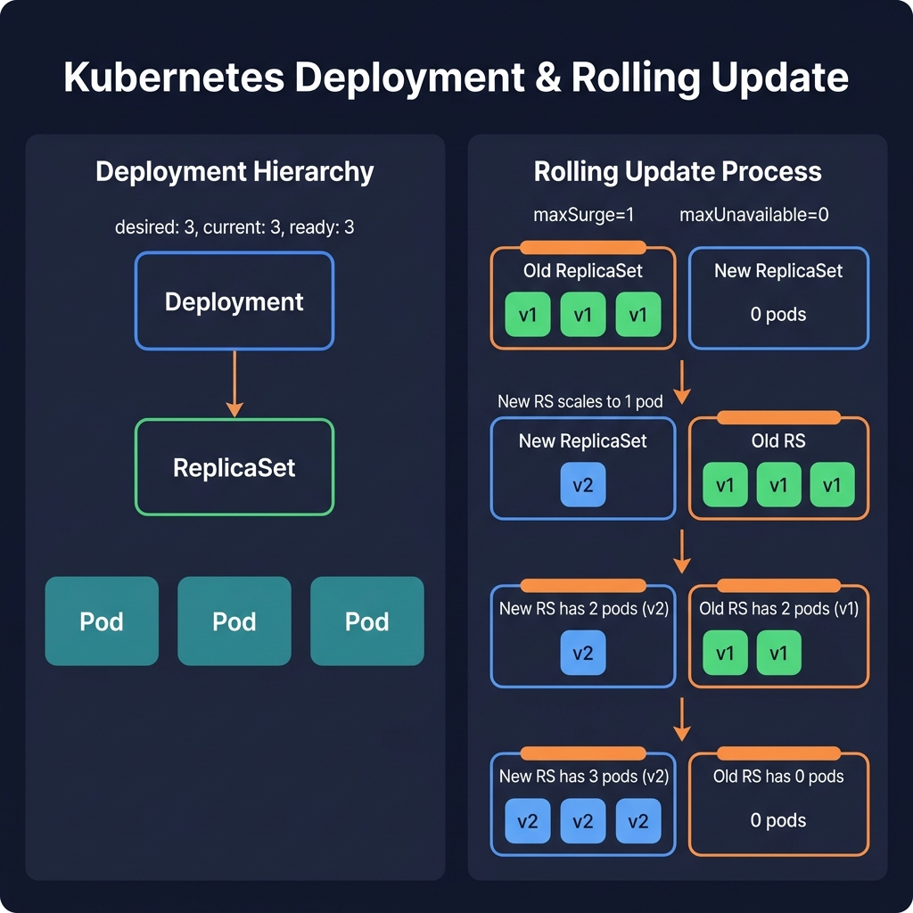

<!-- tags: kubernetes, k8s, deployments, scaling -->
# 🚀 Deployments & ReplicaSets

> Deployment manages the application lifecycle: scaling, rolling update, rollback — zero downtime

| Aspect           | Detail                                                  |
| ---------------- | ------------------------------------------------------- |
| **K8s Object**   | `apps/v1/Deployment` → `apps/v1/ReplicaSet` → `v1/Pod`  |
| **Use case**     | Deploy stateless apps, rolling updates, auto-healing    |
| **Go relevance** | Deploy Go microservices with zero-downtime              |
| **Kubectl**      | `kubectl create deployment`, `kubectl rollout`          |

---

## 1. DEFINE

Picture a rollout that rarely fails because of missing YAML; it fails because the controller holds a desired state different from what the team assumes. A Deployment is only worth understanding when you see it as a state guardian rather than a long manifest.


### Deployment vs ReplicaSet vs Pod

| Object         | Role                                 | Managed by  | Create directly? |
| -------------- | ------------------------------------ | ----------- | ---------------- |
| **Pod**        | Runs containers                      | ReplicaSet  | ❌ Never         |
| **ReplicaSet** | Maintains N pod replicas             | Deployment  | ❌ Never         |
| **Deployment** | Manages ReplicaSets + rolling update | User/CI-CD  | ✅ Use this      |

### Ownership Chain

```
Deployment
  └─► ReplicaSet (current) ──► Pod-1, Pod-2, Pod-3
  └─► ReplicaSet (old)     ──► (scaled to 0, kept for rollback)
```

### Deployment Strategy

| Strategy          | Description             | Downtime | Use case                            |
| ----------------- | ----------------------- | -------- | ----------------------------------- |
| **RollingUpdate** | Replace pods one by one | ❌ No    | Default — most applications         |
| **Recreate**      | Kill all → create new   | ✅ Yes   | DB migration requiring exclusive lock |

### RollingUpdate Parameters

| Param            | Default | Meaning                                    |
| ---------------- | ------- | ------------------------------------------ |
| `maxSurge`       | 25%     | Max extra Pods above desired replicas      |
| `maxUnavailable` | 25%     | Max Pods that can be unavailable           |

Example: `replicas: 4`, `maxSurge: 1`, `maxUnavailable: 1`
→ During update: minimum 3 pods, maximum 5 pods

### Invariants

- **Desired state = Actual state**: Controller loop always reconciles
- **ReplicaSet hash**: Every template change → new ReplicaSet
- **Revision history**: K8s keeps N old versions (default 10)

### Failure Modes

| Error             | Cause                       | Consequence                                |
| ----------------- | --------------------------- | ------------------------------------------ |
| Rollout stuck     | Bad image, probe failure    | New pods `CrashLoopBackOff`, old still run |
| Rollback fail     | `revisionHistoryLimit: 0`   | No old version to rollback to              |
| Scaling conflicts | HPA + manual scale together | Thrashing: scale up/down repeatedly        |

---

Those failure modes are clear. But there is a trap: a rollout without `maxUnavailable` set = downtime, and image tag `latest` = non-deterministic deploy. That trap appears in PITFALLS.

## 2. VISUAL

The concepts have names. Moving to diagrams, the more important part reveals itself: how requests, workloads, or signals flow through these layers.



*Figure: A Deployment manages ReplicaSets which manage Pods. During a rolling update, the new ReplicaSet scales up while the old scales down — maxSurge and maxUnavailable control the pace.*


### Rolling Update Flow

```
State:  replicas=3, maxSurge=1, maxUnavailable=1

Step 0 (stable):
  RS-old:  [Pod-v1] [Pod-v1] [Pod-v1]    ← 3 pods v1
  RS-new:  (not yet created)

Step 1 (surge):
  RS-old:  [Pod-v1] [Pod-v1] [Pod-v1]    ← 3 pods (unchanged)
  RS-new:  [Pod-v2]                       ← 1 new pod (surge)
  Total: 4 pods (max = 3 + 1 surge)

Step 2 (drain old):
  RS-old:  [Pod-v1] [Pod-v1]  ×          ← 2 pods (killed 1)
  RS-new:  [Pod-v2]                       ← 1 pod
  Total: 3 pods

Step 3:
  RS-old:  [Pod-v1] [Pod-v1]
  RS-new:  [Pod-v2] [Pod-v2]              ← 2 new pods
  Total: 4 pods

Step 4:
  RS-old:  [Pod-v1]
  RS-new:  [Pod-v2] [Pod-v2]
  Total: 3 pods

Step 5 (done):
  RS-old:  (scaled to 0, metadata retained)
  RS-new:  [Pod-v2] [Pod-v2] [Pod-v2]    ← 3 pods v2
  Total: 3 pods ✅
```

### Deployment Architecture

```
┌──────────────────────────────────────────────────┐
│                  DEPLOYMENT                       │
│          "go-api" replicas=3                      │
│                                                    │
│  ┌──────────────────────────────────────────────┐ │
│  │      ReplicaSet (revision 2 — CURRENT)       │ │
│  │  ┌────────┐  ┌────────┐  ┌────────┐         │ │
│  │  │ Pod v2 │  │ Pod v2 │  │ Pod v2 │         │ │
│  │  │ :8080  │  │ :8080  │  │ :8080  │         │ │
│  │  └────────┘  └────────┘  └────────┘         │ │
│  └──────────────────────────────────────────────┘ │
│                                                    │
│  ┌──────────────────────────────────────────────┐ │
│  │      ReplicaSet (revision 1 — OLD)           │ │
│  │  replicas: 0  (kept for rollback)            │ │
│  └──────────────────────────────────────────────┘ │
└──────────────────────────────────────────────────┘
                        │
                        ▼
              ┌──────────────────┐
              │     SERVICE      │
              │  Selector: app=  │
              │    go-api        │
              │  → Pod v2 ×3    │
              └──────────────────┘
```

---

## 3. CODE

The flow above gives you intuition; the section below is what the team will actually copy, review, and be accountable for in production.


### Example 1: Basic — Deployment YAML for a Go app

> **Goal**: Create a Deployment with 3 replicas, health checks, and resource limits.
> **Requires**: Go app image (from article 01), minikube.
> **Result**: App self-heals on pod crash, always maintains 3 instances.

```yaml
# k8s/deployment.yaml
apiVersion: apps/v1
kind: Deployment
metadata:
    name: go-api
    labels:
        app: go-api
spec:
    replicas: 3 # ✅ Maintain 3 Pods

    # ✅ Selector MUST match Pod template labels
    selector:
        matchLabels:
            app: go-api

    # ✅ Rolling update strategy
    strategy:
        type: RollingUpdate
        rollingUpdate:
            maxSurge: 1 # Max 4 pods during update
            maxUnavailable: 0 # ⚠️ Zero downtime: do not kill old pod until new is ready

    # ✅ Keep 5 old ReplicaSets for rollback
    revisionHistoryLimit: 5

    # ✅ Pod template
    template:
        metadata:
            labels:
                app: go-api
                version: v1
        spec:
            containers:
                - name: api
                  image: go-api:v1
                  ports:
                      - containerPort: 8080
                        name: http
                  env:
                      - name: PORT
                        value: '8080'
                      - name: GIN_MODE
                        value: 'release'
                  resources:
                      requests:
                          memory: '64Mi'
                          cpu: '100m'
                      limits:
                          memory: '256Mi'
                          cpu: '500m'
                  livenessProbe:
                      httpGet:
                          path: /healthz
                          port: http
                      initialDelaySeconds: 5
                      periodSeconds: 10
                  readinessProbe:
                      httpGet:
                          path: /readyz
                          port: http
                      initialDelaySeconds: 3
                      periodSeconds: 5

            # ✅ Anti-affinity: avoid placing all pods on the same node
            affinity:
                podAntiAffinity:
                    preferredDuringSchedulingIgnoredDuringExecution:
                        - weight: 100
                          podAffinityTerm:
                              labelSelector:
                                  matchExpressions:
                                      - key: app
                                        operator: In
                                        values:
                                            - go-api
                              topologyKey: kubernetes.io/hostname
```

```bash
# Deploy
kubectl apply -f k8s/deployment.yaml

# ✅ View deployment status
kubectl get deployment go-api
# NAME     READY   UP-TO-DATE   AVAILABLE   AGE
# go-api   3/3     3            3           30s

# ✅ View pods
kubectl get pods -l app=go-api
# NAME                      READY   STATUS    RESTARTS   AGE
# go-api-7d4b8c6f5-abc12   1/1     Running   0          30s
# go-api-7d4b8c6f5-def34   1/1     Running   0          30s
# go-api-7d4b8c6f5-ghi56   1/1     Running   0          30s

# ✅ View ReplicaSets
kubectl get rs -l app=go-api
```

> **Result**: 3 replicas always running, K8s auto-recreates pod on crash.
> **Note**: `maxUnavailable: 0` means updates are slower but guarantee zero-downtime.

📅 Created: 2026-03-20 · 🔄 Updated: 2026-04-20 · ⏱️ 15 min read

---

Basic deployment is covered. But rollout strategy needs configuration — time to tune.

### Example 2: Intermediate — Rolling Update + Rollback

> **Goal**: Deploy a new version, monitor rollout, rollback if broken.
> **Requires**: Running Deployment from Example 1.
> **Result**: Safe production update workflow.

```bash
# ═══════════════════════════════════════════════
# PART 1: Rolling Update
# ═══════════════════════════════════════════════

# ✅ Update image → trigger rolling update
kubectl set image deployment/go-api api=go-api:v2

# Or edit directly:
# kubectl edit deployment go-api

# ✅ Watch rollout progress
kubectl rollout status deployment/go-api
# Waiting for deployment "go-api" rollout to finish:
#   1 out of 3 new replicas have been updated...
#   2 out of 3 new replicas have been updated...
#   3 out of 3 new replicas have been updated...
#   deployment "go-api" successfully rolled out

# ✅ View rollout history
kubectl rollout history deployment/go-api
# REVISION  CHANGE-CAUSE
# 1         <none>
# 2         <none>

# ═══════════════════════════════════════════════
# PART 2: Rollback when new version is broken
# ═══════════════════════════════════════════════

# Deploy a buggy version
kubectl set image deployment/go-api api=go-api:v3-buggy

# ⚠️ New pods CrashLoopBackOff
kubectl get pods -l app=go-api
# NAME                      READY   STATUS             RESTARTS   AGE
# go-api-5c8b7d9f2-xxx11   0/1     CrashLoopBackOff   3          2m
# go-api-7d4b8c6f5-abc12   1/1     Running            0          10m  ← v2 still running
# go-api-7d4b8c6f5-def34   1/1     Running            0          10m
# go-api-7d4b8c6f5-ghi56   1/1     Running            0          10m

# ✅ Rollback to previous version
kubectl rollout undo deployment/go-api

# Or rollback to a specific revision:
kubectl rollout undo deployment/go-api --to-revision=1

# ✅ Verify
kubectl rollout status deployment/go-api
kubectl get pods -l app=go-api  # All Running
```

```go
// deployment_manager.go — Manage deployments via client-go
package main

import (
	"context"
	"fmt"
	"log"
	"path/filepath"
	"time"

	appsv1 "k8s.io/api/apps/v1"
	metav1 "k8s.io/apimachinery/pkg/apis/meta/v1"
	"k8s.io/client-go/kubernetes"
	"k8s.io/client-go/tools/clientcmd"
	"k8s.io/client-go/util/homedir"
)

// ✅ Connect to K8s cluster from kubeconfig
func newK8sClient() (*kubernetes.Clientset, error) {
	kubeconfig := filepath.Join(homedir.HomeDir(), ".kube", "config")
	config, err := clientcmd.BuildConfigFromFlags("", kubeconfig)
	if err != nil {
		return nil, fmt.Errorf("kubeconfig error: %w", err)
	}
	return kubernetes.NewForConfig(config)
}

// ✅ Scale deployment
func scaleDeployment(client *kubernetes.Clientset, name, namespace string, replicas int32) error {
	ctx := context.Background()

	// Get current deployment
	deployment, err := client.AppsV1().Deployments(namespace).Get(ctx, name, metav1.GetOptions{})
	if err != nil {
		return fmt.Errorf("get deployment: %w", err)
	}

	// ✅ Update replicas
	deployment.Spec.Replicas = &replicas

	_, err = client.AppsV1().Deployments(namespace).Update(ctx, deployment, metav1.UpdateOptions{})
	if err != nil {
		return fmt.Errorf("update deployment: %w", err)
	}

	log.Printf("✅ Scaled %s to %d replicas", name, replicas)
	return nil
}

// ✅ Update image version (trigger rolling update)
func updateImage(client *kubernetes.Clientset, name, namespace, container, image string) error {
	ctx := context.Background()

	deployment, err := client.AppsV1().Deployments(namespace).Get(ctx, name, metav1.GetOptions{})
	if err != nil {
		return err
	}

	// ✅ Find container and update image
	for i, c := range deployment.Spec.Template.Spec.Containers {
		if c.Name == container {
			deployment.Spec.Template.Spec.Containers[i].Image = image
			break
		}
	}

	// ⚠️ Add annotation to track change cause
	if deployment.Spec.Template.Annotations == nil {
		deployment.Spec.Template.Annotations = make(map[string]string)
	}
	deployment.Spec.Template.Annotations["deployment.kubernetes.io/change-cause"] =
		fmt.Sprintf("Updated %s to %s at %s", container, image, time.Now().Format(time.RFC3339))

	_, err = client.AppsV1().Deployments(namespace).Update(ctx, deployment, metav1.UpdateOptions{})
	return err
}

// ✅ Watch rollout status
func watchRollout(client *kubernetes.Clientset, name, namespace string) error {
	ctx := context.Background()

	for i := 0; i < 60; i++ { // Timeout 5 minutes
		deployment, err := client.AppsV1().Deployments(namespace).Get(ctx, name, metav1.GetOptions{})
		if err != nil {
			return err
		}

		// ✅ Check conditions
		for _, cond := range deployment.Status.Conditions {
			if cond.Type == appsv1.DeploymentProgressing && cond.Status == "False" {
				return fmt.Errorf("❌ Rollout failed: %s", cond.Message)
			}
		}

		// ✅ All replicas updated and available
		if deployment.Status.UpdatedReplicas == *deployment.Spec.Replicas &&
			deployment.Status.AvailableReplicas == *deployment.Spec.Replicas {
			log.Printf("✅ Rollout complete: %d/%d replicas available",
				deployment.Status.AvailableReplicas, *deployment.Spec.Replicas)
			return nil
		}

		log.Printf("⏳ Rollout in progress: %d/%d updated, %d/%d available",
			deployment.Status.UpdatedReplicas, *deployment.Spec.Replicas,
			deployment.Status.AvailableReplicas, *deployment.Spec.Replicas)

		time.Sleep(5 * time.Second)
	}

	return fmt.Errorf("⏰ Rollout timeout")
}

func main() {
	client, err := newK8sClient()
	if err != nil {
		log.Fatal(err)
	}

	// Scale to 5 replicas
	scaleDeployment(client, "go-api", "default", 5)

	// Update image
	updateImage(client, "go-api", "default", "api", "go-api:v2")

	// Watch rollout
	watchRollout(client, "go-api", "default")
}
```

> **Result**: Manage deployment lifecycle via kubectl CLI and Go `client-go`.
> **Note**: `client-go` uses `k8s.io/client-go` — match version with your K8s cluster.

---

Rollout strategy is covered. But rollback needs history — time to revert.

### Example 3: Advanced — Canary Deployment Pattern

> **Goal**: Deploy new version to 10% traffic first, validate, then rollout to 100%.
> **Requires**: 2 Deployment objects + Service selector.
> **Result**: Production-safe deployment strategy.

```yaml
# k8s/canary/deployment-stable.yaml
apiVersion: apps/v1
kind: Deployment
metadata:
    name: go-api-stable
spec:
    replicas: 9 # ✅ 90% traffic
    selector:
        matchLabels:
            app: go-api
            track: stable
    template:
        metadata:
            labels:
                app: go-api # ⚠️ Service selector matches "app: go-api"
                track: stable
                version: v1
        spec:
            containers:
                - name: api
                  image: go-api:v1
                  ports:
                      - containerPort: 8080
                  resources:
                      requests: { memory: '64Mi', cpu: '100m' }
                      limits: { memory: '256Mi', cpu: '500m' }
---
# k8s/canary/deployment-canary.yaml
apiVersion: apps/v1
kind: Deployment
metadata:
    name: go-api-canary
spec:
    replicas: 1 # ✅ 10% traffic
    selector:
        matchLabels:
            app: go-api
            track: canary
    template:
        metadata:
            labels:
                app: go-api # ⚠️ Same "app: go-api" → Service routes traffic here
                track: canary
                version: v2
        spec:
            containers:
                - name: api
                  image: go-api:v2
                  ports:
                      - containerPort: 8080
                  resources:
                      requests: { memory: '64Mi', cpu: '100m' }
                      limits: { memory: '256Mi', cpu: '500m' }
---
# k8s/canary/service.yaml
apiVersion: v1
kind: Service
metadata:
    name: go-api
spec:
    selector:
        app: go-api # ✅ Matches BOTH stable AND canary pods
    ports:
        - port: 80
          targetPort: 8080
```

```bash
# Deploy canary
kubectl apply -f k8s/canary/

# ✅ Verify: 10 pods total (9 stable + 1 canary)
kubectl get pods -l app=go-api --show-labels

# ✅ Test canary — send 100 requests, ~10% will reach v2
for i in $(seq 1 100); do
  curl -s http://go-api-svc/healthz | jq -r .version
done | sort | uniq -c
#  90 v1
#  10 v2

# ✅ Canary OK → promote: scale canary up, scale stable down
kubectl scale deployment go-api-canary --replicas=10
kubectl scale deployment go-api-stable --replicas=0

# ✅ Cleanup: rename canary → stable
kubectl delete deployment go-api-stable
kubectl patch deployment go-api-canary -p '{"metadata":{"name":"go-api-stable"}}'
```

> **Result**: Canary deployment reduces blast radius — only 10% of users affected if v2 is broken.
> **Note**: K8s native canary relies on pod ratio. Use Istio/Flagger for precise traffic percentage control.

---

You have covered deployment, rollout, and rollback. Now comes the dangerous part: missing `maxUnavailable` and `latest` tag — the trap set up from the beginning.

## 4. PITFALLS

Errors typically live not in syntax but in operational boundaries and forgotten failure modes. The table below collects exactly those mistakes.


| #   | Mistake                                                                     | Consequence | Fix                                       |
| --- | --------------------------------------------------------------------------- | ----------- | ----------------------------------------- |
| 1   | Default `maxUnavailable: 25%` → may lose 25% capacity during update         | —           | Set `maxUnavailable: 0` for zero-downtime |
| 2   | No `readinessProbe` → new pod receives traffic before it is ready           | —           | Always have a readiness probe             |
| 3   | `revisionHistoryLimit: 0` → cannot rollback                                 | —           | Keep at least 3–5 revisions               |
| 4   | Scale via `kubectl scale` + HPA simultaneously → conflict                   | —           | Let HPA manage, do not manual scale       |
| 5   | Image tag `latest` + `imagePullPolicy: IfNotPresent` → K8s uses stale image | —           | Use immutable tags (SHA or semver)         |

---

You have covered Deployments and the traps. The resources below help go deeper.

## 5. REF

| Resource              | Link                                                                                                                                      |
| --------------------- | ----------------------------------------------------------------------------------------------------------------------------------------- |
| Deployments           | [kubernetes.io/docs/concepts/workloads/controllers/deployment](https://kubernetes.io/docs/concepts/workloads/controllers/deployment/)     |
| Rolling Update        | [kubernetes.io/docs/tutorials/kubernetes-basics/update](https://kubernetes.io/docs/tutorials/kubernetes-basics/update/)                   |
| `client-go`           | [github.com/kubernetes/client-go](https://github.com/kubernetes/client-go)                                                                |
| Canary Deployments    | [kubernetes.io/blog/canary-deployments](https://kubernetes.io/docs/concepts/cluster-administration/manage-deployment/#canary-deployments) |
| Flagger (auto canary) | [flagger.app](https://flagger.app/)                                                                                                       |

---

## 6. RECOMMEND

Now that you see what this lane solves and where it typically breaks, the resources below extend along adjacent operational pressures.


| Extension          | When                          | Reason                                           |
| ------------------ | ----------------------------- | ------------------------------------------------ |
| **Flagger**        | Need canary automation        | Auto promote/rollback based on metrics           |
| **ArgoCD**         | GitOps deployment             | Declarative CD, auto-sync from Git               |
| **Argo Rollouts**  | Advanced blue-green / canary  | Replaces Deployment with analysis phases         |
| **kustomize**      | Multi-env (dev/staging/prod)  | Overlay patches per environment                  |
| **Skaffold**       | Local dev workflow            | Auto-rebuild + redeploy on code changes          |

---

---

## 🔍 Debug Checklist

| # | Symptom | Root cause | Diagnostic command |
|---|---------|------------|-------------------|
| 1 | Rollout stuck — new pods `CrashLoopBackOff` | Bad image or readiness probe failure | `kubectl rollout status deployment/<name>` and `kubectl logs <new-pod>` |
| 2 | Deployment does not scale up | HPA conflicts with manual `kubectl scale` | `kubectl get hpa` and `kubectl describe deploy/<name>` |
| 3 | Rollback has no effect | `revisionHistoryLimit: 0` — no old ReplicaSet kept | `kubectl rollout history deployment/<name>` |
| 4 | New pods created but receive no traffic | `readinessProbe` fails → endpoints are empty | `kubectl describe endpoints <svc>` |
| 5 | `maxUnavailable` causes capacity drop | Default 25% — too high under heavy traffic | `kubectl get deploy <name> -o yaml` check strategy |
| 6 | Old ReplicaSet still has pods | Rollout in progress or stuck | `kubectl get rs -l app=<name>` |
| 7 | Canary still receives 100% traffic | Service selector does not match correct label | `kubectl describe svc <name>` check Selector |

---

## 🃏 Quick Reference

| # | Pattern | Command / Rule |
|---|---------|----------------|
| 1 | Update image → trigger rolling update | `kubectl set image deployment/<name> <container>=<image>:<tag>` |
| 2 | View rollout status | `kubectl rollout status deployment/<name>` |
| 3 | View rollout history | `kubectl rollout history deployment/<name>` |
| 4 | Rollback to previous version | `kubectl rollout undo deployment/<name>` |
| 5 | Rollback to specific revision | `kubectl rollout undo deployment/<name> --to-revision=2` |
| 6 | Scale replicas | `kubectl scale deployment/<name> --replicas=5` |
| 7 | Zero-downtime strategy | `maxSurge: 1`, `maxUnavailable: 0` |
| 8 | Annotate change cause | `kubectl annotate deploy/<name> kubernetes.io/change-cause="v2 release"` |

---

## 🎯 Interview Angle

**Related system design / technical questions:**
- *"How do RollingUpdate and Recreate differ? When must you use Recreate?"*
- *"If a rollout gets stuck midway, how does K8s handle it? How do you rollback?"*
- *"How does HPA interact with Deployment replicas? Can they conflict?"*

**Key talking points interviewers expect:**

| Topic | Talking point |
|-------|---------------|
| RollingUpdate vs Recreate | Rolling: zero-downtime, replaces pods one by one; Recreate: all down → all up, used when schema migration needs exclusive lock |
| Rollback mechanism | K8s keeps old ReplicaSet (scaled to 0) per `revisionHistoryLimit`; `undo` simply re-scales the old RS up |
| maxSurge / maxUnavailable | maxSurge = temporary extra pods; maxUnavailable = pods allowed to be down; both cannot be 0 simultaneously |
| HPA conflict | HPA owns the `replicas` field; if you manual scale, HPA will override on the next reconciliation cycle |
| ReplicaSet hash | Every change in pod template → new pod-template-hash → new RS → Deployment proceeds |
| Change-cause annotation | `kubernetes.io/change-cause` annotation on Deployment → appears in `rollout history` |

**Common follow-up questions:**
- *"Why is the old ReplicaSet not deleted immediately?"* → Needed for rollback; capped by `revisionHistoryLimit`
- *"How does progressive delivery differ from rolling update?"* → Progressive uses metrics to decide continue or abort (Flagger, Argo Rollouts)
- *"What is the Deployment controller?"* → Control loop: desired state vs actual state → continuously reconciles

---

**Links**: [← Pods & Containers](./01-pods-and-containers.md) · [→ Services & Networking](./03-services-networking.md)
