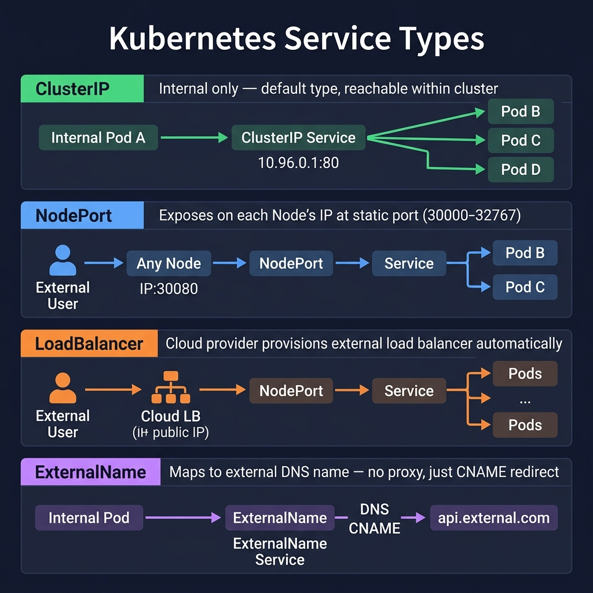

<!-- tags: kubernetes, k8s, services, networking -->
# 🌐 Services & Networking

> Service is the bridge between Pods — providing a stable endpoint for applications even as Pods are born and die continuously

| Aspect           | Detail                                             |
| ---------------- | -------------------------------------------------- |
| **K8s Object**   | `v1/Service`, `v1/Endpoints`                       |
| **Use case**     | Load balancing, service discovery, expose apps     |
| **Go relevance** | Microservices gRPC/HTTP call each other via Service DNS |
| **Kubectl**      | `kubectl expose`, `kubectl get svc`                |

---

## 1. DEFINE

Picture pods that can live and die continuously, but external traffic must not follow that chaotic rhythm. Services and networking exist to separate discovery and routing from the lifecycle of individual Pods.


### Why do you need a Service?

Pod IP **changes** on every recreate. A Service provides:

1. **Stable DNS name** — `go-api.default.svc.cluster.local`
2. **Stable Virtual IP** (ClusterIP) — unchanged even as pods change
3. **Load balancing** — round-robin across pods
4. **Service discovery** — DNS-based, automatic

### Service Types

| Type             | Accessible from            | IP/Port             | Use case                        |
| ---------------- | -------------------------- | ------------------- | ------------------------------- |
| **ClusterIP**    | Inside cluster             | Internal virtual IP | Service ↔ Service communication |
| **NodePort**     | Outside cluster via Node IP | NodeIP:30000-32767 | Dev/test, temporary exposure    |
| **LoadBalancer** | Internet                   | Cloud LB IP         | Production — cloud provider     |
| **ExternalName** | Inside cluster             | DNS CNAME           | Alias for external service      |
| **Headless**     | Inside cluster             | No ClusterIP        | StatefulSet, direct pod access  |

### Actors

| Actor                    | Role                                        |
| ------------------------ | ------------------------------------------- |
| **kube-proxy**           | Creates iptables/IPVS rules for Service routing |
| **CoreDNS**              | Internal DNS server — resolves Service names |
| **Endpoints Controller** | Watches Pod IPs, updates Endpoints object   |
| **Cloud Controller**     | Provisions LoadBalancer from cloud provider  |

### DNS Resolution

```
<service-name>.<namespace>.svc.cluster.local

Example:
  go-api.default.svc.cluster.local       → ClusterIP
  go-api.default.svc.cluster.local:8080  → Port
  go-api                                  → Short name (same namespace)
  go-api.production                       → Cross-namespace
```

### Failure Modes

| Error                    | Cause                                   | Fix                                      |
| ------------------------ | --------------------------------------- | ---------------------------------------- |
| Service cannot route     | Selector does not match Pod labels      | Check `kubectl describe svc` → Endpoints |
| DNS resolution fail      | CoreDNS crash or Pod DNS config wrong   | `kubectl get pods -n kube-system`        |
| Connection refused       | Port mismatch or Pod not ready          | Verify `targetPort` = container port     |
| Timeout                  | NetworkPolicy blocking or Pod overloaded | Check NetworkPolicy, resource limits     |

---

Those failure modes sound easy to avoid. But there is a trap: Service selector not matching Pod labels = no endpoints, and using ClusterIP for external access = unreachable. That trap appears in PITFALLS.

## 2. VISUAL

Definitions only lock vocabulary. The visual below shows the actual operational flow where containers, pods, log pipelines, and shell commands start hitting production.



*Figure: Four Service types serve different access patterns — ClusterIP for internal routing, NodePort for development exposure, LoadBalancer for production ingress, and ExternalName for CNAME-based external aliasing.*


### Service → Endpoints → Pods

```
                   ┌──────────────────────┐
                   │     CLIENT           │
                   │  (another Pod/外部)   │
                   └──────────┬───────────┘
                              │
                    http://go-api:80
                              │
                   ┌──────────▼───────────┐
                   │      SERVICE         │
                   │  Name: go-api        │
                   │  Type: ClusterIP     │
                   │  IP: 10.96.50.100    │
                   │  Port: 80            │
                   │  Selector: app=go-api│
                   └──────────┬───────────┘
                              │
                   ┌──────────▼───────────┐
                   │     ENDPOINTS        │
                   │  10.244.1.5:8080     │
                   │  10.244.2.8:8080     │
                   │  10.244.3.3:8080     │
                   └──────────┬───────────┘
                              │
            ┌─────────────────┼─────────────────┐
            │                 │                  │
     ┌──────▼──────┐  ┌──────▼──────┐  ┌───────▼─────┐
     │   Pod-1     │  │   Pod-2     │  │   Pod-3     │
     │ 10.244.1.5  │  │ 10.244.2.8  │  │ 10.244.3.3  │
     │ :8080       │  │ :8080       │  │ :8080       │
     └─────────────┘  └─────────────┘  └─────────────┘
```

### Service Types Comparison

```
                    INTERNET
                       │
        ┌──────────────┼──────────────┐
        │              │              │
   LoadBalancer    NodePort      Ingress
   (Cloud LB)     (Node:3xxxx)  (L7 routing)
        │              │              │
        └──────────────┼──────────────┘
                       │
                  ClusterIP
                  (10.96.x.x)
                       │
                    Endpoints
                    (Pod IPs)
```

---

## 3. CODE

The diagrams have shown the main path. The code/manifests/commands below pull it down to the artifact level that on-call or reviewers actually use.


### Example 1: Basic — ClusterIP Service for a Go API

> **Goal**: Create a Service to expose a Deployment, test DNS resolution.
> **Requires**: Running Deployment `go-api`.
> **Result**: Stable endpoint for internal communication.

```yaml
# k8s/service-clusterip.yaml
apiVersion: v1
kind: Service
metadata:
    name: go-api
    labels:
        app: go-api
spec:
    type: ClusterIP # ✅ Default — internal only
    selector:
        app: go-api # ⚠️ MUST match Pod labels
    ports:
        - name: http
          port: 80 # ✅ Port that clients use
          targetPort: 8080 # ✅ Actual port on the container
          protocol: TCP
        - name: grpc
          port: 9090
          targetPort: 9090
          protocol: TCP
```

```bash
# Deploy service
kubectl apply -f k8s/service-clusterip.yaml

# ✅ Verify
kubectl get svc go-api
# NAME     TYPE        CLUSTER-IP      PORT(S)          AGE
# go-api   ClusterIP   10.96.50.100    80/TCP,9090/TCP  5s

# ✅ Check endpoints (pod IPs)
kubectl get endpoints go-api
# NAME     ENDPOINTS                                       AGE
# go-api   10.244.1.5:8080,10.244.2.8:8080,...            5s

# ✅ Test DNS from inside the cluster
kubectl run test-dns --rm -it --image=busybox -- nslookup go-api
# Name:      go-api.default.svc.cluster.local
# Address 1: 10.96.50.100

# ✅ Test connectivity
kubectl run test-curl --rm -it --image=curlimages/curl -- \
  curl http://go-api/healthz
```

> **Result**: Service `go-api` has a stable DNS name + IP, load balances across 3 pods.
> **Note**: ClusterIP is only accessible within the cluster. Use NodePort/Ingress for external exposure.

📅 Created: 2026-03-20 · 🔄 Updated: 2026-04-20 · ⏱️ 15 min read

---

ClusterIP is covered. But external access needs LoadBalancer — time to expose.

### Example 2: Intermediate — Go microservices calling each other via Service DNS

> **Goal**: 2 Go services: API Gateway → User Service, communicating via Service DNS.
> **Requires**: 2 Deployments + 2 Services.
> **Result**: Service-to-service communication pattern.

```go
// gateway/main.go — API Gateway calling User Service
package main

import (
	"encoding/json"
	"fmt"
	"io"
	"log"
	"net/http"
	"os"
	"time"
)

func main() {
	// ✅ Service URL from env or K8s DNS
	// In K8s: "http://user-service" (short DNS name)
	userServiceURL := os.Getenv("USER_SERVICE_URL")
	if userServiceURL == "" {
		userServiceURL = "http://user-service" // ✅ K8s DNS auto-resolve
	}

	// ✅ HTTP client with timeout — CRITICAL for microservices
	client := &http.Client{
		Timeout: 5 * time.Second,
		Transport: &http.Transport{
			MaxIdleConns:        100,
			MaxIdleConnsPerHost: 10,
			IdleConnTimeout:     90 * time.Second,
		},
	}

	http.HandleFunc("/api/users", func(w http.ResponseWriter, r *http.Request) {
		// ✅ Forward request to User Service
		resp, err := client.Get(userServiceURL + "/users")
		if err != nil {
			// ⚠️ Service unreachable — circuit breaker pattern
			log.Printf("❌ User service error: %v", err)
			w.WriteHeader(http.StatusServiceUnavailable)
			json.NewEncoder(w).Encode(map[string]string{
				"error": "user service unavailable",
			})
			return
		}
		defer resp.Body.Close()

		// ✅ Proxy response
		w.Header().Set("Content-Type", "application/json")
		w.WriteHeader(resp.StatusCode)
		io.Copy(w, resp.Body)
	})

	http.HandleFunc("/healthz", func(w http.ResponseWriter, r *http.Request) {
		hostname, _ := os.Hostname()
		json.NewEncoder(w).Encode(map[string]string{
			"service":  "gateway",
			"hostname": hostname,
			"status":   "healthy",
		})
	})

	port := os.Getenv("PORT")
	if port == "" {
		port = "8080"
	}
	log.Printf("🚀 Gateway listening on :%s", port)
	log.Printf("📡 User Service URL: %s", userServiceURL)
	log.Fatal(http.ListenAndServe(":"+port, nil))
}
```

```go
// user-service/main.go — User Service
package main

import (
	"encoding/json"
	"log"
	"net/http"
	"os"
)

type User struct {
	ID    int    `json:"id"`
	Name  string `json:"name"`
	Email string `json:"email"`
}

func main() {
	users := []User{
		{ID: 1, Name: "Alice", Email: "alice@example.com"},
		{ID: 2, Name: "Bob", Email: "bob@example.com"},
	}

	http.HandleFunc("/users", func(w http.ResponseWriter, r *http.Request) {
		hostname, _ := os.Hostname()
		w.Header().Set("Content-Type", "application/json")
		w.Header().Set("X-Served-By", hostname) // ✅ Track load balancing
		json.NewEncoder(w).Encode(users)
	})

	http.HandleFunc("/healthz", func(w http.ResponseWriter, r *http.Request) {
		w.WriteHeader(http.StatusOK)
		json.NewEncoder(w).Encode(map[string]string{"status": "ok"})
	})

	log.Println("🚀 User Service on :8080")
	log.Fatal(http.ListenAndServe(":8080", nil))
}
```

```yaml
# k8s/microservices.yaml
---
# Gateway Deployment + Service
apiVersion: apps/v1
kind: Deployment
metadata:
    name: gateway
spec:
    replicas: 2
    selector:
        matchLabels:
            app: gateway
    template:
        metadata:
            labels:
                app: gateway
        spec:
            containers:
                - name: gateway
                  image: gateway:v1
                  ports:
                      - containerPort: 8080
                  env:
                      # ✅ Service DNS name — K8s auto-resolve
                      - name: USER_SERVICE_URL
                        value: 'http://user-service'
                  resources:
                      requests: { memory: '64Mi', cpu: '100m' }
                      limits: { memory: '128Mi', cpu: '250m' }
                  readinessProbe:
                      httpGet: { path: /healthz, port: 8080 }
                      periodSeconds: 5
---
apiVersion: v1
kind: Service
metadata:
    name: gateway
spec:
    type: NodePort # ✅ Expose outside cluster via NodePort
    selector:
        app: gateway
    ports:
        - port: 80
          targetPort: 8080
          nodePort: 30080 # Access: http://<node-ip>:30080
---
# User Service Deployment + Service
apiVersion: apps/v1
kind: Deployment
metadata:
    name: user-service
spec:
    replicas: 3
    selector:
        matchLabels:
            app: user-service
    template:
        metadata:
            labels:
                app: user-service
        spec:
            containers:
                - name: user-service
                  image: user-service:v1
                  ports:
                      - containerPort: 8080
                  resources:
                      requests: { memory: '64Mi', cpu: '100m' }
                      limits: { memory: '128Mi', cpu: '250m' }
                  readinessProbe:
                      httpGet: { path: /healthz, port: 8080 }
                      periodSeconds: 5
---
apiVersion: v1
kind: Service
metadata:
    name: user-service
spec:
    type: ClusterIP # ✅ Internal only — gateway calls via DNS
    selector:
        app: user-service
    ports:
        - port: 80
          targetPort: 8080
```

```bash
# Deploy everything
kubectl apply -f k8s/microservices.yaml

# Verify
kubectl get svc
# NAME           TYPE        CLUSTER-IP      PORT(S)        AGE
# gateway        NodePort    10.96.100.1     80:30080/TCP   5s
# user-service   ClusterIP   10.96.100.2     80/TCP         5s

# Test
curl http://$(minikube ip):30080/api/users
# [{"id":1,"name":"Alice"}, {"id":2,"name":"Bob"}]
```

> **Result**: 2 Go services communicate via K8s DNS, Gateway exposed via NodePort.
> **Note**: Production uses Ingress instead of NodePort (article 06).

---

LoadBalancer is covered. But service mesh needs headless — time to separate.

### Example 3: Advanced — Headless Service for gRPC Load Balancing

> **Goal**: gRPC uses HTTP/2 persistent connections → ClusterIP LB does not work → need Headless Service.
> **Requires**: Understanding of gRPC, Go gRPC client.
> **Result**: Correct load balancing pattern for gRPC in K8s.

```yaml
# k8s/headless-service.yaml
apiVersion: v1
kind: Service
metadata:
    name: grpc-service
spec:
    clusterIP: None # ✅ Headless — DNS returns all Pod IPs
    selector:
        app: grpc-server
    ports:
        - port: 9090
          targetPort: 9090
```

```go
// grpc_client.go — gRPC client-side load balancing with dns resolver
package main

import (
	"context"
	"log"
	"time"

	"google.golang.org/grpc"
	"google.golang.org/grpc/credentials/insecure"
	pb "myapp/proto/user"
)

func main() {
	// ✅ "dns:///" prefix → gRPC uses DNS resolver
	// Headless Service returns list of Pod IPs
	// round_robin → distributes requests evenly across pods
	target := "dns:///grpc-service.default.svc.cluster.local:9090"

	conn, err := grpc.NewClient(
		target,
		grpc.WithTransportCredentials(insecure.NewCredentials()),
		// ✅ Client-side load balancing
		grpc.WithDefaultServiceConfig(`{
			"loadBalancingConfig": [{"round_robin": {}}],
			"methodConfig": [{
				"name": [{"service": ""}],
				"timeout": "5s",
				"retryPolicy": {
					"maxAttempts": 3,
					"initialBackoff": "0.1s",
					"maxBackoff": "1s",
					"backoffMultiplier": 2,
					"retryableStatusCodes": ["UNAVAILABLE"]
				}
			}]
		}`),
	)
	if err != nil {
		log.Fatalf("❌ gRPC dial: %v", err)
	}
	defer conn.Close()

	client := pb.NewUserServiceClient(conn)

	// ✅ Each request will round-robin to a different pod
	for i := 0; i < 10; i++ {
		ctx, cancel := context.WithTimeout(context.Background(), 5*time.Second)
		resp, err := client.GetUser(ctx, &pb.GetUserRequest{Id: 1})
		cancel()
		if err != nil {
			log.Printf("❌ Request %d failed: %v", i, err)
			continue
		}
		log.Printf("✅ Request %d → served by: %s", i, resp.ServedBy)
	}
}
```

> **Result**: gRPC client-side load balancing through Headless Service DNS resolution.
> **Note**: gRPC over ClusterIP → 1 connection → 1 pod receives all traffic. MUST use Headless + client-side LB.

---

You have covered ClusterIP, LoadBalancer, and headless service. Now comes the dangerous part: selector mismatch and wrong service type — the trap set up from the beginning.

## 4. PITFALLS

Knowing how to do it right is only half the story. The other half is the places where it is very easy to get almost right, then pay the price when the cluster or the OS starts shaking.


| #   | Mistake                                     | Consequence | Fix                                              |
| --- | ------------------------------------------- | ----------- | ------------------------------------------------ |
| 1   | gRPC over ClusterIP → all traffic to 1 pod | —           | Headless Service + client-side LB (round_robin)  |
| 2   | Service selector typo → Endpoints empty     | —           | `kubectl describe svc` check Endpoints           |
| 3   | NodePort range limited to 30000-32767       | —           | Use Ingress or LoadBalancer for production       |
| 4   | DNS cache stale → calling dead pod          | —           | Set `dnsPolicy: ClusterFirst`, low TTL           |
| 5   | `targetPort` != container `containerPort`   | —           | Verify port mapping exactly                      |

---

You have covered Services & Networking and the traps. The resources below help go deeper.

## 5. REF

| Resource             | Link                                                                                                                                        |
| -------------------- | ------------------------------------------------------------------------------------------------------------------------------------------- |
| K8s Services         | [kubernetes.io/docs/concepts/services-networking/service](https://kubernetes.io/docs/concepts/services-networking/service/)                 |
| DNS for Services     | [kubernetes.io/docs/concepts/services-networking/dns-pod-service](https://kubernetes.io/docs/concepts/services-networking/dns-pod-service/) |
| gRPC Load Balancing  | [grpc.io/blog/grpc-load-balancing](https://grpc.io/blog/grpc-load-balancing/)                                                               |
| K8s Networking Guide | [learnk8s.io/kubernetes-network-packets](https://learnk8s.io/kubernetes-network-packets)                                                    |

---

## 6. RECOMMEND

After this article, the next read should be the topic closest to your current decision, so the production mental model does not fragment.


| Extension               | When                        | Reason                                   |
| ----------------------- | --------------------------- | ---------------------------------------- |
| **Istio Service Mesh**  | Complex microservices       | mTLS, traffic management, observability  |
| **Linkerd**             | Lightweight service mesh    | Simpler than Istio, gRPC-native LB       |
| **ExternalDNS**         | Auto DNS for LoadBalancer   | Auto-creates DNS records on Service creation |
| **MetalLB**             | Bare-metal clusters         | Provides LoadBalancer for on-premise     |
| **Cilium**              | High-performance networking | eBPF-based, replaces kube-proxy          |

---

---

## 🔍 Debug Checklist

| # | Symptom | Root cause | Diagnostic command |
|---|---------|------------|-------------------|
| 1 | Service not routing traffic to pods | Selector does not match Pod labels | `kubectl describe svc <name>` → check if Endpoints is empty |
| 2 | DNS resolution fails inside cluster | CoreDNS crash or Pod DNS config wrong | `kubectl get pods -n kube-system` and `kubectl run tmp --rm -it --image=busybox -- nslookup <svc>` |
| 3 | `Connection refused` when calling service | `targetPort` wrong or container not binding correct port | `kubectl describe svc <name>` and `kubectl exec <pod> -- netstat -tlnp` |
| 4 | NodePort not accessible from outside | Firewall blocking or NodePort range wrong | `kubectl get svc <name>` check NodePort; verify firewall rules |
| 5 | gRPC load balancing uneven | ClusterIP uses connection-level LB — 1 connection → 1 pod | Use Headless Service + `dns:///` scheme in Go gRPC client |
| 6 | Endpoints object empty | Pods not Ready (readiness probe failing) | `kubectl get endpoints <svc>` and `kubectl describe pod <pod>` |
| 7 | Service timeout | NetworkPolicy blocking or pod overloaded | `kubectl get networkpolicy -A` and `kubectl top pod` |

---

## 🃏 Quick Reference

| # | Pattern | Command / Rule |
|---|---------|----------------|
| 1 | List all services | `kubectl get svc` |
| 2 | View service endpoints | `kubectl get endpoints <svc>` |
| 3 | DNS format inside cluster | `<svc>.<namespace>.svc.cluster.local` |
| 4 | Short DNS (same namespace) | Just `<svc-name>` |
| 5 | Port-forward to test service | `kubectl port-forward svc/<name> 8080:80` |
| 6 | Headless service (gRPC LB) | `clusterIP: None` in spec |
| 7 | Quick expose deployment | `kubectl expose deployment <name> --port=80 --target-port=8080` |
| 8 | Test DNS from inside cluster | `kubectl run tmp --rm -it --image=busybox -- nslookup <svc>` |

---

## 🎯 Interview Angle

**Related system design / technical questions:**
- *"How do ClusterIP, NodePort, and LoadBalancer differ? When to use each in production?"*
- *"Why does gRPC over ClusterIP have poor load balancing? What is the solution?"*
- *"How does kube-proxy work when a request hits a Service IP?"*

**Key talking points interviewers expect:**

| Topic | Talking point |
|-------|---------------|
| ClusterIP | Internal virtual IP, only accessible inside cluster; used for service-to-service communication |
| NodePort | Exposes via `<NodeIP>:<30000-32767>`; only for dev/test, not production |
| LoadBalancer | Creates a real cloud LB; production for external traffic; costly if many services |
| kube-proxy | Creates iptables/IPVS rules; traffic to ClusterIP → DNAT → pod IP; not an actual proxy |
| gRPC + Headless | gRPC uses HTTP/2 persistent connection → ClusterIP only routes 1 connection; Headless returns pod IPs → client-side LB |
| Service discovery | DNS-based via CoreDNS; `<svc>.<ns>.svc.cluster.local` resolves to ClusterIP |

**Common follow-up questions:**
- *"What is ExternalName Service used for?"* → DNS CNAME for external service; gradually migrate from external → internal
- *"Why does Service IP stay the same even when pods change?"* → ClusterIP is a virtual IP in etcd, kube-proxy syncs iptables; pod IPs change but the Endpoints object is updated
- *"How does Ingress differ from Service LoadBalancer?"* → Ingress is L7 (HTTP/HTTPS routing, path, host); LoadBalancer is L4 (TCP/UDP), 1 LB per service

---

**Links**: [← Deployments](./02-deployments.md) · [→ ConfigMaps & Secrets](./04-configmaps-secrets.md)
