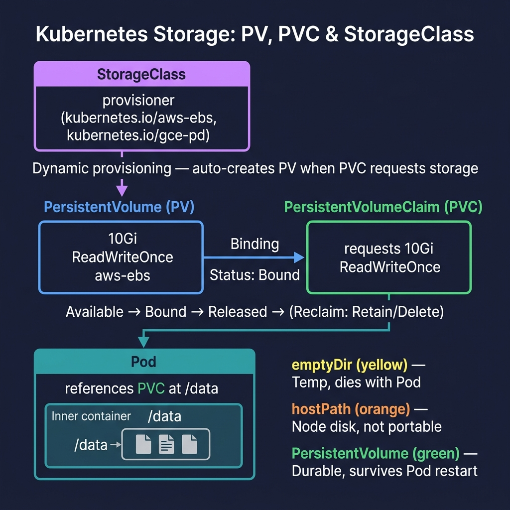

<!-- tags: kubernetes, k8s, storage, volumes -->
# 💾 Volumes & Persistent Storage

> Pods are ephemeral — data is lost when a Pod dies. Volumes and PVC keep data persistent across the lifecycle

| Aspect           | Detail                                                                           |
| ---------------- | -------------------------------------------------------------------------------- |
| **K8s Object**   | `v1/PersistentVolume`, `v1/PersistentVolumeClaim`, `storage.k8s.io/StorageClass` |
| **Use case**     | Database storage, file uploads, shared data                                      |
| **Go relevance** | SQLite files, upload dirs, log persistence                                       |
| **Kubectl**      | `kubectl get pv`, `kubectl get pvc`                                              |

---

## 1. DEFINE

Picture a container that can easily die and come back up; data does not have that luxury. Storage in Kubernetes becomes a real problem the moment state must outlive the Pod mounting it.

### Volume Types

| Type                      | Lifetime         | Use case          | Provider  |
| ------------------------- | ---------------- | ----------------- | --------- |
| **emptyDir**              | Pod lifetime     | Temp files, cache | Local     |
| **hostPath**              | Node lifetime    | Dev/test only     | Local     |
| **PersistentVolume (PV)** | Cluster lifetime | Database, uploads | Cloud/NFS |
| **ConfigMap/Secret**      | Object lifetime  | Config files      | K8s API   |

### Storage Architecture

| Component                       | Role                                             |
| ------------------------------- | ------------------------------------------------ |
| **PersistentVolume (PV)**       | Piece of storage already provisioned (NFS, EBS, GCE PD) |
| **PersistentVolumeClaim (PVC)** | User request for storage → binds to a PV         |
| **StorageClass**                | Template for dynamic provisioning                |
| **CSI Driver**                  | Interface between K8s and storage backend        |

### Access Modes

| Mode                 | Abbreviation | Description                    |
| -------------------- | ------------ | ------------------------------ |
| **ReadWriteOnce**    | RWO          | 1 Node read-write              |
| **ReadOnlyMany**     | ROX          | Many Nodes read-only           |
| **ReadWriteMany**    | RWX          | Many Nodes read-write          |
| **ReadWriteOncePod** | RWOP         | 1 Pod read-write (K8s 1.27+)  |

### Reclaim Policy

| Policy      | When PVC deleted                  | Use case        |
| ----------- | --------------------------------- | --------------- |
| **Retain**  | PV kept, admin handles cleanup    | Production data |
| **Delete**  | PV + underlying storage deleted   | Dev/test        |
| **Recycle** | ⚠️ Deprecated                    | Do not use      |

### Failure Modes

| Error                  | Cause                     | Fix                                       |
| ---------------------- | ------------------------- | ----------------------------------------- |
| PVC `Pending`          | No matching PV            | Check StorageClass, capacity, access mode |
| Pod `ContainerCreating`| PV not yet attached       | Wait or check CSI driver logs             |
| Data loss              | `reclaimPolicy: Delete`   | Use `Retain` for production               |
| Multi-attach error     | RWO volume on 2 nodes     | Use RWX or StatefulSet                    |

---

Those failure modes sound familiar. But there is a trap: emptyDir loses data when Pod restarts = data loss, and PVC bound to wrong StorageClass = provisioning failure. That trap appears in PITFALLS.

## 2. VISUAL

Definitions only lock vocabulary. The visual below shows the actual operational flow where containers, pods, log pipelines, and shell commands start hitting production.



*Figure: StorageClass enables dynamic provisioning — PVC requests storage, PV is auto-created, and the Pod mounts it. emptyDir dies with the Pod; hostPath is node-local; PersistentVolume survives restarts.*

### PV → PVC → Pod Binding

```
┌─────────────────┐     ┌─────────────────┐
│   StorageClass   │     │   Admin/Cloud    │
│   "fast-ssd"     │     │   Provisioner    │
└────────┬─────────┘     └────────┬─────────┘
         │ (dynamic provision)     │ (static provision)
         │                         │
    ┌────▼─────────────────────────▼────────┐
    │         PersistentVolume (PV)          │
    │   capacity: 10Gi                      │
    │   accessModes: [ReadWriteOnce]        │
    │   persistentVolumeReclaimPolicy: Retain│
    │   Status: Available → Bound            │
    └────────────────┬──────────────────────┘
                     │ (auto-bind)
    ┌────────────────▼──────────────────────┐
    │      PersistentVolumeClaim (PVC)       │
    │   "postgres-data"                      │
    │   request: 10Gi                        │
    │   storageClassName: fast-ssd           │
    │   Status: Bound                        │
    └────────────────┬──────────────────────┘
                     │ (volume mount)
    ┌────────────────▼──────────────────────┐
    │               POD                      │
    │   volumeMounts:                        │
    │     - mountPath: /var/lib/postgresql   │
    │       name: postgres-data              │
    └────────────────────────────────────────┘
```

---

## 3. CODE

The flow above gives you intuition; the section below is what the team will actually copy, review, and be accountable for in production.

### Example 1: Basic — PVC for PostgreSQL

> **Goal**: Deploy PostgreSQL with persistent storage, data survives pod restart.
> **Requires**: StorageClass available (minikube has `standard` built-in).
> **Result**: Database data not lost when pod is recreated.

```yaml
# k8s/postgres-storage.yaml
---
# PVC — request storage
apiVersion: v1
kind: PersistentVolumeClaim
metadata:
    name: postgres-data
spec:
    accessModes:
        - ReadWriteOnce # ✅ 1 Node read-write — sufficient for single DB
    storageClassName: standard # ✅ minikube default StorageClass
    resources:
        requests:
            storage: 5Gi
---
# PostgreSQL Deployment
apiVersion: apps/v1
kind: Deployment
metadata:
    name: postgres
spec:
    replicas: 1 # ⚠️ Database = 1 replica (use StatefulSet for HA)
    selector:
        matchLabels:
            app: postgres
    strategy:
        type: Recreate # ⚠️ Recreate because RWO volume cannot multi-attach
    template:
        metadata:
            labels:
                app: postgres
        spec:
            containers:
                - name: postgres
                  image: postgres:16-alpine
                  ports:
                      - containerPort: 5432
                  env:
                      - name: POSTGRES_DB
                        value: myapp
                      - name: POSTGRES_USER
                        valueFrom:
                            secretKeyRef:
                                name: postgres-secret
                                key: username
                      - name: POSTGRES_PASSWORD
                        valueFrom:
                            secretKeyRef:
                                name: postgres-secret
                                key: password
                      - name: PGDATA
                        value: /var/lib/postgresql/data/pgdata
                  volumeMounts:
                      - name: postgres-storage
                        mountPath: /var/lib/postgresql/data
                  resources:
                      requests: { memory: '256Mi', cpu: '250m' }
                      limits: { memory: '512Mi', cpu: '500m' }
            volumes:
                - name: postgres-storage
                  persistentVolumeClaim:
                      claimName: postgres-data # ✅ Reference PVC
---
apiVersion: v1
kind: Service
metadata:
    name: postgres-svc
spec:
    selector:
        app: postgres
    ports:
        - port: 5432
          targetPort: 5432
```

```bash
# Deploy
kubectl create secret generic postgres-secret \
  --from-literal=username=appuser \
  --from-literal=password=secretpass123

kubectl apply -f k8s/postgres-storage.yaml

# ✅ Verify PVC bound
kubectl get pvc postgres-data
# NAME            STATUS   VOLUME     CAPACITY   ACCESS MODES   STORAGECLASS
# postgres-data   Bound    pvc-xxx    5Gi        RWO            standard

# ✅ Test data persistence: delete pod → data still there
kubectl delete pod -l app=postgres
kubectl get pods -l app=postgres -w  # Wait for new pod
kubectl exec -it deploy/postgres -- psql -U appuser -d myapp -c "SELECT 1"
```

> **Result**: PostgreSQL data persists across pod restarts.
> **Note**: Deployment `strategy: Recreate` is mandatory with RWO volumes.

📅 Created: 2026-03-20 · 🔄 Updated: 2026-04-20 · ⏱️ 15 min read

---

EmptyDir is covered. But persistent data needs PVC — time to claim.

### Example 2: Intermediate — Go app upload files + shared volume

> **Goal**: Go app saves uploaded files to PVC, persists across deploys.
> **Requires**: PVC + Go file upload handler.
> **Result**: File upload service production-ready.

```go
// upload/handler.go — File upload handler with PVC storage
package upload

import (
	"crypto/sha256"
	"fmt"
	"io"
	"log"
	"net/http"
	"os"
	"path/filepath"
	"time"
)

const (
	maxUploadSize = 10 << 20 // 10MB
)

type Handler struct {
	uploadDir string // ✅ Mounted from PVC
}

func NewHandler(uploadDir string) *Handler {
	// ✅ Ensure directory exists
	if err := os.MkdirAll(uploadDir, 0755); err != nil {
		log.Fatalf("❌ Cannot create upload dir %s: %v", uploadDir, err)
	}
	return &Handler{uploadDir: uploadDir}
}

func (h *Handler) Upload(w http.ResponseWriter, r *http.Request) {
	r.Body = http.MaxBytesReader(w, r.Body, maxUploadSize)

	file, header, err := r.FormFile("file")
	if err != nil {
		http.Error(w, "File too large or invalid", http.StatusBadRequest)
		return
	}
	defer file.Close()

	// ✅ Generate unique filename (avoid collisions across pods)
	ext := filepath.Ext(header.Filename)
	hash := sha256.New()
	hash.Write([]byte(fmt.Sprintf("%s-%d", header.Filename, time.Now().UnixNano())))
	filename := fmt.Sprintf("%x%s", hash.Sum(nil)[:8], ext)

	// ✅ Save to PVC-mounted directory
	dstPath := filepath.Join(h.uploadDir, filename)
	dst, err := os.Create(dstPath)
	if err != nil {
		log.Printf("❌ Create file error: %v", err)
		http.Error(w, "Storage error", http.StatusInternalServerError)
		return
	}
	defer dst.Close()

	written, err := io.Copy(dst, file)
	if err != nil {
		log.Printf("❌ Write file error: %v", err)
		http.Error(w, "Write error", http.StatusInternalServerError)
		return
	}

	log.Printf("✅ Uploaded %s (%d bytes) → %s", header.Filename, written, dstPath)
	fmt.Fprintf(w, `{"filename": "%s", "size": %d}`, filename, written)
}
```

```yaml
# k8s/upload-service.yaml
apiVersion: v1
kind: PersistentVolumeClaim
metadata:
    name: uploads-pvc
spec:
    accessModes:
        - ReadWriteMany # ✅ RWX — multiple pods write simultaneously
    storageClassName: nfs # ⚠️ Need NFS StorageClass for RWX
    resources:
        requests:
            storage: 20Gi
---
apiVersion: apps/v1
kind: Deployment
metadata:
    name: upload-service
spec:
    replicas: 3 # ✅ 3 replicas — requires RWX volume
    selector:
        matchLabels:
            app: upload-service
    template:
        metadata:
            labels:
                app: upload-service
        spec:
            containers:
                - name: api
                  image: upload-service:v1
                  ports:
                      - containerPort: 8080
                  env:
                      - name: UPLOAD_DIR
                        value: /data/uploads
                  volumeMounts:
                      - name: uploads
                        mountPath: /data/uploads
                  resources:
                      requests: { memory: '64Mi', cpu: '100m' }
                      limits: { memory: '256Mi', cpu: '500m' }
            volumes:
                - name: uploads
                  persistentVolumeClaim:
                      claimName: uploads-pvc
```

> **Result**: Multi-replica upload service sharing PVC storage.
> **Note**: RWX requires NFS/EFS/GlusterFS. Cloud providers: AWS EFS, GCP Filestore.

---

PVC is covered. But dynamic provisioning needs StorageClass — time to configure.

### Example 3: Advanced — StatefulSet with per-Pod storage

> **Goal**: Database cluster (PostgreSQL HA) where each replica has its own PVC.
> **Requires**: StatefulSet + volumeClaimTemplates.
> **Result**: Standard stateful workload pattern.

```yaml
# k8s/statefulset-postgres.yaml
apiVersion: apps/v1
kind: StatefulSet
metadata:
    name: postgres
spec:
    serviceName: postgres-headless # ✅ Headless service for stable DNS
    replicas: 3
    selector:
        matchLabels:
            app: postgres
    template:
        metadata:
            labels:
                app: postgres
        spec:
            containers:
                - name: postgres
                  image: postgres:16-alpine
                  ports:
                      - containerPort: 5432
                  env:
                      - name: POSTGRES_PASSWORD
                        valueFrom:
                            secretKeyRef:
                                name: postgres-secret
                                key: password
                  volumeMounts:
                      - name: data
                        mountPath: /var/lib/postgresql/data
                  resources:
                      requests: { memory: '512Mi', cpu: '500m' }
                      limits: { memory: '1Gi', cpu: '1' }
    # ✅ Each replica automatically creates its own PVC
    volumeClaimTemplates:
        - metadata:
              name: data
          spec:
              accessModes: ['ReadWriteOnce']
              storageClassName: fast-ssd
              resources:
                  requests:
                      storage: 10Gi
---
# ✅ Headless Service — stable DNS for each pod
apiVersion: v1
kind: Service
metadata:
    name: postgres-headless
spec:
    clusterIP: None
    selector:
        app: postgres
    ports:
        - port: 5432
```

```
# ✅ DNS names for each pod (stable, never change):
# postgres-0.postgres-headless.default.svc.cluster.local
# postgres-1.postgres-headless.default.svc.cluster.local
# postgres-2.postgres-headless.default.svc.cluster.local

# ✅ PVCs auto-created:
# data-postgres-0 → its own PV
# data-postgres-1 → its own PV
# data-postgres-2 → its own PV
```

> **Result**: Each DB replica has its own storage, stable network identity.
> **Note**: StatefulSet scale/delete keeps PVCs. Delete PVCs manually to free storage.

---

You have covered emptyDir, PVC, and StorageClass. Now comes the dangerous part: ephemeral data loss and wrong StorageClass — the trap set up from the beginning.

## 4. PITFALLS

| #   | Mistake                                             | Consequence | Fix                                                |
| --- | --------------------------------------------------- | ----------- | -------------------------------------------------- |
| 1   | RWO volume + rolling update → `Multi-Attach error`  | —           | `strategy: Recreate` for RWO volumes               |
| 2   | PVC Pending — no matching PV                        | —           | Check StorageClass exists, capacity sufficient     |
| 3   | Data lost when deleting PVC (`reclaimPolicy: Delete`)| —          | Use `Retain` for production data                   |
| 4   | `hostPath` volume has different data across nodes    | —           | Only for dev. Production uses PV/PVC               |
| 5   | StatefulSet PVCs not auto-deleted                    | —           | Delete manually: `kubectl delete pvc data-postgres-*` |

---

## 5. REF

| Resource           | Link                                                                                                                                    |
| ------------------ | --------------------------------------------------------------------------------------------------------------------------------------- |
| Persistent Volumes | [kubernetes.io/docs/concepts/storage/persistent-volumes](https://kubernetes.io/docs/concepts/storage/persistent-volumes/)               |
| Storage Classes    | [kubernetes.io/docs/concepts/storage/storage-classes](https://kubernetes.io/docs/concepts/storage/storage-classes/)                     |
| StatefulSets       | [kubernetes.io/docs/concepts/workloads/controllers/statefulset](https://kubernetes.io/docs/concepts/workloads/controllers/statefulset/) |
| CSI Drivers        | [kubernetes-csi.github.io/docs](https://kubernetes-csi.github.io/docs/)                                                                 |

---

## 6. RECOMMEND

| Extension                 | When                             | Reason                               |
| ------------------------- | -------------------------------- | ------------------------------------ |
| **Rook-Ceph**             | Self-hosted distributed storage  | Cloud-native storage for bare-metal  |
| **Longhorn**              | Lightweight cloud-native storage | Rancher ecosystem, easy HA           |
| **VolumeSnapshot**        | Backup/restore PVs               | Point-in-time snapshots              |
| **CSI Driver (EBS/GCE)**  | Cloud-native provisioning        | Auto-provision disks                 |
| **MinIO**                 | Object storage in K8s            | S3-compatible, for file uploads      |

---

## 🔍 Debug Checklist

| # | Symptom | Root cause | Diagnostic command |
|---|---------|------------|-------------------|
| 1 | PVC stuck in `Pending` forever | No matching PV or StorageClass does not exist | `kubectl describe pvc <name>` → check Events |
| 2 | Pod stuck in `ContainerCreating` | PV attaching to Node (CSI driver slow) | `kubectl describe pod <pod>` → check `AttachVolume` events |
| 3 | `Multi-Attach error` on rolling update | RWO volume bound to old Node, new Node cannot attach | Use `strategy: Recreate` for Deployment with RWO volume |
| 4 | Permission denied writing to volume | fsGroup or runAsUser does not match file ownership | `kubectl exec <pod> -- ls -la /mount/path` |
| 5 | Data lost after deleting PVC | `reclaimPolicy: Delete` on StorageClass | `kubectl get storageclass` → check reclaimPolicy |
| 6 | StatefulSet PVC not auto-deleted | By design — PVC not deleted on scale down | `kubectl delete pvc <name>` manually |
| 7 | emptyDir data lost | emptyDir only exists for Pod lifetime — Pod restart → deleted | Use PVC for data that needs persistence |

---

## 🃏 Quick Reference

| # | Pattern | Command / Rule |
|---|---------|----------------|
| 1 | View PVC status | `kubectl get pvc` |
| 2 | View all PVs | `kubectl get pv` |
| 3 | View StorageClasses | `kubectl get storageclass` |
| 4 | Basic PVC YAML | `accessModes: [ReadWriteOnce]`, `storage: 5Gi`, `storageClassName: standard` |
| 5 | Access modes | RWO = 1 node; ROX = many nodes read; RWX = many nodes read-write |
| 6 | Reclaim policies | `Retain` = keep (production); `Delete` = delete with PVC (dev) |
| 7 | StatefulSet per-pod PVC | Use `volumeClaimTemplates` instead of `volumes` |
| 8 | Copy files to/from PVC | `kubectl cp <pod>:/path/to/file ./local-file` |

---

## 🎯 Interview Angle

**Related system design / technical questions:**
- *"How do PersistentVolume and PersistentVolumeClaim differ? Who creates which?"*
- *"How does dynamic provisioning work? What role does StorageClass play?"*
- *"How do ReadWriteMany (RWX) and ReadWriteOnce (RWO) differ? When do you need RWX?"*

**Key talking points interviewers expect:**

| Topic | Talking point |
|-------|---------------|
| PV vs PVC | PV = actual storage resource (admin creates or dynamic); PVC = user request; K8s auto-binds PVC → matching PV |
| Dynamic provisioning | PVC does not need a pre-existing PV; StorageClass + CSI driver auto-creates PV when PVC is created |
| RWO vs RWX | RWO: 1 Node mount (EBS, GCE PD); RWX: multiple Nodes simultaneously (NFS, EFS, CephFS) — needed for multi-replica with shared files |
| StatefulSet + PVC | Each replica has its own PVC via `volumeClaimTemplates`; deleting StatefulSet does not delete PVCs |
| Reclaim policy | `Retain`: PV keeps data after PVC delete — admin handles; `Delete`: auto-deletes storage when PVC deleted |
| emptyDir vs PVC | emptyDir is temporary within Pod; PVC persists across pod restarts and node rescheduling |

**Common follow-up questions:**
- *"Why does a database Deployment need `strategy: Recreate`?"* → RWO volume cannot attach to 2 Nodes simultaneously; rolling update creates new pod before killing old → Multi-Attach error
- *"What is VolumeSnapshot for?"* → Point-in-time backup of PVC; restore from snapshot into a new PVC
- *"Why should production use StatefulSet instead of Deployment for DB?"* → Stable network identity, ordered scaling, per-pod PVC — critical for replication

---

**Links**: [← ConfigMaps & Secrets](./04-configmaps-secrets.md) · [→ Ingress & TLS](./06-ingress.md)
