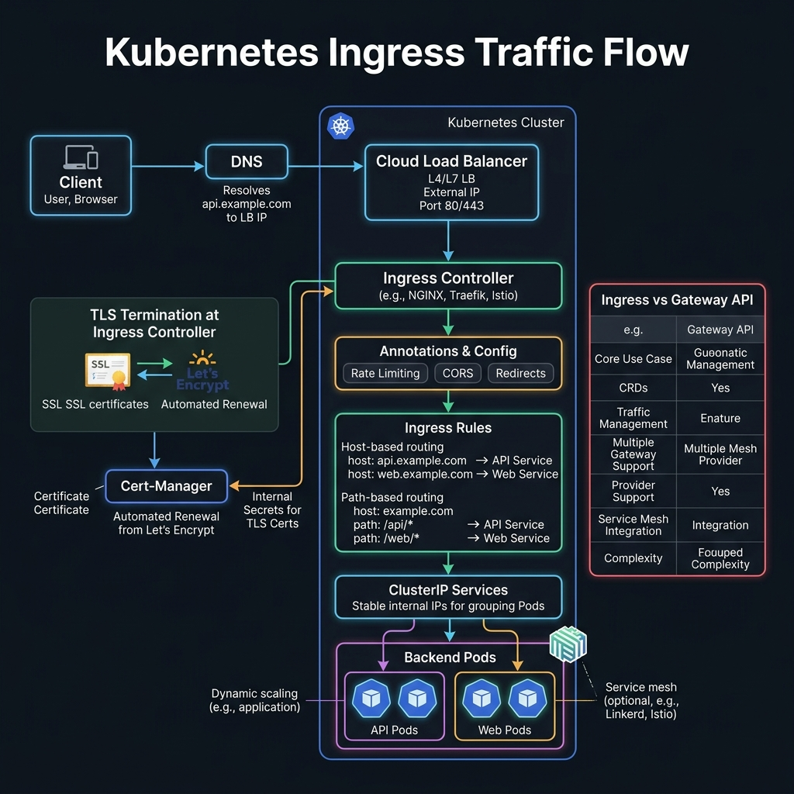

<!-- tags: kubernetes, k8s, ingress, networking -->
# 🌍 Ingress & TLS

> Ingress is a L7 reverse proxy for K8s — routing HTTP/HTTPS traffic based on host/path

| Aspect           | Detail                                              |
| ---------------- | --------------------------------------------------- |
| **K8s Object**   | `networking.k8s.io/v1/Ingress`, `IngressClass`      |
| **Use case**     | Domain routing, SSL termination, path-based routing |
| **Go relevance** | Expose Go APIs via domain name with HTTPS           |
| **Kubectl**      | `kubectl get ingress`                               |

---

## 1. DEFINE

Picture having many services running healthy inside the cluster, but users still only see one hostname or a few fixed entry points. Ingress is where application networking starts hitting edge networking.

### Ingress vs Service (LoadBalancer) vs NodePort

| Feature          | NodePort     | LoadBalancer | Ingress                 |
| ---------------- | ------------ | ------------ | ----------------------- |
| **Layer**        | L4 (TCP/UDP) | L4           | L7 (HTTP/HTTPS)         |
| **SSL**          | ❌ Manual    | ❌ Manual    | ✅ Built-in             |
| **Path routing** | ❌           | ❌           | ✅ `/api/*`, `/web/*`   |
| **Host routing** | ❌           | ❌           | ✅ `api.example.com`    |
| **Cost**         | Free         | $$$ / LB     | 1 LB for many services  |
| **Production**   | ❌           | ✅ Simple    | ✅ Recommended          |

### Actors

| Actor                  | Role                                     |
| ---------------------- | ---------------------------------------- |
| **Ingress Resource**   | Declarative routing rules (YAML)         |
| **Ingress Controller** | Enforces rules (NGINX, Traefik, HAProxy) |
| **cert-manager**       | Auto-provision + renew TLS certificates  |
| **ExternalDNS**        | Auto-create DNS records                  |

### Popular Ingress Controllers

| Controller        | Characteristics              | Use case       |
| ----------------- | ---------------------------- | -------------- |
| **NGINX**         | Standard, mature             | Default choice |
| **Traefik**       | Auto-discovery, middleware   | K3s default    |
| **HAProxy**       | High performance             | High-traffic   |
| **Istio Gateway** | Service mesh integration     | Microservices  |
| **AWS ALB**       | Cloud-native AWS             | EKS            |

### Failure Modes

| Error               | Cause                        | Fix                                   |
| ------------------- | ---------------------------- | ------------------------------------- |
| 404 Not Found       | Path/host does not match rule | Check Ingress rules + backend Service |
| 502 Bad Gateway     | Backend pods down/not ready  | Check readiness probes                |
| SSL error           | Cert expired or not created  | Check cert-manager logs               |
| Ingress has no IP   | Controller not installed     | Install ingress controller            |

---

Those failure modes are clear. But there is a trap: Ingress without ADDRESS = controller not installed, and TLS secret in wrong format = HTTPS fails silently. That trap appears in PITFALLS.

## 2. VISUAL

The concepts have names. Moving to diagrams, the more important part reveals itself: how requests, workloads, or signals flow through these layers.



### Ingress Traffic Flow

```
                    INTERNET
                       │
                https://api.example.com/users
                       │
              ┌────────▼────────┐
              │   LOAD BALANCER  │  (Cloud LB or MetalLB)
              │   External IP    │
              └────────┬────────┘
                       │
              ┌────────▼────────┐
              │ INGRESS CONTROLLER│  (NGINX Pod)
              │                  │
              │ Rules:           │
              │  api.example.com │
              │    /users → svc-users
              │    /orders → svc-orders
              │  admin.example.com
              │    / → svc-admin │
              │                  │
              │ TLS termination  │
              └────┬───────┬────┘
                   │       │
         ┌─────────▼┐  ┌──▼──────────┐
         │svc-users │  │ svc-orders  │
         │ :80      │  │ :80         │
         └────┬─────┘  └──────┬──────┘
              │               │
         ┌────▼────┐    ┌─────▼───┐
         │ Pod×3   │    │ Pod×2   │
         │ Go API  │    │ Go API  │
         └─────────┘    └─────────┘
```

---

## 3. CODE

The diagrams have shown the main path. The code/manifests/commands below pull it down to the artifact level that on-call or reviewers actually use.

### Example 1: Basic — NGINX Ingress for a Go API

> **Goal**: Install NGINX Ingress Controller + create Ingress routing.
> **Requires**: minikube/kind + helm.
> **Result**: Access Go app via domain name.

```bash
# ✅ Install NGINX Ingress Controller
# Minikube:
minikube addons enable ingress

# Or Helm (production):
helm repo add ingress-nginx https://kubernetes.github.io/ingress-nginx
helm install ingress-nginx ingress-nginx/ingress-nginx \
  --namespace ingress-nginx --create-namespace \
  --set controller.replicaCount=2
```

```yaml
# k8s/ingress-basic.yaml
apiVersion: networking.k8s.io/v1
kind: Ingress
metadata:
    name: go-api-ingress
    annotations:
        # ✅ NGINX-specific annotations
        nginx.ingress.kubernetes.io/proxy-body-size: '10m'
        nginx.ingress.kubernetes.io/proxy-read-timeout: '60'
        nginx.ingress.kubernetes.io/proxy-send-timeout: '60'
        nginx.ingress.kubernetes.io/cors-allow-origin: '*'
        nginx.ingress.kubernetes.io/enable-cors: 'true'
spec:
    ingressClassName: nginx # ✅ Specify which controller
    rules:
        # ✅ Host-based routing
        - host: api.example.com
          http:
              paths:
                  - path: /
                    pathType: Prefix
                    backend:
                        service:
                            name: go-api
                            port:
                                number: 80
        # ✅ Multiple services on the same domain
        - host: app.example.com
          http:
              paths:
                  - path: /api
                    pathType: Prefix
                    backend:
                        service:
                            name: go-api
                            port:
                                number: 80
                  - path: /
                    pathType: Prefix
                    backend:
                        service:
                            name: frontend
                            port:
                                number: 80
```

```bash
# Deploy
kubectl apply -f k8s/ingress-basic.yaml

# ✅ Verify
kubectl get ingress
# NAME              CLASS   HOSTS                          ADDRESS        PORTS   AGE
# go-api-ingress    nginx   api.example.com,app.example.com  192.168.49.2  80      5s

# ✅ Test (local — add entry to /etc/hosts)
echo "$(minikube ip) api.example.com app.example.com" | sudo tee -a /etc/hosts
curl http://api.example.com/healthz
```

> **Result**: Multiple services routed via domain names.
> **Note**: Production requires DNS records pointing to Ingress Controller's external IP.

📅 Created: 2026-03-20 · 🔄 Updated: 2026-04-20 · ⏱️ 15 min read

---

Basic Ingress is covered. But TLS needs certificates — time to secure.

### Example 2: Intermediate — TLS with cert-manager (Let's Encrypt)

> **Goal**: Auto-provision + auto-renew HTTPS certificates.
> **Requires**: cert-manager installed, domain name pointing to cluster.
> **Result**: Production HTTPS with auto-renewal.

```bash
# ✅ Install cert-manager
helm repo add jetstack https://charts.jetstack.io
helm install cert-manager jetstack/cert-manager \
  --namespace cert-manager --create-namespace \
  --set installCRDs=true
```

```yaml
# k8s/cert-issuer.yaml — Let's Encrypt Issuer
apiVersion: cert-manager.io/v1
kind: ClusterIssuer
metadata:
    name: letsencrypt-prod
spec:
    acme:
        server: https://acme-v02.api.letsencrypt.org/directory
        email: admin@example.com
        privateKeySecretRef:
            name: letsencrypt-prod-key
        solvers:
            # ✅ HTTP-01 challenge — cert-manager creates temp Ingress
            - http01:
                  ingress:
                      class: nginx
---
# k8s/ingress-tls.yaml — Ingress with TLS
apiVersion: networking.k8s.io/v1
kind: Ingress
metadata:
    name: go-api-tls
    annotations:
        # ✅ cert-manager auto-provision certificate
        cert-manager.io/cluster-issuer: 'letsencrypt-prod'
        nginx.ingress.kubernetes.io/ssl-redirect: 'true'
        nginx.ingress.kubernetes.io/force-ssl-redirect: 'true'
spec:
    ingressClassName: nginx
    tls:
        # ✅ TLS config — cert-manager auto-creates Secret "go-api-tls-cert"
        - hosts:
              - api.example.com
          secretName: go-api-tls-cert
    rules:
        - host: api.example.com
          http:
              paths:
                  - path: /
                    pathType: Prefix
                    backend:
                        service:
                            name: go-api
                            port:
                                number: 80
```

```bash
# Deploy
kubectl apply -f k8s/cert-issuer.yaml
kubectl apply -f k8s/ingress-tls.yaml

# ✅ Verify certificate
kubectl get certificate
# NAME              READY   SECRET              AGE
# go-api-tls-cert   True    go-api-tls-cert     2m

# ✅ Test HTTPS
curl https://api.example.com/healthz
```

> **Result**: Auto HTTPS with Let's Encrypt, auto-renew before expiration.
> **Note**: Let's Encrypt has rate limits — use staging server when testing.

---

TLS is covered. But advanced routing needs annotations — time to tune.

### Example 3: Advanced — Rate Limiting + Auth + Custom Headers

> **Goal**: Ingress with rate limiting, basic auth, custom response headers.
> **Requires**: NGINX Ingress Controller.
> **Result**: Production-hardened Ingress.

```yaml
# k8s/ingress-advanced.yaml
apiVersion: networking.k8s.io/v1
kind: Ingress
metadata:
    name: go-api-hardened
    annotations:
        # ✅ Rate limiting
        nginx.ingress.kubernetes.io/limit-rps: '50'
        nginx.ingress.kubernetes.io/limit-connections: '10'
        nginx.ingress.kubernetes.io/limit-burst-multiplier: '5'

        # ✅ Security headers
        nginx.ingress.kubernetes.io/configuration-snippet: |
            more_set_headers "X-Frame-Options: DENY";
            more_set_headers "X-Content-Type-Options: nosniff";
            more_set_headers "X-XSS-Protection: 1; mode=block";
            more_set_headers "Strict-Transport-Security: max-age=31536000; includeSubDomains";
            more_set_headers "Content-Security-Policy: default-src 'self'";

        # ✅ Request/Response size limits
        nginx.ingress.kubernetes.io/proxy-body-size: '50m'
        nginx.ingress.kubernetes.io/proxy-buffer-size: '8k'

        # ✅ Timeouts
        nginx.ingress.kubernetes.io/proxy-connect-timeout: '10'
        nginx.ingress.kubernetes.io/proxy-read-timeout: '60'
        nginx.ingress.kubernetes.io/proxy-send-timeout: '60'

        # ✅ CORS for frontend SPA
        nginx.ingress.kubernetes.io/enable-cors: 'true'
        nginx.ingress.kubernetes.io/cors-allow-origin: 'https://app.example.com'
        nginx.ingress.kubernetes.io/cors-allow-methods: 'GET, POST, PUT, DELETE, OPTIONS'
        nginx.ingress.kubernetes.io/cors-allow-headers: 'Authorization, Content-Type'

        # ✅ SSL
        cert-manager.io/cluster-issuer: 'letsencrypt-prod'
        nginx.ingress.kubernetes.io/ssl-redirect: 'true'
spec:
    ingressClassName: nginx
    tls:
        - hosts: [api.example.com]
          secretName: go-api-tls
    rules:
        - host: api.example.com
          http:
              paths:
                  - path: /api/v1
                    pathType: Prefix
                    backend:
                        service:
                            name: go-api-v1
                            port:
                                number: 80
                  - path: /api/v2
                    pathType: Prefix
                    backend:
                        service:
                            name: go-api-v2
                            port:
                                number: 80
```

```go
// middleware/ratelimit.go — App-level rate limiting (combined with Ingress-level)
package middleware

import (
	"net/http"
	"sync"
	"time"

	"golang.org/x/time/rate"
)

// ✅ Per-IP rate limiter
type IPRateLimiter struct {
	ips     map[string]*rate.Limiter
	mu      sync.RWMutex
	rate    rate.Limit
	burst   int
}

func NewIPRateLimiter(r rate.Limit, b int) *IPRateLimiter {
	return &IPRateLimiter{
		ips:   make(map[string]*rate.Limiter),
		rate:  r,
		burst: b,
	}
}

func (i *IPRateLimiter) GetLimiter(ip string) *rate.Limiter {
	i.mu.Lock()
	defer i.mu.Unlock()

	limiter, exists := i.ips[ip]
	if !exists {
		limiter = rate.NewLimiter(i.rate, i.burst)
		i.ips[ip] = limiter
		// ✅ Cleanup old entries periodically
		go func() {
			time.Sleep(10 * time.Minute)
			i.mu.Lock()
			delete(i.ips, ip)
			i.mu.Unlock()
		}()
	}
	return limiter
}

// ✅ Middleware
func RateLimit(limiter *IPRateLimiter) func(http.Handler) http.Handler {
	return func(next http.Handler) http.Handler {
		return http.HandlerFunc(func(w http.ResponseWriter, r *http.Request) {
			// ⚠️ In K8s, real IP = X-Forwarded-For (set by Ingress)
			ip := r.Header.Get("X-Forwarded-For")
			if ip == "" {
				ip = r.RemoteAddr
			}

			if !limiter.GetLimiter(ip).Allow() {
				http.Error(w, "Rate limit exceeded", http.StatusTooManyRequests)
				return
			}
			next.ServeHTTP(w, r)
		})
	}
}
```

> **Result**: Defense-in-depth: Ingress rate limit + app-level rate limit + security headers.
> **Note**: `X-Forwarded-For` can be spoofed — Ingress controller handles trusted proxies.

---

You have covered Ingress, TLS, and advanced routing. Now comes the dangerous part: missing controller and wrong TLS secret — the trap set up from the beginning.

## 4. PITFALLS

| #   | Mistake                                  | Consequence | Fix                                                     |
| --- | ---------------------------------------- | ----------- | ------------------------------------------------------- |
| 1   | Ingress deployed but no ADDRESS          | —           | Ingress Controller not installed                        |
| 2   | 502 Bad Gateway                          | —           | Backend pods not ready, check readinessProbe            |
| 3   | TLS cert cannot be created               | —           | Check cert-manager logs: `kubectl logs -n cert-manager` |
| 4   | `pathType: Exact` does not match subpaths | —          | Use `pathType: Prefix`                                  |
| 5   | CORS blocked                             | —           | Add cors annotations or handle in Go app                |

---

## 5. REF

| Resource      | Link                                                                                                                        |
| ------------- | --------------------------------------------------------------------------------------------------------------------------- |
| Ingress       | [kubernetes.io/docs/concepts/services-networking/ingress](https://kubernetes.io/docs/concepts/services-networking/ingress/) |
| NGINX Ingress | [kubernetes.github.io/ingress-nginx](https://kubernetes.github.io/ingress-nginx/)                                           |
| cert-manager  | [cert-manager.io/docs](https://cert-manager.io/docs/)                                                                       |
| Let's Encrypt | [letsencrypt.org](https://letsencrypt.org/)                                                                                 |
| `x/time/rate` | [pkg.go.dev/golang.org/x/time/rate](https://pkg.go.dev/golang.org/x/time/rate)                                              |

---

## 6. RECOMMEND

| Extension                 | When                     | Reason                                   |
| ------------------------- | ------------------------ | ---------------------------------------- |
| **Traefik IngressRoute**  | Need middleware chains   | Native K8s CRDs, middleware pattern      |
| **Gateway API**           | K8s 1.27+                | Successor of Ingress, richer API         |
| **OAuth2 Proxy**          | SSO authentication       | Forward auth via Ingress                 |
| **ModSecurity WAF**       | Security compliance      | Web Application Firewall integrated with NGINX |
| **Cloudflare Tunnel**     | Expose without public IP | Zero-trust tunnel, DDoS protection       |

---

## 🔍 Debug Checklist

| # | Symptom | Root cause | Diagnostic command |
|---|---------|------------|-------------------|
| 1 | Ingress has no ADDRESS | Ingress Controller not installed | `kubectl get pods -n ingress-nginx` |
| 2 | 404 Not Found from Ingress | Path or host rule does not match | `kubectl describe ingress <name>` → check Rules |
| 3 | 502 Bad Gateway | Backend pods down or not ready | `kubectl get endpoints <svc>` and `kubectl describe pod <pod>` |
| 4 | TLS certificate not created | cert-manager error or DNS not pointing correctly | `kubectl describe certificate <name>` and `kubectl logs -n cert-manager deploy/cert-manager` |
| 5 | CORS blocked from browser | CORS annotations missing or wrong origin | `kubectl describe ingress <name>` check annotations |
| 6 | `pathType: Exact` does not match | Exact only matches exact path, no trailing slash | Switch to `pathType: Prefix` |
| 7 | Rate limit too strict → 429 | `limit-rps` annotation too low | Check `nginx.ingress.kubernetes.io/limit-rps` value |

---

## 🃏 Quick Reference

| # | Pattern | Command / Rule |
|---|---------|----------------|
| 1 | List all ingress | `kubectl get ingress -A` |
| 2 | Describe ingress (rules + backend) | `kubectl describe ingress <name>` |
| 3 | Install NGINX Ingress (minikube) | `minikube addons enable ingress` |
| 4 | Path types | `Exact`: exact match; `Prefix`: prefix match; `ImplementationSpecific` |
| 5 | TLS secret format | `tls: [{hosts: [domain.com], secretName: tls-secret}]` |
| 6 | SSL redirect annotation | `nginx.ingress.kubernetes.io/ssl-redirect: "true"` |
| 7 | Rate limiting annotation | `nginx.ingress.kubernetes.io/limit-rps: "50"` |
| 8 | Force HTTPS redirect | `nginx.ingress.kubernetes.io/force-ssl-redirect: "true"` |

---

## 🎯 Interview Angle

**Related system design / technical questions:**
- *"How does Ingress differ from Service LoadBalancer? When should you use Ingress?"*
- *"What is an Ingress Controller? How does it differ from an Ingress Resource?"*
- *"How does cert-manager auto-renew TLS certificates?"*

**Key talking points interviewers expect:**

| Topic | Talking point |
|-------|---------------|
| Ingress vs LoadBalancer | Ingress is L7 (HTTP host/path routing, SSL termination); LoadBalancer is L4 (TCP); Ingress uses 1 LB for many services → cost savings |
| Ingress Resource vs Controller | Resource = declarative rules in K8s; Controller = Pod enforcing rules (NGINX, Traefik); without Controller the Resource has no effect |
| IngressClass | Specifies which controller handles the Ingress resource; `spec.ingressClassName: nginx` |
| cert-manager ACME | cert-manager creates temp Ingress for Let's Encrypt HTTP-01 challenge; stores cert in Secret; auto-renews 30 days before expiration |
| Gateway API | Successor to Ingress; richer API with HTTPRoute, GRPCRoute; K8s 1.24+ stable |
| NGINX annotations | Powerful but controller-specific; migrate to Gateway API for portability |

**Common follow-up questions:**
- *"If there are 2 Ingress Controllers, how does K8s know which one to use?"* → `ingressClassName` field; if not set → default controller (annotation `kubernetes.io/ingress.class`)
- *"Where does TLS termination happen?"* → At the Ingress Controller; traffic from controller → pods is HTTP (plain); need mTLS for end-to-end encryption
- *"How to expose WebSocket via Ingress?"* → Add annotation `nginx.ingress.kubernetes.io/proxy-read-timeout: "3600"` and `nginx.ingress.kubernetes.io/proxy-send-timeout: "3600"`

---

**Links**: [← Volumes & Storage](./05-volumes-storage.md) · [→ Helm Charts](./07-helm.md)
