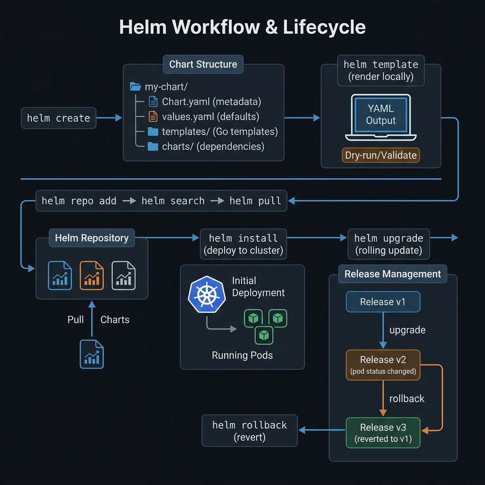

<!-- tags: kubernetes, k8s, helm, package-management -->
# 📦 Helm Charts

> Helm is the package manager for K8s — package, version, and deploy complex applications with a single command

| Aspect           | Detail                                                   |
| ---------------- | -------------------------------------------------------- |
| **Tool**         | Helm v3 (no Tiller)                                      |
| **Use case**     | Package K8s manifests, manage releases, multi-env config |
| **Go relevance** | Helm uses Go templates, Helm SDK written in Go           |
| **CLI**          | `helm install`, `helm upgrade`, `helm rollback`          |

---

## 1. DEFINE

Picture when a good manifest needs to be replicated across many environments and many releases — Helm steps in as the packaging tool. But it is only useful if the team maintains the boundary between reuse and config sprawl.

### Helm Concepts

| Concept        | Description                      | Example                      |
| -------------- | -------------------------------- | ---------------------------- |
| **Chart**      | Package containing K8s templates | `go-api/` directory          |
| **Release**    | Instance of a Chart on a cluster | `go-api-prod`                |
| **Repository** | Store for Charts                 | `https://charts.bitnami.com` |
| **Values**     | Config overrides for a Chart     | `values-prod.yaml`           |
| **Template**   | K8s YAML + Go template syntax    | `{{ .Values.replicas }}`     |

### Chart Structure

```
go-api-chart/
├── Chart.yaml           # Chart metadata (name, version)
├── values.yaml          # Default values
├── values-dev.yaml      # Dev overrides
├── values-prod.yaml     # Production overrides
├── templates/
│   ├── _helpers.tpl     # Template helpers
│   ├── deployment.yaml  # Deployment template
│   ├── service.yaml     # Service template
│   ├── ingress.yaml     # Ingress template
│   ├── configmap.yaml   # ConfigMap template
│   ├── secret.yaml      # Secret template
│   ├── hpa.yaml         # HPA template
│   └── NOTES.txt        # Post-install message
└── charts/              # Sub-charts (dependencies)
```

### Comparison

| Method            | Templating      | Versioning | Rollback | Dependency |
| ----------------- | --------------- | ---------- | -------- | ---------- |
| **kubectl apply** | ❌              | ❌         | ❌       | ❌         |
| **kustomize**     | Overlay patches | ❌         | ❌       | ❌         |
| **Helm**          | Go templates    | ✅         | ✅       | ✅         |

### Failure Modes

| Error                           | Cause                              | Fix                                   |
| ------------------------------- | ---------------------------------- | ------------------------------------- |
| Template render fail            | Syntax error in `.tpl`             | `helm template --debug`               |
| Release stuck `pending-upgrade` | Timeout or crash during upgrade    | `helm rollback` or `helm uninstall`   |
| Values not applied              | Wrong indentation in values.yaml   | `helm get values <release>` to verify |

---

Those failure modes sound easy to avoid. But there is a trap: template render error = deploy fails, and wrong indent in helpers = YAML breaks. That trap appears in PITFALLS.

## 2. VISUAL

Theory sounds fine on paper. The visual below pulls it to the actual operational context where latency, failure, and ownership are no longer vague.



### Helm Workflow

```
Developer                   Helm CLI                    K8s Cluster
    │                          │                            │
    │  helm install go-api     │                            │
    │  -f values-prod.yaml     │                            │
    │─────────────────────────►│                            │
    │                          │  Render templates          │
    │                          │  + values → K8s YAML       │
    │                          │───────────────────────────►│
    │                          │                            │ Create resources
    │                          │        Release v1          │
    │                          │◄───────────────────────────│
    │  helm upgrade go-api     │                            │
    │  --set image.tag=v2      │                            │
    │─────────────────────────►│                            │
    │                          │  Re-render + apply diff    │
    │                          │───────────────────────────►│
    │                          │        Release v2          │ Rolling update
    │                          │◄───────────────────────────│
    │  helm rollback go-api 1  │                            │
    │─────────────────────────►│                            │
    │                          │  Apply v1 templates        │
    │                          │───────────────────────────►│
    │                          │        Release v3 (=v1)    │ Rollback
```

---

## 3. CODE

The diagrams have shown the main path. The code/manifests/commands below pull it down to the artifact level that on-call or reviewers actually use.

### Example 1: Basic — Create a Helm Chart for a Go API

> **Goal**: Create a Helm chart from scratch, deploy a Go API.
> **Requires**: Helm 3.x installed.
> **Result**: Reusable, configurable K8s deployment package.

```bash
# ✅ Scaffold a new chart
helm create go-api-chart
```

```yaml
# go-api-chart/Chart.yaml
apiVersion: v2
name: go-api
description: Go API Server Helm Chart
type: application
version: 0.1.0 # Chart version
appVersion: '1.0.0' # Application version
```

```yaml
# go-api-chart/values.yaml — Default values
replicaCount: 2

image:
    repository: go-api
    tag: 'v1'
    pullPolicy: IfNotPresent

service:
    type: ClusterIP
    port: 80
    targetPort: 8080

ingress:
    enabled: false
    className: nginx
    host: api.example.com
    tls: false

resources:
    requests:
        memory: '64Mi'
        cpu: '100m'
    limits:
        memory: '256Mi'
        cpu: '500m'

autoscaling:
    enabled: false
    minReplicas: 2
    maxReplicas: 10
    targetCPUUtilization: 70

config:
    logLevel: 'info'
    port: '8080'

secrets:
    databaseURL: ''
    apiKey: ''

probes:
    liveness:
        path: /healthz
        initialDelay: 5
    readiness:
        path: /readyz
        initialDelay: 3
```

```yaml
# go-api-chart/templates/deployment.yaml
apiVersion: apps/v1
kind: Deployment
metadata:
  name: {{ include "go-api.fullname" . }}
  labels:
    {{- include "go-api.labels" . | nindent 4 }}
spec:
  {{- if not .Values.autoscaling.enabled }}
  replicas: {{ .Values.replicaCount }}
  {{- end }}
  selector:
    matchLabels:
      {{- include "go-api.selectorLabels" . | nindent 6 }}
  strategy:
    type: RollingUpdate
    rollingUpdate:
      maxSurge: 1
      maxUnavailable: 0
  template:
    metadata:
      labels:
        {{- include "go-api.selectorLabels" . | nindent 8 }}
      annotations:
        # ✅ Force rollout when ConfigMap changes
        checksum/config: {{ include (print $.Template.BasePath "/configmap.yaml") . | sha256sum }}
    spec:
      containers:
        - name: {{ .Chart.Name }}
          image: "{{ .Values.image.repository }}:{{ .Values.image.tag }}"
          imagePullPolicy: {{ .Values.image.pullPolicy }}
          ports:
            - containerPort: {{ .Values.service.targetPort }}
              name: http
          envFrom:
            - configMapRef:
                name: {{ include "go-api.fullname" . }}-config
          {{- if .Values.secrets.databaseURL }}
          env:
            - name: DATABASE_URL
              valueFrom:
                secretKeyRef:
                  name: {{ include "go-api.fullname" . }}-secret
                  key: DATABASE_URL
          {{- end }}
          resources:
            {{- toYaml .Values.resources | nindent 12 }}
          livenessProbe:
            httpGet:
              path: {{ .Values.probes.liveness.path }}
              port: http
            initialDelaySeconds: {{ .Values.probes.liveness.initialDelay }}
            periodSeconds: 10
          readinessProbe:
            httpGet:
              path: {{ .Values.probes.readiness.path }}
              port: http
            initialDelaySeconds: {{ .Values.probes.readiness.initialDelay }}
            periodSeconds: 5
```

```yaml
# go-api-chart/templates/_helpers.tpl
{{- define "go-api.fullname" -}}
{{- printf "%s-%s" .Release.Name .Chart.Name | trunc 63 | trimSuffix "-" }}
{{- end }}

{{- define "go-api.labels" -}}
helm.sh/chart: {{ .Chart.Name }}-{{ .Chart.Version }}
app.kubernetes.io/name: {{ .Chart.Name }}
app.kubernetes.io/instance: {{ .Release.Name }}
app.kubernetes.io/version: {{ .Chart.AppVersion | quote }}
app.kubernetes.io/managed-by: {{ .Release.Service }}
{{- end }}

{{- define "go-api.selectorLabels" -}}
app.kubernetes.io/name: {{ .Chart.Name }}
app.kubernetes.io/instance: {{ .Release.Name }}
{{- end }}
```

```bash
# ✅ Dry-run — preview rendered YAML
helm template my-release ./go-api-chart -f values-prod.yaml

# ✅ Install
helm install go-api-prod ./go-api-chart \
  -f values-prod.yaml \
  --namespace production --create-namespace

# ✅ Upgrade
helm upgrade go-api-prod ./go-api-chart \
  --set image.tag=v2

# ✅ Rollback
helm rollback go-api-prod 1

# ✅ History
helm history go-api-prod
```

> **Result**: Reusable chart, single command deploy/upgrade/rollback.
> **Note**: Always test template first: `helm template --debug`

📅 Created: 2026-03-20 · 🔄 Updated: 2026-04-20 · ⏱️ 15 min read

---

Basic chart is covered. But values overrides need hierarchy — time to merge.

### Example 2: Intermediate — Multi-environment values

> **Goal**: Same Chart, different config for dev/staging/prod.
> **Requires**: values-dev.yaml, values-staging.yaml, values-prod.yaml.
> **Result**: Consistent deployment process across environments.

```yaml
# values-dev.yaml
replicaCount: 1
image:
  tag: "latest"
  pullPolicy: Always
resources:
  requests: { memory: "32Mi", cpu: "50m" }
  limits:   { memory: "128Mi", cpu: "250m" }
config:
  logLevel: "debug"
ingress:
  enabled: true
  host: api-dev.example.com
  tls: false

# values-staging.yaml
replicaCount: 2
image:
  tag: "rc-1.2.0"
resources:
  requests: { memory: "64Mi", cpu: "100m" }
  limits:   { memory: "256Mi", cpu: "500m" }
config:
  logLevel: "info"
ingress:
  enabled: true
  host: api-staging.example.com
  tls: true

# values-prod.yaml
replicaCount: 5
image:
  tag: "1.2.0"
resources:
  requests: { memory: "128Mi", cpu: "200m" }
  limits:   { memory: "512Mi", cpu: "1" }
config:
  logLevel: "warn"
autoscaling:
  enabled: true
  minReplicas: 3
  maxReplicas: 20
  targetCPUUtilization: 60
ingress:
  enabled: true
  host: api.example.com
  tls: true
```

```bash
# ✅ Deploy each environment
helm install go-api-dev ./go-api-chart -f values-dev.yaml -n dev --create-namespace
helm install go-api-stg ./go-api-chart -f values-staging.yaml -n staging --create-namespace
helm install go-api-prod ./go-api-chart -f values-prod.yaml -n production --create-namespace
```

> **Result**: One chart, many environments — consistency guaranteed.
> **Note**: Production secrets should be injected separately (SealedSecrets), not in values.

---

Values are covered. But release lifecycle needs hooks — time to manage.

### Example 3: Advanced — Helmfile + Dependencies

> **Goal**: Manage multiple charts at once (Go API + PostgreSQL + Redis + Monitoring).
> **Requires**: helmfile installed.
> **Result**: Full-stack deployment orchestration.

```yaml
# helmfile.yaml — Declarative Helm releases
repositories:
    - name: bitnami
      url: https://charts.bitnami.com/bitnami
    - name: prometheus
      url: https://prometheus-community.github.io/helm-charts

releases:
    # ✅ PostgreSQL
    - name: postgres
      namespace: production
      chart: bitnami/postgresql
      version: 13.2.0
      values:
          - auth:
                postgresPassword: '{{ requiredEnv `DB_PASSWORD` }}'
                database: myapp
            primary:
                persistence:
                    size: 20Gi

    # ✅ Redis
    - name: redis
      namespace: production
      chart: bitnami/redis
      version: 18.2.0
      values:
          - auth:
                password: '{{ requiredEnv `REDIS_PASSWORD` }}'
            master:
                persistence:
                    size: 5Gi

    # ✅ Go API (local chart)
    - name: go-api
      namespace: production
      chart: ./go-api-chart
      values:
          - values-prod.yaml
      set:
          - name: secrets.databaseURL
            value: 'postgres://appuser:{{ requiredEnv `DB_PASSWORD` }}@postgres-postgresql:5432/myapp'

    # ✅ Monitoring
    - name: monitoring
      namespace: monitoring
      chart: prometheus/kube-prometheus-stack
      version: 52.0.0
      values:
          - grafana:
                adminPassword: '{{ requiredEnv `GRAFANA_PASSWORD` }}'
```

```bash
# ✅ Deploy entire stack
export DB_PASSWORD=secret REDIS_PASSWORD=secret GRAFANA_PASSWORD=admin
helmfile apply

# ✅ Diff before apply
helmfile diff

# ✅ Destroy everything
helmfile destroy
```

> **Result**: Full-stack deployment in 1 command: DB + Cache + API + Monitoring.
> **Note**: `requiredEnv` ensures secrets are not missing before deploy.

---

You have covered chart, values, and hooks. Now comes the dangerous part: template errors and indent bugs — the trap set up from the beginning.

## 4. PITFALLS

| #   | Mistake                                    | Consequence | Fix                                                    |
| --- | ------------------------------------------ | ----------- | ------------------------------------------------------ |
| 1   | Template indent wrong → YAML invalid       | —           | Use `nindent` instead of `indent`, `helm template --debug` |
| 2   | ConfigMap change but Pod does not restart   | —           | Add `checksum/config` annotation                       |
| 3   | `helm upgrade` fails halfway → stuck state | —           | `helm rollback` or `helm uninstall --force`            |
| 4   | Chart version vs AppVersion confused       | —           | Chart.version = chart packaging, appVersion = app code |
| 5   | Values file override not applied           | —           | Check value path: `helm get values <release>`          |

---

## 5. REF

| Resource             | Link                                                                            |
| -------------------- | ------------------------------------------------------------------------------- |
| Helm Docs            | [helm.sh/docs](https://helm.sh/docs/)                                           |
| Chart Best Practices | [helm.sh/docs/chart_best_practices](https://helm.sh/docs/chart_best_practices/) |
| Go Template Syntax   | [pkg.go.dev/text/template](https://pkg.go.dev/text/template)                    |
| Helmfile             | [github.com/helmfile/helmfile](https://github.com/helmfile/helmfile)            |
| Artifact Hub         | [artifacthub.io](https://artifacthub.io/)                                       |

---

## 6. RECOMMEND

| Extension             | When                    | Reason                                         |
| --------------------- | ----------------------- | ---------------------------------------------- |
| **Helmfile**          | Multi-chart deployments | Declarative, environment-aware                 |
| **Chart Testing**     | CI pipeline             | `helm lint`, `helm test`, `ct` (chart-testing) |
| **OCI Registry**      | Chart distribution      | Push charts to Docker registry                 |
| **Helm Secrets**      | Encrypt values          | SOPS integration for sensitive values          |
| **Helm Diff Plugin**  | Preview changes         | `helm diff upgrade` before applying            |

---

## 🔍 Debug Checklist

| # | Symptom | Root cause | Diagnostic command |
|---|---------|------------|-------------------|
| 1 | `helm template` render error | Syntax error in `.tpl` file or wrong indent | `helm template --debug ./chart` view rendered YAML |
| 2 | Release stuck at `pending-upgrade` | Upgrade crashed midway | `helm rollback <release> <revision>` or `helm uninstall --force` |
| 3 | Values not applied | Wrong key path in values.yaml or `--set` syntax error | `helm get values <release>` view active values |
| 4 | ConfigMap does not trigger pod restart after upgrade | Helm does not know pod needs reload | Add `checksum/config: {{ include ... \| sha256sum }}` annotation |
| 5 | Hook job stuck | Helm waits for Job completion before continuing | `kubectl get jobs -n <ns>` and `kubectl logs job/<name>` |
| 6 | Chart dependency cannot be pulled | Repo not added or version wrong | `helm repo add <name> <url>` and `helm dependency update` |

---

## 🃏 Quick Reference

| # | Pattern | Command / Rule |
|---|---------|----------------|
| 1 | Install new chart | `helm install <release> <chart> -f values.yaml -n <ns> --create-namespace` |
| 2 | Upgrade release | `helm upgrade <release> <chart> --set image.tag=v2` |
| 3 | Rollback to revision | `helm rollback <release> <revision>` |
| 4 | View release history | `helm history <release>` |
| 5 | Preview rendered YAML | `helm template <release> <chart> -f values.yaml` |
| 6 | View active values | `helm get values <release>` |
| 7 | Debug template render | `helm template --debug ./chart 2>&1 \| head -50` |
| 8 | Uninstall release | `helm uninstall <release> -n <ns>` |

---

## 🎯 Interview Angle

**Related system design / technical questions:**
- *"How does Helm differ from kubectl apply? When should you use Helm instead of kustomize?"*
- *"How do Chart version and appVersion differ?"*
- *"Helm release lifecycle: install → upgrade → rollback — how does it work under the hood?"*

**Key talking points interviewers expect:**

| Topic | Talking point |
|-------|---------------|
| Helm vs kubectl apply | Helm tracks release state (history, rollback); dynamic templating with Go templates; dependency management; kubectl apply is just declarative apply |
| Helm vs Kustomize | Helm: templating + versioning + rollback; Kustomize: overlay patches, no template syntax needed; Kustomize is built into kubectl |
| Chart vs Release | Chart = package (like an npm package); Release = instance of chart on cluster (can have multiple releases from 1 chart) |
| Values override | `values.yaml` (default) → `-f values-prod.yaml` (override) → `--set key=value` (highest priority) |
| Helm hooks | `pre-install`, `post-upgrade`, `pre-delete`... jobs run at lifecycle events; `helm.sh/hook` annotation |
| Chart version | `version` = chart package version; `appVersion` = app code version — these two are independent |

**Common follow-up questions:**
- *"Where does Helm store release state?"* → Stored in Kubernetes Secrets (or ConfigMaps) in the same namespace; viewable via `kubectl get secret -l owner=helm`
- *"Why use `nindent` instead of `indent` in Helm templates?"* → `nindent` auto-adds a leading newline → safer when indenting YAML blocks
- *"What problem does Helmfile solve?"* → Manages multiple Helm releases, dependencies between releases, environment-specific configuration in a single declarative file

---

**Links**: [← Ingress & TLS](./06-ingress.md) · [→ Health Checks & Auto-scaling](./08-health-scaling.md)
