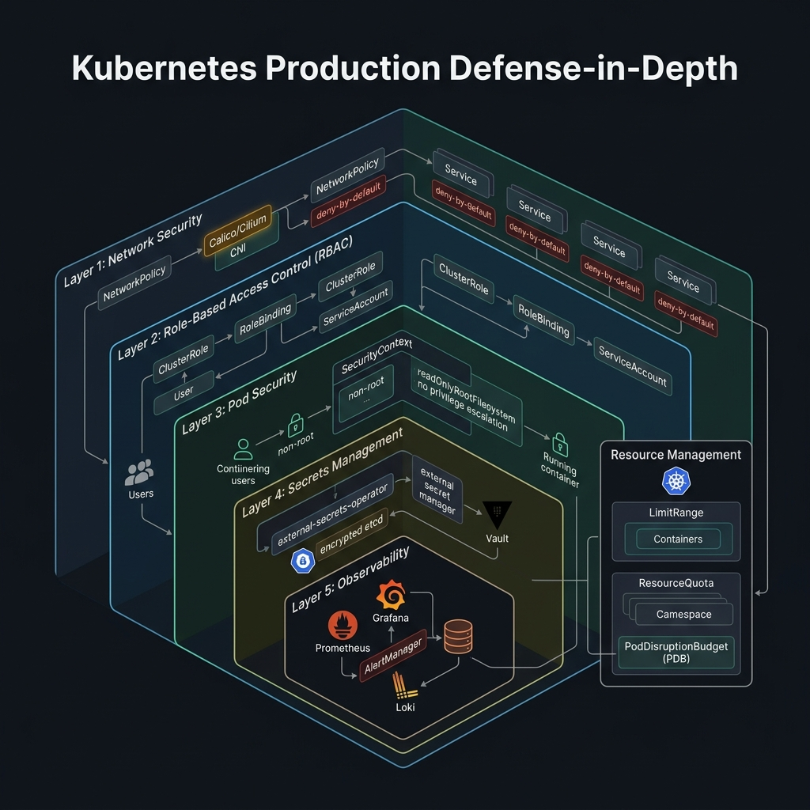

<!-- tags: kubernetes, k8s, production, best-practice -->
# 🛡️ Production Hardening

> Security, monitoring, and best practices checklist before going live.

| Aspect           | Detail                                                        |
| ---------------- | ------------------------------------------------------------- |
| **K8s Objects**  | `RBAC`, `NetworkPolicy`, `PodSecurityPolicy`, `ResourceQuota` |
| **Use case**     | Security, observability, reliability for production           |
| **Go relevance** | Secure Go apps in K8s environment                             |
| **Tools**        | Prometheus, Grafana, Loki, Falco                              |

📅 Created: 2026-03-20 · 🔄 Updated: 2026-04-20 · ⏱️ 15 min read

---

## 1. DEFINE

Picture Kubernetes sounding powerful until the day the cluster takes real traffic, real quotas, and real incidents. The production lane is where decisions about resources, security, and operability start costing real money if done carelessly.

### Production Checklist

| Category          | Item                           | Priority    |
| ----------------- | ------------------------------ | ----------- |
| **Security**      | RBAC — least privilege         | 🔴 Critical |
| **Security**      | NetworkPolicy — zero trust     | 🔴 Critical |
| **Security**      | Pod Security Standards         | 🔴 Critical |
| **Security**      | Image scanning (Trivy)         | 🟡 High     |
| **Reliability**   | Resource limits on every Pod   | 🔴 Critical |
| **Reliability**   | PodDisruptionBudget            | 🟡 High     |
| **Reliability**   | Anti-affinity rules            | 🟡 High     |
| **Observability** | Prometheus metrics             | 🔴 Critical |
| **Observability** | Structured logging (JSON)      | 🟡 High     |
| **Observability** | Distributed tracing            | 🟢 Medium   |

### RBAC (Role-Based Access Control)

| Object                 | Scope        | Description                       |
| ---------------------- | ------------ | --------------------------------- |
| **Role**               | Namespace    | Permissions within 1 namespace    |
| **ClusterRole**        | Cluster-wide | Permissions across entire cluster |
| **RoleBinding**        | Namespace    | Bind Role to user/group           |
| **ClusterRoleBinding** | Cluster-wide | Bind ClusterRole to user/group    |
| **ServiceAccount**     | Namespace    | Identity for Pods                 |

### Pod Security Standards

| Level          | Description                    | Use case                       |
| -------------- | ------------------------------ | ------------------------------ |
| **Privileged** | No restrictions                | System-level pods (monitoring) |
| **Baseline**   | Prevent privilege escalation   | Default for most apps          |
| **Restricted** | Most hardened                  | Sensitive workloads            |

### Failure Modes

| Mistake                | Cause                                   | Consequence                        |
| ---------------------- | --------------------------------------- | ---------------------------------- |
| RBAC too broad         | `ClusterAdmin` for every ServiceAccount | Compromise 1 pod → entire cluster  |
| No NetworkPolicy       | Default allow-all                       | Lateral movement is easy           |
| No resource limits     | 1 Pod consumes all resources            | Node pressure → evictions          |
| No PDB                 | Node drain → all pods down              | Downtime                           |

---

Those failure modes sound basic. But there is a trap: a pod getting Evicted because the node ran out of memory means an unexpected service outage, and not setting PDB means a rolling update kills too many pods. That trap appears in PITFALLS.

## 2. VISUAL

The concept has a name. In the diagram, the critical part emerges: how five security layers stack to create defense-in-depth for production workloads.



### Defense-in-Depth Architecture

```text
┌─────────────────────────────────────────────────────────────┐
│                     PRODUCTION CLUSTER                       │
│                                                              │
│  ┌─────────────────────────────────────────────────────┐    │
│  │  Layer 1: NETWORK                                    │    │
│  │  ┌──────────────┐  ┌────────────────────────────┐   │    │
│  │  │ NetworkPolicy│  │ Ingress + WAF              │   │    │
│  │  │ (Zero Trust) │  │ (Rate limit, CORS, TLS)    │   │    │
│  │  └──────────────┘  └────────────────────────────┘   │    │
│  └─────────────────────────────────────────────────────┘    │
│                                                              │
│  ┌─────────────────────────────────────────────────────┐    │
│  │  Layer 2: IDENTITY & ACCESS                          │    │
│  │  ┌────────────┐  ┌──────────────┐  ┌─────────────┐ │    │
│  │  │ RBAC       │  │ ServiceAccount│  │ Secret Mgmt │ │    │
│  │  │ Least priv │  │ Per-app SA    │  │ Vault/ESO   │ │    │
│  │  └────────────┘  └──────────────┘  └─────────────┘ │    │
│  └─────────────────────────────────────────────────────┘    │
│                                                              │
│  ┌─────────────────────────────────────────────────────┐    │
│  │  Layer 3: WORKLOAD                                   │    │
│  │  ┌──────────────┐  ┌────────────┐  ┌─────────────┐ │    │
│  │  │ Pod Security │  │ Resource   │  │ Image Scan  │ │    │
│  │  │ Standards    │  │ Limits     │  │ (Trivy)     │ │    │
│  │  └──────────────┘  └────────────┘  └─────────────┘ │    │
│  └─────────────────────────────────────────────────────┘    │
│                                                              │
│  ┌─────────────────────────────────────────────────────┐    │
│  │  Layer 4: OBSERVABILITY                              │    │
│  │  ┌────────────┐  ┌──────────┐  ┌─────────────────┐ │    │
│  │  │ Prometheus │  │ Grafana  │  │ Alert Manager   │ │    │
│  │  │ Metrics    │  │ Dashboard│  │ PagerDuty/Slack │ │    │
│  │  └────────────┘  └──────────┘  └─────────────────┘ │    │
│  └─────────────────────────────────────────────────────┘    │
└─────────────────────────────────────────────────────────────┘
```

*Figure: Defense-in-depth with four layers — Network, Identity & Access, Workload, and Observability.*

---

## 3. CODE

### Example 1: Basic — RBAC + ServiceAccount for Go app

> **Goal**: Create a dedicated ServiceAccount, restrict to least privilege
> **Requires**: K8s cluster
> **Outcome**: Least-privilege access, no default ServiceAccount usage

```yaml
# k8s/rbac.yaml
---
# ✅ Dedicated ServiceAccount for Go API
apiVersion: v1
kind: ServiceAccount
metadata:
    name: go-api-sa
    namespace: production
    labels:
        app: go-api
automountServiceAccountToken: false # ⚠️ Do not mount token unless K8s API needed
---
# ✅ Role — only allow reading specific ConfigMaps and Secrets
apiVersion: rbac.authorization.k8s.io/v1
kind: Role
metadata:
    name: go-api-role
    namespace: production
rules:
    - apiGroups: ['']
      resources: ['configmaps']
      verbs: ['get', 'list', 'watch'] # ✅ Read-only
      resourceNames: ['app-config'] # ✅ Only specific ConfigMap
    - apiGroups: ['']
      resources: ['secrets']
      verbs: ['get']
      resourceNames: ['db-credentials']
---
# ✅ Bind Role → ServiceAccount
apiVersion: rbac.authorization.k8s.io/v1
kind: RoleBinding
metadata:
    name: go-api-binding
    namespace: production
subjects:
    - kind: ServiceAccount
      name: go-api-sa
      namespace: production
roleRef:
    kind: Role
    name: go-api-role
    apiGroup: rbac.authorization.k8s.io
---
# ✅ Deployment using dedicated ServiceAccount
apiVersion: apps/v1
kind: Deployment
metadata:
    name: go-api
    namespace: production
spec:
    replicas: 3
    selector:
        matchLabels:
            app: go-api
    template:
        metadata:
            labels:
                app: go-api
        spec:
            serviceAccountName: go-api-sa # ✅ Use dedicated SA
            automountServiceAccountToken: false
            securityContext:
                runAsNonRoot: true # ✅ Do not run as root
                runAsUser: 65534 # nobody
                runAsGroup: 65534
                fsGroup: 65534
                seccompProfile:
                    type: RuntimeDefault
            containers:
                - name: api
                  image: go-api:v1
                  securityContext:
                      allowPrivilegeEscalation: false # ✅ Block privilege escalation
                      readOnlyRootFilesystem: true # ✅ Read-only filesystem
                      capabilities:
                          drop: ['ALL'] # ✅ Drop all Linux capabilities
                  ports:
                      - containerPort: 8080
                  resources:
                      requests: { memory: '128Mi', cpu: '200m' }
                      limits: { memory: '256Mi', cpu: '500m' }
                  volumeMounts:
                      - name: tmp
                        mountPath: /tmp
            volumes:
                - name: tmp
                  emptyDir: {}
```

> **✅ Outcome**: Go app runs non-root, no privilege escalation, read-only filesystem, least-privilege RBAC.
> **⚠️ Note**: `readOnlyRootFilesystem: true` requires the Go app not to write to container root.

---

### Example 2: Intermediate — NetworkPolicy + Monitoring

> **Goal**: Zero-trust networking + Prometheus monitoring
> **Requires**: Calico/Cilium CNI, Prometheus
> **Outcome**: Defense-in-depth networking, full observability

```yaml
# k8s/network-policy.yaml
---
# ✅ Default deny all — zero trust
apiVersion: networking.k8s.io/v1
kind: NetworkPolicy
metadata:
    name: default-deny-all
    namespace: production
spec:
    podSelector: {} # ✅ Applies to ALL pods
    policyTypes:
        - Ingress
        - Egress
---
# ✅ Allow Go API to receive traffic from Ingress Controller
apiVersion: networking.k8s.io/v1
kind: NetworkPolicy
metadata:
    name: allow-go-api-ingress
    namespace: production
spec:
    podSelector:
        matchLabels:
            app: go-api
    policyTypes:
        - Ingress
    ingress:
        - from:
              - namespaceSelector:
                    matchLabels:
                        name: ingress-nginx
          ports:
              - port: 8080
                protocol: TCP
---
# ✅ Allow Go API to call PostgreSQL + Redis
apiVersion: networking.k8s.io/v1
kind: NetworkPolicy
metadata:
    name: allow-go-api-egress
    namespace: production
spec:
    podSelector:
        matchLabels:
            app: go-api
    policyTypes:
        - Egress
    egress:
        - to: []
          ports:
              - port: 53
                protocol: UDP
              - port: 53
                protocol: TCP
        - to:
              - podSelector:
                    matchLabels:
                        app: postgres
          ports:
              - port: 5432
        - to:
              - podSelector:
                    matchLabels:
                        app: redis
          ports:
              - port: 6379
```

```go
// monitoring/metrics.go — Prometheus metrics + middleware
package monitoring

import (
	"net/http"
	"strconv"
	"time"

	"github.com/prometheus/client_golang/prometheus"
	"github.com/prometheus/client_golang/prometheus/promauto"
	"github.com/prometheus/client_golang/prometheus/promhttp"
)

var (
	httpRequestsTotal = promauto.NewCounterVec(
		prometheus.CounterOpts{
			Namespace: "go_api",
			Name:      "http_requests_total",
			Help:      "Total HTTP requests by method, path, status",
		},
		[]string{"method", "path", "status"},
	)

	httpRequestDuration = promauto.NewHistogramVec(
		prometheus.HistogramOpts{
			Namespace: "go_api",
			Name:      "http_request_duration_seconds",
			Help:      "HTTP request duration in seconds",
			Buckets:   []float64{.005, .01, .025, .05, .1, .25, .5, 1, 2.5, 5},
		},
		[]string{"method", "path"},
	)

	httpRequestsInFlight = promauto.NewGauge(
		prometheus.GaugeOpts{
			Namespace: "go_api",
			Name:      "http_requests_in_flight",
			Help:      "Current in-flight HTTP requests",
		},
	)
)

// ✅ Prometheus metrics middleware
func MetricsMiddleware(next http.Handler) http.Handler {
	return http.HandlerFunc(func(w http.ResponseWriter, r *http.Request) {
		start := time.Now()
		httpRequestsInFlight.Inc()
		defer httpRequestsInFlight.Dec()

		wrapped := &responseWriter{ResponseWriter: w, statusCode: http.StatusOK}
		next.ServeHTTP(wrapped, r)

		duration := time.Since(start).Seconds()
		status := strconv.Itoa(wrapped.statusCode)

		httpRequestsTotal.WithLabelValues(r.Method, r.URL.Path, status).Inc()
		httpRequestDuration.WithLabelValues(r.Method, r.URL.Path).Observe(duration)
	})
}

type responseWriter struct {
	http.ResponseWriter
	statusCode int
}

func (rw *responseWriter) WriteHeader(code int) {
	rw.statusCode = code
	rw.ResponseWriter.WriteHeader(code)
}

func Handler() http.Handler {
	return promhttp.Handler()
}
```

```yaml
# k8s/servicemonitor.yaml — Prometheus ServiceMonitor
apiVersion: monitoring.coreos.com/v1
kind: ServiceMonitor
metadata:
    name: go-api
    namespace: production
    labels:
        release: prometheus
spec:
    selector:
        matchLabels:
            app: go-api
    endpoints:
        - port: http
          path: /metrics
          interval: 15s
    namespaceSelector:
        matchNames:
            - production
```

> **✅ Outcome**: Zero-trust networking + full Prometheus observability.
> **⚠️ Note**: Default deny → all traffic blocked. Add allow rules for each connection.

---

### Example 3: Advanced — Structured Logging + Alerting

> **Goal**: JSON structured logging for K8s, Grafana alerts
> **Requires**: Go structured logger, Prometheus AlertManager
> **Outcome**: Production-grade observability stack

```go
// logger/logger.go — Production structured logger
package logger

import (
	"context"
	"log/slog"
	"os"
	"runtime"
	"time"
)

// ✅ K8s-aware logger — includes pod metadata
func New() *slog.Logger {
	opts := &slog.HandlerOptions{
		Level: parseLevel(os.Getenv("LOG_LEVEL")),
		ReplaceAttr: func(groups []string, a slog.Attr) slog.Attr {
			if a.Key == slog.TimeKey {
				a.Key = "@timestamp"
				a.Value = slog.StringValue(time.Now().UTC().Format(time.RFC3339Nano))
			}
			return a
		},
	}
	handler := slog.NewJSONHandler(os.Stdout, opts)
	return slog.New(handler).With(
		slog.String("service", os.Getenv("SERVICE_NAME")),
		slog.String("version", os.Getenv("APP_VERSION")),
		slog.String("pod", os.Getenv("POD_NAME")),
		slog.String("namespace", os.Getenv("POD_NAMESPACE")),
		slog.String("node", os.Getenv("NODE_NAME")),
		slog.String("go_version", runtime.Version()),
	)
}

func parseLevel(level string) slog.Level {
	switch level {
	case "debug": return slog.LevelDebug
	case "warn":  return slog.LevelWarn
	case "error": return slog.LevelError
	default:      return slog.LevelInfo
	}
}

func FromContext(ctx context.Context) *slog.Logger {
	if l, ok := ctx.Value("logger").(*slog.Logger); ok {
		return l
	}
	return slog.Default()
}
```

```yaml
# k8s/alerts.yaml — Prometheus AlertManager rules
apiVersion: monitoring.coreos.com/v1
kind: PrometheusRule
metadata:
    name: go-api-alerts
    namespace: production
spec:
    groups:
        - name: go-api.rules
          rules:
              - alert: HighErrorRate
                expr: |
                    sum(rate(go_api_http_requests_total{status=~"5.."}[5m]))
                    / sum(rate(go_api_http_requests_total[5m])) > 0.05
                for: 5m
                labels:
                    severity: critical
                annotations:
                    summary: 'High error rate (> 5%)'
              - alert: HighLatency
                expr: |
                    histogram_quantile(0.95,
                      sum(rate(go_api_http_request_duration_seconds_bucket[5m])) by (le)
                    ) > 1
                for: 5m
                labels:
                    severity: warning
                annotations:
                    summary: 'P95 latency > 1s'
              - alert: PodRestarting
                expr: |
                    increase(kube_pod_container_status_restarts_total{
                      namespace="production", container="api"
                    }[1h]) > 3
                labels:
                    severity: warning
                annotations:
                    summary: 'Pod {{ $labels.pod }} restarted {{ $value }} times in 1h'
```

> **✅ Outcome**: JSON structured logging + Prometheus alerts for error rate, latency, restarts.
> **⚠️ Note**: JSON log format → parseable by Loki/ELK. Avoid `fmt.Println` — use `slog`.

---

## 4. PITFALLS

| #   | Mistake                                              | Consequence           | Fix                                                  |
| --- | ---------------------------------------------------- | --------------------- | ---------------------------------------------------- |
| 1   | Using `default` ServiceAccount → too many permissions | Cluster compromise    | Create dedicated SA, `automountServiceAccountToken: false` |
| 2   | No NetworkPolicy → any pod talks to any pod           | Lateral movement      | Default deny + whitelist rules                       |
| 3   | Running as root in container                          | Container escape risk | `runAsNonRoot: true`, `runAsUser: 65534`             |
| 4   | `fmt.Println` logging → not searchable                | Debugging nightmare   | Use `slog` JSON structured logging                   |
| 5   | Alert fatigue — too many alerts                       | Real alerts ignored   | Tune thresholds, group similar alerts                |
| 6   | No PDB → node drain kills all pods                    | Downtime              | `PodDisruptionBudget: minAvailable: 2`               |

---

## 5. REF

| Resource                    | Link                                                                                                                     |
| --------------------------- | ------------------------------------------------------------------------------------------------------------------------ |
| K8s Security Best Practices | [kubernetes.io/docs/concepts/security](https://kubernetes.io/docs/concepts/security/)                                     |
| RBAC                        | [kubernetes.io/docs/reference/access-authn-authz/rbac](https://kubernetes.io/docs/reference/access-authn-authz/rbac/)     |
| NetworkPolicy               | [kubernetes.io/docs/concepts/services-networking/network-policies](https://kubernetes.io/docs/concepts/services-networking/network-policies/) |
| kube-prometheus-stack       | [github.com/prometheus-community/helm-charts](https://github.com/prometheus-community/helm-charts/tree/main/charts/kube-prometheus-stack) |
| Go slog                     | [pkg.go.dev/log/slog](https://pkg.go.dev/log/slog)                                                                       |
| Falco                       | [falco.org](https://falco.org/)                                                                                           |

---

## 6. RECOMMEND

| Extension          | When                | Reason                                               |
| ------------------ | ------------------- | ---------------------------------------------------- |
| **Falco**          | Runtime security    | Detect anomalous container behavior                  |
| **OPA/Gatekeeper** | Policy engine       | Enforce org policies (no latest tag, resource limits) |
| **Cilium**         | Advanced networking | eBPF-based NetworkPolicy, L7 filtering               |
| **OpenTelemetry**  | Distributed tracing | End-to-end request tracing                           |
| **Velero**         | Disaster recovery   | Cluster backup + restore                             |
| **Kubescape**      | Security scanning   | NSA/MITRE framework compliance                       |

---

## 🔍 Debug Checklist

| # | Symptom | Cause | Debug Command |
|---|---------|-------|---------------|
| 1 | Pod `Evicted` | Node out of memory/disk → kubelet evicts low-priority pods | `kubectl describe node <node>` → check Conditions |
| 2 | Node `MemoryPressure` or `DiskPressure` | No resource limits → 1 pod consumes all | `kubectl top pods -A --sort-by=memory` |
| 3 | Pod `OOMKilled` in production | `memory limit` too low for actual usage | `kubectl describe pod <pod>` → increase limits |
| 4 | RBAC `Forbidden` when app calls K8s API | ServiceAccount lacks permissions | `kubectl auth can-i <verb> <resource> --as=system:serviceaccount:<ns>:<sa>` |
| 5 | Network traffic blocked after adding NetworkPolicy | Default deny blocks legitimate traffic | `kubectl describe networkpolicy -n <ns>` |
| 6 | Node drain fails during maintenance | PDB does not allow drain | `kubectl get pdb -n <ns>` |
| 7 | Alert firing continuously (alert fatigue) | Threshold too low or query wrong | Check: `kubectl get prometheusrule -n <ns>` |

---

## 🃏 Quick Reference

| # | Pattern | Command / Rule |
|---|---------|----------------|
| 1 | Create PodDisruptionBudget | `minAvailable: 2` or `maxUnavailable: 1` |
| 2 | View PDB status | `kubectl get pdb -n <ns>` |
| 3 | Resource quota for namespace | `kubectl create quota <name> --hard=pods=50,cpu=10,memory=20Gi` |
| 4 | Run non-root in container | `securityContext: {runAsNonRoot: true, runAsUser: 65534}` |
| 5 | Read-only filesystem | `securityContext: {readOnlyRootFilesystem: true}` |
| 6 | Drop all Linux capabilities | `securityContext: {capabilities: {drop: [ALL]}}` |
| 7 | View Node resource pressure | `kubectl describe node <node> \| grep -A5 Conditions` |
| 8 | Check RBAC permissions | `kubectl auth can-i list pods --as=system:serviceaccount:default:my-sa` |

---

## 🎯 Interview Angle

**Relevant system design / technical questions:**
- *"What does your production readiness checklist include? How do you prioritize?"*
- *"What problem does PodDisruptionBudget solve? When is it necessary?"*
- *"Why should containers not run as root? What are the security layers in K8s?"*

**Points the interviewer wants to hear:**

| Topic | Talking Point |
|-------|---------------|
| PodDisruptionBudget | Ensures minimum N pods available during voluntary disruption (node drain, rolling update) |
| Node affinity vs Taints | Affinity: pod wants/must run on labeled nodes; Taints: node repels pods unless tolerated |
| Defense-in-depth | Network → Identity → Workload → Observability; each layer independently limits blast radius |
| Resource limits in prod | `requests` = scheduling guarantee; `limits` = cap; missing → noisy neighbor evictions |
| Observability pillars | Metrics (Prometheus) + Logs (Loki/ELK) + Traces (Jaeger/Tempo) — all 3 needed |
| Non-root container | Root in container = root on host if escape; `runAsNonRoot` + `readOnlyRootFilesystem` reduces attack surface |

**Common follow-up questions:**
- *"If DB is breached in K8s, how does lateral movement happen without NetworkPolicy?"* → Default allow-all → compromised pod can call any service in the cluster.
- *"How do ResourceQuota and LimitRange differ?"* → ResourceQuota: limits total namespace resources; LimitRange: sets default/max per pod/container.
- *"What is Falco?"* → Runtime security — detects anomalous container behavior based on syscall events.

---

**Links**: [← CI/CD Pipeline](./09-cicd-pipeline.md) · [→ Deployment Strategies](./11-deployment-strategies.md) · [← README](./README.md)
