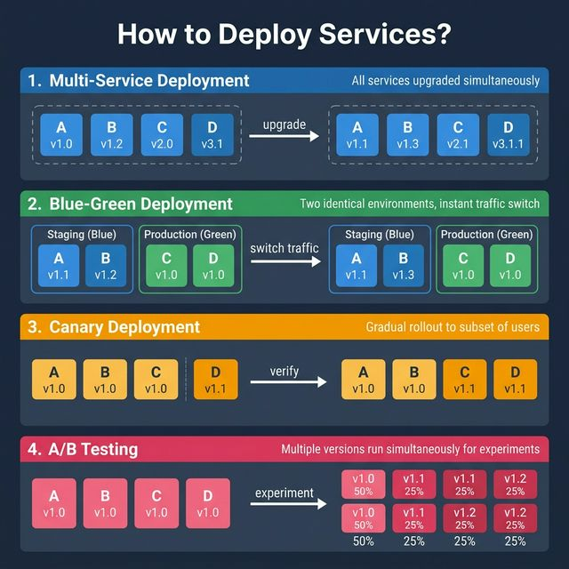
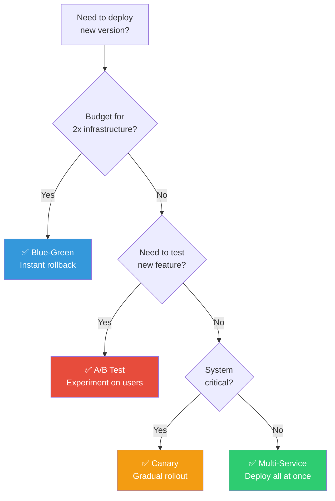

<!-- tags: kubernetes, k8s, deployments, canary -->
# 🚀 Deployment Strategies

> Deploying or upgrading services is risky. Understanding deployment strategies helps reduce risk, enable fast rollback, and ensure zero-downtime for production.

📅 Created: 2026-03-22 · 🔄 Updated: 2026-04-20 · ⏱️ 12 min read

| Aspect          | Detail                                                  |
| --------------- | ------------------------------------------------------- |
| **Complexity**  | 🌟🌟🌟                                                  |
| **K8s Objects** | `Deployment`, `Service`, `Ingress`, `HPA`               |
| **Use case**    | Zero-downtime deployments, risk mitigation, A/B testing |
| **Tools**       | kubectl, Argo Rollouts, Flagger, Istio                  |

---

## 1. DEFINE

Picture a rollout that rarely fails because of missing YAML; it fails because the controller holds a desired state different from what the team thinks. Deployment only becomes worth understanding when you see it as a state guardian rather than a long manifest.

Each deployment strategy solves the same problem: **how do you update a service without affecting users?** No strategy is perfect — each has trade-offs around cost, complexity, and rollback speed.

| #   | Strategy          | How it works                               | Advantage                  | Disadvantage                                 |
| --- | ----------------- | ------------------------------------------ | -------------------------- | -------------------------------------------- |
| 1   | **Multi-Service** | Deploy all services at once                | Simple, fast               | Hard to rollback, hard to test dependencies  |
| 2   | **Blue-Green**    | 2 identical environments, switch traffic   | Instant rollback           | Double cost (2x infrastructure)              |
| 3   | **Canary**        | Gradual upgrade, one subset at a time      | Low cost, easy rollback    | Must test on production, more complex        |
| 4   | **A/B Test**      | Multiple versions running, experiment      | Cheap, test features live  | Needs tight control, risk pushing wrong features |

### Detailed Comparison

| Criteria            | Multi-Service |   Blue-Green    |  Canary  |   A/B Test    |
| ------------------- | :-----------: | :-------------: | :------: | :-----------: |
| **Rollback speed**  |    ❌ Slow    |   ✅ Instant    | ✅ Fast  | ⚠️ Medium     |
| **Cost**            |    ✅ Low     | ❌ High (2x env)| ✅ Low   |    ✅ Low     |
| **Complexity**      |  ✅ Simple    |  ⚠️ Medium      |  ⚠️ High |    ❌ High    |
| **Risk**            |    ❌ High    |     ✅ Low      | ✅ Low   | ⚠️ Medium     |
| **Test on prod**    |     No        |      No         |  ✅ Yes  |     ✅ Yes    |

---

Those failure modes sound familiar. But there is a trap: canary based on pod ratio is not the same as % of requests — traffic split is wrong, and blue-green without health checks means a failed cut-over. That trap appears in PITFALLS.

## 2. VISUAL



### Decision Flowchart: Choosing a Deployment Strategy



*Core idea: Production-critical systems should use Canary or Blue-Green. A/B Test when experimentation is needed. Multi-Service is only suitable for staging/dev environments.*

---

## 3. CODE

### 1. Rolling Update — K8s Default Strategy

K8s defaults to Rolling Update — gradually replacing old pods with new ones.

```yaml
# k8s/deployment-rolling.yaml
apiVersion: apps/v1
kind: Deployment
metadata:
    name: go-api
    namespace: production
spec:
    replicas: 4
    strategy:
        type: RollingUpdate
        rollingUpdate:
            maxSurge: 1 # Max 1 extra pod created
            maxUnavailable: 0 # No pod allowed down → zero-downtime
    selector:
        matchLabels:
            app: go-api
    template:
        metadata:
            labels:
                app: go-api
                version: v1.2.0
        spec:
            containers:
                - name: api
                  image: go-api:v1.2.0
                  ports:
                      - containerPort: 8080
                  readinessProbe: # ✅ K8s only routes traffic when pod is ready
                      httpGet:
                          path: /healthz
                          port: 8080
                      initialDelaySeconds: 5
                      periodSeconds: 10
                  livenessProbe:
                      httpGet:
                          path: /healthz
                          port: 8080
                      initialDelaySeconds: 15
                      periodSeconds: 20
                  resources:
                      requests: { memory: '128Mi', cpu: '200m' }
                      limits: { memory: '256Mi', cpu: '500m' }
```

```bash
# Deploy and watch rolling update
kubectl apply -f k8s/deployment-rolling.yaml
kubectl rollout status deployment/go-api -w

# Rollback if issues arise
kubectl rollout undo deployment/go-api
kubectl rollout history deployment/go-api
```

Rolling update is covered. But instant switch needs blue-green — time to deploy.

### 2. Blue-Green Deployment with K8s Services

```yaml
# k8s/blue-green/blue-deployment.yaml — Blue (v1.0)
apiVersion: apps/v1
kind: Deployment
metadata:
    name: go-api-blue
spec:
    replicas: 3
    selector:
        matchLabels:
            app: go-api
            version: blue
    template:
        metadata:
            labels:
                app: go-api
                version: blue
        spec:
            containers:
                - name: api
                  image: go-api:v1.0.0
                  ports:
                      - containerPort: 8080
---
# k8s/blue-green/green-deployment.yaml — Green (v1.1)
apiVersion: apps/v1
kind: Deployment
metadata:
    name: go-api-green
spec:
    replicas: 3
    selector:
        matchLabels:
            app: go-api
            version: green
    template:
        metadata:
            labels:
                app: go-api
                version: green
        spec:
            containers:
                - name: api
                  image: go-api:v1.1.0
                  ports:
                      - containerPort: 8080
---
# k8s/blue-green/service.yaml — Switch traffic via selector
apiVersion: v1
kind: Service
metadata:
    name: go-api
spec:
    selector:
        app: go-api
        version: blue # ← Change to "green" to switch traffic
    ports:
        - port: 80
          targetPort: 8080
```

```bash
# Switch traffic from blue → green (instant rollback = switch back)
kubectl patch service go-api -p '{"spec":{"selector":{"version":"green"}}}'

# Instant rollback
kubectl patch service go-api -p '{"spec":{"selector":{"version":"blue"}}}'
```

Blue-green is covered. But gradual traffic needs canary — time to split.

### 3. Canary Deployment with Argo Rollouts

```yaml
# k8s/canary/rollout.yaml — Argo Rollouts Canary Strategy
apiVersion: argoproj.io/v1alpha1
kind: Rollout
metadata:
    name: go-api
spec:
    replicas: 5
    strategy:
        canary:
            steps:
                - setWeight: 10 # ✅ Step 1: 10% traffic to new version
                - pause:
                      duration: 5m # Wait 5 minutes, monitor metrics
                - setWeight: 30 # ✅ Step 2: 30% traffic
                - pause:
                      duration: 5m
                - setWeight: 60 # ✅ Step 3: 60% traffic
                - pause:
                      duration: 5m
                - setWeight: 100 # ✅ Step 4: 100% traffic → done
            canaryService: go-api-canary
            stableService: go-api-stable
            trafficRouting:
                nginx:
                    stableIngress: go-api-ingress
    selector:
        matchLabels:
            app: go-api
    template:
        metadata:
            labels:
                app: go-api
        spec:
            containers:
                - name: api
                  image: go-api:v1.2.0
                  ports:
                      - containerPort: 8080
```

```bash
# Watch canary rollout
kubectl argo rollouts get rollout go-api -w

# Promote (skip remaining steps → 100%)
kubectl argo rollouts promote go-api

# Abort (rollback to stable)
kubectl argo rollouts abort go-api
```

### 4. Go: Health Check Server for Deployment Strategies

```go
package main

import (
    "encoding/json"
    "log"
    "net/http"
    "os"
    "sync/atomic"
    "time"
)

var (
    healthy   int32 = 1 // Atomic flag for readiness
    version         = os.Getenv("APP_VERSION")
    startTime       = time.Now()
)

type HealthResponse struct {
    Status  string `json:"status"`
    Version string `json:"version"`
    Uptime  string `json:"uptime"`
}

// /healthz — Liveness probe: is the app still alive?
func livenessHandler(w http.ResponseWriter, r *http.Request) {
    w.WriteHeader(http.StatusOK)
    json.NewEncoder(w).Encode(HealthResponse{
        Status:  "alive",
        Version: version,
        Uptime:  time.Since(startTime).String(),
    })
}

// /readyz — Readiness probe: is the app ready to serve traffic?
func readinessHandler(w http.ResponseWriter, r *http.Request) {
    if atomic.LoadInt32(&healthy) == 0 {
        w.WriteHeader(http.StatusServiceUnavailable)
        json.NewEncoder(w).Encode(HealthResponse{Status: "not ready"})
        return
    }
    w.WriteHeader(http.StatusOK)
    json.NewEncoder(w).Encode(HealthResponse{
        Status:  "ready",
        Version: version,
    })
}

// SetUnhealthy — Call before graceful shutdown
// K8s will stop routing traffic to this pod
func SetUnhealthy() {
    atomic.StoreInt32(&healthy, 0)
}

func main() {
    mux := http.NewServeMux()
    mux.HandleFunc("/healthz", livenessHandler)
    mux.HandleFunc("/readyz", readinessHandler)
    mux.HandleFunc("/", func(w http.ResponseWriter, r *http.Request) {
        json.NewEncoder(w).Encode(map[string]string{
            "message": "Hello from " + version,
        })
    })

    log.Printf("Starting server v%s on :8080", version)
    log.Fatal(http.ListenAndServe(":8080", mux))
}
```

---

You have walked through rolling, canary, and blue-green. Now comes the dangerous part: wrong traffic split and unhealthy cut-over — the trap set up from the beginning.

## 4. PITFALLS

| #   | Mistake                                  | Consequence                                                | Fix                                                                          |
| --- | ---------------------------------------- | ---------------------------------------------------------- | ---------------------------------------------------------------------------- |
| 1   | **No readiness probe**                   | K8s routes traffic to unready pods → users get 502/503     | Always configure readinessProbe. Ensure endpoint checks dependencies.        |
| 2   | **Blue-Green: forget to cleanup old env** | 2x cost runs forever, serious cloud billing waste          | Script auto-scale-down old env after verification. Set TTL reminder.         |
| 3   | **Canary: no metric monitoring**          | Push 100% traffic to buggy version unknowingly → outage    | Integrate Prometheus metrics into canary steps. Auto-rollback on threshold.  |
| 4   | **Rolling update maxUnavailable > 0**     | Pods killed before new ones ready → reduced capacity       | Set `maxUnavailable: 0` and `maxSurge: 1` to ensure full capacity.          |
| 5   | **A/B Test: feature flag leak**           | Unfinished feature pushed to 100% users due to bad config  | Use feature flag service (LaunchDarkly, Unleash). Default off. Explicit opt-in. |

---

## 5. REF

| Resource                       | Link                                                                                                 |
| ------------------------------ | ---------------------------------------------------------------------------------------------------- |
| K8s Deployment Strategies      | [kubernetes.io/docs](https://kubernetes.io/docs/concepts/workloads/controllers/deployment/#strategy) |
| Argo Rollouts                  | [argoproj.github.io](https://argoproj.github.io/argo-rollouts/)                                      |
| Flagger (Progressive Delivery) | [flagger.app](https://flagger.app/)                                                                  |
| Istio Traffic Management       | [istio.io/docs](https://istio.io/latest/docs/concepts/traffic-management/)                           |

---

## 6. RECOMMEND

| Extension           | When                         | Reason                                                                             |
| ------------------- | ---------------------------- | ---------------------------------------------------------------------------------- |
| **Argo Rollouts**   | Production canary/blue-green | Dedicated controller for progressive delivery in K8s with metrics analysis.        |
| **Flagger + Istio** | Service mesh environments    | Canary automation with traffic splitting via Istio VirtualService.                 |
| **GitOps (ArgoCD)** | Audit trail for deployments  | Every deployment change goes through Git → traceable, reviewable, rollbackable.    |
| **Feature Flags**   | Large-scale A/B Testing      | Separate deployment from release — deploy new code but only enable for subset users. |

---

## 🔍 Debug Checklist

| # | Symptom | Cause | Debug Command |
|---|---------|-------|---------------|
| 1 | Canary does not split traffic correctly | K8s native canary is based on pod ratio, not % of requests | Count pods: 9 stable + 1 canary = 10% traffic; use Argo Rollouts for precise % |
| 2 | Blue-green switchover fails | Service selector not updated | `kubectl get svc <name> -o yaml` check `selector.version` |
| 3 | Rolling update reduces capacity | `maxUnavailable > 0` — old pods killed before new ready | Set `maxUnavailable: 0`, `maxSurge: 1` |
| 4 | Argo Rollouts canary stuck at step | Analysis metrics fail or pause not promoted | `kubectl argo rollouts get rollout <name>` check step status |
| 5 | Blue env still receives traffic after switch | Selector update delayed | `kubectl describe svc <name>` → Endpoints; `kubectl get endpoints <name>` |
| 6 | Canary does not auto-rollback on error rate spike | `AnalysisTemplate` not configured or Prometheus has no data | `kubectl describe analysisrun <name>` |
| 7 | A/B test feature leaks to all users | Feature flag service not checking user segment correctly | Check feature flag config; do not use K8s labels for A/B separation |

---

## 🃏 Quick Reference

| # | Pattern | Command / Rule |
|---|---------|----------------|
| 1 | Compare strategies | Blue-Green: instant rollback, 2x cost; Canary: cheap, gradual; Rolling: default, zero-downtime |
| 2 | Blue-green switch traffic | `kubectl patch svc go-api -p '{"spec":{"selector":{"version":"green"}}}'` |
| 3 | Blue-green rollback | `kubectl patch svc go-api -p '{"spec":{"selector":{"version":"blue"}}}'` |
| 4 | Canary promote (Argo Rollouts) | `kubectl argo rollouts promote <rollout>` |
| 5 | Canary abort / rollback | `kubectl argo rollouts abort <rollout>` |
| 6 | View rollout status | `kubectl argo rollouts get rollout <name> -w` |
| 7 | Rolling update zero-downtime | `strategy: {type: RollingUpdate, rollingUpdate: {maxSurge: 1, maxUnavailable: 0}}` |
| 8 | Rollback rolling update | `kubectl rollout undo deployment/<name>` |

---

## 🎯 Interview Angle

**Relevant system design / technical questions:**
- *"When do you choose Blue-Green over Canary? What are the trade-offs?"*
- *"How does K8s native canary (pod ratio) differ from Canary with Istio/Argo Rollouts?"*
- *"How do you implement automatic rollback when error rate increases during canary?"*

**Points the interviewer wants to hear:**

| Topic | Talking Point |
|-------|---------------|
| Blue-Green trade-off | Instant rollback (1 command) but 2x infrastructure cost; suitable when zero-risk rollback is needed and budget allows |
| Canary trade-off | Low cost (1-2 extra pods), tests on real traffic; but must monitor metrics, rollback not instant |
| K8s native canary | Based on pod count (1/10 = 10%); no precise % control; unusable with low replica counts |
| Argo Rollouts / Flagger | Dedicated controller; precise traffic % via Ingress/Istio; auto-analysis and rollback |
| Flagger + Prometheus | Configure metric threshold (error rate, latency); Flagger auto-promotes or rolls back based on analysis |
| Traffic shifting | Istio `VirtualService` weight; Nginx canary annotations; Gateway API HTTPRoute weight |

**Common follow-up questions:**
- *"How do you handle database schema migration during canary?"* → Need backward-compatible migrations; deploy migration first; both v1 and v2 must work with the new schema.
- *"What is shadow deployment?"* → Traffic mirror: send copy of requests to new version but don't use the response; test without affecting users.
- *"How do feature flags differ from canary?"* → Feature flags: separate deployment from release; canary: separate traffic between versions; combine both for maximum control.

---

← Previous: [Production Hardening](./10-production.md) · → Next: [Pod Lifecycle](./12-pod-lifecycle.md) · ← Back to [K8s Fundamental](./README.md)
