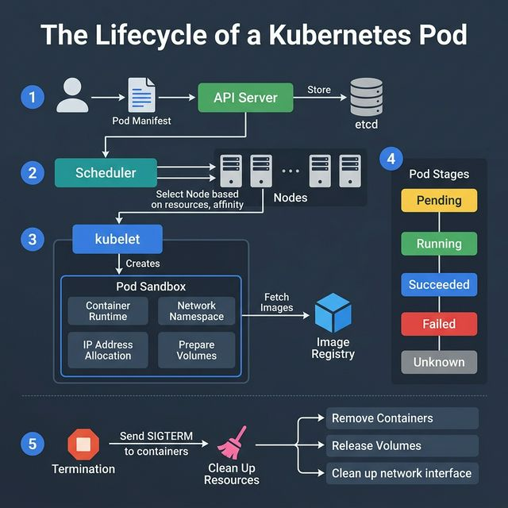
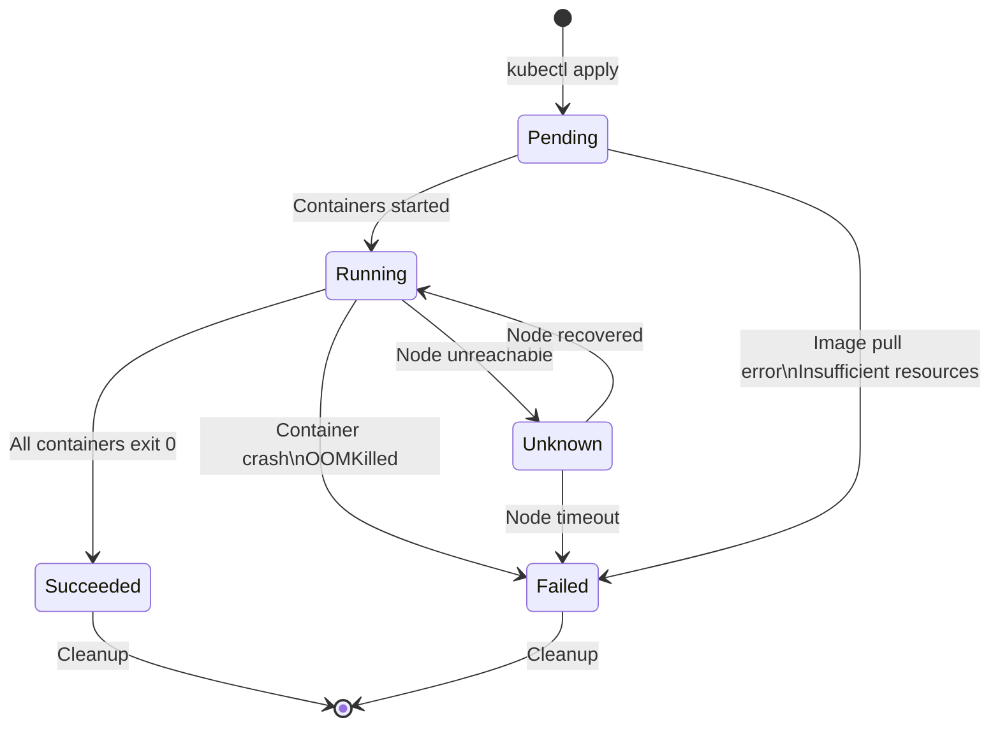
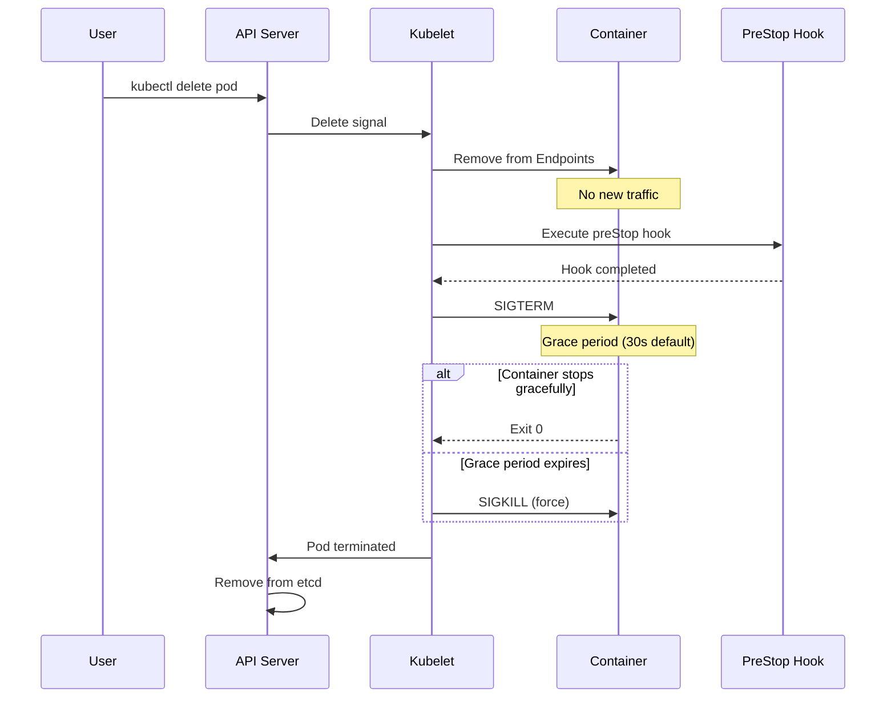

<!-- tags: kubernetes, k8s, pods, lifecycle -->
# ♻️ The Lifecycle of a Kubernetes Pod

> The Pod is the smallest unit in Kubernetes — understanding its lifecycle is foundational for debugging, optimizing, and operating production clusters.

📅 Created: 2026-03-22 · 🔄 Updated: 2026-04-20 · ⏱️ 20 min read

| Aspect         | Detail                                                                |
| -------------- | --------------------------------------------------------------------- |
| **Complexity** | 🌟🌟🌟🌟                                                              |
| **Use case**   | K8s operations, Debugging pods, Graceful shutdown, Health monitoring  |
| **Keywords**   | Pod lifecycle, kubelet, scheduler, probes, graceful shutdown, SIGTERM |

---

## 1. DEFINE

Picture the pod lifecycle looking like a few simple states on a diagram until a container restart loop, an init container block, or a forgotten termination grace period hits. This is the article about the real heartbeat of a workload.

### Pod Lifecycle — 7 Stages

| Step | Stage         | Component                   | Action                                                              |
| ---- | ------------- | --------------------------- | ------------------------------------------------------------------- |
| 1    | **Submit**    | API Server → etcd           | Pod manifest stored in cluster state                                |
| 2    | **Schedule**  | Scheduler                   | Select node based on resources, affinity, taints                    |
| 3    | **Prepare**   | kubelet                     | Create network namespace, assign IP, mount volumes, pull images     |
| 4    | **Run**       | kubelet + Container Runtime | Containers start, health probes begin                               |
| 5    | **Monitor**   | kubelet                     | Track phase: Pending → Running → Succeeded/Failed/Unknown           |
| 6    | **Terminate** | kubelet                     | Send SIGTERM → wait grace period → SIGKILL                          |
| 7    | **Cleanup**   | kubelet → API Server        | Remove containers, release volumes, clean network, delete from etcd |

### Pod Phases

| Phase         | Description                          | When?                                                  |
| ------------- | ------------------------------------ | ------------------------------------------------------ |
| **Pending**   | Pod accepted but not yet running     | Pulling images, scheduling, or waiting for volumes     |
| **Running**   | At least 1 container running         | Normal operation                                       |
| **Succeeded** | All containers exited with code 0    | Job/CronJob completed                                  |
| **Failed**    | At least 1 container exited non-zero | Application crash, OOMKilled                           |
| **Unknown**   | Cannot determine state               | Node communication lost                                |

### Container States

| State          | Description                                            |
| -------------- | ------------------------------------------------------ |
| **Waiting**    | Container has not started — pulling image, creating sandbox |
| **Running**    | Container is executing — process is active             |
| **Terminated** | Container has stopped — completed or crashed           |

---

Those failure modes are clear. But there is a trap: a pod stuck in Terminating because a finalizer has not been removed means a resource leak, and a preStop hook without enough time means requests get cut. That trap appears in PITFALLS.

## 2. VISUAL



### Full Lifecycle Flow

```text
User/CI-CD
  │
  │ kubectl apply -f pod.yaml
  ▼
┌──────────────┐     ┌────────┐
│  API Server  │────→│  etcd  │  ① Store pod manifest
└──────┬───────┘     └────────┘
       │
       ▼
┌──────────────┐     ┌─────────────────┐
│  Scheduler   │────→│ Select Best Node│  ② Evaluate resources,
└──────┬───────┘     │ • CPU/Memory    │     affinity, taints
       │             │ • Affinity      │
       │             │ • Taints        │
       │             └─────────────────┘
       ▼
┌──────────────┐
│   kubelet    │  ③ On selected node
└──────┬───────┘
       │
       ▼
┌─────────────────────────────────┐
│         Pod Sandbox             │
│  ┌──────────┐ ┌──────────────┐ │
│  │ Network  │ │   Volumes    │ │  ③ Create namespace,
│  │Namespace │ │   Mounted    │ │     assign IP, mount
│  └──────────┘ └──────────────┘ │
│  ┌──────────┐ ┌──────────────┐ │
│  │Container │ │  Container   │ │  ④ Pull images, start
│  │  App     │ │  Sidecar     │ │     containers
│  └──────────┘ └──────────────┘ │
└─────────────────────────────────┘
       │
       ▼
  Health Probes  ④ Liveness + Readiness
       │
       ▼
  Pod Phase: Running  ⑤
       │
       │ (delete / complete / crash)
       ▼
  SIGTERM → Grace Period → SIGKILL  ⑥
       │
       ▼
  Cleanup: Remove containers,   ⑦
  release volumes, clean network,
  remove from etcd
```

### Mermaid: Pod State Machine



### Graceful Shutdown Sequence



---

## 3. CODE

### 1. Go Application — Graceful Shutdown

```go
package main

import (
    "context"
    "fmt"
    "log/slog"
    "net/http"
    "os"
    "os/signal"
    "syscall"
    "time"
)

// ─── GRACEFUL SHUTDOWN ───
// Handle SIGTERM from Kubernetes properly
// 1. Stop accepting new requests
// 2. Finish in-flight requests
// 3. Close resources (DB, cache, queues)
// 4. Exit cleanly

func main() {
    mux := http.NewServeMux()

    // Health endpoints for K8s probes
    mux.HandleFunc("/healthz", func(w http.ResponseWriter, _ *http.Request) {
        w.WriteHeader(http.StatusOK)
        fmt.Fprintln(w, "ok")
    })

    mux.HandleFunc("/readyz", func(w http.ResponseWriter, _ *http.Request) {
        // ✅ Check dependencies (DB, cache, etc.)
        w.WriteHeader(http.StatusOK)
        fmt.Fprintln(w, "ready")
    })

    mux.HandleFunc("/", func(w http.ResponseWriter, r *http.Request) {
        // Simulate work
        time.Sleep(100 * time.Millisecond)
        fmt.Fprintf(w, "Hello from pod: %s\n", os.Getenv("HOSTNAME"))
    })

    server := &http.Server{
        Addr:         ":8080",
        Handler:      mux,
        ReadTimeout:  10 * time.Second,
        WriteTimeout: 30 * time.Second,
        IdleTimeout:  60 * time.Second,
    }

    // ✅ Start server in goroutine
    go func() {
        slog.Info("server starting", "addr", server.Addr)
        if err := server.ListenAndServe(); err != http.ErrServerClosed {
            slog.Error("server error", "err", err)
            os.Exit(1)
        }
    }()

    // ✅ Wait for SIGTERM (Kubernetes sends this)
    quit := make(chan os.Signal, 1)
    signal.Notify(quit, syscall.SIGTERM, syscall.SIGINT)
    sig := <-quit
    slog.Info("shutdown signal received", "signal", sig)

    // ✅ Grace period — finish in-flight requests
    ctx, cancel := context.WithTimeout(context.Background(), 25*time.Second)
    defer cancel()

    // Step 1: Stop accepting new connections
    if err := server.Shutdown(ctx); err != nil {
        slog.Error("server shutdown error", "err", err)
    }

    // Step 2: Close other resources
    // db.Close()
    // cache.Close()
    // queue.Close()

    slog.Info("server stopped gracefully")
}
```

Graceful shutdown code is covered. But the Pod manifest needs lifecycle hooks — time to configure.

### 2. Pod Manifest — Complete Example

```yaml
# pod-lifecycle-demo.yaml
apiVersion: v1
kind: Pod
metadata:
    name: lifecycle-demo
    labels:
        app: lifecycle-demo
spec:
    terminationGracePeriodSeconds: 30 # ⑥ Grace period for SIGTERM

    # ── Init Containers ──
    # Run before main containers (sequential)
    initContainers:
        - name: init-db-check
          image: busybox:1.36
          command: [
                  'sh',
                  '-c',
                  'until nc -z db-service 5432; do
                  echo "Waiting for DB...";
                  sleep 2;
                  done',
              ]

    # ── Main Containers ──
    containers:
        - name: app
          image: myapp:1.0.0
          ports:
              - containerPort: 8080
                name: http

          # ✅ Resource requests/limits (affects scheduling)
          resources:
              requests:
                  cpu: '100m'
                  memory: '128Mi'
              limits:
                  cpu: '500m'
                  memory: '512Mi'

          # ✅ Startup probe — for slow-starting apps
          startupProbe:
              httpGet:
                  path: /healthz
                  port: http
              failureThreshold: 30
              periodSeconds: 2

          # ✅ Liveness probe — is the app alive?
          livenessProbe:
              httpGet:
                  path: /healthz
                  port: http
              initialDelaySeconds: 5
              periodSeconds: 10
              failureThreshold: 3

          # ✅ Readiness probe — can it serve traffic?
          readinessProbe:
              httpGet:
                  path: /readyz
                  port: http
              initialDelaySeconds: 5
              periodSeconds: 5
              failureThreshold: 2

          # ✅ Lifecycle hooks
          lifecycle:
              postStart:
                  exec:
                      command: ['/bin/sh', '-c', "echo 'Pod started' >> /var/log/app.log"]
              preStop:
                  exec:
                      command: ['/bin/sh', '-c', 'sleep 5'] # Wait for traffic drain

          volumeMounts:
              - name: config
                mountPath: /etc/app/config
                readOnly: true
              - name: data
                mountPath: /var/data

        # ── Sidecar Container ──
        - name: log-shipper
          image: fluent/fluent-bit:2.2
          volumeMounts:
              - name: data
                mountPath: /var/data
                readOnly: true

    # ── Volumes ──
    volumes:
        - name: config
          configMap:
              name: app-config
        - name: data
          emptyDir: {}

    # ── Scheduling ──
    nodeSelector:
        kubernetes.io/os: linux
    tolerations:
        - key: 'workload'
          operator: 'Equal'
          value: 'production'
          effect: 'NoSchedule'
```

### 3. Pod Lifecycle Watcher — Go Client

```go
package main

import (
    "context"
    "fmt"
    "log/slog"
    "path/filepath"
    "time"

    corev1 "k8s.io/api/core/v1"
    metav1 "k8s.io/apimachinery/pkg/apis/meta/v1"
    "k8s.io/apimachinery/pkg/watch"
    "k8s.io/client-go/kubernetes"
    "k8s.io/client-go/tools/clientcmd"
    "k8s.io/client-go/util/homedir"
)

func main() {
    kubeconfig := filepath.Join(homedir.HomeDir(), ".kube", "config")
    config, err := clientcmd.BuildConfigFromFlags("", kubeconfig)
    if err != nil {
        slog.Error("kubeconfig error", "err", err)
        return
    }

    clientset, err := kubernetes.NewForConfig(config)
    if err != nil {
        slog.Error("clientset error", "err", err)
        return
    }

    ctx := context.Background()
    namespace := "default"

    // ✅ Watch all pods in namespace
    watcher, err := clientset.CoreV1().Pods(namespace).Watch(ctx, metav1.ListOptions{})
    if err != nil {
        slog.Error("watch error", "err", err)
        return
    }
    defer watcher.Stop()

    slog.Info("watching pods", "namespace", namespace)

    for event := range watcher.ResultChan() {
        pod, ok := event.Object.(*corev1.Pod)
        if !ok {
            continue
        }

        switch event.Type {
        case watch.Added:
            slog.Info("pod ADDED",
                "name", pod.Name,
                "phase", pod.Status.Phase,
                "node", pod.Spec.NodeName)
        case watch.Modified:
            slog.Info("pod MODIFIED",
                "name", pod.Name,
                "phase", pod.Status.Phase,
                "conditions", formatConditions(pod.Status.Conditions),
                "containers", formatContainerStatuses(pod.Status.ContainerStatuses))
        case watch.Deleted:
            slog.Info("pod DELETED",
                "name", pod.Name,
                "deletionTime", pod.DeletionTimestamp)
        }
    }
}

func formatConditions(conditions []corev1.PodCondition) string {
    result := ""
    for _, c := range conditions {
        result += fmt.Sprintf("%s=%s ", c.Type, c.Status)
    }
    return result
}

func formatContainerStatuses(statuses []corev1.ContainerStatus) string {
    result := ""
    for _, s := range statuses {
        state := "unknown"
        if s.State.Waiting != nil {
            state = fmt.Sprintf("Waiting(%s)", s.State.Waiting.Reason)
        } else if s.State.Running != nil {
            state = fmt.Sprintf("Running(since %s)",
                s.State.Running.StartedAt.Format(time.RFC3339))
        } else if s.State.Terminated != nil {
            state = fmt.Sprintf("Terminated(exit=%d)",
                s.State.Terminated.ExitCode)
        }
        result += fmt.Sprintf("%s:%s ", s.Name, state)
    }
    return result
}
```

### 4. Debugging Pod Issues — kubectl Commands

```bash
# ── Step 1: Check pod status ──
kubectl get pods -o wide
kubectl describe pod <pod-name>

# ── Step 2: Check events ──
kubectl get events --sort-by='.lastTimestamp' | grep <pod-name>

# ── Step 3: Check logs ──
kubectl logs <pod-name>                    # current container
kubectl logs <pod-name> -c <container>     # specific container
kubectl logs <pod-name> --previous         # previous crashed container

# ── Step 4: Check container states ──
kubectl get pod <pod-name> -o jsonpath='{.status.containerStatuses[*].state}'

# ── Step 5: Debug common issues ──
# ImagePullBackOff → wrong image name/tag, registry auth
# CrashLoopBackOff → app crashing, check logs
# OOMKilled → increase memory limits
# Pending → insufficient resources, check scheduler events
# Evicted → node pressure, check node resources

# ── Step 6: Live debugging ──
kubectl exec -it <pod-name> -- /bin/sh     # shell into container
kubectl port-forward <pod-name> 8080:8080  # access locally
kubectl top pod <pod-name>                 # resource usage
```

---

You have walked through lifecycle, preStop, and init containers. Now comes the dangerous part: stuck Terminating and short preStop — the trap set up from the beginning.

## 4. PITFALLS

| #   | Mistake                            | Consequence                                                    | Fix                                                                            |
| --- | ---------------------------------- | -------------------------------------------------------------- | ------------------------------------------------------------------------------ |
| 1   | **Not handling SIGTERM**           | App gets SIGKILL after grace period → data loss, broken conns  | Implement graceful shutdown: catch SIGTERM, drain connections, close resources. |
| 2   | **Liveness probe too aggressive**  | Pod restarted continuously when app is just slow               | Increase `initialDelaySeconds`, `failureThreshold`. Use `startupProbe`.        |
| 3   | **No resource limits set**         | Pod consumes all node resources → evicts other pods            | Always set `requests` and `limits`. Requests = guaranteed, Limits = maximum.   |
| 4   | **preStop hook too short**         | Traffic still arrives after endpoints removed → 502 errors     | preStop `sleep 5-10s` to let LB update endpoints before app shuts down.        |
| 5   | **Init container without timeout** | Pod stuck in Pending forever                                   | Set `activeDeadlineSeconds` or timeout in init script.                         |
| 6   | **Readiness = Liveness**           | Same endpoint → pod restarted when only exclusion from traffic needed | Readiness checks dependencies (DB, cache). Liveness only checks process alive. |

---

## 5. REF

| Resource                             | Link                                                                                                                   |
| ------------------------------------ | ---------------------------------------------------------------------------------------------------------------------- |
| Pod Lifecycle — Official Docs        | [kubernetes.io](https://kubernetes.io/docs/concepts/workloads/pods/pod-lifecycle/)                                     |
| Container Lifecycle Hooks            | [kubernetes.io](https://kubernetes.io/docs/concepts/containers/container-lifecycle-hooks/)                             |
| Configure Liveness, Readiness Probes | [kubernetes.io](https://kubernetes.io/docs/tasks/configure-pod-container/configure-liveness-readiness-startup-probes/) |
| Graceful Shutdown in K8s             | [learnk8s.io](https://learnk8s.io/graceful-shutdown)                                                                   |
| client-go — Go K8s Client            | [github.com](https://github.com/kubernetes/client-go)                                                                  |

---

## 6. RECOMMEND

| Extension                      | When                | Reason                                                                             |
| ------------------------------ | ------------------- | ---------------------------------------------------------------------------------- |
| **Pod Disruption Budget**      | Production HA       | Ensure minimum available pods during voluntary disruption (rolling update, drain). |
| **Pod Priority & Preemption**  | Resource contention | High-priority pods evict low-priority pods when cluster resources are scarce.      |
| **Ephemeral Containers**       | Live debugging      | `kubectl debug` injects debug container into running pod without restart.          |
| **Topology Spread**            | Multi-zone HA       | Spread pods across zones/nodes evenly — avoid single point of failure.             |

---

## 🔍 Debug Checklist

| # | Symptom | Cause | Debug Command |
|---|---------|-------|---------------|
| 1 | Pod stuck in `Terminating` state | Finalizer not removed or volume detach slow | `kubectl describe pod <pod>` → check Finalizers; force: `kubectl delete pod <pod> --grace-period=0 --force` |
| 2 | Graceful shutdown timeout → SIGKILL | App does not handle SIGTERM; `terminationGracePeriodSeconds` too short | `kubectl describe pod <pod>` → check `Termination Grace Period` |
| 3 | `preStop` hook not running | Hook times out or command does not exist in image | `kubectl describe pod <pod>` → check Events; hook timeout < `terminationGracePeriodSeconds` |
| 4 | Pod `Evicted` repeatedly | Node resource pressure (memory, disk) | `kubectl describe node <node>` → check Conditions |
| 5 | Init container not completing | Dependency not available or command fails | `kubectl logs <pod> -c <init-container>` and `kubectl describe pod <pod>` |
| 6 | Container killed with exit code 137 | OOMKilled (137 = 128 + SIGKILL signal 9) | `kubectl describe pod <pod>` → `OOMKilled`; increase memory limit |
| 7 | Pod stuck in `Pending` despite sufficient resources | Taints not tolerated or affinity not matching | `kubectl describe pod <pod>` → check scheduler Events |

---

## 🃏 Quick Reference

| # | Pattern | Command / Rule |
|---|---------|----------------|
| 1 | Pod phases | Pending → Running → Succeeded / Failed / Unknown |
| 2 | Container states | Waiting / Running / Terminated |
| 3 | `terminationGracePeriodSeconds` | Default 30s; must > `preStop` duration + app shutdown time |
| 4 | preStop hook (drain traffic) | `lifecycle: {preStop: {exec: {command: ["sleep", "5"]}}}` |
| 5 | Force delete stuck pod | `kubectl delete pod <pod> --grace-period=0 --force` |
| 6 | View pod events | `kubectl describe pod <pod>` → Events section |
| 7 | View detailed container state | `kubectl get pod <pod> -o jsonpath='{.status.containerStatuses}'` |
| 8 | View container exit code | `kubectl get pod <pod> -o jsonpath='{.status.containerStatuses[0].state.terminated.exitCode}'` |

---

## 🎯 Interview Angle

**Relevant system design / technical questions:**
- *"Describe in detail the termination process of a Pod from `kubectl delete` to when the pod completely disappears?"*
- *"Why is a `preStop` hook needed? Isn't handling SIGTERM in the app enough?"*
- *"How do SIGTERM and SIGKILL differ in the K8s context?"*

**Points the interviewer wants to hear:**

| Topic | Talking Point |
|-------|---------------|
| Termination sequence | delete → remove from endpoints → preStop hook → SIGTERM → grace period → SIGKILL → cleanup etcd |
| preStop necessity | After `kubectl delete`, there is a delay before endpoints are updated on all nodes (iptables propagation); preStop `sleep 5` allows load balancer to drain connections before SIGTERM |
| SIGTERM vs SIGKILL | SIGTERM: catchable → app graceful shutdown; SIGKILL: not catchable, kernel kills immediately → data loss risk |
| terminationGracePeriodSeconds | K8s waits at most N seconds after SIGTERM before SIGKILL; must > preStop + app shutdown time |
| Init containers ordering | Run sequentially, each must complete before the next; fail = pod does not start; used for dependency checks, migrations |
| Pod lifecycle hooks | `postStart`: runs right after container starts (not guaranteed before ENTRYPOINT); `preStop`: runs before SIGTERM |

**Common follow-up questions:**
- *"Why is the `postStart` hook not guaranteed to run before ENTRYPOINT?"* → postStart and ENTRYPOINT run in parallel; not synchronous; use init containers if ordering is needed.
- *"What does exit code 137 mean?"* → 128 + signal number; signal 9 = SIGKILL; exit 137 = OOMKilled or SIGKILL.
- *"How do you debug an OOMKilled pod?"* → `kubectl describe pod` → `Reason: OOMKilled`; `kubectl top pod` to check usage; increase `memory limit`; check Go heap with `pprof`.

---

← Previous: [Deployment Strategies](./11-deployment-strategies.md) · ← Back to [K8s Fundamental](./README.md)
