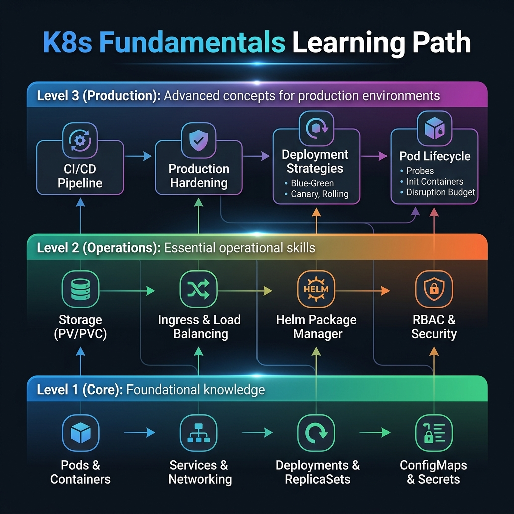

<!-- tags: overview -->
# Kubernetes Fundamentals

> The foundation lane for Pod, Deployment, Service, ConfigMap, Storage, Ingress, and core lifecycle concepts.

| Aspect | Detail |
| --- | --- |
| **Concept** | Navigation hub for `Kubernetes Fundamentals` |
| **Audience** | Backend engineer new to K8s, platform engineer needing a standardized mental model |
| **Primary style** | Concept-First router |
| **Entry point** | Open when you need to lock down primitives before discussing rollout or mesh. |

📅 Updated: 2026-04-20 · ⏱️ 6 min read

---

## 1. DEFINE

Picture yourself debugging a broken rollout, but the conversation keeps bouncing between Pod, Deployment, Service, and Ingress as if they were all the same thing. The Fundamentals lane exists to cut that ambiguity at the root.

This hub does not replace individual articles. It exists to help you open the right lane before wandering into tools, syntax, or specific diagrams. Reading in the right order reduces the feeling of "knowing many keywords but still unable to route the real problem."

### Signals & Boundaries

- Open this hub when you know the issue lives inside `Kubernetes Fundamentals` but are unsure which article to read first.
- Use the coverage map to route by pain point, not by file order.
- Return here after each article to pick the next step with intention.

### Coverage Map

| Entry | Role |
| --- | --- |
| [Pods & Containers](01-pods-and-containers.md) | Entry point for lane `Pods & Containers` |
| [Deployments & ReplicaSets](02-deployments.md) | Entry point for lane `Deployments & ReplicaSets` |
| [Services & Networking](03-services-networking.md) | Entry point for lane `Services & Networking` |
| [ConfigMaps & Secrets](04-configmaps-secrets.md) | Entry point for lane `ConfigMaps & Secrets` |
| [Volumes & Persistent Storage](05-volumes-storage.md) | Entry point for lane `Volumes & Persistent Storage` |
| [Ingress & TLS](06-ingress.md) | Entry point for lane `Ingress & TLS` |
| [Helm Charts](07-helm.md) | Entry point for lane `Helm Charts` |
| [Health Checks & Auto-scaling](08-health-scaling.md) | Entry point for lane `Health Checks & Auto-scaling` |
| [CI/CD Pipeline](09-cicd-pipeline.md) | Entry point for lane `CI/CD Pipeline` |
| [Production Hardening](10-production.md) | Entry point for lane `Production Hardening` |
| [Deployment Strategies](11-deployment-strategies.md) | Entry point for lane `Deployment Strategies` |
| [The Lifecycle of a Kubernetes Pod](12-pod-lifecycle.md) | Entry point for lane `The Lifecycle of a Kubernetes Pod` |

---

## 2. VISUAL

The definition locked the hub's scope. The visual below helps route quickly by lane instead of scrolling a dry link list.



### Level 1

```text
start from current pain point
  -> Pods & Containers
  -> Deployments & ReplicaSets
  -> Services & Networking
  -> ConfigMaps & Secrets
  -> Volumes & Persistent Storage
  -> Ingress & TLS
```

*Figure: This hub works as a router, not a catalog to scroll through.*

### Level 2

```text
read the right lane -> reduced topic-hopping between articles
read the wrong lane -> terminology fragments accumulate the more you read
```

*Figure: The real value of a router-style README is keeping the reader on the right path from the start.*

---

## 3. CODE

The diagram showed the routing rhythm. The artifact below turns the hub into a short worksheet so the team or learner can pick the right entry gate.

### Problem 1: Basic — Route the lane before reading deep

> **Goal**: Prevent study or review from drifting into "open whichever article looks interesting."
> **Approach**: Choose lane by current pain point.
> **Example**: Pick the right cluster to read in `Kubernetes Fundamentals`.
> **Complexity**: Basic

```yaml
router:
  module: Kubernetes Fundamentals
  rule: "choose lane by pain point, not by familiar name"
  suggested_path:
  - 01-pods-and-containers.md
  - 02-deployments.md
  - 03-services-networking.md
  - 04-configmaps-secrets.md
  - 05-volumes-storage.md
  - 06-ingress.md
```

This artifact does not solve the problem for you. It trims wrong lanes before your time is spent on articles that do not serve your current goal.

---

## 4. PITFALLS

When the hub/router is used incorrectly, the reader can still read individual articles, but overall understanding fragments into disconnected concepts.

| # | Severity | Mistake | Consequence | Fix |
| --- | --- | --- | --- | --- |
| 1 | 🔴 Fatal | Reading by file order instead of routing by pain point | Accumulates terminology without solving the real problem | Use the coverage map before opening a detail article |
| 2 | 🟡 Common | Treating the README as a pure link catalog | Loses the hub's routing purpose | Always ask "which lane matches my current pain?" |
| 3 | 🔵 Minor | Finishing an article without returning to the hub | Jumps to an adjacent article by instinct | Return to the README to pick the next step |

---

## 5. REF

| Resource | Type | Link | Notes |
| --- | --- | --- | --- |
| Pods & Containers | Internal | [Pods & Containers](01-pods-and-containers.md) | Directly related entry point |
| Deployments & ReplicaSets | Internal | [Deployments & ReplicaSets](02-deployments.md) | Directly related entry point |
| Services & Networking | Internal | [Services & Networking](03-services-networking.md) | Directly related entry point |
| ConfigMaps & Secrets | Internal | [ConfigMaps & Secrets](04-configmaps-secrets.md) | Directly related entry point |

---

## 6. RECOMMEND

Once you know which lane you are in, the next step is to open the first article of that lane instead of wandering into a new topic.

| Extension | When | Reason | File/Link |
| --- | --- | --- | --- |
| Pods & Containers | When pain point matches this lane | Continue into the right cluster instead of reading loosely | [Pods & Containers](01-pods-and-containers.md) |
| Deployments & ReplicaSets | When pain point matches this lane | Continue into the right cluster instead of reading loosely | [Deployments & ReplicaSets](02-deployments.md) |
| Services & Networking | When pain point matches this lane | Continue into the right cluster instead of reading loosely | [Services & Networking](03-services-networking.md) |
