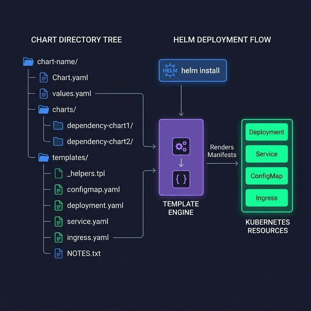

<!-- tags: kubernetes, k8s, helm, charts -->
# 📐 Chart Structure & Go Templates

> Understand Helm Chart structure inside out — Go template syntax, built-in objects, pipeline functions.

| Aspect           | Detail                                      |
| ---------------- | ------------------------------------------- |
| **Tool**         | Helm v3, Go `text/template`                 |
| **Use case**     | Create reusable K8s deployment packages     |
| **Go relevance** | Helm templates = Go templates, same syntax  |
| **CLI**          | `helm create`, `helm template`, `helm lint` |

📅 Created: 2026-03-20 · 🔄 Updated: 2026-04-20 · ⏱️ 15 min read

---

## 1. DEFINE

Picture `Chart Structure & Go Templates` appearing when a cluster is under specific operational pressure and you can no longer answer with generic YAML.

### Chart Structure in Detail

```text
my-chart/
├── Chart.yaml            # Metadata — name, version, dependencies
├── Chart.lock            # Lock file for dependencies
├── values.yaml           # Default configuration values
├── values.schema.json    # JSON Schema validation for values
├── .helmignore           # Files to ignore when packaging
├── templates/
│   ├── NOTES.txt         # Post-install message (rendered)
│   ├── _helpers.tpl      # Named templates (reusable snippets)
│   ├── deployment.yaml   # K8s Deployment
│   ├── service.yaml      # K8s Service
│   ├── ingress.yaml      # K8s Ingress
│   ├── configmap.yaml    # ConfigMap
│   ├── secret.yaml       # Secret
│   ├── hpa.yaml          # HorizontalPodAutoscaler
│   ├── pdb.yaml          # PodDisruptionBudget
│   └── tests/
│       └── test-conn.yaml # Helm test pods
└── charts/               # Sub-charts / dependencies
```

### Chart.yaml Anatomy

| Field          | Required | Description                                |
| -------------- | -------- | ------------------------------------------ |
| `apiVersion`   | ✅       | `v2` for Helm 3                            |
| `name`         | ✅       | Chart name (lowercase, hyphen)             |
| `version`      | ✅       | Chart version (SemVer)                     |
| `appVersion`   | ❌       | App version (for display)                  |
| `type`         | ❌       | `application` (default) or `library`       |
| `dependencies` | ❌       | Sub-chart dependencies                     |
| `maintainers`  | ❌       | Team contact                               |

### Built-in Objects

| Object          | Access                                 | Description               |
| --------------- | -------------------------------------- | ------------------------- |
| `.Release`      | `.Release.Name`, `.Release.Namespace`  | Release info              |
| `.Values`       | `.Values.replicaCount`                 | values.yaml data          |
| `.Chart`        | `.Chart.Name`, `.Chart.Version`        | Chart.yaml data           |
| `.Template`     | `.Template.Name`, `.Template.BasePath` | Template file info        |
| `.Capabilities` | `.Capabilities.KubeVersion`            | K8s cluster capabilities  |
| `.Files`        | `.Files.Get "config.ini"`              | Access non-template files |

### Failure Modes

| Mistake                   | Cause                      | Fix                              |
| ------------------------- | -------------------------- | -------------------------------- |
| Template render error     | Missing closing `{{ end }}` | `helm template --debug`         |
| YAML indent broken        | Wrong `indent` vs `nindent` | Always use `nindent`            |
| Nil pointer               | `.Values.missing.key`      | Use `default` or `if` check     |
| Resource name > 63 chars  | Template fullname too long | `trunc 63` in helpers            |

---

Those failure modes sound easy to avoid. But there is a trap: a Helm template parse error from a missing `end` kills the deploy silently, and a helpers indent mistake breaks the YAML. That trap appears in PITFALLS.

## 2. VISUAL



*Figure: Chart directory tree on the left feeds into the Helm template engine, which renders values into Kubernetes resource manifests — Deployment, Service, ConfigMap, Ingress.*

### Template Rendering Flow

```text
values.yaml          Chart.yaml         Templates (*.yaml)
    │                    │                    │
    ▼                    ▼                    ▼
┌─────────────────────────────────────────────────┐
│              HELM TEMPLATE ENGINE               │
│                                                  │
│  .Values ◄── values.yaml + --set overrides      │
│  .Chart  ◄── Chart.yaml                         │
│  .Release ◄── helm install options              │
│                                                  │
│  ┌─────────────────────────────────────────┐    │
│  │  templates/deployment.yaml              │    │
│  │                                         │    │
│  │  replicas: {{ .Values.replicaCount }}   │    │
│  │  image: {{ .Values.image.repository }}: │    │
│  │         {{ .Values.image.tag }}          │    │
│  └─────────────────┬───────────────────────┘    │
│                     │ render                     │
│  ┌─────────────────▼───────────────────────┐    │
│  │  Rendered Deployment YAML               │    │
│  │                                         │    │
│  │  replicas: 3                            │    │
│  │  image: go-api:v1.2.0                   │    │
│  └─────────────────────────────────────────┘    │
└──────────────────────┬──────────────────────────┘
                       │ kubectl apply
                       ▼
              ┌──────────────────┐
              │  K8s API Server  │
              └──────────────────┘
```

*Figure: The Helm engine merges values.yaml, Chart.yaml, and --set overrides into built-in objects, then renders Go templates into valid K8s YAML for kubectl apply.*

---

## 3. CODE

The diagram showed the rendering pipeline. Code below shows how templates, helpers, and schema validation work in practice.

### Example 1: Basic — Go Template Syntax Essentials

> **Goal**: Master Go template syntax inside Helm
> **Requires**: Helm 3.x
> **Outcome**: Write flexible, production-grade templates

```yaml
# templates/deployment.yaml
apiVersion: apps/v1
kind: Deployment
metadata:
  # ✅ Named template from _helpers.tpl
  name: {{ include "myapp.fullname" . }}
  labels:
    {{- include "myapp.labels" . | nindent 4 }}
  {{- /* Comment: annotations only when values exist */ -}}
  {{- with .Values.annotations }}
  annotations:
    {{- toYaml . | nindent 4 }}
  {{- end }}
spec:
  # ✅ Conditional: only set replicas if HPA is not enabled
  {{- if not .Values.autoscaling.enabled }}
  replicas: {{ .Values.replicaCount | default 1 }}
  {{- end }}
  selector:
    matchLabels:
      {{- include "myapp.selectorLabels" . | nindent 6 }}
  template:
    metadata:
      labels:
        {{- include "myapp.selectorLabels" . | nindent 8 }}
      annotations:
        # ✅ Force rollout when config changes
        checksum/config: {{ include (print $.Template.BasePath "/configmap.yaml") . | sha256sum }}
    spec:
      # ✅ imagePullSecrets — conditional
      {{- with .Values.imagePullSecrets }}
      imagePullSecrets:
        {{- toYaml . | nindent 8 }}
      {{- end }}
      containers:
        - name: {{ .Chart.Name }}
          image: "{{ .Values.image.repository }}:{{ .Values.image.tag | default .Chart.AppVersion }}"
          imagePullPolicy: {{ .Values.image.pullPolicy }}
          ports:
            {{- range .Values.service.ports }}
            - name: {{ .name }}
              containerPort: {{ .containerPort }}
              protocol: {{ .protocol | default "TCP" }}
            {{- end }}
          # ✅ Environment from values
          env:
            {{- range $key, $value := .Values.env }}
            - name: {{ $key }}
              value: {{ $value | quote }}
            {{- end }}
          # ✅ Resources — toYaml for nested objects
          resources:
            {{- toYaml .Values.resources | nindent 12 }}
```

```yaml
# templates/_helpers.tpl — Reusable named templates
{{/*
Expand the name of the chart.
*/}}
{{- define "myapp.name" -}}
{{- default .Chart.Name .Values.nameOverride | trunc 63 | trimSuffix "-" }}
{{- end }}

{{/*
Fullname — release + chart name, truncated to 63 chars
*/}}
{{- define "myapp.fullname" -}}
{{- if .Values.fullnameOverride }}
{{- .Values.fullnameOverride | trunc 63 | trimSuffix "-" }}
{{- else }}
{{- $name := default .Chart.Name .Values.nameOverride }}
{{- if contains $name .Release.Name }}
{{- .Release.Name | trunc 63 | trimSuffix "-" }}
{{- else }}
{{- printf "%s-%s" .Release.Name $name | trunc 63 | trimSuffix "-" }}
{{- end }}
{{- end }}
{{- end }}

{{/*
Standard labels
*/}}
{{- define "myapp.labels" -}}
helm.sh/chart: {{ include "myapp.chart" . }}
{{ include "myapp.selectorLabels" . }}
app.kubernetes.io/version: {{ .Chart.AppVersion | quote }}
app.kubernetes.io/managed-by: {{ .Release.Service }}
{{- end }}

{{/*
Selector labels
*/}}
{{- define "myapp.selectorLabels" -}}
app.kubernetes.io/name: {{ include "myapp.name" . }}
app.kubernetes.io/instance: {{ .Release.Name }}
{{- end }}

{{/*
Chart label
*/}}
{{- define "myapp.chart" -}}
{{- printf "%s-%s" .Chart.Name .Chart.Version | replace "+" "_" | trunc 63 | trimSuffix "-" }}
{{- end }}
```

```bash
# ✅ Debug template rendering
helm template my-release ./my-chart --debug

# ✅ Validate templates
helm lint ./my-chart

# ✅ Render only a specific file
helm template my-release ./my-chart -s templates/deployment.yaml
```

> **✅ Outcome**: Understand pipeline syntax, conditionals, loops, named templates.
> **⚠️ Note**: `{{- ` (dash) trims whitespace on the left, `-}}` trims on the right.

---

Chart skeleton is covered. But template logic needs helpers — time to separate concerns.

### Example 2: Intermediate — values.schema.json Validation

> **Goal**: JSON Schema verifies values.yaml before deploy — catch errors early
> **Requires**: Helm 3.x
> **Outcome**: Type-safe chart configuration

```json
{
    "$schema": "https://json-schema.org/draft/2020-12/schema",
    "type": "object",
    "required": ["replicaCount", "image"],
    "properties": {
        "replicaCount": {
            "type": "integer",
            "minimum": 1,
            "maximum": 100,
            "description": "Number of replicas"
        },
        "image": {
            "type": "object",
            "required": ["repository"],
            "properties": {
                "repository": {
                    "type": "string",
                    "minLength": 1
                },
                "tag": {
                    "type": "string",
                    "pattern": "^[a-zA-Z0-9][a-zA-Z0-9._-]*$"
                },
                "pullPolicy": {
                    "type": "string",
                    "enum": ["Always", "IfNotPresent", "Never"]
                }
            }
        },
        "resources": {
            "type": "object",
            "properties": {
                "requests": {
                    "type": "object",
                    "properties": {
                        "memory": { "type": "string", "pattern": "^[0-9]+(Mi|Gi)$" },
                        "cpu": { "type": "string", "pattern": "^[0-9]+(m|)$" }
                    }
                }
            }
        }
    }
}
```

```bash
# ✅ helm install auto-validates against schema
helm install test ./my-chart --set replicaCount=-1
# Error: values don't meet the specifications of the schema:
# - replicaCount: Must be >= 1
```

> **✅ Outcome**: Chart has type validation — catches config errors before deploy.
> **⚠️ Note**: For large schemas, split into `values.schema.json` per component.

---

Helpers are covered. But multi-env config needs values overlay — time to layer.

### Example 3: Advanced — Custom Template Functions + Files Access

> **Goal**: Use `.Files`, custom functions, complex loops
> **Requires**: Charts with extra config files
> **Outcome**: Charts that handle complex configurations

```yaml
# templates/configmap.yaml — Auto-load files
apiVersion: v1
kind: ConfigMap
metadata:
  name: {{ include "myapp.fullname" . }}-config
data:
  # ✅ Load file from chart root
  application.yaml: |-
    {{ .Files.Get "config/application.yaml" | nindent 4 }}

  # ✅ Loop through multiple files in a directory
  {{- $files := .Files.Glob "config/**.yaml" }}
  {{- range $path, $bytes := $files }}
  {{ base $path }}: |-
    {{ $bytes | toString | nindent 4 }}
  {{- end }}
---
# templates/secret.yaml — Auto-generate random passwords
apiVersion: v1
kind: Secret
metadata:
  name: {{ include "myapp.fullname" . }}-secret
  annotations:
    # ✅ Do not regenerate on upgrade
    "helm.sh/resource-policy": keep
type: Opaque
data:
  # ✅ Generate random password (persist across upgrades)
  {{- $secret := (lookup "v1" "Secret" .Release.Namespace (printf "%s-secret" (include "myapp.fullname" .))) }}
  {{- if $secret }}
  admin-password: {{ index $secret.data "admin-password" }}
  {{- else }}
  admin-password: {{ randAlphaNum 32 | b64enc }}
  {{- end }}
---
# templates/network-policies.yaml — Dynamic rules from values
{{- range .Values.networkPolicies }}
apiVersion: networking.k8s.io/v1
kind: NetworkPolicy
metadata:
  name: {{ $.Release.Name }}-{{ .name }}
spec:
  podSelector:
    matchLabels:
      {{- include "myapp.selectorLabels" $ | nindent 6 }}
  ingress:
    {{- range .allowFrom }}
    - from:
        - namespaceSelector:
            matchLabels:
              name: {{ . }}
    {{- end }}
---
{{- end }}
```

```yaml
# values.yaml for Example 3
networkPolicies:
    - name: allow-ingress
      allowFrom:
          - ingress-nginx
          - monitoring
    - name: allow-internal
      allowFrom:
          - production
          - staging
```

> **✅ Outcome**: Dynamic config loading, password generation, template loops for multiple resources.
> **⚠️ Note**: `lookup` only works during install/upgrade (not with `helm template`).

---

You have walked through the skeleton, helpers, and values overlay. Now comes the dangerous part: parse errors and indent bugs — the trap set up from the beginning.

## 4. PITFALLS

| #   | Mistake                              | Consequence                                            | Fix                                                    |
| --- | ------------------------------------ | ------------------------------------------------------ | ------------------------------------------------------ |
| 1   | Wrong YAML indent → invalid manifest | K8s rejects the resource                               | Use `nindent` (new indent) instead of `indent`         |
| 2   | `{{ .Values.x.y }}` nil pointer      | Template crashes                                       | `{{ (.Values.x).y \| default "" }}` or `with` block    |
| 3   | Extra whitespace in YAML             | Unexpected empty lines in output                       | Use `{{-` and `-}}` to trim                            |
| 4   | Named template missing scope (`.`)   | Template receives empty context                        | `{{ include "name" . }}` — must pass `.`               |
| 5   | `.Files.Get` cannot find file        | Returns empty string silently                          | File must be in chart root and not excluded by `.helmignore` |

---

## 5. REF

| Resource                  | Link                                                                            |
| ------------------------- | ------------------------------------------------------------------------------- |
| Helm Chart Template Guide | [helm.sh/docs/chart_template_guide](https://helm.sh/docs/chart_template_guide/) |
| Go Template Syntax        | [pkg.go.dev/text/template](https://pkg.go.dev/text/template)                    |
| Sprig Template Functions  | [masterminds.github.io/sprig](http://masterminds.github.io/sprig/)              |
| Chart Best Practices      | [helm.sh/docs/chart_best_practices](https://helm.sh/docs/chart_best_practices/) |
| JSON Schema               | [json-schema.org](https://json-schema.org/)                                     |

---

## 6. RECOMMEND

| Extension              | When                   | Reason                                  |
| ---------------------- | ---------------------- | --------------------------------------- |
| **helm-docs**          | Auto-generate README   | Creates docs from values comments       |
| **Pluto**              | Detect deprecated APIs | Scans charts for removed K8s APIs       |
| **Datree**             | Policy enforcement     | Validates charts against org policies   |
| **Chart Testing (ct)** | CI pipeline            | Lint, install, and test charts in CI    |
| **Helmify**            | Convert YAML → Helm    | Converts existing manifests to charts   |

---

## 🔍 Debug Checklist

| # | Symptom | Cause | Debug Command |
|---|---------|-------|---------------|
| 1 | `Error: parse error` on install | Go template syntax error, missing `{{ end }}` | `helm template my-release ./chart --debug` |
| 2 | YAML indentation wrong, K8s rejects manifest | Using `indent` instead of `nindent` in pipeline | `helm template ./chart \| kubectl apply --dry-run=client -f -` |
| 3 | Nil pointer: `can't evaluate field X` | `.Values.x.y` when `x` is not set | `helm template ./chart --debug 2>&1 \| grep nil` |
| 4 | `helm lint` reports missing required value | Schema `required` field has no default | `helm lint ./chart --set replicaCount=1` |
| 5 | Named template not found | `include "myapp.helper"` wrong name or scope | `helm template ./chart -s templates/_helpers.tpl --debug` |
| 6 | Resource name exceeds 63 characters | Fullname template missing `trunc 63` | `helm template ./chart \| grep 'name:' \| awk '{print length, $0}'` |
| 7 | `.Files.Get` returns empty | File excluded by `.helmignore` or not in chart root | `cat .helmignore` and verify file path |

---

## 🃏 Quick Reference

| # | Pattern | Command / Rule |
|---|---------|----------------|
| 1 | Create new chart from scaffold | `helm create my-chart` |
| 2 | Render templates without deploying | `helm template my-release ./chart -f values.yaml` |
| 3 | Render a specific file | `helm template my-release ./chart -s templates/deployment.yaml` |
| 4 | Lint and validate chart | `helm lint ./chart --strict` |
| 5 | Dry-run with K8s validation | `helm install --dry-run --generate-name ./chart` |
| 6 | Trim whitespace on the left | `{{- ` (dash before content) |
| 7 | Include named template with scope | `{{ include "myapp.labels" . \| nindent 4 }}` |
| 8 | Conditional with `with` (auto scope) | `{{- with .Values.annotations }}...{{ end }}` |

---

## 🎯 Interview Angle

**Relevant system design / technical questions:**
- *"Explain the structure of a Helm chart and the role of each file/folder."*
- *"Why is `_helpers.tpl` important? How do you use it?"*
- *"What is the difference between `.Values`, `.Release`, `.Chart`, and `.Capabilities` in Helm templates?"*

**Points the interviewer wants to hear:**

| Topic | Talking Point |
|-------|---------------|
| Chart anatomy | `Chart.yaml` = metadata, `values.yaml` = defaults, `templates/` = Go templates render K8s manifests |
| `_helpers.tpl` | Contains reusable named templates — `define`/`include` pattern, does not render as a resource because the name starts with `_` |
| Built-in objects | `.Values` from values files, `.Release` from `helm install` options, `.Chart` from Chart.yaml, `.Capabilities` from cluster |
| `nindent` vs `indent` | `nindent` adds a newline first — essential for correct YAML indentation in pipelines |
| `values.schema.json` | JSON Schema validation catches wrong config before deploy — type safety for chart users |
| `lookup` function | Queries existing K8s resources inside templates — only works during real install/upgrade, not with `helm template` |

**Common follow-up questions:**
- *"How do you generate a random password that does not change on every upgrade?"* → Use `lookup` to check if the Secret already exists; if so, keep the existing value.
- *"When to use `with` vs `if`?"* → `with` changes scope (`.`) to that object, good when accessing multiple fields; `if` only checks a condition without changing scope.

---

**Links**: [← README](./README.md) · [→ Values & Dependencies](./02-values-dependencies.md)
