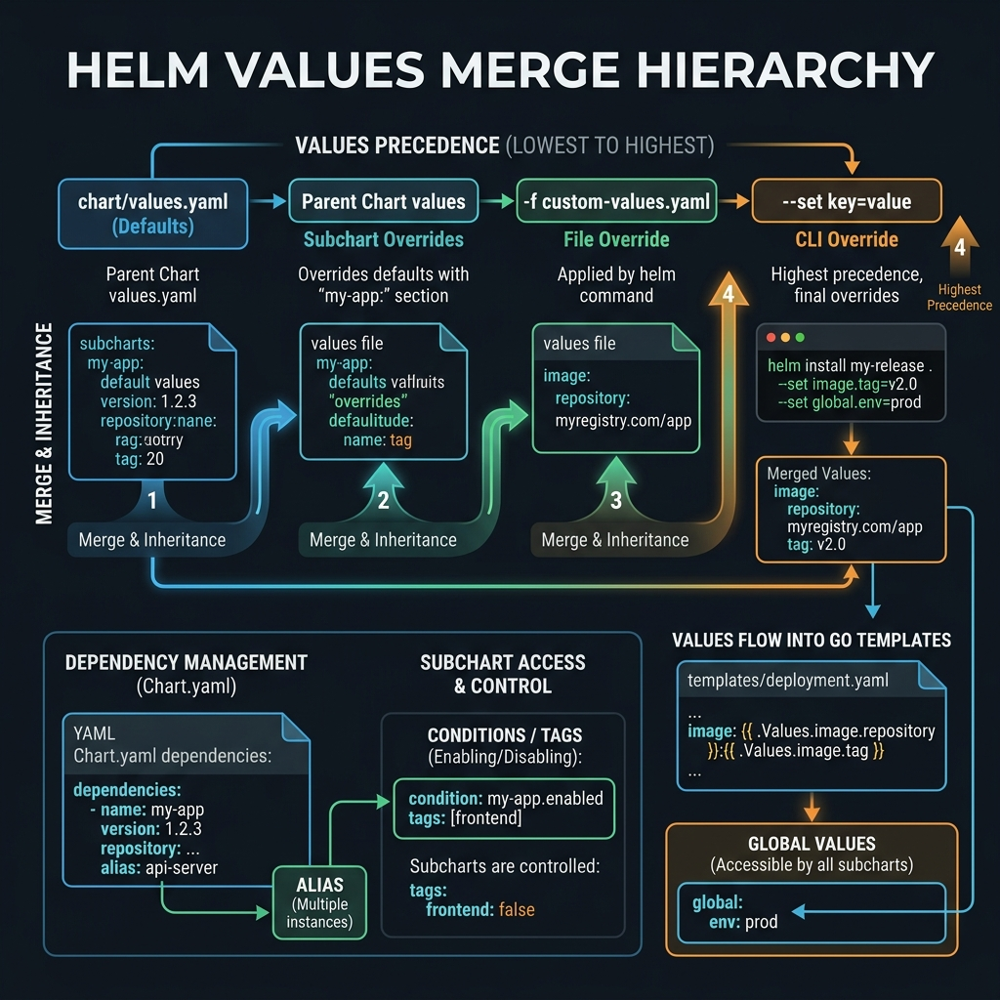

<!-- tags: kubernetes, k8s, helm, configuration -->
# 🔗 Values & Dependencies

> Multi-environment values management and chart dependency system — deploy the same chart for dev/staging/prod.

| Aspect           | Detail                                      |
| ---------------- | ------------------------------------------- |
| **Concept**      | Values hierarchy, dependency management     |
| **Use case**     | Multi-env configs, shared dependencies      |
| **Go relevance** | Environment-specific Go app configs         |
| **CLI**          | `helm install -f`, `helm dependency update` |

📅 Created: 2026-03-20 · 🔄 Updated: 2026-04-20 · ⏱️ 15 min read

---

## 1. DEFINE

Picture `Values & Dependencies` appearing when a cluster is under specific operational pressure and you can no longer answer with generic YAML.

### Values Merge Order (Highest → Lowest Priority)

| Priority    | Source                                  | Example                      |
| ----------- | --------------------------------------- | ---------------------------- |
| 1 (highest) | `--set` CLI                             | `--set image.tag=v2`         |
| 2           | `--set-file` CLI                        | `--set-file config=app.yaml` |
| 3           | `-f` / `--values` file (rightmost wins) | `-f values-prod.yaml`        |
| 4           | Parent chart values                     | `subchart.key: value`        |
| 5 (lowest)  | Chart default `values.yaml`             | `values.yaml`                |

### Dependency Types

| Type         | Declaration               | Use Case                         |
| ------------ | ------------------------- | -------------------------------- |
| **External** | `Chart.yaml` dependencies | bitnami/postgresql, redis        |
| **Subchart** | `charts/` directory       | Local shared charts              |
| **Library**  | `type: library`           | Reusable templates, no resources |

### Conditions & Tags

| Feature         | Description              | Example                     |
| --------------- | ------------------------ | --------------------------- |
| `condition`     | Enable/disable dependency | `postgresql.enabled: false` |
| `tags`          | Group dependencies       | `tags: [backend]`           |
| `alias`         | Rename dependency        | `alias: primary-db`         |
| `import-values` | Pull subchart values     | Import defaults from child  |

### Failure Modes

| Mistake                       | Cause                                | Fix                      |
| ----------------------------- | ------------------------------------ | ------------------------ |
| Dependency not found          | `helm dependency update` not run     | `helm dep up`            |
| Values override not applied   | Wrong key path or YAML indent        | `helm get values` verify |
| Subchart values conflict      | Parent and child share same key      | Parent always wins       |

---

Those failure modes sound basic. But there is a trap: a subchart values key path that does not match causes a silent override failure, and an unpinned dependency version leads to a breaking upgrade. That trap appears in PITFALLS.

## 2. VISUAL

The definition locked the vocabulary. The visual below shows how values merge from four precedence levels and flow into Go templates during rendering.



### Values Merge Hierarchy

```text
┌─────────────────────────────────────────────────┐
│              FINAL MERGED VALUES                 │
│                                                   │
│  Priority: --set > -f file > parent > default    │
└────────────────────┬────────────────────────────┘
                     │ merge
    ┌────────────────┼────────────────┐
    │                │                │
┌───▼────┐    ┌──────▼──────┐   ┌────▼────────┐
│ --set  │    │ -f values-  │   │  values.yaml │
│ flags  │    │ prod.yaml   │   │  (default)   │
│ (wins) │    │ (override)  │   │  (fallback)  │
└────────┘    └─────────────┘   └──────────────┘
```

### Multi-Environment Pattern

```text
my-chart/
├── values.yaml           ← Base defaults
├── values-dev.yaml       ← Dev overrides
├── values-staging.yaml   ← Staging overrides
├── values-prod.yaml      ← Production overrides
└── values-secrets.yaml   ← Encrypted (SOPS/sealed)

Deploy:
  helm install app ./my-chart \
    -f values.yaml \
    -f values-prod.yaml \         ← overrides base
    -f values-secrets.yaml \      ← overrides prod
    --set image.tag=$CI_COMMIT_SHA  ← overrides all
```

*Figure: Values cascade right-to-left. --set always wins. Base defaults provide the fallback for any key not overridden by environment-specific files.*

---

## 3. CODE

The diagram showed the merge hierarchy. Code below shows how to structure values files across environments and manage chart dependencies.

### Example 1: Basic — Multi-Environment Values

> **Goal**: Create values files for dev/staging/prod
> **Requires**: Helm chart with values.yaml
> **Outcome**: Same chart, different configs per environment

```yaml
# values.yaml — Base defaults (shared across all environments)
replicaCount: 1

image:
    repository: ghcr.io/myorg/go-api
    tag: 'latest'
    pullPolicy: IfNotPresent

service:
    type: ClusterIP
    port: 80

ingress:
    enabled: false
    className: nginx
    hosts: []

resources:
    requests:
        memory: '64Mi'
        cpu: '100m'
    limits:
        memory: '256Mi'
        cpu: '500m'

config:
    logLevel: info
    port: '8080'
    corsOrigins: '*'

autoscaling:
    enabled: false
    minReplicas: 1
    maxReplicas: 5

postgresql:
    enabled: true
    auth:
        database: myapp

redis:
    enabled: false
```

```yaml
# values-dev.yaml — Development overrides
replicaCount: 1

image:
    tag: 'latest'
    pullPolicy: Always # ✅ Always pull latest in dev

config:
    logLevel: debug # ✅ Debug logging
    corsOrigins: '*'

resources:
    requests:
        memory: '32Mi'
        cpu: '50m'
    limits:
        memory: '128Mi'
        cpu: '200m'

postgresql:
    auth:
        postgresPassword: devpass123 # ✅ Dev password — OK to hardcode
```

```yaml
# values-staging.yaml
replicaCount: 2

image:
    tag: '' # ✅ Override with --set image.tag=$CI_COMMIT_SHA

ingress:
    enabled: true
    hosts:
        - host: api-staging.example.com
          paths:
              - path: /
                pathType: Prefix

config:
    logLevel: info
    corsOrigins: 'https://staging.example.com'

autoscaling:
    enabled: true
    minReplicas: 2
    maxReplicas: 5
```

```yaml
# values-prod.yaml
replicaCount: 3

image:
    pullPolicy: IfNotPresent # ✅ Only pull if not cached

ingress:
    enabled: true
    annotations:
        cert-manager.io/cluster-issuer: letsencrypt-prod
    tls:
        - secretName: api-tls
          hosts:
              - api.example.com
    hosts:
        - host: api.example.com
          paths:
              - path: /
                pathType: Prefix

config:
    logLevel: warn # ✅ Minimal logging
    corsOrigins: 'https://example.com,https://app.example.com'

resources:
    requests:
        memory: '128Mi'
        cpu: '200m'
    limits:
        memory: '512Mi'
        cpu: '1'

autoscaling:
    enabled: true
    minReplicas: 3
    maxReplicas: 20

redis:
    enabled: true # ✅ Redis enabled only in prod
```

```bash
# ✅ Deploy each environment
helm install go-api ./chart -f values-dev.yaml -n dev
helm install go-api ./chart -f values-staging.yaml --set image.tag=abc123 -n staging
helm install go-api ./chart -f values-prod.yaml --set image.tag=v1.2.0 -n production
```

> **✅ Outcome**: 1 chart, 3 environments — consistency.
> **⚠️ Note**: The last values file in the `-f` list wins (rightmost).

---

Values override is covered. But subchart dependencies need aliasing — time to connect.

### Example 2: Intermediate — Chart Dependencies

> **Goal**: Go app chart depends on PostgreSQL + Redis subcharts
> **Requires**: Network access to Helm repos
> **Outcome**: Full-stack deployment with managed dependencies

```yaml
# Chart.yaml
apiVersion: v2
name: go-api
version: 1.0.0
appVersion: '1.0.0'

dependencies:
    # ✅ PostgreSQL — conditional
    - name: postgresql
      version: '13.2.x'
      repository: https://charts.bitnami.com/bitnami
      condition: postgresql.enabled # ✅ Toggle on/off
      tags:
          - backend

    # ✅ Redis — conditional
    - name: redis
      version: '18.x.x'
      repository: https://charts.bitnami.com/bitnami
      condition: redis.enabled
      tags:
          - backend
          - cache

    # ✅ Multiple instances — alias
    - name: postgresql
      version: '13.2.x'
      repository: https://charts.bitnami.com/bitnami
      alias: analyticsDb # ✅ Second PostgreSQL instance
      condition: analyticsDb.enabled
```

```yaml
# values.yaml — Configure dependencies
postgresql:
    enabled: true
    auth:
        database: myapp
        username: appuser
        postgresPassword: '' # ✅ Override in secrets
    primary:
        persistence:
            size: 10Gi

redis:
    enabled: false # ✅ Disabled by default
    auth:
        password: ''
    master:
        persistence:
            size: 5Gi

analyticsDb:
    enabled: false
    auth:
        database: analytics
```

```bash
# ✅ Download dependencies
helm dependency update ./go-api-chart

# ✅ List dependencies
helm dependency list ./go-api-chart

# ✅ Deploy with redis enabled
helm install go-api ./go-api-chart \
  --set redis.enabled=true \
  --set redis.auth.password=mysecretpassword
```

> **✅ Outcome**: Dependencies auto-managed, toggle on/off per environment.
> **⚠️ Note**: Dependencies download as `.tgz` into `charts/`. Add to `.gitignore`.

---

Dependencies are covered. But shared config needs global values — time to centralize.

### Example 3: Advanced — Import Values + Global Values Pattern

> **Goal**: Share config between parent and subchart, global values pattern
> **Requires**: Complex multi-chart setup
> **Outcome**: DRY configuration across charts

```yaml
# Chart.yaml — import-values
dependencies:
    - name: postgresql
      version: '13.x.x'
      repository: https://charts.bitnami.com/bitnami
      condition: postgresql.enabled
      import-values:
          # ✅ Import subchart values into parent scope
          - child: primary.service
            parent: database

# values.yaml — Global values (shared across ALL subcharts)
global:
    # ✅ Global values accessible in all charts as .Values.global.*
    imageRegistry: ghcr.io
    imagePullSecrets:
        - name: ghcr-secret
    storageClass: fast-ssd

    # ✅ Shared labels
    labels:
        team: backend
        product: go-api

    # ✅ Shared environment
    env: production
```

```yaml
# templates/deployment.yaml — using global values
spec:
  template:
    metadata:
      labels:
        {{- include "myapp.labels" . | nindent 8 }}
        # ✅ Global labels
        {{- range $key, $value := .Values.global.labels }}
        {{ $key }}: {{ $value | quote }}
        {{- end }}
    spec:
      {{- with .Values.global.imagePullSecrets }}
      imagePullSecrets:
        {{- toYaml . | nindent 8 }}
      {{- end }}
      containers:
        - name: {{ .Chart.Name }}
          # ✅ Global registry + chart-specific image
          image: "{{ .Values.global.imageRegistry }}/{{ .Values.image.repository }}:{{ .Values.image.tag }}"
```

```yaml
# templates/_helpers.tpl — Environment-aware helpers
{{- define "myapp.databaseUrl" -}}
{{- if .Values.postgresql.enabled }}
{{- printf "postgres://%s:%s@%s-postgresql:5432/%s?sslmode=disable"
    .Values.postgresql.auth.username
    .Values.postgresql.auth.password
    .Release.Name
    .Values.postgresql.auth.database }}
{{- else }}
{{- .Values.externalDatabase.url }}
{{- end }}
{{- end }}
```

> **✅ Outcome**: Global config shared, database URL auto-generated, DRY.
> **⚠️ Note**: Global values propagate to ALL subcharts. Avoid naming conflicts.

---

You have walked through values, dependencies, and conditional rendering. Now comes the dangerous part: silent key mismatch and unpinned versions — the trap set up from the beginning.

## 4. PITFALLS

| #   | Mistake                                      | Consequence                  | Fix                                      |
| --- | -------------------------------------------- | ---------------------------- | ---------------------------------------- |
| 1   | Subchart values not applied                  | Override fails silently      | Parent key must match subchart name      |
| 2   | `helm dep up` not run → dependency missing   | Install fails                | Run before install, add to CI pipeline   |
| 3   | Global values conflict between subcharts     | Unexpected overrides         | Namespace global keys: `global.myapp.*`  |
| 4   | Version constraint `13.2.x` does not match   | Dependency resolution fails  | Check exact versions: `helm search repo` |
| 5   | Secrets hardcoded in values files            | Credentials exposed in Git   | Use `--set` or helm-secrets plugin       |

---

## 5. REF

| Resource           | Link                                                                                                                        |
| ------------------ | --------------------------------------------------------------------------------------------------------------------------- |
| Values Files       | [helm.sh/docs/chart_template_guide/values_files](https://helm.sh/docs/chart_template_guide/values_files/)                   |
| Chart Dependencies | [helm.sh/docs/helm/helm_dependency](https://helm.sh/docs/helm/helm_dependency/)                                             |
| Subcharts & Global | [helm.sh/docs/chart_template_guide/subcharts_and_globals](https://helm.sh/docs/chart_template_guide/subcharts_and_globals/) |
| Bitnami Charts     | [github.com/bitnami/charts](https://github.com/bitnami/charts)                                                              |

---

## 6. RECOMMEND

| Extension            | When                    | Reason                              |
| -------------------- | ----------------------- | ----------------------------------- |
| **Helmfile**         | Multi-chart deployments | Manage values files per environment |
| **helm-secrets**     | Encrypt values          | SOPS integration for sensitive data |
| **Kustomize + Helm** | Post-rendering patches  | Customize after Helm render         |
| **values-diff**      | Compare environments    | Diff between values files           |
| **JSON Schema**      | Validate values input   | Catch errors before deploy          |

---

## 🔍 Debug Checklist

| # | Symptom | Cause | Debug Command |
|---|---------|-------|---------------|
| 1 | Subchart values not applied | Key path in parent values does not match subchart name | `helm get values <release> --all` and compare key hierarchy |
| 2 | `Error: found in Chart.yaml, but missing in charts/` | `helm dependency update` not run after adding dependency | `helm dependency update ./chart` |
| 3 | `--set` override has no effect | Wrong key path or `.` in array index | `helm template ./chart --set key=val --debug \| grep key` |
| 4 | Version constraint does not resolve | Repository not added or version pattern wrong | `helm search repo bitnami/postgresql --versions` |
| 5 | Global values do not propagate to subchart | Key not under `global:` scope | `helm template ./chart --debug \| grep 'global'` |
| 6 | `helm dep list` shows STATUS: missing | `.tgz` in `charts/` gitignored but not downloaded | `helm dependency build ./chart` |
| 7 | Secrets hardcoded exposed in `helm get values` | Used values file instead of encrypted source | `helm get values <release> -n <ns>` to verify |

---

## 🃏 Quick Reference

| # | Pattern | Command / Rule |
|---|---------|----------------|
| 1 | Download all dependencies | `helm dependency update ./chart` |
| 2 | List dependency status | `helm dependency list ./chart` |
| 3 | Override value via CLI | `helm install app ./chart --set image.tag=v2.0.0` |
| 4 | Load values file | `helm install app ./chart -f values-prod.yaml` |
| 5 | Multiple values files (rightmost wins) | `helm install app ./chart -f values.yaml -f values-prod.yaml` |
| 6 | Override subchart value from parent | `--set postgresql.auth.password=secret` |
| 7 | View currently applied values | `helm get values <release-name> -n <namespace>` |
| 8 | Disable a dependency | `--set redis.enabled=false` or `condition: redis.enabled` in Chart.yaml |

---

## 🎯 Interview Angle

**Relevant system design / technical questions:**
- *"Describe the priority order when merging values in Helm. Does `--set` always win?"*
- *"What is the umbrella chart pattern? When should you use subcharts instead of separate releases?"*
- *"How do you share config between a parent chart and multiple subcharts in a DRY way?"*

**Points the interviewer wants to hear:**

| Topic | Talking Point |
|-------|---------------|
| Values override order | `--set` > `--set-file` > `-f` (rightmost) > parent chart values > chart default `values.yaml` |
| Umbrella chart pattern | Parent chart contains multiple app subcharts — deploy the entire stack with one command, centralized lifecycle management |
| When to use subcharts | Tightly coupled services deployed together; loosely coupled services should use separate releases with Helmfile |
| `global` values | Keys under `global:` propagate automatically to all subcharts — use for imageRegistry, imagePullSecrets, env |
| `Chart.lock` | Lock file like `go.sum` — pins exact versions after `helm dep update`, must be committed to Git |
| `alias` field | Deploy the same chart twice (e.g., 2 PostgreSQL instances) with different names |

**Common follow-up questions:**
- *"Why not hardcode secrets in values files?"* → Values files are committed to Git; use `--set` via CI secrets or helm-secrets with SOPS encryption.
- *"How does Helmfile differ from a Helm umbrella chart?"* → Helmfile manages multiple independent releases with environment-specific values; umbrella chart is a single Helm release deploying multiple subcharts together.

---

**Links**: [← Chart Structure](./01-chart-structure.md) · [→ Lifecycle Hooks](./03-lifecycle-hooks.md)
