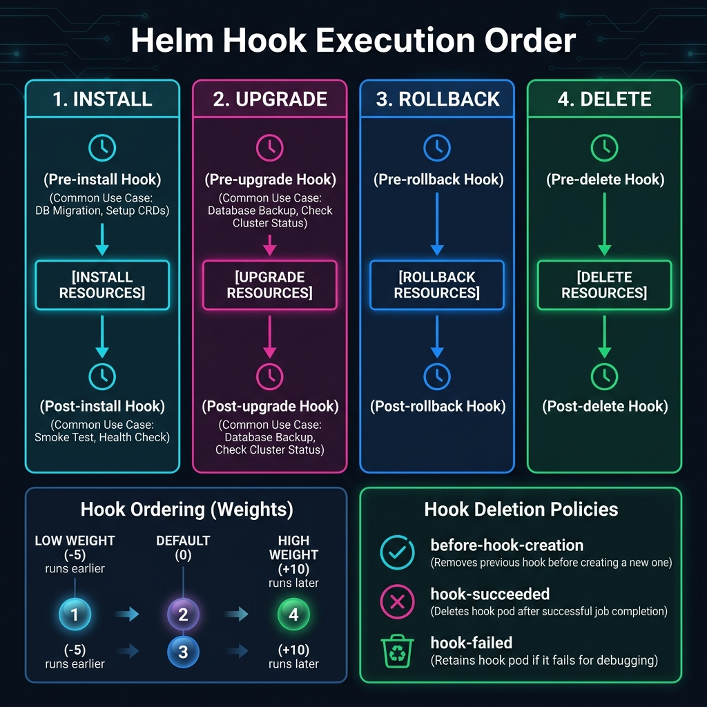

<!-- tags: kubernetes, k8s, helm, hooks -->
# 🪝 Lifecycle Hooks & Testing

> Hooks run jobs at specific points in the release lifecycle — DB migration, backup, smoke test.

| Aspect           | Detail                                                     |
| ---------------- | ---------------------------------------------------------- |
| **Concept**      | Helm hooks, chart tests                                    |
| **Use case**     | DB migration, pre-deploy backup, post-install verification |
| **Go relevance** | golang-migrate, Go test containers                         |
| **CLI**          | `helm test`, hook annotations                              |

📅 Created: 2026-03-20 · 🔄 Updated: 2026-04-20 · ⏱️ 15 min read

---

## 1. DEFINE

Picture the pod lifecycle looking like a few simple states on a diagram — until a container restart loop, a blocked init container, or a forgotten termination grace period proves otherwise. This article covers the real heartbeat of workloads.

### Hook Types

| Hook            | When It Runs                   | Use Case                    |
| --------------- | ------------------------------ | --------------------------- |
| `pre-install`   | Before resources are created   | DB setup, secret generation |
| `post-install`  | After all resources are created | Notification, smoke test   |
| `pre-upgrade`   | Before upgrade                 | DB migration, backup        |
| `post-upgrade`  | After upgrade                  | Cache clear, notification   |
| `pre-delete`    | Before release deletion        | Data backup, cleanup        |
| `post-delete`   | After resources are deleted    | External cleanup            |
| `pre-rollback`  | Before rollback                | Snapshot state              |
| `post-rollback` | After rollback                 | Notification                |
| `test`          | When `helm test` is run        | Integration tests           |

### Hook Weight & Delete Policy

| Feature                      | Description                              |
| ---------------------------- | ---------------------------------------- |
| `helm.sh/hook-weight`        | Execution order (lower number runs first) |
| `helm.sh/hook-delete-policy` | When to delete the hook resource         |
| `before-hook-creation`       | Delete old hook before creating new one  |
| `hook-succeeded`             | Delete after hook succeeds               |
| `hook-failed`                | Delete after hook fails                  |

### Failure Modes

| Mistake                         | Cause                               | Fix                             |
| ------------------------------- | ----------------------------------- | ------------------------------- |
| Hook stuck → upgrade blocked    | Migration error, pod never completes | Fix migration, delete stuck job |
| Hook re-runs every upgrade      | Missing `hook-delete-policy`        | Add `before-hook-creation`      |
| Test fails but release stays up | Tests run separately                | Integrate into CI gate          |

---

Those failure modes sound familiar. But there is a trap: a stuck hook Job blocks the Helm upgrade indefinitely, and a wrong hook weight causes execution order to shift. That trap appears in PITFALLS.

## 2. VISUAL

Theory sounds fine on paper. The visual below shows the exact hook execution timeline across install, upgrade, rollback, and delete phases.



### Hook Execution Order

```text
helm install
    │
    ▼
┌──────────────┐
│ Verify chart │
└──────┬───────┘
       │
       ▼
┌──────────────┐    weight: -5
│ pre-install  │───► DB migration job
│ hooks        │───► Secret generator   weight: 0
└──────┬───────┘
       │ (wait for completion)
       ▼
┌──────────────┐
│ Install all  │    Deployment, Service, ConfigMap...
│ resources    │
└──────┬───────┘
       │
       ▼
┌──────────────┐
│ post-install │───► Slack notification
│ hooks        │───► Smoke test
└──────┬───────┘
       │
       ▼
    DONE ✅
```

*Figure: Hooks run as separate Jobs outside the normal resource lifecycle. Weight controls order — negative runs first. Helm waits for each hook to complete before proceeding.*

---

## 3. CODE

The diagram showed the execution flow. Code below shows how to implement migration hooks, integration tests, and multi-step upgrade workflows.

### Example 1: Basic — DB Migration Hook

> **Goal**: Run golang-migrate before app deployment
> **Requires**: Migration files, PostgreSQL
> **Outcome**: DB schema always in sync with app version

```yaml
# templates/migration-job.yaml
apiVersion: batch/v1
kind: Job
metadata:
  name: {{ include "myapp.fullname" . }}-migrate
  annotations:
    # ✅ Run BEFORE app upgrade
    "helm.sh/hook": pre-install,pre-upgrade
    # ✅ Run migration first (weight -5), then deploy app
    "helm.sh/hook-weight": "-5"
    # ✅ Delete old job before creating new one
    "helm.sh/hook-delete-policy": before-hook-creation,hook-succeeded
spec:
  backoffLimit: 3                # ✅ Retry 3 times on failure
  activeDeadlineSeconds: 300     # ✅ Timeout after 5 minutes
  template:
    spec:
      restartPolicy: Never
      containers:
        - name: migrate
          image: "{{ .Values.image.repository }}:{{ .Values.image.tag }}"
          command:
            - /app/migrate
            - "-path"
            - "/migrations"
            - "-database"
            - "$(DATABASE_URL)"
            - "up"
          env:
            - name: DATABASE_URL
              valueFrom:
                secretKeyRef:
                  name: {{ include "myapp.fullname" . }}-secret
                  key: DATABASE_URL
          resources:
            requests: { memory: "64Mi", cpu: "100m" }
            limits:   { memory: "128Mi", cpu: "200m" }
```

```go
// cmd/migrate/main.go — Migration runner (compiled into the same image)
package main

import (
	"database/sql"
	"log"
	"os"

	"github.com/golang-migrate/migrate/v4"
	"github.com/golang-migrate/migrate/v4/database/postgres"
	_ "github.com/golang-migrate/migrate/v4/source/file"
	_ "github.com/lib/pq"
)

func main() {
	dbURL := os.Getenv("DATABASE_URL")
	if dbURL == "" {
		log.Fatal("❌ DATABASE_URL is required")
	}

	db, err := sql.Open("postgres", dbURL)
	if err != nil {
		log.Fatalf("❌ DB connection failed: %v", err)
	}
	defer db.Close()

	driver, err := postgres.WithInstance(db, &postgres.Config{})
	if err != nil {
		log.Fatalf("❌ Driver error: %v", err)
	}

	m, err := migrate.NewWithDatabaseInstance(
		"file:///migrations",
		"postgres", driver,
	)
	if err != nil {
		log.Fatalf("❌ Migrate init error: %v", err)
	}

	if err := m.Up(); err != nil && err != migrate.ErrNoChange {
		log.Fatalf("❌ Migration failed: %v", err)
	}

	log.Println("✅ Migration completed successfully")
}
```

> **✅ Outcome**: DB migration runs automatically before every deploy. Failure blocks the upgrade.
> **⚠️ Note**: `hook-succeeded` deletes the Job after success. To keep logs for debugging, use `before-hook-creation` instead.

---

Pre-install hook is covered. But the migration job needs ordering — time to sequence.

### Example 2: Intermediate — Helm Tests

> **Goal**: Create integration tests to verify the release works correctly
> **Requires**: Deployed release
> **Outcome**: Post-deploy verification, CI gate

```yaml
# templates/tests/test-connection.yaml
apiVersion: v1
kind: Pod
metadata:
  name: {{ include "myapp.fullname" . }}-test-connection
  annotations:
    "helm.sh/hook": test
    "helm.sh/hook-delete-policy": before-hook-creation,hook-succeeded
spec:
  restartPolicy: Never
  containers:
    # ✅ Test 1: API health check
    - name: test-api
      image: curlimages/curl:latest
      command:
        - sh
        - -c
        - |
          echo "Testing API health..."
          RESPONSE=$(curl -sf http://{{ include "myapp.fullname" . }}:{{ .Values.service.port }}/healthz)
          echo "Response: $RESPONSE"

          STATUS=$(echo "$RESPONSE" | grep -o '"status":"[^"]*"' | cut -d'"' -f4)
          if [ "$STATUS" != "healthy" ] && [ "$STATUS" != "alive" ]; then
            echo "❌ Health check failed: status=$STATUS"
            exit 1
          fi
          echo "✅ API health check passed"
---
# templates/tests/test-db.yaml
apiVersion: v1
kind: Pod
metadata:
  name: {{ include "myapp.fullname" . }}-test-db
  annotations:
    "helm.sh/hook": test
    "helm.sh/hook-weight": "5"
    "helm.sh/hook-delete-policy": before-hook-creation,hook-succeeded
spec:
  restartPolicy: Never
  containers:
    # ✅ Test 2: Database connectivity
    - name: test-db
      image: postgres:16-alpine
      command:
        - sh
        - -c
        - |
          echo "Testing database connection..."
          PGPASSWORD=$DB_PASS psql -h {{ .Release.Name }}-postgresql \
            -U {{ .Values.postgresql.auth.username }} \
            -d {{ .Values.postgresql.auth.database }} \
            -c "SELECT 1 AS test" || exit 1
          echo "✅ Database connection OK"
      env:
        - name: DB_PASS
          valueFrom:
            secretKeyRef:
              name: {{ .Release.Name }}-postgresql
              key: password
```

```bash
# ✅ Run tests
helm test go-api-prod
# Pod go-api-prod-test-connection pending
# Pod go-api-prod-test-connection succeeded
# Pod go-api-prod-test-db succeeded

# ✅ CI pipeline integration
helm test go-api-prod --timeout 120s || {
  echo "Tests failed! Rolling back..."
  helm rollback go-api-prod
  exit 1
}
```

> **✅ Outcome**: Automatic post-deploy verification, CI gate for rollback.
> **⚠️ Note**: Tests run INSIDE the cluster. They need network access to services.

---

Migration hook is covered. But cleanup needs hook-delete-policy — time to clean up.

### Example 3: Advanced — Multi-Step Hook Chain + Backup

> **Goal**: Pre-upgrade: backup DB → migrate → deploy → smoke test → notify
> **Requires**: Multiple hooks with weight ordering
> **Outcome**: Production-grade upgrade workflow

```yaml
# templates/hooks/01-backup.yaml
apiVersion: batch/v1
kind: Job
metadata:
  name: {{ include "myapp.fullname" . }}-backup
  annotations:
    "helm.sh/hook": pre-upgrade
    "helm.sh/hook-weight": "-10"         # ✅ Runs FIRST
    "helm.sh/hook-delete-policy": before-hook-creation
spec:
  backoffLimit: 1
  template:
    spec:
      restartPolicy: Never
      containers:
        - name: backup
          image: postgres:16-alpine
          command:
            - sh
            - -c
            - |
              TIMESTAMP=$(date +%Y%m%d_%H%M%S)
              echo "📦 Backing up database..."
              PGPASSWORD=$DB_PASS pg_dump -h $DB_HOST -U $DB_USER $DB_NAME \
                | gzip > /backups/backup_${TIMESTAMP}.sql.gz
              echo "✅ Backup completed: backup_${TIMESTAMP}.sql.gz"
          env:
            - name: DB_HOST
              value: {{ .Release.Name }}-postgresql
            - name: DB_USER
              value: {{ .Values.postgresql.auth.username }}
            - name: DB_NAME
              value: {{ .Values.postgresql.auth.database }}
            - name: DB_PASS
              valueFrom:
                secretKeyRef:
                  name: {{ .Release.Name }}-postgresql
                  key: password
          volumeMounts:
            - name: backup-storage
              mountPath: /backups
      volumes:
        - name: backup-storage
          persistentVolumeClaim:
            claimName: {{ include "myapp.fullname" . }}-backups
---
# templates/hooks/02-migrate.yaml (hook-weight: -5) — same as Example 1

---
# templates/hooks/03-notify.yaml
apiVersion: batch/v1
kind: Job
metadata:
  name: {{ include "myapp.fullname" . }}-notify
  annotations:
    "helm.sh/hook": post-upgrade
    "helm.sh/hook-weight": "10"          # ✅ Runs LAST
    "helm.sh/hook-delete-policy": hook-succeeded
spec:
  backoffLimit: 1
  template:
    spec:
      restartPolicy: Never
      containers:
        - name: notify
          image: curlimages/curl:latest
          command:
            - sh
            - -c
            - |
              curl -X POST {{ .Values.slack.webhookUrl }} \
                -H "Content-Type: application/json" \
                -d '{
                  "text": "✅ *{{ include "myapp.fullname" . }}* upgraded to *{{ .Values.image.tag }}* in {{ .Release.Namespace }}"
                }'
```

> **✅ Outcome**: backup(-10) → migrate(-5) → deploy → notify(10) — full lifecycle.
> **⚠️ Note**: Hook failure blocks upgrade. Set `activeDeadlineSeconds` to avoid stuck Jobs.

---

You have walked through hooks, migration, and cleanup. Now comes the dangerous part: stuck Jobs and wrong weight — the trap set up from the beginning.

## 4. PITFALLS

| #   | Mistake                                    | Consequence                      | Fix                                         |
| --- | ------------------------------------------ | -------------------------------- | ------------------------------------------- |
| 1   | Hook Job stuck → upgrade blocked forever   | Release hangs indefinitely       | Set `activeDeadlineSeconds`, `backoffLimit` |
| 2   | Old hook resource still exists from last run | New hook creation fails         | `hook-delete-policy: before-hook-creation`  |
| 3   | Hook Pod uses stale image                  | Migration runs old code          | Explicit image tag, never use `latest`      |
| 4   | Test pod cannot reach service              | Test fails for wrong reason      | Check NetworkPolicy, service selector       |
| 5   | Hook weight ordering is wrong              | Backup runs after migration      | Negative = runs first, positive = runs last |

---

## 5. REF

| Resource       | Link                                                                                                                    |
| -------------- | ----------------------------------------------------------------------------------------------------------------------- |
| Helm Hooks     | [helm.sh/docs/topics/charts_hooks](https://helm.sh/docs/topics/charts_hooks/)                                           |
| Chart Tests    | [helm.sh/docs/topics/chart_tests](https://helm.sh/docs/topics/chart_tests/)                                             |
| golang-migrate | [github.com/golang-migrate/migrate](https://github.com/golang-migrate/migrate)                                          |
| K8s Jobs       | [kubernetes.io/docs/concepts/workloads/controllers/job](https://kubernetes.io/docs/concepts/workloads/controllers/job/) |

---

## 6. RECOMMEND

| Extension              | When                  | Reason                               |
| ---------------------- | --------------------- | ------------------------------------ |
| **Argo Hooks**         | ArgoCD sync hooks     | More flexible than Helm hooks        |
| **chart-testing (ct)** | CI chart validation   | Auto lint + install + test           |
| **conftest**           | Policy testing        | OPA policies on rendered YAML        |
| **Terratest**          | Go-based testing      | Programmatic infra testing           |
| **k6 + Helm tests**   | Load testing          | Post-deploy performance verification |

---

## 🔍 Debug Checklist

| # | Symptom | Cause | Debug Command |
|---|---------|-------|---------------|
| 1 | Helm upgrade blocked, no progress | Hook Job stuck or failed, Helm waiting for completion | `kubectl get jobs -n <ns>` and `kubectl describe job <hook-job>` |
| 2 | Hook Job fails repeatedly, backoffLimit exceeded | Migration error, DB not ready, wrong image | `kubectl logs job/<hook-job-name> -n <ns>` |
| 3 | Hook does not run on upgrade | `helm.sh/hook` annotation has wrong value or indentation error | `helm template ./chart -s templates/migration-job.yaml \| grep 'helm.sh/hook'` |
| 4 | Old hook Job exists, conflicts on creation | Missing `helm.sh/hook-delete-policy: before-hook-creation` | `kubectl get jobs -n <ns> \| grep migrate` |
| 5 | `helm test` passes but app is actually broken | Test pod cannot reach service — NetworkPolicy blocks it | `kubectl exec <test-pod> -- curl -v http://<service>:<port>/healthz` |
| 6 | Hooks run in wrong order | Hook weight not set or set to wrong value | `helm template ./chart \| grep 'hook-weight'` |
| 7 | Post-upgrade hook does not clean up | Using `hook-succeeded` but hook keeps failing | `kubectl get pods --field-selector=status.phase=Failed -n <ns>` |

---

## 🃏 Quick Reference

| # | Pattern | Command / Rule |
|---|---------|----------------|
| 1 | Declare hook type | `"helm.sh/hook": pre-install,pre-upgrade` (annotation on Job) |
| 2 | Run before all other hooks | `"helm.sh/hook-weight": "-10"` (lower number = runs first) |
| 3 | Clean up hook after success | `"helm.sh/hook-delete-policy": hook-succeeded` |
| 4 | Avoid conflict between upgrades | `"helm.sh/hook-delete-policy": before-hook-creation` |
| 5 | Run Helm tests | `helm test <release-name> --timeout 120s` |
| 6 | View hook Job logs | `kubectl logs -l 'job-name=<name>' --previous -n <ns>` |
| 7 | Force delete a stuck hook job | `kubectl delete job <hook-job> -n <ns>` then retry upgrade |
| 8 | Timeout hook to prevent infinite blocking | `activeDeadlineSeconds: 300` in Job spec |

---

## 🎯 Interview Angle

**Relevant system design / technical questions:**
- *"How do Helm hooks differ from Kubernetes init containers? When do you use each?"*
- *"Explain how you design a safe production upgrade workflow: backup → migrate → deploy → verify."*
- *"If a pre-upgrade hook fails, what happens to the release? How do you recover?"*

**Points the interviewer wants to hear:**

| Topic | Talking Point |
|-------|---------------|
| Hook vs init container | Hooks run outside pod lifecycle (separate Job, can block entire release); init containers run inside a pod before the app container — different scope |
| Hook execution order | Negative weight runs first, positive runs last; same weight runs in parallel by resource kind alphabetically |
| Hook failure behavior | Hook failure → Helm marks release as FAILED, blocks further progress; requires `helm rollback` or fix the job then retry |
| Delete policy strategy | Production: `before-hook-creation` (keep logs for debugging); Dev: `hook-succeeded` (auto cleanup) |
| Cleanup hook jobs | Missing delete policy → Jobs accumulate; use K8s TTL controller or `hook-delete-policy` |
| `helm test` use case | Post-deploy smoke test in CI gate — failure triggers auto rollback; not a replacement for unit tests |

**Common follow-up questions:**
- *"How do you handle migration failure without losing data?"* → Pre-upgrade hook backs up first (weight -10), migration runs after (weight -5); if migration fails, Helm keeps the old version.
- *"What image should a hook Job use? Should you use `latest`?"* → Never; always pin an explicit image tag. Usually use the same image as the app so the migration binary is included.

---

**Links**: [← Values & Dependencies](./02-values-dependencies.md) · [→ Library Charts](./04-library-charts.md)
