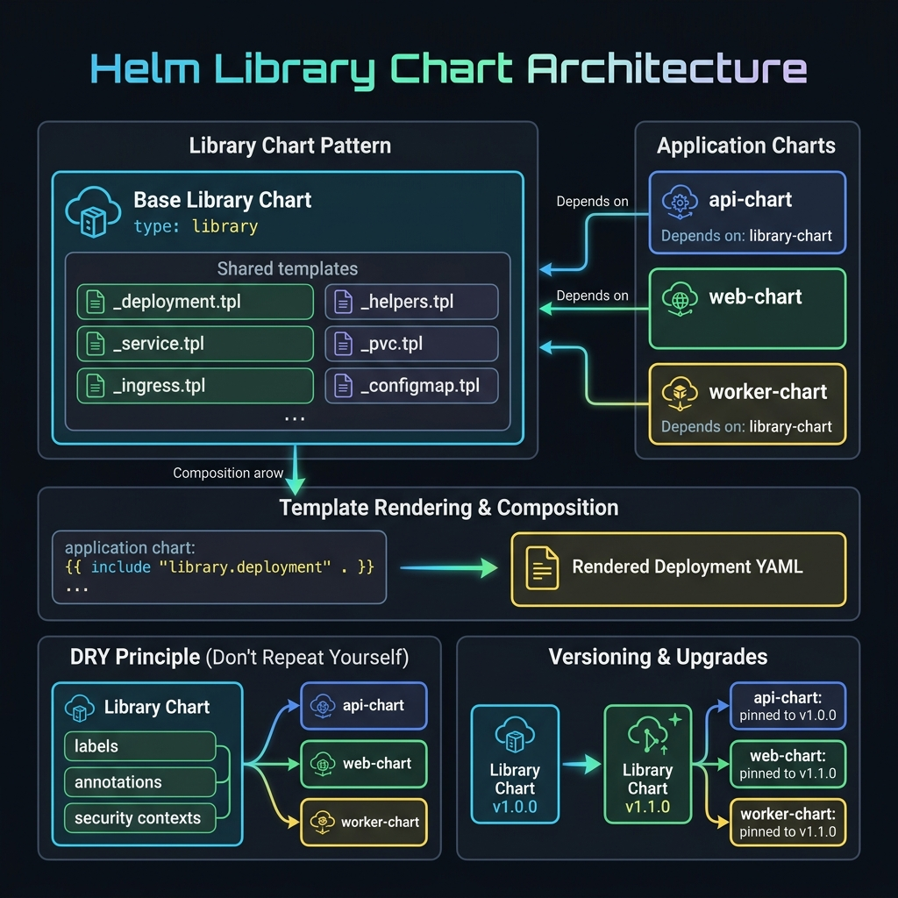

<!-- tags: kubernetes, k8s, helm, charts -->
# 📚 Library Charts & Subcharts

> Library charts provide reusable templates — the DRY principle for Helm charts.

| Aspect           | Detail                                           |
| ---------------- | ------------------------------------------------ |
| **Concept**      | `type: library` Chart, named templates           |
| **Use case**     | Shared templates, common patterns, org standards |
| **Go relevance** | Go packages = Helm library charts                |
| **CLI**          | `helm dependency`, Chart.yaml `type: library`    |

📅 Created: 2026-03-20 · 🔄 Updated: 2026-04-20 · ⏱️ 15 min read

---

## 1. DEFINE

Picture `Library Charts & Subcharts` appearing when a cluster is under specific operational pressure and you can no longer answer with generic YAML.

### Library Chart vs Application Chart

| Feature         | Application                | Library                       |
| --------------- | -------------------------- | ----------------------------- |
| **type**        | `application`              | `library`                     |
| **Installable** | ✅ Directly                | ❌ Must be a dependency       |
| **Templates**   | Render into K8s resources  | Only provide named templates  |
| **Purpose**     | Deploy an application      | Share template logic          |

### Subchart Override Rules

| Rule                 | Description                                  |
| -------------------- | -------------------------------------------- |
| Parent values win    | Parent chart overrides subchart defaults     |
| Global values shared | `.Values.global.*` accessible everywhere     |
| Subchart namespace   | Access: `.Values.<subchart-name>.key`        |
| Template isolation   | Subchart templates cannot access parent scope |

### Failure Modes

| Mistake                      | Cause                                     | Fix                         |
| ---------------------------- | ----------------------------------------- | --------------------------- |
| Library functions not found  | Dependency not downloaded                 | `helm dep update`           |
| Template scope wrong         | Library uses `.Values` that doesn't match parent | Pass scope via `include` |
| Version mismatch             | Library updated but consumer not          | Pin version + `helm dep up` |

---

Those failure modes sound clear. But there is a trap: a library dependency without `helm dep update` causes a "Chart not found" error, and a template naming collision leads to a silent override. That trap appears in PITFALLS.

## 2. VISUAL

The concept has a name. In the diagram, the critical part emerges: how a single library chart feeds shared templates into multiple application charts via composition.



### Library Chart Architecture

```text
┌──────────────────────────────────────────────────┐
│              common-lib (Library Chart)            │
│              type: library                         │
│                                                    │
│  templates/_helpers.tpl:                           │
│    common.labels                                   │
│    common.deployment                               │
│    common.service                                  │
│    common.ingress                                  │
│    common.configmap                                │
│    common.rbac                                     │
└──────────┬──────────────┬────────────────────────┘
           │              │
    dep    │       dep    │
           │              │
┌──────────▼──────┐  ┌───▼──────────────┐
│  go-api Chart   │  │  go-worker Chart │
│  type: app      │  │  type: app       │
│                 │  │                  │
│  uses:          │  │  uses:           │
│   common.deploy │  │   common.deploy  │
│   common.svc    │  │   common.labels  │
│   common.ingress│  │                  │
└─────────────────┘  └──────────────────┘
```

*Figure: The library chart contains only named templates — no K8s resources. Consumer charts import it as a dependency and call its templates via `include`.*

---

## 3. CODE

The diagram showed the dependency flow. Code below shows how to create a library chart, consume it, and build a multi-service umbrella chart.

### Example 1: Basic — Create a Library Chart

> **Goal**: Create a library chart with reusable common templates
> **Requires**: Helm 3.x
> **Outcome**: DRY templates for all charts in the org

```yaml
# common-lib/Chart.yaml
apiVersion: v2
name: common-lib
version: 1.0.0
type: library # ✅ Library — not installable
description: Common Helm templates for Go microservices
```

```yaml
# common-lib/templates/_deployment.tpl
{{/*
Standard Deployment template
Usage: {{ include "common.deployment" (dict "root" . "component" "api") }}
*/}}
{{- define "common.deployment" -}}
apiVersion: apps/v1
kind: Deployment
metadata:
  name: {{ include "common.fullname" .root }}-{{ .component }}
  labels:
    {{- include "common.labels" .root | nindent 4 }}
    app.kubernetes.io/component: {{ .component }}
spec:
  {{- if not .root.Values.autoscaling.enabled }}
  replicas: {{ .root.Values.replicaCount | default 1 }}
  {{- end }}
  selector:
    matchLabels:
      {{- include "common.selectorLabels" .root | nindent 6 }}
      app.kubernetes.io/component: {{ .component }}
  strategy:
    type: RollingUpdate
    rollingUpdate:
      maxSurge: 1
      maxUnavailable: 0
  template:
    metadata:
      labels:
        {{- include "common.selectorLabels" .root | nindent 8 }}
        app.kubernetes.io/component: {{ .component }}
    spec:
      serviceAccountName: {{ include "common.serviceAccountName" .root }}
      securityContext:
        runAsNonRoot: true
        runAsUser: 65534
        fsGroup: 65534
      containers:
        - name: {{ .component }}
          image: "{{ .root.Values.image.repository }}:{{ .root.Values.image.tag | default .root.Chart.AppVersion }}"
          imagePullPolicy: {{ .root.Values.image.pullPolicy }}
          ports:
            {{- range .root.Values.service.ports }}
            - name: {{ .name }}
              containerPort: {{ .containerPort }}
            {{- end }}
          {{- with .root.Values.resources }}
          resources:
            {{- toYaml . | nindent 12 }}
          {{- end }}
          {{- with .root.Values.livenessProbe }}
          livenessProbe:
            {{- toYaml . | nindent 12 }}
          {{- end }}
          {{- with .root.Values.readinessProbe }}
          readinessProbe:
            {{- toYaml . | nindent 12 }}
          {{- end }}
{{- end -}}
```

```yaml
# common-lib/templates/_labels.tpl
{{- define "common.fullname" -}}
{{- printf "%s-%s" .Release.Name .Chart.Name | trunc 63 | trimSuffix "-" }}
{{- end }}

{{- define "common.labels" -}}
helm.sh/chart: {{ printf "%s-%s" .Chart.Name .Chart.Version | replace "+" "_" }}
app.kubernetes.io/name: {{ .Chart.Name }}
app.kubernetes.io/instance: {{ .Release.Name }}
app.kubernetes.io/version: {{ .Chart.AppVersion | quote }}
app.kubernetes.io/managed-by: {{ .Release.Service }}
{{- with .Values.global.labels }}
{{ toYaml . }}
{{- end }}
{{- end }}

{{- define "common.selectorLabels" -}}
app.kubernetes.io/name: {{ .Chart.Name }}
app.kubernetes.io/instance: {{ .Release.Name }}
{{- end }}

{{- define "common.serviceAccountName" -}}
{{- default (include "common.fullname" .) .Values.serviceAccount.name }}
{{- end }}
```

### Consumer chart using the library:

```yaml
# go-api/Chart.yaml
apiVersion: v2
name: go-api
version: 1.0.0
type: application
dependencies:
    - name: common-lib
      version: '1.x.x'
      repository: 'file://../common-lib' # ✅ Local or OCI registry
```

```yaml
# go-api/templates/deployment.yaml — Using the library template
{{ include "common.deployment" (dict "root" . "component" "api") }}
```

> **✅ Outcome**: All Go microservices use shared templates — consistent across the org.
> **⚠️ Note**: Library chart changes → all consumers need `helm dep update`.

---

Library template is covered. But the consumer chart needs import — time to wire things up.

### Example 2: Intermediate — Subchart Communication

> **Goal**: Parent chart embeds subcharts, overrides values, wires internal connections
> **Requires**: Multi-service architecture
> **Outcome**: Full-stack chart package

```yaml
# parent-chart/Chart.yaml
dependencies:
    - name: go-api
      version: '1.0.0'
      repository: 'file://charts/go-api'
    - name: go-worker
      version: '1.0.0'
      repository: 'file://charts/go-worker'
    - name: postgresql
      version: '13.x.x'
      repository: https://charts.bitnami.com/bitnami
      condition: postgresql.enabled

# parent-chart/values.yaml — Override subchart values
go-api:
    replicaCount: 3
    image:
        tag: 'v1.2.0'
    env:
        DATABASE_URL: 'postgres://user:pass@{{ .Release.Name }}-postgresql:5432/myapp'

go-worker:
    replicaCount: 2
    image:
        tag: 'v1.2.0'
    env:
        QUEUE_URL: 'amqp://rabbitmq:5672'

postgresql:
    enabled: true
    auth:
        database: myapp
```

> **✅ Outcome**: Monorepo-style deployment, subcharts wired together.
> **⚠️ Note**: Subcharts install independently — good for testing isolation.

---

Consumer is covered. But versioning needs semver — time to manage releases.

### Example 3: Advanced — Operator Pattern with Go

> **Goal**: Create a Kubernetes Operator — manage CRDs lifecycle
> **Requires**: operator-sdk, kubebuilder
> **Outcome**: Custom controller for domain-specific automation

```go
// controllers/goapp_controller.go — Simplified operator reconciler
package controllers

import (
	"context"
	"fmt"

	appsv1 "k8s.io/api/apps/v1"
	corev1 "k8s.io/api/core/v1"
	metav1 "k8s.io/apimachinery/pkg/apis/meta/v1"
	ctrl "sigs.k8s.io/controller-runtime"
	"sigs.k8s.io/controller-runtime/pkg/client"
	"sigs.k8s.io/controller-runtime/pkg/log"

	appv1alpha1 "myoperator/api/v1alpha1"
)

// ✅ GoAppReconciler — reconciles GoApp CRD
type GoAppReconciler struct {
	client.Client
}

// ✅ Reconcile — called whenever a GoApp CRD changes
func (r *GoAppReconciler) Reconcile(ctx context.Context, req ctrl.Request) (ctrl.Result, error) {
	logger := log.FromContext(ctx)

	// Fetch GoApp CR
	var goapp appv1alpha1.GoApp
	if err := r.Get(ctx, req.NamespacedName, &goapp); err != nil {
		return ctrl.Result{}, client.IgnoreNotFound(err)
	}

	logger.Info("✅ Reconciling GoApp", "name", goapp.Name, "replicas", goapp.Spec.Replicas)

	// ✅ Create/Update Deployment
	deployment := &appsv1.Deployment{
		ObjectMeta: metav1.ObjectMeta{
			Name:      goapp.Name,
			Namespace: goapp.Namespace,
		},
		Spec: appsv1.DeploymentSpec{
			Replicas: &goapp.Spec.Replicas,
			Selector: &metav1.LabelSelector{
				MatchLabels: map[string]string{"app": goapp.Name},
			},
			Template: corev1.PodTemplateSpec{
				ObjectMeta: metav1.ObjectMeta{
					Labels: map[string]string{"app": goapp.Name},
				},
				Spec: corev1.PodSpec{
					Containers: []corev1.Container{{
						Name:  "app",
						Image: fmt.Sprintf("%s:%s", goapp.Spec.Image, goapp.Spec.Version),
						Ports: []corev1.ContainerPort{{ContainerPort: 8080}},
					}},
				},
			},
		},
	}

	// ✅ Set owner reference — garbage collection
	ctrl.SetControllerReference(&goapp, deployment, r.Scheme())

	// Create or update
	if err := r.Client.Patch(ctx, deployment, client.Apply,
		client.FieldOwner("goapp-controller")); err != nil {
		return ctrl.Result{}, err
	}

	// ✅ Update status
	goapp.Status.ReadyReplicas = deployment.Status.ReadyReplicas
	goapp.Status.Phase = "Running"
	r.Status().Update(ctx, &goapp)

	return ctrl.Result{}, nil
}

func (r *GoAppReconciler) SetupWithManager(mgr ctrl.Manager) error {
	return ctrl.NewControllerManagedBy(mgr).
		For(&appv1alpha1.GoApp{}).      // Watch GoApp CRD
		Owns(&appsv1.Deployment{}).      // Watch owned Deployments
		Complete(r)
}
```

> **✅ Outcome**: Custom operator manages app lifecycle through CRD.
> **⚠️ Note**: Operator = controller + CRD. Use kubebuilder to scaffold.

---

You have walked through library, consumer, and versioning. Now comes the dangerous part: missing dep update and naming collision — the trap set up from the beginning.

## 4. PITFALLS

| #   | Mistake                                              | Consequence                | Fix                                      |
| --- | ---------------------------------------------------- | -------------------------- | ---------------------------------------- |
| 1   | Library template scope is wrong                      | Nil pointer, empty output  | Pass `.` or `dict` with correct context  |
| 2   | Subchart values overridden by parent unexpectedly    | Config drift               | Explicit key paths, document the API     |
| 3   | Library version mismatch                             | Template not found         | Pin versions, follow semantic versioning |
| 4   | Forgot to run `helm dep update`                      | Chart not found error      | Add to CI pipeline, Makefile             |
| 5   | Operator reconcile loop runs infinitely              | CPU spike, API server load | Only update when state actually changes  |

---

## 5. REF

| Resource           | Link                                                                                                                        |
| ------------------ | --------------------------------------------------------------------------------------------------------------------------- |
| Library Charts     | [helm.sh/docs/topics/library_charts](https://helm.sh/docs/topics/library_charts/)                                           |
| Subcharts          | [helm.sh/docs/chart_template_guide/subcharts_and_globals](https://helm.sh/docs/chart_template_guide/subcharts_and_globals/) |
| Operator SDK       | [sdk.operatorframework.io](https://sdk.operatorframework.io/)                                                               |
| Kubebuilder        | [book.kubebuilder.io](https://book.kubebuilder.io/)                                                                         |
| controller-runtime | [pkg.go.dev/sigs.k8s.io/controller-runtime](https://pkg.go.dev/sigs.k8s.io/controller-runtime)                              |

---

## 6. RECOMMEND

| Extension              | When                 | Reason                             |
| ---------------------- | -------------------- | ---------------------------------- |
| **Kubebuilder**        | Creating CRD operators | Full framework, code generation   |
| **Operator SDK**       | Red Hat ecosystem    | Includes Helm/Ansible operators    |
| **OCI Chart Registry** | Distribute charts    | Push charts to Docker registry     |
| **Monorepo Helm**      | Multi-chart projects | Consistent versioning, shared libs |
| **Helm Dashboard**     | GUI management       | Komodor Helm Dashboard             |

---

## 🔍 Debug Checklist

| # | Symptom | Cause | Debug Command |
|---|---------|-------|---------------|
| 1 | `Error: found in Chart.yaml, but missing in charts/` when using library | `helm dep update` not run after adding library dependency | `helm dependency update ./consumer-chart` |
| 2 | `template: no template "common.labels" is associated with template` | Library chart not downloaded or template name wrong | `helm template ./chart --debug 2>&1 \| grep 'no template'` |
| 3 | Nil pointer in library template | Context not passed correctly — `include "lib.func"` missing `.` or `dict` wrong | `helm template ./chart -s templates/deployment.yaml --debug` |
| 4 | Library template renders as K8s resource (unexpected) | File in library `templates/` missing `_` prefix | Rename file to `_name.tpl` — only `_` files do not render |
| 5 | Named template conflict between consumer and library | Consumer redefines a name that collides with library | `helm template ./chart 2>&1 \| grep 'already defined'` |
| 6 | Subchart values overridden by parent unexpectedly | Parent values.yaml has a key matching subchart name | `helm get values <release> --all -n <ns>` |
| 7 | `include` with `tpl` function does not render variable | Missing context or `tpl` not receiving `.` | `{{ tpl .Values.someTemplate . }}` — must pass root context |

---

## 🃏 Quick Reference

| # | Pattern | Command / Rule |
|---|---------|----------------|
| 1 | Declare library chart | `type: library` in `Chart.yaml` |
| 2 | Define named template | `{{- define "common.labels" -}}...{{- end -}}` in `_helpers.tpl` |
| 3 | Include template with scope | `{{ include "common.labels" . \| nindent 4 }}` |
| 4 | Include with custom dict context | `{{ include "common.deployment" (dict "root" . "component" "api") }}` |
| 5 | Render string from values as template | `{{ tpl .Values.configTemplate . }}` |
| 6 | Reference library from local path | `repository: "file://../common-lib"` in Chart.yaml |
| 7 | Reference library from OCI | `repository: "oci://ghcr.io/myorg/charts"` |
| 8 | Update library dependency | `helm dependency update ./consumer-chart` |

---

## 🎯 Interview Angle

**Relevant system design / technical questions:**
- *"How does a library chart differ from an umbrella chart? When do you use each?"*
- *"How do you organize code reuse in Helm when you have many microservices charts?"*
- *"If a library chart introduces a breaking change, what is the process for updating all consumers?"*

**Points the interviewer wants to hear:**

| Topic | Talking Point |
|-------|---------------|
| Library vs umbrella | Library chart = shared template code (not installable); umbrella chart = parent that deploys multiple app subcharts together |
| Code reuse strategy | Library chart for common labels, standard Deployment structure, security context; consumer charts only need to override values |
| `define` vs `include` vs `template` | `define` declares, `include` calls and captures output (can pipe), `template` calls without capture — prefer `include` |
| Template isolation | Subchart templates cannot access parent scope; pass data via `.Values.global.*` or `dict` in `include` |
| Semantic versioning library | Pin `version: "1.x.x"` for minor-compatible; breaking changes → bump major version, notify consumers |
| `tpl` function | Renders a Go template string at runtime — useful when values contain template expressions, but watch out for injection |

**Common follow-up questions:**
- *"Why can't a library chart be installed directly with `helm install`?"* → `type: library` tells Helm not to render templates into K8s resources; it only exposes named templates to consumers through dependency.
- *"When should you extract a template into a library instead of copy-pasting between charts?"* → When 3+ charts use the same pattern — DRY principle; copy-paste leads to drift and inconsistency across the org.

---

**Links**: [← Lifecycle Hooks](./03-lifecycle-hooks.md) · [→ Plugins & Security](./05-plugins-security.md)
