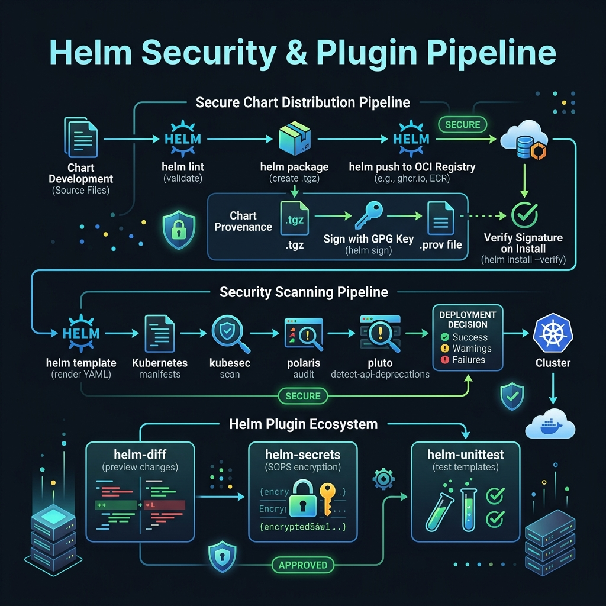

<!-- tags: kubernetes, k8s, helm, security -->
# 🔌 Helm Plugins & Security

> Extend the Helm CLI with plugins: diff, secrets, push — security best practices for production.

| Aspect           | Detail                                                       |
| ---------------- | ------------------------------------------------------------ |
| **Concept**      | Helm plugin system, OCI registries, signing                  |
| **Use case**     | Secure chart distribution, encrypted values, pre-deploy diff |
| **Go relevance** | Helm plugins are written in Go                               |
| **CLI**          | `helm plugin install`, `helm diff`, `helm secrets`           |

📅 Created: 2026-03-20 · 🔄 Updated: 2026-04-20 · ⏱️ 15 min read

---

## 1. DEFINE

Picture `Helm Plugins & Security` appearing when a cluster is under specific operational pressure and you can no longer answer with generic YAML.

### Essential Plugins

| Plugin             | Description                      | Command                    |
| ------------------ | -------------------------------- | -------------------------- |
| **helm-diff**      | Preview changes before upgrade   | `helm diff upgrade`        |
| **helm-secrets**   | Encrypt values with SOPS         | `helm secrets install`     |
| **helm-push**      | Push charts to OCI/Chartmuseum   | `helm push chart.tgz repo` |
| **helm-unittest**  | Unit test templates              | `helm unittest chart`      |
| **helm-dashboard** | Web UI for managing releases     | `helm dashboard`           |

### OCI Registry for Charts

| Feature          | ChartMuseum (Legacy) | OCI Registry             |
| ---------------- | -------------------- | ------------------------ |
| **Protocol**     | HTTP API             | OCI Distribution Spec    |
| **Registry**     | Dedicated server     | Docker Hub, GHCR, ECR... |
| **Auth**         | Basic/Token          | Docker login             |
| **Helm version** | 3.x                  | 3.8+                     |
| **Recommended**  | ❌ Legacy            | ✅ Standard              |

### Chart Signing & Verification

| Feature             | Description                  |
| ------------------- | ---------------------------- |
| **Provenance file** | `.prov` file — GPG signature |
| **Cosign**          | Sigstore-based signing       |
| **helm verify**     | Verify chart signature       |

### Failure Modes

| Mistake                    | Cause                             | Fix                           |
| -------------------------- | --------------------------------- | ----------------------------- |
| SOPS decrypt fails         | Missing GPG key or AWS KMS access | Configure SOPS keys correctly |
| OCI push rejected          | Auth expired                      | `helm registry login`         |
| helm-diff output too large | Many resources changed            | `--suppress` unchanged        |

---

Those failure modes sound easy to avoid. But there is a trap: a helm-secrets decrypt failure due to a missing GPG key blocks the deploy entirely, and installing a plugin without verifying its source is a supply chain risk. That trap appears in PITFALLS.

## 2. VISUAL

The definition locked the vocabulary. The visual below shows the full security pipeline from chart development through lint, scan, sign, and push to OCI registry.



### Secure Chart Distribution Flow

```text
Developer          CI/CD           OCI Registry        Production
    │                │                 │                    │
    │ helm package   │                 │                    │
    │ + cosign sign  │                 │                    │
    │───────────────►│                 │                    │
    │                │ helm push (OCI) │                    │
    │                │────────────────►│                    │
    │                │                 │                    │
    │                │   cosign verify │                    │
    │                │                 │◄───────────────────│
    │                │                 │ helm pull (OCI)    │
    │                │                 │───────────────────►│
    │                │                 │    helm install    │
```

*Figure: Charts are signed during CI, pushed to an OCI registry, then verified before production install. This ensures no tampering between build and deploy.*

---

## 3. CODE

The diagram showed the distribution flow. Code below shows how to use essential plugins, push to OCI registries, and sign charts for production.

### Example 1: Basic — helm-diff + helm-secrets

> **Goal**: Preview changes before deploy + encrypt sensitive values
> **Requires**: Helm plugins installed
> **Outcome**: Safe deployments, encrypted secrets in Git

```bash
# ✅ Install plugins
helm plugin install https://github.com/databus23/helm-diff
helm plugin install https://github.com/jkroepke/helm-secrets

# ✅ helm-diff: Preview changes BEFORE deploying
helm diff upgrade go-api ./chart -f values-prod.yaml
# default, go-api, Deployment (apps/v1) has changed:
# -  replicas: 3
# +  replicas: 5
# -  image: go-api:v1.1.0
# +  image: go-api:v1.2.0

# ✅ Only deploy if diff looks OK
helm diff upgrade go-api ./chart -f values-prod.yaml && \
  helm upgrade go-api ./chart -f values-prod.yaml
```

```yaml
# values-secrets.yaml — Encrypted with SOPS
# ✅ Create encrypted file:
# sops --encrypt --encrypt-suffix _encrypted values-secrets.yaml.dec > values-secrets.yaml
apiVersion: v1
data:
    database_url_encrypted: ENC[AES256_GCM,data:xxx,type:str]
    api_key_encrypted: ENC[AES256_GCM,data:yyy,type:str]
sops:
    kms:
        - arn: arn:aws:kms:us-east-1:123456:key/xxx-yyy
    version: 3.8.1
```

```bash
# ✅ Create .sops.yaml — configure SOPS encryption
cat > .sops.yaml <<EOF
creation_rules:
  - path_regex: values-secrets.*\.yaml$
    kms: "arn:aws:kms:us-east-1:123456:key/xxx-yyy"
    # Or use age:
    # age: age1xxx
    # Or PGP:
    # pgp: "FINGERPRINT"
EOF

# ✅ Encrypt
sops --encrypt values-secrets.yaml.dec > values-secrets.yaml

# ✅ Deploy with encrypted values
helm secrets upgrade go-api ./chart \
  -f values-prod.yaml \
  -f values-secrets.yaml         # ← Auto-decrypts at deploy time
```

> **✅ Outcome**: Preview changes + secrets encrypted in Git. Safe for GitOps.
> **⚠️ Note**: SOPS requires KMS/GPG/age key. CI needs access to the key for decryption.

---

Secrets plugin is covered. But RBAC needs a service account — time to restrict access.

### Example 2: Intermediate — OCI Registry

> **Goal**: Push/pull charts from an OCI registry (GHCR, ECR, Docker Hub)
> **Requires**: Helm 3.8+, registry access
> **Outcome**: Chart distribution just like Docker images

```bash
# ✅ Login to OCI registry
helm registry login ghcr.io -u $GITHUB_USER -p $GITHUB_TOKEN

# ✅ Package chart
helm package ./go-api-chart

# ✅ Push to OCI registry
helm push go-api-0.1.0.tgz oci://ghcr.io/myorg/charts

# ✅ Pull from OCI registry
helm pull oci://ghcr.io/myorg/charts/go-api --version 0.1.0

# ✅ Install directly from OCI
helm install go-api oci://ghcr.io/myorg/charts/go-api \
  --version 0.1.0 \
  -f values-prod.yaml

# ✅ Use in Chart.yaml dependencies
# dependencies:
#   - name: common-lib
#     version: "1.0.0"
#     repository: "oci://ghcr.io/myorg/charts"
```

> **✅ Outcome**: Charts distributed like Docker images. Same registry, same auth.
> **⚠️ Note**: OCI charts are immutable — you cannot re-push the same version.

---

RBAC is covered. But OCI registry needs image signing — time to verify.

### Example 3: Advanced — Chart Signing + CI Pipeline

> **Goal**: Sign charts with Cosign, verify in CI/CD
> **Requires**: Cosign installed, keyless signing (Fulcio)
> **Outcome**: Supply chain security for Helm charts

```bash
# ✅ Install cosign
go install github.com/sigstore/cosign/v2/cmd/cosign@latest

# ✅ Sign chart (keyless — Fulcio/Rekor)
cosign sign --yes ghcr.io/myorg/charts/go-api:0.1.0

# ✅ Verify before install
cosign verify ghcr.io/myorg/charts/go-api:0.1.0 \
  --certificate-identity-regexp=".*@myorg\.com" \
  --certificate-oidc-issuer="https://token.actions.githubusercontent.com"
```

```yaml
# .github/workflows/chart-release.yaml
name: Release Chart

on:
    push:
        tags: ['chart-v*']

jobs:
    release:
        runs-on: ubuntu-latest
        permissions:
            packages: write
            id-token: write # ✅ For Cosign keyless signing
        steps:
            - uses: actions/checkout@v4

            - name: Helm Package
              run: helm package ./chart

            - name: Login to GHCR
              run: helm registry login ghcr.io -u ${{ github.actor }} -p ${{ secrets.GITHUB_TOKEN }}

            - name: Push Chart
              run: |
                  CHART_FILE=$(ls *.tgz)
                  helm push $CHART_FILE oci://ghcr.io/${{ github.repository_owner }}/charts

            - name: Install Cosign
              uses: sigstore/cosign-installer@v3

            - name: Sign Chart
              run: |
                  CHART_NAME=$(helm show chart ./chart | grep '^name:' | awk '{print $2}')
                  CHART_VERSION=$(helm show chart ./chart | grep '^version:' | awk '{print $2}')
                  cosign sign --yes ghcr.io/${{ github.repository_owner }}/charts/${CHART_NAME}:${CHART_VERSION}
```

> **✅ Outcome**: Signed charts, keyless verification, supply chain security.
> **⚠️ Note**: Cosign keyless uses OIDC — CI/CD provider must support it.

---

You have walked through secrets, RBAC, and signing. Now comes the dangerous part: missing GPG key and unverified plugins — the trap set up from the beginning.

## 4. PITFALLS

| #   | Mistake                               | Consequence                  | Fix                                 |
| --- | ------------------------------------- | ---------------------------- | ----------------------------------- |
| 1   | `helm diff` output too large          | Hard to review               | `--suppress` flag, filter resources |
| 2   | SOPS key rotation → decrypt fails     | Deploy blocked               | Plan key rotation, re-encrypt files |
| 3   | OCI push with same version → rejected | Release pipeline fails       | Increment version, OCI is immutable |
| 4   | Plugin version incompatible           | Unexpected errors            | Pin plugin versions in CI           |
| 5   | Cosign verify fails in air-gapped env | Cannot validate chart origin | Pre-fetch Rekor/Fulcio certs        |

---

## 5. REF

| Resource     | Link                                                                         |
| ------------ | ---------------------------------------------------------------------------- |
| helm-diff    | [github.com/databus23/helm-diff](https://github.com/databus23/helm-diff)     |
| helm-secrets | [github.com/jkroepke/helm-secrets](https://github.com/jkroepke/helm-secrets) |
| OCI Support  | [helm.sh/docs/topics/registries](https://helm.sh/docs/topics/registries/)    |
| Cosign       | [github.com/sigstore/cosign](https://github.com/sigstore/cosign)             |
| SOPS         | [github.com/getsops/sops](https://github.com/getsops/sops)                   |

---

## 6. RECOMMEND

| Extension       | When                | Reason                           |
| --------------- | ------------------- | -------------------------------- |
| **Notation**    | Alternative signing | Microsoft/AWS signing tool       |
| **ChartMuseum** | Legacy environments | Self-hosted chart repo           |
| **Harbor**      | Enterprise registry | Charts + Images + Scanning       |
| **Datree**      | Policy enforcement  | Prevent misconfigs before deploy |
| **Snyk**        | Security scanning   | Scan charts for vulnerabilities  |

---

## 🔍 Debug Checklist

| # | Symptom | Cause | Debug Command |
|---|---------|-------|---------------|
| 1 | `helm secrets` decrypt fails with `failed to get the data key` | GPG key missing from keyring or KMS role lacks permission | `gpg --list-secret-keys` or `aws sts get-caller-identity` |
| 2 | `helm diff` shows no output | Plugin version too old or incompatible with current Helm version | `helm plugin list` and `helm diff version` |
| 3 | `helm push` returns `Error: 401 Unauthorized` | Registry token expired | `helm registry login ghcr.io -u $USER -p $TOKEN` |
| 4 | `helm plugin install` fails with network error | Firewall/proxy blocks GitHub, or URL changed | `helm plugin install <url> --debug` or download manually |
| 5 | SOPS encrypts file but cannot decrypt after key rotation | `.sops.yaml` points to old key, file not re-encrypted | `sops updatekeys values-secrets.yaml` |
| 6 | Cosign verify fails: `no matching signatures` | Chart push did not include sign step, or wrong registry reference | `cosign triangulate ghcr.io/myorg/charts/go-api:0.1.0` |
| 7 | `helm diff` output too large, hard to read | Many resources changed or full annotation diff | `helm diff upgrade --suppress-secrets --show-secrets=false` |

---

## 🃏 Quick Reference

| # | Pattern | Command / Rule |
|---|---------|----------------|
| 1 | Install helm-diff plugin | `helm plugin install https://github.com/databus23/helm-diff` |
| 2 | Install helm-secrets plugin | `helm plugin install https://github.com/jkroepke/helm-secrets` |
| 3 | Preview diff before upgrade | `helm diff upgrade <release> ./chart -f values-prod.yaml` |
| 4 | Deploy with encrypted values | `helm secrets upgrade <release> ./chart -f values.yaml -f values-secrets.yaml` |
| 5 | Encrypt file with SOPS | `sops --encrypt values-secrets.yaml.dec > values-secrets.yaml` |
| 6 | Login to OCI registry | `helm registry login ghcr.io -u $USER -p $TOKEN` |
| 7 | Push chart to OCI | `helm push go-api-0.1.0.tgz oci://ghcr.io/myorg/charts` |
| 8 | Sign chart with Cosign (keyless) | `cosign sign --yes ghcr.io/myorg/charts/go-api:0.1.0` |

---

## 🎯 Interview Angle

**Relevant system design / technical questions:**
- *"How do you manage secrets in Helm? Compare helm-secrets, External Secrets Operator, and Sealed Secrets."*
- *"What is the minimum RBAC for Helm in production? Why should you avoid cluster-admin?"*
- *"How do you ensure supply chain security for Helm charts — from build to deploy?"*

**Points the interviewer wants to hear:**

| Topic | Talking Point |
|-------|---------------|
| helm-secrets vs ESO | helm-secrets: decrypts at deploy time, secrets still in Git (encrypted); External Secrets Operator: pulls from Vault/AWS SM at runtime — no secrets in Git |
| Sealed Secrets | Encrypts with the controller's public key in the cluster — only that controller can decrypt; good for GitOps but tightly coupled to the cluster |
| Helm RBAC best practices | Use per-namespace ServiceAccount with Role (not ClusterRole) and limited verbs; avoid Tiller-style cluster-admin |
| `helm diff` in CI | Gate before every production upgrade — human review required; detects unexpected drift between desired and current state |
| OCI vs ChartMuseum | OCI is standard, immutable, uses the same registry as images; ChartMuseum is legacy, mutable, requires maintaining an extra service |
| Cosign supply chain | Sign during build (CI), verify before deploy (admission webhook) — ensures the chart was not tampered with between build and deploy |

**Common follow-up questions:**
- *"If a SOPS key is compromised, how do you rotate?"* → Create a new key, `sops updatekeys` on all encrypted files, revoke the old key — must re-encrypt all files before revoking.
- *"Can `helm diff` expose secrets?"* → Yes, if using `--show-secrets`; it suppresses by default — be careful when logging CI output.

---

**Links**: [← Library Charts](./04-library-charts.md) · [→ Custom Operators](./06-operators.md)
