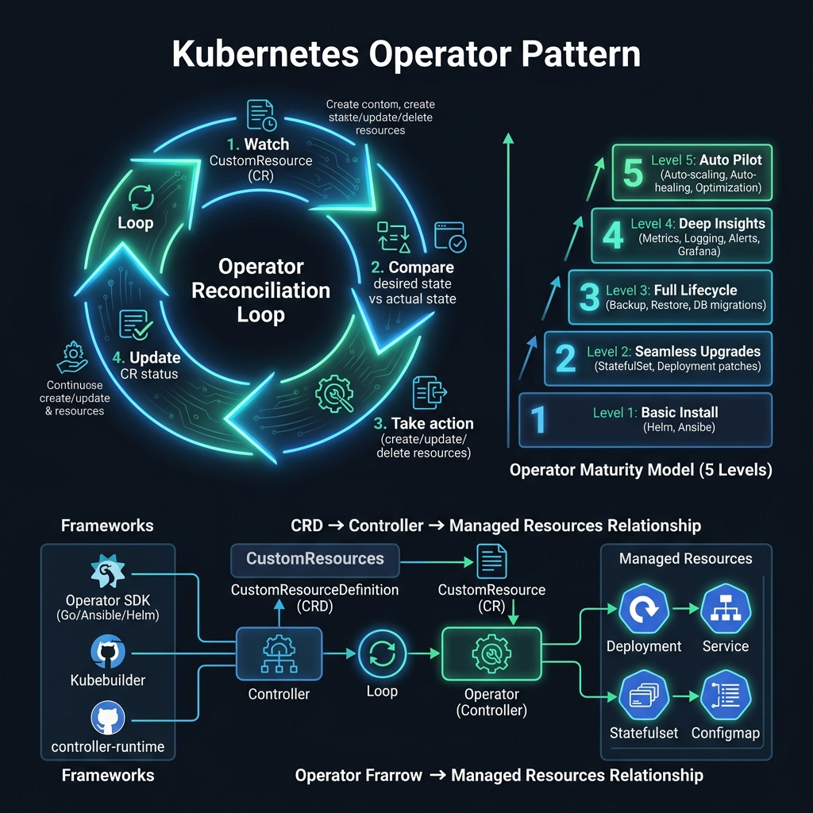

<!-- tags: kubernetes, k8s, helm, operators -->
# 🤖 Custom Operators (Go)

> Extend the K8s API with Custom Resource Definitions + Go controllers — domain-specific automation.

| Aspect           | Detail                                                  |
| ---------------- | ------------------------------------------------------- |
| **Tools**        | Kubebuilder, Operator SDK, controller-runtime           |
| **Use case**     | Automate complex deployment workflows, day-2 operations |
| **Go relevance** | Go is the standard language for writing operators       |
| **CLI**          | `kubebuilder init`, `operator-sdk`                      |

📅 Created: 2026-03-20 · 🔄 Updated: 2026-04-20 · ⏱️ 15 min read

---

## 1. DEFINE

Picture `Custom Operators (Go)` appearing when a cluster is under specific operational pressure and you can no longer answer with generic YAML.

### Operator Pattern

| Component                            | Role                                         |
| ------------------------------------ | -------------------------------------------- |
| **CRD** (Custom Resource Definition) | Extend K8s API — define new resource types   |
| **Controller**                       | Watch CRDs, reconcile desired → actual state |
| **Manager**                          | Run controllers, handle leader election      |
| **Webhook**                          | Validate/mutate CRDs before persistence      |

### Operator Maturity Model

| Level | Capability            | Example                                 |
| ----- | --------------------- | --------------------------------------- |
| 1     | **Basic Install**     | Helm install alternative                |
| 2     | **Seamless Upgrades** | Version-aware rolling updates           |
| 3     | **Full Lifecycle**    | Backup, restore, failover               |
| 4     | **Deep Insights**     | Metrics, alerts, log analysis           |
| 5     | **Auto Pilot**        | Auto-tuning, auto-scaling, self-healing |

### Reconciliation Loop

| Phase       | Action                                   |
| ----------- | ---------------------------------------- |
| **Observe** | Watch CRD changes (create/update/delete) |
| **Diff**    | Compare desired state vs actual state    |
| **Act**     | Create/update/delete child resources     |
| **Status**  | Update CRD status subresource            |

### Failure Modes

| Mistake                  | Cause                            | Fix                                  |
| ------------------------ | -------------------------------- | ------------------------------------ |
| Infinite reconcile loop  | Status update triggers reconcile | Check if change needed before update |
| Orphaned resources       | OwnerReference missing           | Always set controller reference      |
| CRD schema too strict    | New fields break backward compat | Versioned CRDs (v1, v2alpha1)        |

---

Those failure modes sound basic. But there is a trap: a reconcile loop running continuously wastes CPU and overloads the API server, and a CRD schema without validation allows invalid state. That trap appears in PITFALLS.

## 2. VISUAL

Theory sounds clean on paper. The visual below shows the reconciliation loop, the 5-level maturity model, and how CRDs connect to controllers and managed resources.



### Operator Architecture

```text
┌──────────────────────────────────────────────────┐
│                   K8s API SERVER                  │
│                                                   │
│  CRD: GoApp (apiVersion: app.example.com/v1)    │
│  ┌─────────────────────────────────────────┐    │
│  │  spec:                                   │    │
│  │    image: go-api                        │    │
│  │    version: v1.2.0                      │    │
│  │    replicas: 3                          │    │
│  │    database:                            │    │
│  │      engine: postgres                   │    │
│  │      size: 10Gi                         │    │
│  └─────────────────────────────────────────┘    │
└──────────────┬───────────────────────────────────┘
               │ Watch (informer)
               ▼
┌──────────────────────────────────────────────────┐
│              GO OPERATOR (Controller)             │
│                                                   │
│  func Reconcile(ctx, req) (Result, error) {      │
│    1. Get GoApp CR                               │
│    2. Create/Update Deployment                   │
│    3. Create/Update Service                      │
│    4. Create/Update PostgreSQL StatefulSet        │
│    5. Run DB migration Job                       │
│    6. Update GoApp.Status                        │
│  }                                               │
└──────────────┬───────────────────────────────────┘
               │ Create/Update
               ▼
  ┌──────────┐  ┌─────────┐  ┌────────────┐
  │Deployment│  │ Service │  │StatefulSet │
  │ go-api   │  │ go-api  │  │ postgres   │
  └──────────┘  └─────────┘  └────────────┘
```

*Figure: The operator watches CRD changes via an informer, reconciles desired state against actual state, and creates/updates child resources (Deployment, Service, StatefulSet) accordingly.*

---

## 3. CODE

The diagram showed the reconciliation architecture. Code below shows how to scaffold an operator, define CRDs, and implement a full reconciler.

### Example 1: Basic — Kubebuilder Scaffold

> **Goal**: Create an operator project with kubebuilder
> **Requires**: kubebuilder, Go 1.21+
> **Outcome**: Operator skeleton with CRD + controller

```bash
# ✅ Install kubebuilder
go install sigs.k8s.io/kubebuilder/v3/cmd/kubebuilder@latest

# ✅ Init project
mkdir go-app-operator && cd go-app-operator
kubebuilder init --domain example.com --repo github.com/myorg/go-app-operator

# ✅ Create API (CRD + Controller)
kubebuilder create api --group app --version v1 --kind GoApp --resource --controller

# ✅ Project structure
# .
# ├── api/v1/
# │   ├── goapp_types.go          ← CRD struct definition
# │   └── zz_generated.deepcopy.go
# ├── controllers/
# │   └── goapp_controller.go     ← Reconciler logic
# ├── config/
# │   ├── crd/                    ← Generated CRD YAML
# │   ├── rbac/                   ← RBAC permissions
# │   └── manager/                ← Manager deployment
# ├── main.go                     ← Entry point
# └── Makefile
```

```go
// api/v1/goapp_types.go — CRD Type Definition
package v1

import (
	metav1 "k8s.io/apimachinery/pkg/apis/meta/v1"
)

// ✅ GoAppSpec — desired state
type GoAppSpec struct {
	// Image repository
	// +kubebuilder:validation:Required
	Image string `json:"image"`

	// App version tag
	// +kubebuilder:validation:Pattern=`^v[0-9]+\.[0-9]+\.[0-9]+$`
	Version string `json:"version"`

	// Number of replicas
	// +kubebuilder:validation:Minimum=1
	// +kubebuilder:validation:Maximum=100
	// +kubebuilder:default=1
	Replicas int32 `json:"replicas,omitempty"`

	// Database configuration
	// +optional
	Database *DatabaseSpec `json:"database,omitempty"`

	// Resource requirements
	// +optional
	Resources *ResourceSpec `json:"resources,omitempty"`
}

type DatabaseSpec struct {
	// +kubebuilder:validation:Enum=postgres;mysql
	Engine string `json:"engine"`
	// +kubebuilder:default="10Gi"
	Size string `json:"size,omitempty"`
}

type ResourceSpec struct {
	CPU    string `json:"cpu,omitempty"`
	Memory string `json:"memory,omitempty"`
}

// ✅ GoAppStatus — observed state
type GoAppStatus struct {
	// +kubebuilder:validation:Enum=Pending;Running;Failed;Degraded
	Phase          string `json:"phase,omitempty"`
	ReadyReplicas  int32  `json:"readyReplicas,omitempty"`
	DatabaseReady  bool   `json:"databaseReady,omitempty"`
	CurrentVersion string `json:"currentVersion,omitempty"`
	// +optional
	Conditions []metav1.Condition `json:"conditions,omitempty"`
}

// +kubebuilder:object:root=true
// +kubebuilder:subresource:status
// +kubebuilder:printcolumn:name="Phase",type=string,JSONPath=`.status.phase`
// +kubebuilder:printcolumn:name="Ready",type=integer,JSONPath=`.status.readyReplicas`
// +kubebuilder:printcolumn:name="Version",type=string,JSONPath=`.status.currentVersion`
// +kubebuilder:printcolumn:name="Age",type=date,JSONPath=`.metadata.creationTimestamp`
type GoApp struct {
	metav1.TypeMeta   `json:",inline"`
	metav1.ObjectMeta `json:"metadata,omitempty"`
	Spec              GoAppSpec   `json:"spec,omitempty"`
	Status            GoAppStatus `json:"status,omitempty"`
}

// +kubebuilder:object:root=true
type GoAppList struct {
	metav1.TypeMeta `json:",inline"`
	metav1.ListMeta `json:"metadata,omitempty"`
	Items           []GoApp `json:"items"`
}
```

```bash
# ✅ Generate CRD manifests + code
make manifests generate

# ✅ Install CRD
make install

# ✅ Run operator locally (dev mode)
make run

# ✅ Deploy to cluster
make docker-build docker-push IMG=myregistry/go-app-operator:v1
make deploy IMG=myregistry/go-app-operator:v1
```

> **✅ Outcome**: CRD registered, controller scaffold ready.
> **⚠️ Note**: `kubebuilder` markers (`+kubebuilder:`) generate validation + docs.

---

Basic operator is covered. But the CRD needs validation — time to define the schema.

### Example 2: Intermediate — Full Reconciler Implementation

> **Goal**: Implement reconcile logic: Deployment + Service + Status
> **Requires**: Kubebuilder project from Example 1
> **Outcome**: Operator that manages the full app lifecycle

```go
// controllers/goapp_controller.go
package controllers

import (
	"context"
	"fmt"
	"time"

	appsv1 "k8s.io/api/apps/v1"
	corev1 "k8s.io/api/core/v1"
	"k8s.io/apimachinery/pkg/api/errors"
	metav1 "k8s.io/apimachinery/pkg/apis/meta/v1"
	"k8s.io/apimachinery/pkg/runtime"
	"k8s.io/apimachinery/pkg/types"
	"k8s.io/apimachinery/pkg/util/intstr"
	ctrl "sigs.k8s.io/controller-runtime"
	"sigs.k8s.io/controller-runtime/pkg/client"
	"sigs.k8s.io/controller-runtime/pkg/log"

	appv1 "github.com/myorg/go-app-operator/api/v1"
)

type GoAppReconciler struct {
	client.Client
	Scheme *runtime.Scheme
}

// ✅ RBAC markers — auto-generated RBAC rules
// +kubebuilder:rbac:groups=app.example.com,resources=goapps,verbs=get;list;watch;create;update;patch;delete
// +kubebuilder:rbac:groups=app.example.com,resources=goapps/status,verbs=get;update;patch
// +kubebuilder:rbac:groups=apps,resources=deployments,verbs=get;list;watch;create;update;patch;delete
// +kubebuilder:rbac:groups="",resources=services,verbs=get;list;watch;create;update;patch;delete

func (r *GoAppReconciler) Reconcile(ctx context.Context, req ctrl.Request) (ctrl.Result, error) {
	logger := log.FromContext(ctx)

	// ✅ Step 1: Fetch the GoApp instance
	var app appv1.GoApp
	if err := r.Get(ctx, req.NamespacedName, &app); err != nil {
		if errors.IsNotFound(err) {
			logger.Info("GoApp deleted, cleaning up")
			return ctrl.Result{}, nil
		}
		return ctrl.Result{}, err
	}

	logger.Info("Reconciling", "name", app.Name, "version", app.Spec.Version)

	// ✅ Step 2: Reconcile Deployment
	if err := r.reconcileDeployment(ctx, &app); err != nil {
		return ctrl.Result{}, r.updatePhase(ctx, &app, "Failed")
	}

	// ✅ Step 3: Reconcile Service
	if err := r.reconcileService(ctx, &app); err != nil {
		return ctrl.Result{}, r.updatePhase(ctx, &app, "Failed")
	}

	// ✅ Step 4: Update Status
	if err := r.updateStatus(ctx, &app); err != nil {
		return ctrl.Result{}, err
	}

	// ✅ Requeue after 30s to check health
	return ctrl.Result{RequeueAfter: 30 * time.Second}, nil
}

func (r *GoAppReconciler) reconcileDeployment(ctx context.Context, app *appv1.GoApp) error {
	desired := r.desiredDeployment(app)

	// ✅ Set owner reference — garbage collection
	if err := ctrl.SetControllerReference(app, desired, r.Scheme); err != nil {
		return err
	}

	// ✅ Create or Update
	var existing appsv1.Deployment
	err := r.Get(ctx, types.NamespacedName{Name: desired.Name, Namespace: desired.Namespace}, &existing)
	if errors.IsNotFound(err) {
		return r.Create(ctx, desired)
	}
	if err != nil {
		return err
	}

	// ✅ Update only if spec changed
	existing.Spec = desired.Spec
	return r.Update(ctx, &existing)
}

func (r *GoAppReconciler) desiredDeployment(app *appv1.GoApp) *appsv1.Deployment {
	labels := map[string]string{
		"app":                          app.Name,
		"app.kubernetes.io/managed-by": "go-app-operator",
		"version":                      app.Spec.Version,
	}

	return &appsv1.Deployment{
		ObjectMeta: metav1.ObjectMeta{
			Name:      app.Name,
			Namespace: app.Namespace,
			Labels:    labels,
		},
		Spec: appsv1.DeploymentSpec{
			Replicas: &app.Spec.Replicas,
			Selector: &metav1.LabelSelector{MatchLabels: labels},
			Template: corev1.PodTemplateSpec{
				ObjectMeta: metav1.ObjectMeta{Labels: labels},
				Spec: corev1.PodSpec{
					Containers: []corev1.Container{{
						Name:  "app",
						Image: fmt.Sprintf("%s:%s", app.Spec.Image, app.Spec.Version),
						Ports: []corev1.ContainerPort{{
							Name:          "http",
							ContainerPort: 8080,
						}},
					}},
				},
			},
		},
	}
}

func (r *GoAppReconciler) reconcileService(ctx context.Context, app *appv1.GoApp) error {
	desired := &corev1.Service{
		ObjectMeta: metav1.ObjectMeta{
			Name:      app.Name,
			Namespace: app.Namespace,
		},
		Spec: corev1.ServiceSpec{
			Selector: map[string]string{"app": app.Name},
			Ports: []corev1.ServicePort{{
				Name:       "http",
				Port:       80,
				TargetPort: intstr.FromInt(8080),
			}},
		},
	}
	ctrl.SetControllerReference(app, desired, r.Scheme)

	var existing corev1.Service
	err := r.Get(ctx, types.NamespacedName{Name: desired.Name, Namespace: desired.Namespace}, &existing)
	if errors.IsNotFound(err) {
		return r.Create(ctx, desired)
	}
	return err
}

func (r *GoAppReconciler) updateStatus(ctx context.Context, app *appv1.GoApp) error {
	var deploy appsv1.Deployment
	if err := r.Get(ctx, types.NamespacedName{Name: app.Name, Namespace: app.Namespace}, &deploy); err != nil {
		return err
	}

	app.Status.ReadyReplicas = deploy.Status.ReadyReplicas
	app.Status.CurrentVersion = app.Spec.Version
	if deploy.Status.ReadyReplicas == app.Spec.Replicas {
		app.Status.Phase = "Running"
	} else {
		app.Status.Phase = "Pending"
	}

	return r.Status().Update(ctx, app)
}

func (r *GoAppReconciler) updatePhase(ctx context.Context, app *appv1.GoApp, phase string) error {
	app.Status.Phase = phase
	return r.Status().Update(ctx, app)
}

func (r *GoAppReconciler) SetupWithManager(mgr ctrl.Manager) error {
	return ctrl.NewControllerManagedBy(mgr).
		For(&appv1.GoApp{}).
		Owns(&appsv1.Deployment{}).
		Owns(&corev1.Service{}).
		Complete(r)
}
```

```yaml
# Usage: kubectl apply
apiVersion: app.example.com/v1
kind: GoApp
metadata:
    name: my-api
spec:
    image: ghcr.io/myorg/go-api
    version: v1.2.0
    replicas: 3
    database:
        engine: postgres
        size: 20Gi
```

```bash
# ✅ Deploy
kubectl apply -f goapp.yaml

# ✅ Check status
kubectl get goapp
# NAME     PHASE    READY  VERSION   AGE
# my-api   Running  3      v1.2.0    5m

# ✅ Scale
kubectl patch goapp my-api --type merge -p '{"spec":{"replicas":5}}'
```

> **✅ Outcome**: Full operator: CRD → Controller → Deployment + Service + Status.
> **⚠️ Note**: Always set OwnerReference for garbage collection.

---

You have walked through operator, CRD schema, and reconciliation. Now comes the dangerous part: infinite reconcile loop and invalid CRD state — the trap set up from the beginning.

## 4. PITFALLS

| #   | Mistake                            | Consequence                     | Fix                                          |
| --- | ---------------------------------- | ------------------------------- | -------------------------------------------- |
| 1   | Infinite reconcile loop            | CPU waste, API server overload  | Check status before update, compare state    |
| 2   | Orphaned child resources           | Resources leak after CR deleted | Set OwnerReference, `Owns()` in setup        |
| 3   | CRD backward incompatibility      | Existing CRs break on upgrade  | Version CRDs: v1alpha1 → v1beta1 → v1        |
| 4   | RBAC missing → permission denied   | Controller cannot create resources | Check `+kubebuilder:rbac` markers         |
| 5   | Rate limiting too aggressive       | Slow reconciliation            | Tune controller manager rate limiter         |

---

## 5. REF

| Resource           | Link                                                                                           |
| ------------------ | ---------------------------------------------------------------------------------------------- |
| Kubebuilder Book   | [book.kubebuilder.io](https://book.kubebuilder.io/)                                            |
| Operator SDK       | [sdk.operatorframework.io](https://sdk.operatorframework.io/)                                  |
| controller-runtime | [pkg.go.dev/sigs.k8s.io/controller-runtime](https://pkg.go.dev/sigs.k8s.io/controller-runtime) |
| OperatorHub        | [operatorhub.io](https://operatorhub.io/)                                                      |
| client-go          | [github.com/kubernetes/client-go](https://github.com/kubernetes/client-go)                     |

---

## 6. RECOMMEND

| Extension              | When                          | Reason                           |
| ---------------------- | ----------------------------- | -------------------------------- |
| **Admission Webhooks** | Validate/mutate before create | Prevent invalid CRs              |
| **Finalizers**         | Cleanup external resources    | Pre-delete hooks for operators   |
| **Multi-version CRDs** | API evolution                | Webhook conversion between versions |
| **Helm Operator**      | Helm-based operators          | Simpler, Helm chart as operator  |
| **Metacontroller**     | Declarative controllers       | YAML-based controller logic      |

---

## 🔍 Debug Checklist

| # | Symptom | Cause | Debug Command |
|---|---------|-------|---------------|
| 1 | Reconcile loop runs continuously without stopping | Status update triggers a watch event → infinite loop | `kubectl logs -f deployment/<operator> -n <ns> \| grep 'Reconciling'` — check frequency |
| 2 | Controller panic: `runtime error: invalid memory address` | CRD not registered with Scheme, or nil pointer in reconciler | `kubectl logs deployment/<operator> -n <ns> --previous` |
| 3 | CRD does not appear after `kubectl apply` | CRD YAML has wrong `group`/`version`/`kind` or `make install` not run | `kubectl get crd \| grep example.com` and `kubectl describe crd goapps.app.example.com` |
| 4 | `kubectl get goapp` returns `No resources found` but CRD is applied | Controller watch not triggered — informer cache not synced | `kubectl get events -n <ns> --field-selector=reason=FailedSync` |
| 5 | `Error: forbidden: User cannot create deployments` | Operator ServiceAccount RBAC lacks permission | `kubectl auth can-i create deployments --as=system:serviceaccount:<ns>:<sa>` |
| 6 | Child resources not deleted when CRD instance is deleted | OwnerReference not set on child resources | `kubectl get deployment <name> -o yaml \| grep ownerReferences` |
| 7 | Operator deployed but CRD status never updates | `r.Status().Update()` skipped when `+kubebuilder:subresource:status` is missing | `kubectl get goapp -o yaml \| grep -A5 'status:'` |

---

## 🃏 Quick Reference

| # | Pattern | Command / Rule |
|---|---------|----------------|
| 1 | Init kubebuilder project | `kubebuilder init --domain example.com --repo github.com/myorg/operator` |
| 2 | Create CRD + Controller scaffold | `kubebuilder create api --group app --version v1 --kind GoApp --resource --controller` |
| 3 | Generate CRD YAML from Go types | `make manifests` |
| 4 | Install CRD into cluster | `make install` |
| 5 | Run controller locally (dev) | `make run` |
| 6 | Reconcile: do not requeue | `return ctrl.Result{}, nil` |
| 7 | Reconcile: requeue after delay | `return ctrl.Result{RequeueAfter: 30 * time.Second}, nil` |
| 8 | Reconcile: requeue immediately (error) | `return ctrl.Result{}, err` |

---

## 🎯 Interview Angle

**Relevant system design / technical questions:**
- *"When should you build a Kubernetes Operator instead of using a Helm chart? What are the trade-offs?"*
- *"Explain the reconcile loop pattern and why it must be idempotent."*
- *"What are Finalizers in a Kubernetes Operator? How do you implement them?"*

**Points the interviewer wants to hear:**

| Topic | Talking Point |
|-------|---------------|
| Operator vs Helm | Helm: static templating, deploy/upgrade/rollback; Operator: active controller, encodes operational knowledge (day-2 ops), reacts to state changes continuously |
| When to build an operator | Complex stateful workloads (databases, message queues), automated failover, custom upgrade strategies — when human operator knowledge needs to be codified |
| Reconcile idempotency | Reconcile can be called multiple times for the same event; must check existing state before create/update — `IsNotFound` pattern |
| Finalizers | Block deletion until cleanup is complete (delete external resources, PVs, DNS records); implement with `controllerutil.AddFinalizer` |
| OwnerReference | Set on child resources → K8s garbage collects automatically when the parent CRD is deleted; use `ctrl.SetControllerReference` |
| Operator Maturity | Level 1 (basic install) to Level 5 (auto-pilot) — the interviewer wants to know you understand operators are more than "a Helm replacement" |

**Common follow-up questions:**
- *"How do you avoid an infinite reconcile loop?"* → Only update status when the value actually changes; use `equality.Semantic.DeepEqual` to compare before calling `Update`; separate Spec reconcile and Status reconcile.
- *"Can a controller watch multiple resource types?"* → Yes, use the `Watches()` builder with `handler.EnqueueRequestForOwner` so that a change on a child resource triggers reconcile on the parent CR.

---

**Links**: [← Plugins & Security](./05-plugins-security.md) · [← README](./README.md)
