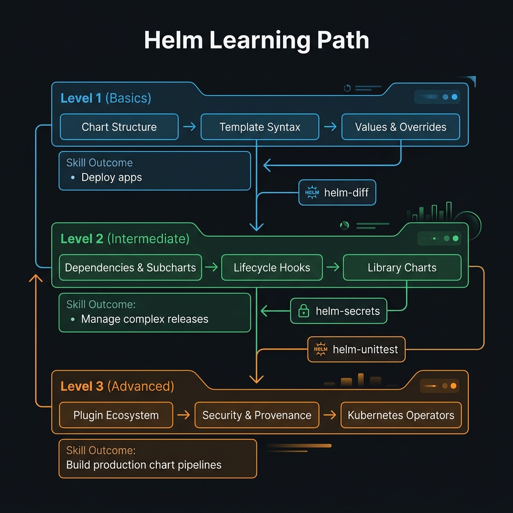

<!-- tags: overview -->
# Helm & Packaging

> Lane for chart structure, values, dependencies, hooks, and packaging strategy on K8s.

| Aspect | Detail |
| --- | --- |
| **Concept** | Navigation hub for `Helm & Packaging` |
| **Audience** | Platform engineer, chart maintainer, release engineer |
| **Primary style** | Concept-First router |
| **Entry point** | Open when the pain point is packaging/reuse/config sprawl on K8s. |

📅 Updated: 2026-04-20 · ⏱️ 6 min read

---

## 1. DEFINE

Picture `Helm & Packaging` appearing when a cluster is under a specific operational pressure and you can no longer answer with generic YAML.

When YAML has been duplicated across multiple environments and each release needs its own pile of overrides, the problem is no longer "write the manifest correctly." The problem is keeping the deployment package reviewable and reusable.

This hub does not replace individual articles. It exists to help you open the right lane before wandering into tool-specific syntax or diagrams. Reading in the right order reduces the feeling of "knowing many keywords but still unable to route the real problem."

### Signals & Boundaries

- Open this hub when you know the issue lives in `Helm & Packaging` but are unsure which article to read first.
- Use the coverage map to route by pain point, not by file order.
- Return here after each article to pick the next step with intention.

### Coverage Map

| Entry | Role |
| --- | --- |
| [Chart Structure & Go Templates](01-chart-structure.md) | Entry point for lane `Chart Structure & Go Templates` |
| [Values & Dependencies](02-values-dependencies.md) | Entry point for lane `Values & Dependencies` |
| [Lifecycle Hooks & Testing](03-lifecycle-hooks.md) | Entry point for lane `Lifecycle Hooks & Testing` |
| [Library Charts & Subcharts](04-library-charts.md) | Entry point for lane `Library Charts & Subcharts` |
| [Helm Plugins & Security](05-plugins-security.md) | Entry point for lane `Helm Plugins & Security` |
| [Custom Operators (Go)](06-operators.md) | Entry point for lane `Custom Operators (Go)` |

---

## 2. VISUAL

The definition locked the hub's scope. The visual below helps route by lane instead of scrolling a dry link list.



### Level 1

```text
start from current pain point
  -> Chart Structure & Go Templates
  -> Values & Dependencies
  -> Lifecycle Hooks & Testing
  -> Library Charts & Subcharts
  -> Helm Plugins & Security
  -> Custom Operators (Go)
```

*Figure: This hub works as a router, not a catalog to skim through.*

### Level 2

```text
read the right lane  -> reduces jumping between articles
read the wrong lane  -> the more you read, the more disconnected the terminology feels
```

*Figure: The real value of a router-style README is keeping the reader on the right path from the start.*

---

## 3. CODE

The diagram showed the routing rhythm. The artifact below turns the hub into a short worksheet so the team or learner can pick the right entry gate.

### Problem 1: Basic — Route the lane before reading deep

> **Goal**: Prevent study or review from drifting into "open whichever article looks interesting."
> **Approach**: Choose lane by current pain point.
> **Example**: Pick the right cluster to read in `Helm & Packaging`.
> **Complexity**: Basic

```yaml
router:
  module: Helm & Packaging
  rule: "choose lane by pain point, not by familiar name"
  suggested_path:
  - 01-chart-structure.md
  - 02-values-dependencies.md
  - 03-lifecycle-hooks.md
  - 04-library-charts.md
  - 05-plugins-security.md
  - 06-operators.md
```

This artifact does not solve the problem for you. It trims wrong lanes before your time is spent on articles that do not serve your current goal.

---

## 4. PITFALLS

| # | Severity | Mistake | Consequence | Fix |
| --- | --- | --- | --- | --- |
| 1 | 🔴 Fatal | Reading by file order instead of routing by pain point | Accumulates terminology without solving the real problem | Use the coverage map before opening a detail article |
| 2 | 🟡 Common | Treating the README as a pure link catalog | Loses the hub's routing purpose | Always ask "which lane matches my current pain?" |
| 3 | 🔵 Minor | Finishing an article without returning to the hub | Jumps to an adjacent article by instinct | Return to the README to pick the next step |

---

## 5. REF

| Resource | Type | Link | Notes |
| --- | --- | --- | --- |
| Chart Structure & Go Templates | Internal | [Chart Structure & Go Templates](01-chart-structure.md) | Directly related entry point |
| Values & Dependencies | Internal | [Values & Dependencies](02-values-dependencies.md) | Directly related entry point |
| Lifecycle Hooks & Testing | Internal | [Lifecycle Hooks & Testing](03-lifecycle-hooks.md) | Directly related entry point |
| Library Charts & Subcharts | Internal | [Library Charts & Subcharts](04-library-charts.md) | Directly related entry point |

---

## 6. RECOMMEND

Once you know which lane you are in, the next step is to open the first article of that lane instead of wandering into a new topic.

| Next step | When | Reason | File/Link |
| --- | --- | --- | --- |
| Chart Structure & Go Templates | When the pain point matches this lane | Continue into the right cluster | [Chart Structure & Go Templates](01-chart-structure.md) |
| Values & Dependencies | When the pain point matches this lane | Continue into the right cluster | [Values & Dependencies](02-values-dependencies.md) |
| Lifecycle Hooks & Testing | When the pain point matches this lane | Continue into the right cluster | [Lifecycle Hooks & Testing](03-lifecycle-hooks.md) |
