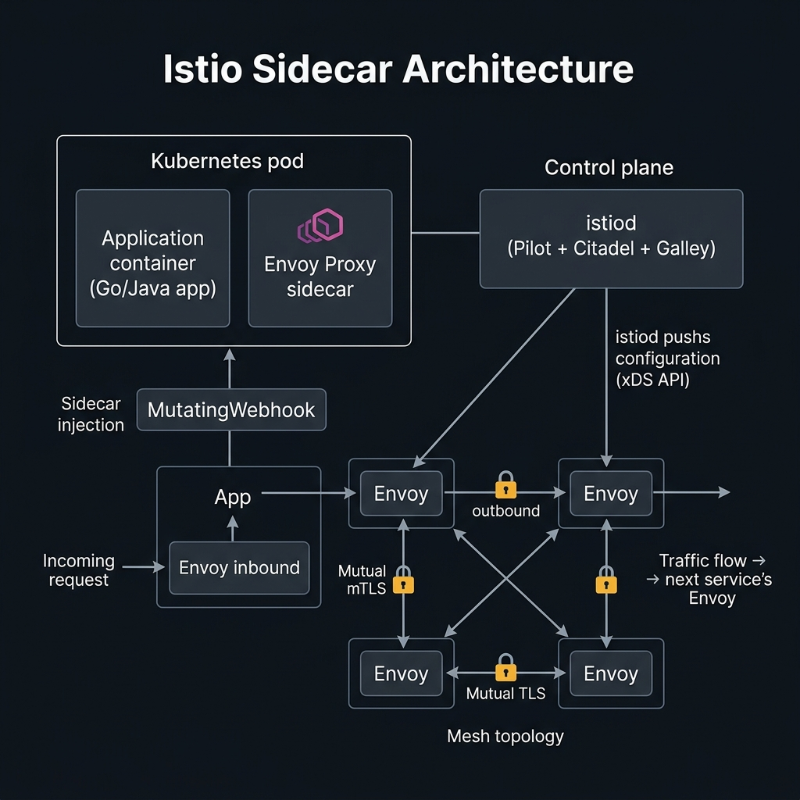

<!-- tags: kubernetes, k8s, istio, service-mesh -->
# 🔷 Architecture & Sidecar Proxy

> Istio injects an Envoy sidecar into every Pod — intercepting all traffic with zero code changes.

| Aspect           | Detail                                                 |
| ---------------- | ------------------------------------------------------ |
| **Tool**         | Istio 1.20+, Envoy Proxy                               |
| **Use case**     | mTLS, traffic routing, observability for microservices |
| **Go relevance** | Go services automatically gain mTLS, tracing, metrics  |
| **CLI**          | `istioctl`, `kubectl`                                  |

📅 Created: 2026-03-20 · 🔄 Updated: 2026-04-20 · ⏱️ 15 min read

---

## 1. DEFINE

Picture service mesh starting from the sidecar, because that is where traffic, security, and telemetry insert themselves into the application's path. Without understanding the sidecar, every higher-level promise of Istio remains vague.

### Istio Architecture

| Component       | Plane         | Role                                                   |
| --------------- | ------------- | ------------------------------------------------------ |
| **Envoy Proxy** | Data Plane    | Sidecar proxy — intercepts traffic                     |
| **istiod**      | Control Plane | Config distribution, cert authority, service discovery |
| **Pilot**       | Control Plane | xDS config → Envoy                                     |
| **Citadel**     | Control Plane | mTLS certificate management                            |
| **Galley**      | Control Plane | Config validation                                      |

### Sidecar Injection

| Method              | Description                                        |
| ------------------- | -------------------------------------------------- |
| **Namespace label** | `istio-injection=enabled` → all pods in namespace  |
| **Pod annotation**  | `sidecar.istio.io/inject: "true"` → specific pod   |
| **Manual**          | `istioctl kube-inject -f app.yaml`                 |

### Key CRDs

| CRD                     | Role                            | Example                        |
| ----------------------- | ------------------------------- | ------------------------------ |
| **VirtualService**      | Routing rules (L7)              | Route /api/v2 → canary service |
| **DestinationRule**     | Load balancing, circuit breaker | Round-robin, outlier detection |
| **Gateway**             | Ingress/Egress point            | HTTPS termination              |
| **PeerAuthentication**  | mTLS mode                       | STRICT, PERMISSIVE             |
| **AuthorizationPolicy** | Access control                  | Allow only namespace X         |

### Failure Modes

| Mistake               | Cause                     | Fix                                                |
| ---------------------- | ------------------------- | -------------------------------------------------- |
| Sidecar not injected   | Namespace label missing   | `kubectl label ns default istio-injection=enabled` |
| 503 errors             | Destination rule mismatch | Check DestinationRule subsets                      |
| mTLS handshake fail    | Mixed STRICT/PERMISSIVE   | Consistent PeerAuthentication                      |
| High latency           | Envoy overhead (~1ms p99) | Check Envoy stats, resource limits                 |

---

Those failure modes sound familiar. But there is a trap: a namespace missing the injection label means the sidecar never gets injected, and missing sidecar resource limits causes memory overhead. That trap appears in PITFALLS.

## 2. VISUAL

The definitions locked the vocabulary. The visual below shows how the control plane, data plane, and sidecar injection interact in a production Istio mesh.



### Sidecar Architecture

```text
┌───────────────────────────────────────────────┐
│                    POD                         │
│                                                │
│  ┌──────────────┐     ┌──────────────────┐    │
│  │   Go App     │     │   Envoy Sidecar  │    │
│  │   :8080      │◄───►│   :15001 (inbound)│   │
│  │              │     │   :15006 (outbound)│   │
│  │   - handles  │     │                   │   │
│  │     business │     │   - mTLS          │   │
│  │     logic    │     │   - routing       │   │
│  │              │     │   - metrics       │   │
│  │              │     │   - tracing       │   │
│  └──────────────┘     └──────────────────┘    │
│                                                │
│  iptables rules redirect all traffic → Envoy  │
└───────────────────────────────────────────────┘

   Inbound traffic flow:
   Client → iptables → Envoy :15006 → Go App :8080

   Outbound traffic flow:
   Go App → iptables → Envoy :15001 → External Service
```

### Control Plane ↔ Data Plane

```text
┌─────────────────────────────────────────────┐
│            CONTROL PLANE                     │
│                                              │
│  ┌───────────────────────────────────────┐  │
│  │              istiod                    │  │
│  │                                        │  │
│  │  Pilot: xDS config distribution       │  │
│  │  Citadel: mTLS certs (SPIFFE)         │  │
│  │  Galley: config validation            │  │
│  └──────────────┬────────────────────────┘  │
│                 │ xDS API (gRPC stream)      │
└─────────────────┼───────────────────────────┘
                  │
    ┌─────────────┼─────────────┐
    │             │             │
┌───▼───┐   ┌────▼────┐   ┌───▼───┐
│ Envoy │   │  Envoy  │   │ Envoy │
│ Pod-1 │   │  Pod-2  │   │ Pod-3 │
└───────┘   └─────────┘   └───────┘
    DATA PLANE
```

*Figure: istiod distributes config via xDS gRPC streams to all Envoy sidecars. Envoy intercepts 100% of pod traffic through iptables redirect — no application code changes required.*

---

## 3. CODE

The diagram showed the data flow. Code below shows how to install Istio, enable injection, and configure mTLS for Go services.

### Example 1: Basic — Install Istio + Enable Injection

> **Goal**: Install Istio, enable sidecar injection, verify
> **Requires**: K8s cluster ≥4 CPU, 8GB RAM
> **Outcome**: Istio service mesh running

```bash
# ✅ Install istioctl
curl -L https://istio.io/downloadIstio | sh -
export PATH=$PWD/istio-*/bin:$PATH

# ✅ Install Istio (demo profile for learning)
istioctl install --set profile=demo -y
# ✅ Production profile:
# istioctl install --set profile=default -y

# ✅ Verify installation
istioctl verify-install
kubectl get pods -n istio-system

# ✅ Enable sidecar injection for namespace
kubectl label namespace default istio-injection=enabled
```

```yaml
# k8s/go-api-istio.yaml — Deploy Go API (sidecar auto-injected)
apiVersion: apps/v1
kind: Deployment
metadata:
    name: go-api
    labels:
        app: go-api
        version: v1 # ✅ Version label for traffic routing
spec:
    replicas: 3
    selector:
        matchLabels:
            app: go-api
            version: v1
    template:
        metadata:
            labels:
                app: go-api
                version: v1
            annotations:
                # ✅ Sidecar resource limits (optional — recommended for production)
                sidecar.istio.io/proxyCPU: '100m'
                sidecar.istio.io/proxyMemory: '128Mi'
                sidecar.istio.io/proxyCPULimit: '500m'
                sidecar.istio.io/proxyMemoryLimit: '256Mi'
        spec:
            containers:
                - name: api
                  image: go-api:v1
                  ports:
                      - containerPort: 8080
                        name: http # ⚠️ Port name CRITICAL for Istio protocol detection
                  resources:
                      requests: { memory: '64Mi', cpu: '100m' }
                      limits: { memory: '256Mi', cpu: '500m' }
---
apiVersion: v1
kind: Service
metadata:
    name: go-api
spec:
    selector:
        app: go-api
    ports:
        - name: http # ⚠️ Name prefix = protocol (http, grpc, tcp)
          port: 80
          targetPort: 8080
```

```bash
# ✅ Deploy
kubectl apply -f k8s/go-api-istio.yaml

# ✅ Verify sidecar injection — Pod has 2 containers
kubectl get pods -l app=go-api
# NAME                      READY   STATUS    CONTAINERS
# go-api-xxxx-yyyy          2/2     Running   2  ← api + istio-proxy

# ✅ View Envoy sidecar config
istioctl proxy-config clusters go-api-xxxx-yyyy
istioctl proxy-status
```

> **✅ Outcome**: Go app with Envoy sidecar injected, mTLS automatic.
> **⚠️ Note**: Port name must match protocol: `http-*`, `grpc-*`, `tcp-*`.

---

Sidecar injection is covered. But the control plane needs config — time to tune.

### Example 2: Intermediate — Go gRPC Service with Istio mTLS

> **Goal**: Go gRPC service automatically gains mTLS through Istio, zero code changes
> **Requires**: Istio installed, Go gRPC service
> **Outcome**: Encrypted service-to-service communication

```go
// grpc-server/main.go — Go gRPC server (NO TLS code needed)
package main

import (
	"context"
	"log"
	"net"
	"os"

	"google.golang.org/grpc"
	"google.golang.org/grpc/reflection"
	pb "myapp/proto/user"
)

type userServer struct {
	pb.UnimplementedUserServiceServer
}

func (s *userServer) GetUser(ctx context.Context, req *pb.GetUserRequest) (*pb.GetUserResponse, error) {
	hostname, _ := os.Hostname()
	// ✅ Go app needs NO TLS code — Istio handles mTLS
	return &pb.GetUserResponse{
		Id:       req.Id,
		Name:     "Alice",
		ServedBy: hostname, // Track which pod served
	}, nil
}

func main() {
	port := os.Getenv("GRPC_PORT")
	if port == "" {
		port = "9090"
	}

	lis, err := net.Listen("tcp", ":"+port)
	if err != nil {
		log.Fatalf("❌ Listen: %v", err)
	}

	// ✅ Plain gRPC server — NO TLS credentials
	// Istio Envoy sidecar handles mTLS transparently
	server := grpc.NewServer()
	pb.RegisterUserServiceServer(server, &userServer{})
	reflection.Register(server)

	log.Printf("🚀 gRPC server on :%s (mTLS via Istio)", port)
	log.Fatal(server.Serve(lis))
}
```

```yaml
# k8s/peer-authentication.yaml — Enforce mTLS
apiVersion: security.istio.io/v1beta1
kind: PeerAuthentication
metadata:
    name: default
    namespace: production
spec:
    mtls:
        mode: STRICT # ✅ All traffic MUST use mTLS
        # PERMISSIVE = accept both plain + mTLS (migration phase)
        # STRICT = only mTLS (production)
---
# k8s/destination-rule.yaml — mTLS for outbound
apiVersion: networking.istio.io/v1beta1
kind: DestinationRule
metadata:
    name: go-api
spec:
    host: go-api.production.svc.cluster.local
    trafficPolicy:
        tls:
            mode: ISTIO_MUTUAL # ✅ Use Istio-managed certs
        connectionPool:
            http:
                h2UpgradePolicy: UPGRADE # ✅ HTTP/2 for gRPC
```

```bash
# ✅ Verify mTLS
istioctl authn tls-check go-api-xxxx.production go-api.production.svc.cluster.local
# HOST:PORT                                    STATUS   SERVER      CLIENT
# go-api.production.svc.cluster.local:80       OK       STRICT      ISTIO_MUTUAL
```

> **✅ Outcome**: Automatic mTLS between all services, Go code unchanged.
> **⚠️ Note**: Migration path: PERMISSIVE first → verify → STRICT.

---

Control plane is covered. But ambient mode needs evaluation — time to compare.

### Example 3: Advanced — Custom Envoy Filter (Go/Wasm)

> **Goal**: Extend Envoy with a Go/Wasm plugin — custom header, rate limiting
> **Requires**: proxy-wasm-go-sdk
> **Outcome**: Custom data plane logic

```go
// envoy-filter/main.go — Wasm plugin for Envoy
package main

import (
	"github.com/tetratelabs/proxy-wasm-go-sdk/proxywasm"
	"github.com/tetratelabs/proxy-wasm-go-sdk/proxywasm/types"
)

func main() {
	proxywasm.SetVMContext(&vmContext{})
}

type vmContext struct{ types.DefaultVMContext }

func (*vmContext) NewPluginContext(contextID uint32) types.PluginContext {
	return &pluginContext{}
}

type pluginContext struct{ types.DefaultPluginContext }

func (*pluginContext) NewHttpContext(contextID uint32) types.HttpContext {
	return &httpHeaders{}
}

// ✅ Custom HTTP filter
type httpHeaders struct{ types.DefaultHttpContext }

func (ctx *httpHeaders) OnHttpRequestHeaders(numHeaders int, endOfStream bool) types.Action {
	// ✅ Add custom header
	proxywasm.AddHttpRequestHeader("x-custom-auth", "validated")

	// ✅ Block requests without API key
	apiKey, err := proxywasm.GetHttpRequestHeader("x-api-key")
	if err != nil || apiKey == "" {
		proxywasm.SendHttpResponse(401, nil, []byte("Missing API key"), -1)
		return types.ActionPause
	}

	return types.ActionContinue
}

func (ctx *httpHeaders) OnHttpResponseHeaders(numHeaders int, endOfStream bool) types.Action {
	// ✅ Add response headers
	proxywasm.AddHttpResponseHeader("x-served-by", "go-wasm-filter")
	return types.ActionContinue
}
```

```yaml
# k8s/envoy-filter.yaml — Deploy Wasm filter
apiVersion: networking.istio.io/v1alpha3
kind: EnvoyFilter
metadata:
    name: custom-auth-filter
    namespace: production
spec:
    workloadSelector:
        labels:
            app: go-api
    configPatches:
        - applyTo: HTTP_FILTER
          match:
              context: SIDECAR_INBOUND
              listener:
                  filterChain:
                      filter:
                          name: envoy.filters.network.http_connection_manager
                          subFilter:
                              name: envoy.filters.http.router
          patch:
              operation: INSERT_BEFORE
              value:
                  name: envoy.filters.http.wasm
                  typedConfig:
                      '@type': type.googleapis.com/udpa.type.v1.TypedStruct
                      typeUrl: type.googleapis.com/envoy.extensions.filters.http.wasm.v3.Wasm
                      value:
                          config:
                              vmConfig:
                                  runtime: envoy.wasm.runtime.v8
                                  code:
                                      local:
                                          filename: /var/local/wasm/custom-auth.wasm
```

> **✅ Outcome**: Custom Envoy filter written in Go, injected into the data plane.
> **⚠️ Note**: Wasm filters are advanced. Most use cases are handled by VirtualService/AuthorizationPolicy.

---

You have walked through injection, control plane, and ambient mode. Now comes the dangerous part: missing labels and sidecar overhead — the trap set up from the beginning.

## 4. PITFALLS

| #   | Mistake                                   | Consequence                    | Fix                                           |
| --- | ----------------------------------------- | ------------------------------ | --------------------------------------------- |
| 1   | Pod shows 2/2 but sidecar is not ready    | Traffic not routed correctly   | Check `istioctl proxy-status`, view Envoy logs |
| 2   | Service port name missing protocol prefix | Istio cannot detect protocol   | Must use `http-`, `grpc-`, `tcp-` prefix       |
| 3   | Init container too slow → timeout         | Pod startup fails              | Exclude init containers from traffic capture   |
| 4   | Memory spike after enabling Istio         | Node resource exhaustion       | Set sidecar resource limits via annotations    |
| 5   | mTLS STRICT blocks external traffic       | Non-mesh clients get rejected  | Use `PeerAuthentication` per-service           |

---

## 5. REF

| Resource           | Link                                                                                                   |
| ------------------ | ------------------------------------------------------------------------------------------------------ |
| Istio Architecture | [istio.io/docs/ops/deployment/architecture](https://istio.io/latest/docs/ops/deployment/architecture/) |
| Envoy Proxy        | [envoyproxy.io](https://www.envoyproxy.io/)                                                            |
| proxy-wasm-go-sdk  | [github.com/tetratelabs/proxy-wasm-go-sdk](https://github.com/tetratelabs/proxy-wasm-go-sdk)           |
| SPIFFE/SPIRE       | [spiffe.io](https://spiffe.io/)                                                                        |

---

## 6. RECOMMEND

| Extension               | When                | Reason                       |
| ----------------------- | ------------------- | ---------------------------- |
| **Ambient Mesh**        | Istio 1.22+         | Sidecar-less mesh (ztunnel)  |
| **Kiali**               | Mesh visualization  | Service graph, traffic flow  |
| **Linkerd**             | Lighter alternative | Simpler, less resource usage |
| **Cilium Service Mesh** | eBPF-based          | No sidecar, kernel-level     |
| **SPIRE**               | Identity framework  | Workload identity management |

---

## 🔍 Debug Checklist

| # | Symptom | Cause | Debug Command |
|---|---------|-------|---------------|
| 1 | Pod has only 1/1 container, sidecar not injected | Namespace missing `istio-injection=enabled` label | `kubectl get ns <ns> --show-labels` |
| 2 | Sidecar injected but Envoy shows `0/1` | istiod has not synced xDS config yet | `istioctl proxy-status` |
| 3 | `istioctl proxy-status` shows STALE | Pilot–Envoy connection lost or config error | `istioctl proxy-config cluster <pod> -n <ns>` |
| 4 | 503 upstream connect error after enabling Istio | Service port name missing protocol prefix | `kubectl get svc -o yaml` — check `name: http-*` |
| 5 | Init container times out when injection enabled | iptables rules redirect into init containers | `kubectl describe pod <pod>` — view `istio-init` logs |
| 6 | Envoy memory/CPU abnormally high | Missing sidecar resource limits annotation | Add `sidecar.istio.io/proxyCPULimit` annotation to Pod |
| 7 | `istioctl analyze` reports `IST0101` error | Namespace/service missing `app` or `version` label | `istioctl analyze -n <ns>` |

---

## 🃏 Quick Reference

| # | Pattern | Command / Rule |
|---|---------|----------------|
| 1 | Enable sidecar injection for namespace | `kubectl label ns <ns> istio-injection=enabled` |
| 2 | Manually inject into a single file | `istioctl kube-inject -f app.yaml \| kubectl apply -f -` |
| 3 | Check sync status of all Envoy proxies | `istioctl proxy-status` |
| 4 | View Envoy cluster config for a pod | `istioctl proxy-config cluster <pod> -n <ns>` |
| 5 | View Envoy listener config | `istioctl proxy-config listener <pod> -n <ns>` |
| 6 | View Envoy route config | `istioctl proxy-config route <pod> -n <ns>` |
| 7 | Analyze entire mesh configuration | `istioctl analyze --all-namespaces` |
| 8 | Verify Istio installation succeeded | `istioctl verify-install` |

---

## 🎯 Interview Angle

**Relevant system design / technical questions:**
- *"Explain the difference between the Control Plane and Data Plane in Istio. What does istiod do?"*
- *"How does sidecar injection work? Why is no application code change needed?"*
- *"What is the xDS protocol and how does Envoy use it? What are the trade-offs of a service mesh?"*

**Points the interviewer wants to hear:**

| Topic | Talking Point |
|-------|---------------|
| Control Plane | istiod = Pilot (xDS config) + Citadel (mTLS certs/SPIFFE) + Galley (validation) — merged into 1 binary since Istio 1.5 |
| Data Plane | Envoy sidecar intercepts 100% of traffic via iptables redirect, no code changes needed |
| xDS Protocol | gRPC stream between istiod and Envoy — LDS, RDS, CDS, EDS — real-time config updates |
| Injection mechanics | MutatingWebhook intercepts Pod creation → injects `istio-proxy` container + `istio-init` init container automatically |
| Trade-offs | +mTLS/observability/routing, but adds ~1ms latency p99, memory per pod, debugging complexity |
| Ambient Mesh | Istio 1.22+ sidecar-less: ztunnel (L4) + waypoint proxy (L7) — significantly reduces resource overhead |

**Common follow-up questions:**
- *"Why are `app` and `version` labels needed on Pods?"* → Istio uses them to identify workloads in metrics/tracing and match DestinationRule subsets.
- *"What is the difference between PERMISSIVE and STRICT mTLS?"* → PERMISSIVE accepts both plaintext and mTLS (migration phase); STRICT accepts only mTLS (production).
- *"If the sidecar crashes, does traffic get dropped?"* → The Pod keeps running but loses mTLS/tracing/routing — a liveness probe on `istio-proxy` is needed.

---

**Links**: [← README](./README.md) · [→ Traffic Management](./02-traffic-management.md)
