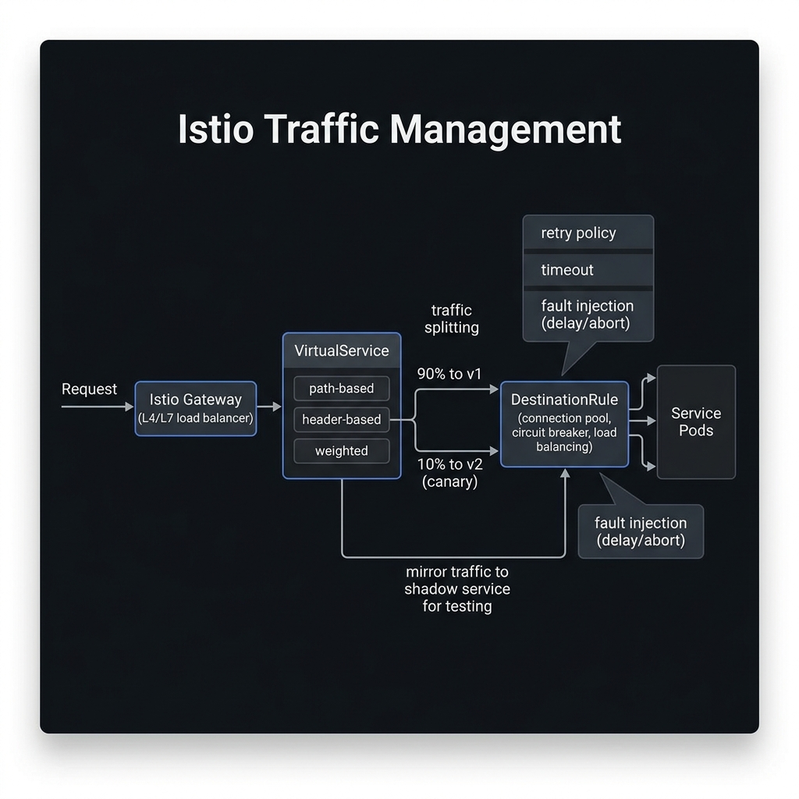

<!-- tags: kubernetes, k8s, istio, traffic-management -->
# 🛣️ Traffic Management

> VirtualService + DestinationRule = the routing engine for microservices — canary, A/B testing, fault injection.

| Aspect           | Detail                                                |
| ---------------- | ----------------------------------------------------- |
| **CRDs**         | `VirtualService`, `DestinationRule`, `Gateway`        |
| **Use case**     | Canary routing, header-based routing, fault injection |
| **Go relevance** | Zero-code traffic splitting for Go services           |
| **CLI**          | `istioctl proxy-config routes`                        |

📅 Created: 2026-03-20 · 🔄 Updated: 2026-04-20 · ⏱️ 15 min read

---

## 1. DEFINE

Picture traffic management as the place where a service mesh starts touching release decisions, resiliency, and routing. One wrong policy and the request path diverges entirely from what the team imagines.

### VirtualService vs DestinationRule

| CRD                 | Role                                | Scope                                |
| ------------------- | ----------------------------------- | ------------------------------------ |
| **VirtualService**  | WHERE to route traffic (rules)      | L7 routing decisions                 |
| **DestinationRule** | HOW to reach destination (policies) | Load balancing, circuit breaker, TLS |
| **Gateway**         | Entry point for external traffic    | Like Ingress but Istio-native        |

### Routing Match Conditions

| Match             | Field                      | Example                  |
| ----------------- | -------------------------- | ------------------------ |
| **URI**           | `exact`, `prefix`, `regex` | `/api/v2/*`              |
| **Headers**       | `exact`, `prefix`, `regex` | `x-user-type: premium`   |
| **Query params**  | `exact`, `regex`           | `?version=beta`          |
| **Source labels** | `sourceLabels`             | Only from `app: gateway` |
| **Port**          | `port`                     | Traffic on port 8080     |

### Traffic Policy Features

| Feature             | Description                | CRD             |
| ------------------- | -------------------------- | --------------- |
| **Weight routing**  | 90/10 split                | VirtualService  |
| **Mirror**          | Copy traffic (shadow)      | VirtualService  |
| **Fault injection** | Delay/abort                | VirtualService  |
| **Retry**           | Auto retry failed requests | VirtualService  |
| **Timeout**         | Request timeout            | VirtualService  |
| **Circuit breaker** | Outlier detection          | DestinationRule |
| **Connection pool** | Max connections            | DestinationRule |

### Failure Modes

| Mistake                 | Cause                              | Fix                                 |
| ----------------------- | ---------------------------------- | ----------------------------------- |
| 404 Not Found           | VirtualService host mismatch       | Check `hosts` field matches Service |
| 503 No healthy upstream | DestinationRule subset label wrong | Verify Pod labels match subset      |
| Infinite retry loop     | No `retries.retryOn` limit         | Set `maxRetries`, `perTryTimeout`   |
| Traffic not splitting   | Version label missing on Pods      | Add `version: v1/v2` labels         |

---

Those failure modes sound clear. But there is a trap: a DestinationRule subset label that does not match means 503 No healthy upstream, and a VirtualService with the wrong host sends traffic to the wrong place. That trap appears in PITFALLS.

## 2. VISUAL

The concept has a name. In the diagram, the more important part emerges: how requests route through Gateway, VirtualService, and DestinationRule before reaching pods.



### Traffic Routing Flow

```text
External        Istio Gateway        VirtualService       DestinationRule
Client              │                     │                     │
  │                 │                     │                     │
  ├───HTTPS────────►│                     │                     │
  │            SSL termination            │                     │
  │                 │                     │                     │
  │                 ├──── match rules ───►│                     │
  │                 │    uri: /api/v1     │                     │
  │                 │    header: x-beta   │                     │
  │                 │                     │                     │
  │                 │                     ├── route decision ──►│
  │                 │                     │   weight: 90% → v1  │
  │                 │                     │   weight: 10% → v2  │
  │                 │                     │                     │
  │                 │                     │                ┌────▼──────┐
  │                 │                     │                │ Subset v1 │
  │                 │                     │                │ Pods ×9   │
  │                 │                     │                ├───────────┤
  │                 │                     │                │ Subset v2 │
  │                 │                     │                │ Pods ×1   │
  │                 │                     │                └───────────┘
```

*Figure: External traffic enters through the Gateway, is matched against VirtualService rules, then routed to DestinationRule subsets by weight. This gives exact percentage-based traffic control, unlike K8s native pod-ratio splitting.*

---

## 3. CODE

The diagram showed the routing path. Code below shows how to expose services through a Gateway, set up canary deployments, and inject faults for resilience testing.

### Example 1: Basic — VirtualService + Gateway

> **Goal**: Expose Go API externally via Istio Gateway
> **Requires**: Istio installed, Go app deployed
> **Outcome**: L7 routing replacing Ingress

```yaml
# k8s/istio-gateway.yaml
apiVersion: networking.istio.io/v1beta1
kind: Gateway
metadata:
    name: api-gateway
spec:
    selector:
        istio: ingressgateway # ✅ Istio default ingress
    servers:
        - port:
              number: 443
              name: https
              protocol: HTTPS
          tls:
              mode: SIMPLE
              credentialName: api-tls-cert # ✅ TLS cert (K8s Secret)
          hosts:
              - 'api.example.com'
        - port:
              number: 80
              name: http
              protocol: HTTP
          tls:
              httpsRedirect: true # ✅ Force HTTPS
          hosts:
              - 'api.example.com'
---
apiVersion: networking.istio.io/v1beta1
kind: VirtualService
metadata:
    name: go-api-vs
spec:
    hosts:
        - 'api.example.com'
    gateways:
        - api-gateway # ✅ External traffic through Gateway
        - mesh # ✅ Internal traffic (pod-to-pod)
    http:
        # ✅ Path-based routing
        - match:
              - uri:
                    prefix: /api/v2
          route:
              - destination:
                    host: go-api-v2
                    port:
                        number: 80
        # ✅ Default route
        - route:
              - destination:
                    host: go-api
                    port:
                        number: 80
          timeout: 10s
          retries:
              attempts: 3
              perTryTimeout: 3s
              retryOn: 5xx,reset,connect-failure
```

```bash
# ✅ Get Istio Ingress Gateway IP
export INGRESS_IP=$(kubectl -n istio-system get service istio-ingressgateway \
  -o jsonpath='{.status.loadBalancer.ingress[0].ip}')
echo $INGRESS_IP

# ✅ Test
curl -H "Host: api.example.com" http://$INGRESS_IP/healthz
```

> **✅ Outcome**: L7 routing with path-based rules, auto-retry, timeout.
> **⚠️ Note**: `mesh` gateway for internal traffic, named gateway for external.

---

Traffic routing is covered. But weight-based splitting needs canary — time to split.

### Example 2: Intermediate — Canary Deployment (Weight-based)

> **Goal**: Route 10% traffic → v2, 90% → v1
> **Requires**: 2 versions deployed
> **Outcome**: Safe canary rollout

```yaml
# k8s/canary-routing.yaml
apiVersion: networking.istio.io/v1beta1
kind: DestinationRule
metadata:
    name: go-api-dr
spec:
    host: go-api
    trafficPolicy:
        connectionPool:
            tcp: { maxConnections: 100 }
            http: { h2UpgradePolicy: DEFAULT, maxRequestsPerConnection: 10 }
        outlierDetection:
            consecutive5xxErrors: 5 # ✅ Circuit break after 5 consecutive errors
            interval: 30s
            baseEjectionTime: 30s
            maxEjectionPercent: 50
    subsets:
        - name: v1
          labels:
              version: v1 # ✅ Match Pod labels
        - name: v2
          labels:
              version: v2
---
apiVersion: networking.istio.io/v1beta1
kind: VirtualService
metadata:
    name: go-api-canary
spec:
    hosts:
        - go-api
    http:
        # ✅ Header-based routing (internal testing)
        - match:
              - headers:
                    x-canary:
                        exact: 'true'
          route:
              - destination:
                    host: go-api
                    subset: v2
        # ✅ Weight-based canary
        - route:
              - destination:
                    host: go-api
                    subset: v1
                weight: 90 # ✅ 90% → v1
              - destination:
                    host: go-api
                    subset: v2
                weight: 10 # ✅ 10% → v2
```

```bash
# ✅ Test canary — 100 requests
for i in $(seq 1 100); do
  curl -s http://go-api/healthz | jq -r .version
done | sort | uniq -c
#  91 v1
#   9 v2

# ✅ Test header-based routing (QA team)
curl -H "x-canary: true" http://go-api/healthz
# → always v2

# ✅ Promote canary to 100%
# Update VirtualService weight: v1=0, v2=100
```

> **✅ Outcome**: Precise traffic control, header-based testing, progressive rollout.
> **⚠️ Note**: Istio weight routing is more accurate than K8s native pod-ratio splitting.

---

Canary is covered. But fault injection needs testing — time to simulate.

### Example 3: Advanced — Fault Injection + Traffic Mirroring

> **Goal**: Test resilience with fault injection, shadow traffic for v2 testing
> **Requires**: Running services with Istio
> **Outcome**: Chaos engineering + shadow testing

```yaml
# k8s/fault-injection.yaml — Test app resilience
apiVersion: networking.istio.io/v1beta1
kind: VirtualService
metadata:
    name: go-api-fault
spec:
    hosts:
        - go-api
    http:
        # ✅ Inject 3s delay into 10% of requests
        - fault:
              delay:
                  percentage:
                      value: 10.0
                  fixedDelay: 3s
              # ✅ Inject 503 error into 5% of requests
              abort:
                  percentage:
                      value: 5.0
                  httpStatus: 503
          route:
              - destination:
                    host: go-api
                    subset: v1
---
# k8s/traffic-mirror.yaml — Shadow traffic for testing
apiVersion: networking.istio.io/v1beta1
kind: VirtualService
metadata:
    name: go-api-mirror
spec:
    hosts:
        - go-api
    http:
        - route:
              - destination:
                    host: go-api
                    subset: v1
                weight: 100
          # ✅ Mirror 100% traffic to v2 (fire-and-forget)
          mirror:
              host: go-api
              subset: v2
          mirrorPercentage:
              value: 100.0 # ✅ Mirror all traffic
```

```go
// resilience/client.go — Go client resilient to fault injection
package resilience

import (
	"context"
	"fmt"
	"net/http"
	"time"

	"github.com/hashicorp/go-retryablehttp"
)

// ✅ Resilient HTTP client — handles Istio fault injection
func NewResilientClient() *http.Client {
	retryClient := retryablehttp.NewClient()
	retryClient.RetryMax = 3
	retryClient.RetryWaitMin = 100 * time.Millisecond
	retryClient.RetryWaitMax = 2 * time.Second
	retryClient.CheckRetry = func(ctx context.Context, resp *http.Response, err error) (bool, error) {
		if err != nil {
			return true, nil // ✅ Retry on connection errors
		}
		if resp.StatusCode >= 500 {
			return true, nil // ✅ Retry on 5xx (Istio fault injection)
		}
		return false, nil
	}

	return retryClient.StandardClient()
}

func CallServiceWithResilience(serviceURL string) (string, error) {
	client := NewResilientClient()

	ctx, cancel := context.WithTimeout(context.Background(), 10*time.Second)
	defer cancel()

	req, err := http.NewRequestWithContext(ctx, "GET", serviceURL+"/healthz", nil)
	if err != nil {
		return "", err
	}

	resp, err := client.Do(req)
	if err != nil {
		return "", fmt.Errorf("❌ Service call failed after retries: %w", err)
	}
	defer resp.Body.Close()

	return fmt.Sprintf("✅ Status: %d", resp.StatusCode), nil
}
```

> **✅ Outcome**: Chaos testing (fault injection) + shadow testing (traffic mirror).
> **⚠️ Note**: Mirror traffic is fire-and-forget. Responses from v2 are discarded.

---

You have walked through routing, canary, and fault injection. Now comes the dangerous part: label mismatch and wrong host — the trap set up from the beginning.

## 4. PITFALLS

| #   | Mistake                                | Consequence                  | Fix                                      |
| --- | -------------------------------------- | ---------------------------- | ---------------------------------------- |
| 1   | VirtualService does not apply          | Requests go to wrong service | `hosts` must match Service FQDN          |
| 2   | Subset missing → 503                   | No healthy upstream          | Create DestinationRule before VirtualService |
| 3   | Weights do not sum to 100              | Traffic distributed incorrectly | K8s validates but distribution is wrong |
| 4   | Fault injection affects production     | Real users experience errors | Use match conditions (headers, source)   |
| 5   | Mirror overloads v2                    | Shadow service crashes       | Set `mirrorPercentage` < 100             |

---

## 5. REF

| Resource                  | Link                                                                                                                                     |
| ------------------------- | ---------------------------------------------------------------------------------------------------------------------------------------- |
| Istio Traffic Management  | [istio.io/docs/concepts/traffic-management](https://istio.io/latest/docs/concepts/traffic-management/)                                   |
| VirtualService Reference  | [istio.io/docs/reference/config/networking/virtual-service](https://istio.io/latest/docs/reference/config/networking/virtual-service/)   |
| DestinationRule Reference | [istio.io/docs/reference/config/networking/destination-rule](https://istio.io/latest/docs/reference/config/networking/destination-rule/) |
| go-retryablehttp          | [github.com/hashicorp/go-retryablehttp](https://github.com/hashicorp/go-retryablehttp)                                                   |

---

## 6. RECOMMEND

| Extension         | When                        | Reason                            |
| ----------------- | --------------------------- | --------------------------------- |
| **Flagger**       | Auto canary promotion       | Metric-based progressive delivery |
| **Argo Rollouts** | Advanced rollout strategies | Blue-green, canary with analysis  |
| **Chaos Mesh**    | Full chaos engineering      | Network, disk, process faults     |
| **Litmus**        | Chaos experiments           | ChaosEngine, ChaosExperiment CRDs |
| **Gloo Edge**     | API Gateway                 | Envoy-based with function routing |

---

## 🔍 Debug Checklist

| # | Symptom | Cause | Debug Command |
|---|---------|-------|---------------|
| 1 | 503 No healthy upstream | DestinationRule subset label does not match Pod label | `kubectl get pods -l version=v1 -n <ns>` — verify labels |
| 2 | Traffic does not route to subset v2 despite 10% weight | Pod `version: v2` label missing or wrong | `istioctl proxy-config route <pod> -n <ns> --name 80` |
| 3 | VirtualService rules not applying | `hosts` field does not match Service name/FQDN | `kubectl get vs <name> -o yaml` — check `hosts` vs Service name |
| 4 | Timeout has no effect | VirtualService timeout overridden by DestinationRule | `istioctl proxy-config route <pod>` — inspect timeout setting |
| 5 | Retry creates a retry storm / loop | `retryOn` too broad, no `perTryTimeout` set | Add `perTryTimeout: 2s` and `retryOn: 5xx,reset` |
| 6 | Fault injection affects production requests | Match condition too broad | Add `match: headers: x-test: exact: "true"` |
| 7 | Traffic mirror overloads v2 service | `mirrorPercentage: 100` + v2 has low resources | Reduce `mirrorPercentage.value` to 10–20 |

---

## 🃏 Quick Reference

| # | Pattern | Command / Rule |
|---|---------|----------------|
| 1 | View current Envoy route config | `istioctl proxy-config route <pod> -n <ns>` |
| 2 | List all VirtualServices in namespace | `kubectl get virtualservice -n <ns>` |
| 3 | Create DestinationRule with 2 subsets | `spec.subsets: [{name: v1, labels: {version: v1}}, {name: v2, ...}]` |
| 4 | Weight-based canary 90/10 | `route: [{destination: {subset: v1}, weight: 90}, {destination: {subset: v2}, weight: 10}]` |
| 5 | Header-based routing | `match: [{headers: {x-canary: {exact: "true"}}}] → subset: v2` |
| 6 | Configure retry with timeout | `retries: {attempts: 3, perTryTimeout: 2s, retryOn: "5xx,reset,connect-failure"}` |
| 7 | Inject 3s delay into 10% of requests | `fault: {delay: {percentage: {value: 10.0}, fixedDelay: 3s}}` |
| 8 | Circuit breaker — outlier detection | `outlierDetection: {consecutive5xxErrors: 5, interval: 30s, baseEjectionTime: 30s}` |

---

## 🎯 Interview Angle

**Relevant system design / technical questions:**
- *"How does a VirtualService differ from a K8s Ingress? When do you use each?"*
- *"Explain how Istio does canary deployment more precisely than K8s native rolling update."*
- *"How does the circuit breaker in Istio work? What is outlier detection?"*

**Points the interviewer wants to hear:**

| Topic | Talking Point |
|-------|---------------|
| VirtualService vs Ingress | VS is an L7 routing engine — matches headers/query/source labels. Ingress only matches basic host/path |
| Canary vs Rolling Update | K8s rolling uses pod ratio (1/10 pods = 10%) — imprecise. Istio weight routing gives exact % on traffic |
| DestinationRule subsets | Must create DR before VS. Subset matches Pod labels → Envoy cluster. Missing DR → 503 |
| Circuit breaker | `outlierDetection` ejects a pod from the load balancer after N consecutive errors. `connectionPool` limits concurrent connections |
| Traffic mirroring | Fire-and-forget shadow traffic — tests v2 with production traffic, responses are dropped. Does not affect users |
| Fault injection | Chaos engineering at the mesh level — inject delay/abort without code, scopeable by headers |

**Common follow-up questions:**
- *"If weights do not sum to 100, what happens?"* → Istio still applies but distributes traffic inaccurately — always verify the total equals 100.
- *"Can you use a VirtualService without a DestinationRule?"* → Yes, if you do not need subsets/traffic policies — but circuit breaker requires a DR.
- *"Does fault injection affect client retry?"* → Yes — test fault injection combined with retry config to verify resilience.

---

**Links**: [← Architecture & Sidecar](./01-architecture-sidecar.md) · [→ Security & mTLS](./03-security-mtls.md)
