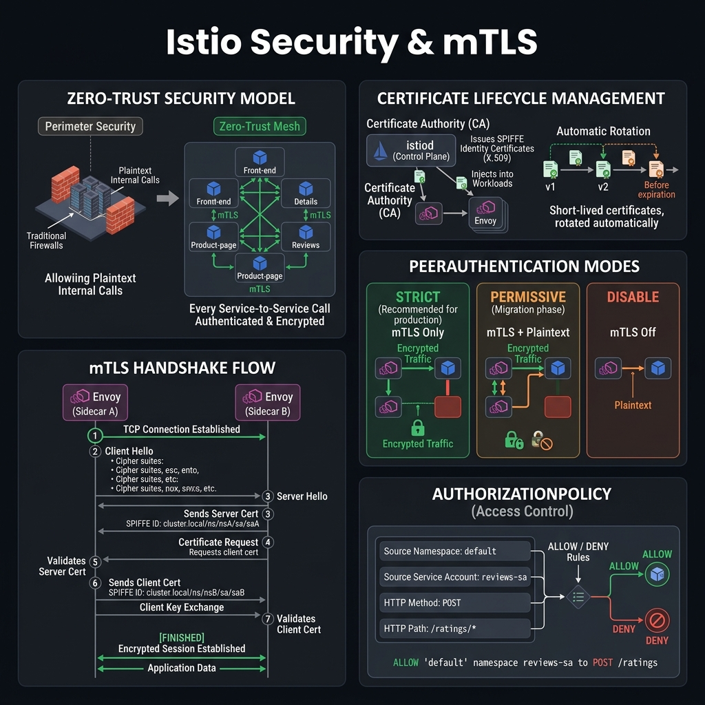

<!-- tags: kubernetes, k8s, istio, security -->
# 🔐 Security & mTLS

> Zero-trust security: automatic mTLS, fine-grained AuthorizationPolicy, JWT validation.

| Aspect           | Detail                                                               |
| ---------------- | -------------------------------------------------------------------- |
| **CRDs**         | `PeerAuthentication`, `AuthorizationPolicy`, `RequestAuthentication` |
| **Use case**     | Encrypt traffic, access control, JWT auth                            |
| **Go relevance** | Go services gain auto mTLS, no code changes                         |
| **CLI**          | `istioctl authn tls-check`                                           |

📅 Created: 2026-03-20 · 🔄 Updated: 2026-04-20 · ⏱️ 15 min read

---

## 1. DEFINE

Picture security in a mesh as something that goes far beyond the slogan "enable mTLS." It lies in how identity, certificates, and policies coordinate to be both safe and not shoot yourself in the foot.

### Security Layers

| Layer             | CRD                     | Description                   |
| ----------------- | ----------------------- | ----------------------------- |
| **Transport**     | `PeerAuthentication`    | mTLS mode (STRICT/PERMISSIVE) |
| **Origin**        | `RequestAuthentication` | JWT token validation          |
| **Authorization** | `AuthorizationPolicy`   | ALLOW/DENY rules per service  |

### mTLS Modes

| Mode           | Description              | Use case                   |
| -------------- | ------------------------ | -------------------------- |
| **DISABLE**    | No mTLS                  | Legacy services, migration |
| **PERMISSIVE** | Accept both plain + mTLS | Migration phase            |
| **STRICT**     | mTLS only                | Production                 |
| **UNSET**      | Inherit from parent      | Default                    |

### SPIFFE Identity

| Format                                           | Description       |
| ------------------------------------------------ | ----------------- |
| `spiffe://cluster.local/ns/production/sa/go-api` | Workload identity |
| `cluster.local`                                  | Trust domain      |
| `ns/production`                                  | Namespace         |
| `sa/go-api`                                      | ServiceAccount    |

### Failure Modes

| Mistake                | Cause                                    | Fix                      |
| ---------------------- | ---------------------------------------- | ------------------------ |
| Connection refused     | STRICT mTLS but client has no sidecar    | Enable sidecar injection |
| 403 RBAC access denied | AuthorizationPolicy deny                 | Check policy rules       |
| JWT validation failed  | Token expired or issuer wrong            | Verify JWT config        |

---

Those failure modes sound easy to avoid. But there is a trap: STRICT mTLS when the client has no sidecar means connection refused, and a PeerAuthentication with the wrong scope creates a security gap. That trap appears in PITFALLS.

## 2. VISUAL

The definition locked the vocabulary. The visual below shows how zero-trust mTLS, certificate rotation, PeerAuthentication modes, and AuthorizationPolicy interact at the Envoy level.



### Zero-Trust Security Architecture

```text
┌──────────────────────────────────────────────────────┐
│                ISTIO SECURITY MODEL                   │
│                                                       │
│  1. Transport Security (mTLS)                        │
│  ┌─────────────┐    mTLS     ┌─────────────┐       │
│  │ Service A   │◄═══════════►│ Service B   │       │
│  │ (Envoy)     │  SPIFFE ID  │ (Envoy)     │       │
│  └─────────────┘             └─────────────┘       │
│                                                       │
│  2. Origin Authentication (JWT)                      │
│  ┌─────────┐   JWT Token   ┌──────────────┐        │
│  │ Client  │──────────────►│ Envoy checks │        │
│  │ (User)  │               │ → RequestAuth│        │
│  └─────────┘               └──────────────┘        │
│                                                       │
│  3. Authorization (RBAC)                             │
│  ┌──────────────┐   ALLOW?  ┌──────────────┐       │
│  │ Source:      │──────────►│ AuthzPolicy  │       │
│  │  namespace   │           │ → ALLOW/DENY │       │
│  │  principal   │           │ → CUSTOM     │       │
│  │  IP          │           └──────────────┘       │
│  └──────────────┘                                    │
└──────────────────────────────────────────────────────┘
```

*Figure: Istio's three-layer security model — mTLS for transport, JWT for origin authentication, and AuthorizationPolicy for RBAC. Each layer operates independently and can be combined for full zero-trust.*

---

## 3. CODE

The diagram showed the security layers. Code below shows how to enforce mTLS, set up JWT authentication, and integrate external authorization with OPA.

### Example 1: Basic — mTLS + Authorization Policy

> **Goal**: Enforce STRICT mTLS + namespace-based access control
> **Requires**: Istio installed, multiple namespaces
> **Outcome**: Zero-trust service-to-service communication

```yaml
# k8s/security/peer-auth.yaml
apiVersion: security.istio.io/v1beta1
kind: PeerAuthentication
metadata:
    name: strict-mtls
    namespace: production
spec:
    mtls:
        mode: STRICT
---
# k8s/security/authz-policy.yaml — Fine-grained access control
apiVersion: security.istio.io/v1beta1
kind: AuthorizationPolicy
metadata:
    name: go-api-access
    namespace: production
spec:
    selector:
        matchLabels:
            app: go-api
    rules:
        # ✅ Allow gateway → go-api
        - from:
              - source:
                    principals: ['cluster.local/ns/production/sa/gateway']
          to:
              - operation:
                    methods: ['GET', 'POST', 'PUT', 'DELETE']
                    paths: ['/api/*']
        # ✅ Allow monitoring → health endpoints only
        - from:
              - source:
                    namespaces: ['monitoring']
          to:
              - operation:
                    methods: ['GET']
                    paths: ['/healthz', '/readyz', '/metrics']
        # ✅ Deny everything else (implicit deny when rules exist)
```

```bash
# ✅ Verify mTLS
istioctl authn tls-check $(kubectl get pod -l app=go-api -o name | head -1) \
  go-api.production.svc.cluster.local

# ✅ Test access — from allowed namespace
kubectl -n production exec deploy/gateway -- curl http://go-api/api/users
# → 200 OK

# ✅ Test access — from denied namespace
kubectl -n default exec deploy/test -- curl http://go-api.production/api/users
# → 403 RBAC: access denied
```

> **✅ Outcome**: STRICT mTLS + namespace/principal-based authorization.
> **⚠️ Note**: When an AuthorizationPolicy exists, traffic not matching any rules is DENIED.

---

mTLS setup is covered. But AuthorizationPolicy needs RBAC — time to enforce.

### Example 2: Intermediate — JWT Authentication

> **Goal**: Validate JWT tokens at the Envoy level, before they reach the Go app
> **Requires**: JWT issuer (Auth0, Keycloak, custom)
> **Outcome**: Authentication at the infrastructure level

```yaml
# k8s/security/jwt-auth.yaml
apiVersion: security.istio.io/v1beta1
kind: RequestAuthentication
metadata:
    name: jwt-auth
    namespace: production
spec:
    selector:
        matchLabels:
            app: go-api
    jwtRules:
        - issuer: 'https://auth.example.com/'
          jwksUri: 'https://auth.example.com/.well-known/jwks.json'
          forwardOriginalToken: true # ✅ Forward JWT to Go app
          outputPayloadToHeader: 'x-jwt-payload' # ✅ Decoded payload as header
---
# k8s/security/require-jwt.yaml — Require valid JWT
apiVersion: security.istio.io/v1beta1
kind: AuthorizationPolicy
metadata:
    name: require-jwt
    namespace: production
spec:
    selector:
        matchLabels:
            app: go-api
    rules:
        # ✅ Public endpoints — no JWT needed
        - to:
              - operation:
                    paths: ['/healthz', '/readyz', '/api/public/*']
        # ✅ Protected endpoints — require valid JWT
        - from:
              - source:
                    requestPrincipals: ['https://auth.example.com/*']
          to:
              - operation:
                    paths: ['/api/*']
          when:
              # ✅ Role-based: only admin can access /api/admin
              - key: request.auth.claims[role]
                values: ['admin']
                notValues: []
```

```go
// middleware/jwt.go — Go app reads pre-validated JWT from Istio
package middleware

import (
	"encoding/base64"
	"encoding/json"
	"net/http"
)

// ✅ JWT already validated by Istio — Go app only needs to read claims
func ExtractUser(r *http.Request) (*UserClaims, error) {
	// Istio forwards decoded payload as header
	payload := r.Header.Get("X-Jwt-Payload")
	if payload == "" {
		return nil, nil // Guest/public endpoint
	}

	decoded, err := base64.RawURLEncoding.DecodeString(payload)
	if err != nil {
		return nil, err
	}

	var claims UserClaims
	if err := json.Unmarshal(decoded, &claims); err != nil {
		return nil, err
	}

	return &claims, nil
}

type UserClaims struct {
	Sub   string `json:"sub"`
	Email string `json:"email"`
	Role  string `json:"role"`
}
```

> **✅ Outcome**: JWT validated at mesh level. Go app trusts pre-validated claims.
> **⚠️ Note**: `forwardOriginalToken: true` for backward compatibility.

---

AuthorizationPolicy is covered. But certificate rotation needs lifecycle — time to manage.

### Example 3: Advanced — External Authorization (OPA)

> **Goal**: Custom authorization logic with OPA (Open Policy Agent)
> **Requires**: OPA deployed, Istio ext-authz
> **Outcome**: Policy-as-code authorization

```yaml
# k8s/security/ext-authz.yaml
apiVersion: networking.istio.io/v1alpha3
kind: EnvoyFilter
metadata:
    name: ext-authz-filter
    namespace: production
spec:
    workloadSelector:
        labels:
            app: go-api
    configPatches:
        - applyTo: HTTP_FILTER
          match:
              context: SIDECAR_INBOUND
          patch:
              operation: INSERT_BEFORE
              value:
                  name: envoy.filters.http.ext_authz
                  typedConfig:
                      '@type': type.googleapis.com/envoy.extensions.filters.http.ext_authz.v3.ExtAuthz
                      grpcService:
                          envoyGrpc:
                              clusterName: outbound|9191||opa.production.svc.cluster.local
                          timeout: 1s
                      statusOnError:
                          code: Forbidden
---
# OPA deployment
apiVersion: apps/v1
kind: Deployment
metadata:
    name: opa
    namespace: production
spec:
    replicas: 2
    selector:
        matchLabels:
            app: opa
    template:
        spec:
            containers:
                - name: opa
                  image: openpolicyagent/opa:latest-envoy
                  args:
                      [
                          'run',
                          '--server',
                          '--addr=:8181',
                          '--diagnostic-addr=:8282',
                          '--set=plugins.envoy_ext_authz_grpc.addr=:9191',
                          '--set=decision_logs.console=true',
                          '/policies',
                      ]
                  ports:
                      - containerPort: 9191
                        name: grpc
                  volumeMounts:
                      - name: policy
                        mountPath: /policies
            volumes:
                - name: policy
                  configMap:
                      name: opa-policies
```

```rego
# policies/authz.rego — OPA policy
package envoy.authz

import input.attributes.request.http as http_request

default allow = false

# ✅ Allow health checks
allow {
    http_request.method == "GET"
    startswith(http_request.path, "/health")
}

# ✅ Allow authenticated users
allow {
    http_request.headers["x-jwt-payload"]
    claims := json.unmarshal(base64.decode(http_request.headers["x-jwt-payload"]))
    claims.role == "user"
}

# ✅ Admin-only endpoints
allow {
    startswith(http_request.path, "/api/admin")
    claims := json.unmarshal(base64.decode(http_request.headers["x-jwt-payload"]))
    claims.role == "admin"
}
```

> **✅ Outcome**: Policy-as-code, fine-grained authorization, auditable.
> **⚠️ Note**: OPA ext-authz adds ~1-5ms latency per request.

---

You have walked through mTLS, AuthorizationPolicy, and cert rotation. Now comes the dangerous part: sidecar-less rejection and scope gaps — the trap set up from the beginning.

## 4. PITFALLS

| #   | Mistake                               | Consequence                  | Fix                                    |
| --- | ------------------------------------- | ---------------------------- | -------------------------------------- |
| 1   | STRICT mTLS blocks non-mesh services | Non-sidecar clients rejected | Use PERMISSIVE before migrating        |
| 2   | AuthorizationPolicy implicit deny     | Health checks get blocked    | Add explicit rule for health endpoints |
| 3   | JWT issuer URL mismatch               | All tokens rejected          | Exact match: trailing `/` matters      |
| 4   | JWKS cache stale                      | Valid tokens rejected        | Set shorter `jwksCacheRefreshInterval` |
| 5   | OPA policy blocks after deploy        | All requests denied          | Test policies first with `opa eval`    |

---

## 5. REF

| Resource             | Link                                                                                                                                         |
| -------------------- | -------------------------------------------------------------------------------------------------------------------------------------------- |
| Istio Security       | [istio.io/docs/concepts/security](https://istio.io/latest/docs/concepts/security/)                                                           |
| Authorization Policy | [istio.io/docs/reference/config/security/authorization-policy](https://istio.io/latest/docs/reference/config/security/authorization-policy/) |
| OPA Envoy Plugin     | [openpolicyagent.org/docs/envoy](https://www.openpolicyagent.org/docs/latest/envoy-introduction/)                                            |
| SPIFFE               | [spiffe.io](https://spiffe.io/)                                                                                                              |

---

## 6. RECOMMEND

| Extension                | When              | Reason                   |
| ------------------------ | ----------------- | ------------------------ |
| **SPIRE**                | Advanced identity | Workload attestation     |
| **Kyverno**              | K8s policy engine | Simpler than OPA for K8s |
| **Cert-Manager + Istio** | Custom CA         | Integrate external PKI   |
| **Vault Agent**          | Dynamic secrets   | Per-pod secret injection |
| **OAuth2 Proxy**         | Web app auth      | SSO for dashboards       |

---

## 🔍 Debug Checklist

| # | Symptom | Cause | Debug Command |
|---|---------|-------|---------------|
| 1 | Connection refused after setting STRICT mTLS | Client service has no sidecar (plaintext rejected) | `istioctl authn tls-check <pod> <service-fqdn>` |
| 2 | `upstream connect error or disconnect/reset` | DestinationRule missing `tls.mode: ISTIO_MUTUAL` | `istioctl proxy-config cluster <pod> --fqdn <svc>` |
| 3 | 403 RBAC: access denied | AuthorizationPolicy has no rule matching the request | `kubectl logs <pod> -c istio-proxy \| grep rbac` |
| 4 | JWT token rejected — 401 Unauthorized | Issuer URL mismatch (trailing slash) or token expired | `kubectl describe RequestAuthentication <name>` — verify `issuer` field |
| 5 | JWKS cache stale — valid token rejected | JWKS refresh interval too long after key rotation | Add `jwksCacheRefreshInterval: 30m` to jwtRules |
| 6 | Health endpoints blocked with 403 | AuthorizationPolicy implicit deny — missing rule for `/healthz` | Add explicit rule `paths: ["/healthz", "/readyz"]` |
| 7 | mTLS works with PERMISSIVE but fails with STRICT | Service outside mesh (external) or cron job calls service | Use `PeerAuthentication` per-port exception: `portLevelMtls` |

---

## 🃏 Quick Reference

| # | Pattern | Command / Rule |
|---|---------|----------------|
| 1 | Verify mTLS status between pod and service | `istioctl authn tls-check <pod.ns> <svc.ns.svc.cluster.local>` |
| 2 | Set STRICT mTLS for entire namespace | `spec.mtls.mode: STRICT` in PeerAuthentication, `namespace: <ns>` |
| 3 | Set PERMISSIVE for migration | `spec.mtls.mode: PERMISSIVE` — accepts both plain + mTLS |
| 4 | Allow only from specific namespace | `AuthorizationPolicy.rules[].from[].source.namespaces: ["frontend"]` |
| 5 | Allow by SPIFFE principal | `source.principals: ["cluster.local/ns/prod/sa/go-api"]` |
| 6 | Require JWT + enforce claims | `RequestAuthentication` + `AuthorizationPolicy` with `when: key: request.auth.claims[role]` |
| 7 | Forward JWT payload to Go app | `jwtRules[].outputPayloadToHeader: "x-jwt-payload"` |
| 8 | View pod's SPIFFE certificate identity | `istioctl proxy-config secret <pod> -n <ns>` |

---

## 🎯 Interview Angle

**Relevant system design / technical questions:**
- *"How does mTLS in Istio differ from TLS at the application layer? Who manages the certificates?"*
- *"Explain the zero-trust model in Istio. When do you use STRICT vs PERMISSIVE?"*
- *"When do you use JWT, when do you use mTLS? How do they complement each other?"*

**Points the interviewer wants to hear:**

| Topic | Talking Point |
|-------|---------------|
| mTLS vs App TLS | App TLS = dev manages certs manually. Istio mTLS = istiod/Citadel auto-issues SPIFFE cert, rotates every 24h, zero code changes |
| SPIFFE Identity | Each service has identity `spiffe://cluster.local/ns/<ns>/sa/<sa>` — distinguished by ServiceAccount, not IP |
| STRICT vs PERMISSIVE | PERMISSIVE for migration (legacy service without sidecar). STRICT for production — rejects all plaintext |
| AuthorizationPolicy | Implicit deny — when a policy exists, traffic not matching rules is DENIED. Must explicitly allow health endpoints |
| JWT + mTLS combined | mTLS verifies machine identity (service-to-service). JWT verifies user identity (end-user). Use both for full zero-trust |
| OPA ext-authz | Complex authorization logic (attribute-based, tenancy) that cannot be expressed with AuthorizationPolicy → OPA |

**Common follow-up questions:**
- *"If you delete PeerAuthentication, does traffic still work?"* → Yes, mode reverts to PERMISSIVE/UNSET — it does not automatically become STRICT.
- *"At which port does the sidecar handle mTLS?"* → Envoy inbound `:15006`, outbound `:15001` — the app only sees plaintext on localhost.
- *"When the cert expires, does the service go down?"* → No, Citadel auto-rotates before expiry (default 24h TTL, rotates every 12h).

---

**Links**: [← Traffic Management](./02-traffic-management.md) · [→ Observability](./04-observability.md)
