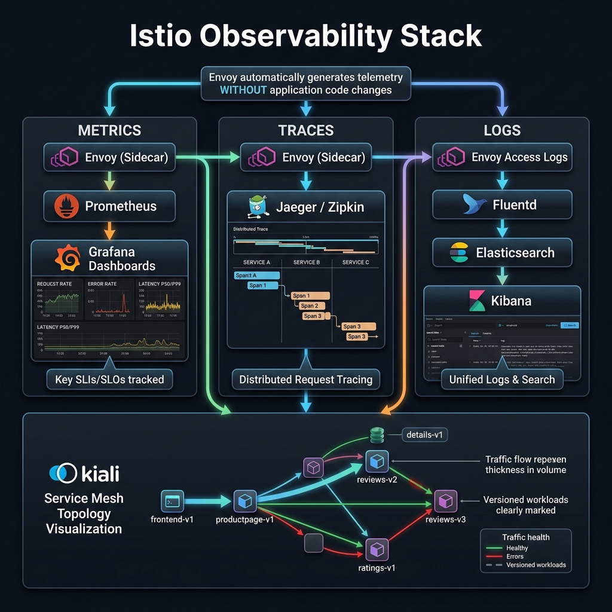

<!-- tags: kubernetes, k8s, istio, observability -->
# 📊 Observability

> Kiali, Jaeger, Prometheus — full visibility into service mesh traffic, latency, and errors.

| Aspect           | Detail                                               |
| ---------------- | ---------------------------------------------------- |
| **Tools**        | Kiali, Jaeger, Prometheus, Grafana                   |
| **Use case**     | Service graph, distributed tracing, metrics          |
| **Go relevance** | Auto-instrumented metrics, OpenTelemetry integration |
| **CLI**          | `istioctl dashboard kiali/jaeger/grafana`            |

📅 Created: 2026-03-20 · 🔄 Updated: 2026-04-20 · ⏱️ 15 min read

---

## 1. DEFINE

Picture that once traffic passes through the sidecar proxy, mesh observability can be extremely powerful or extremely noisy. This article exists to keep telemetry useful enough for on-call, rather than just adding another dashboard.

### Istio Telemetry Components

| Component      | Role                 | Data source                      |
| -------------- | -------------------- | -------------------------------- |
| **Prometheus** | Metrics collection   | Envoy stats, Istio control plane |
| **Grafana**    | Metrics dashboard    | Prometheus queries               |
| **Jaeger**     | Distributed tracing  | Envoy trace headers (B3, W3C)    |
| **Kiali**      | Service mesh console | Prometheus + Istio config        |

### Istio Default Metrics

| Metric                                | Type      | Description                    |
| ------------------------------------- | --------- | ------------------------------ |
| `istio_requests_total`                | Counter   | Request count by response_code |
| `istio_request_duration_milliseconds` | Histogram | Request latency                |
| `istio_request_bytes`                 | Histogram | Request body size              |
| `istio_response_bytes`                | Histogram | Response body size             |
| `istio_tcp_sent_bytes_total`          | Counter   | TCP bytes sent                 |
| `istio_tcp_received_bytes_total`      | Counter   | TCP bytes received             |

### Tracing Propagation

| Format     | Header                        | Istio Default |
| ---------- | ----------------------------- | ------------- |
| **B3**     | `x-b3-traceid`, `x-b3-spanid` | ✅ Default    |
| **W3C**    | `traceparent`, `tracestate`   | ✅ Supported  |
| **Zipkin** | `x-b3-*`                      | ✅            |

### Failure Modes

| Mistake                    | Cause                                | Fix                                            |
| -------------------------- | ------------------------------------ | ---------------------------------------------- |
| Traces broken mid-chain    | Go app does not forward trace headers | Forward B3/W3C headers in inter-service calls |
| Kiali graph empty          | No traffic generated                 | Generate traffic, check Prometheus             |
| High cardinality metrics   | Too many custom labels               | Limit label values, use Telemetry API          |

---

Those failure modes sound basic. But there is a trap: an empty Kiali graph because there is no traffic is a false alarm, and Prometheus not scraping means metrics are missing. That trap appears in PITFALLS.

## 2. VISUAL

Theory sounds clean on paper. The visual below shows how Envoy automatically generates metrics, traces, and logs — and how Kiali ties everything into a single mesh topology view.



### Observability Architecture

```text
┌──────────────────────────────────────────────────────┐
│                    ISTIO MESH                         │
│                                                       │
│  ┌─────────┐     ┌─────────┐     ┌─────────┐       │
│  │ Pod A   │────►│ Pod B   │────►│ Pod C   │       │
│  │ Envoy   │     │ Envoy   │     │ Envoy   │       │
│  └────┬────┘     └────┬────┘     └────┬────┘       │
│       │               │               │              │
│  metrics/traces   metrics/traces  metrics/traces     │
│       │               │               │              │
└───────┼───────────────┼───────────────┼──────────────┘
        │               │               │
   ┌────▼───────────────▼───────────────▼────┐
   │              PROMETHEUS                  │
   │  istio_requests_total                    │
   │  istio_request_duration_milliseconds     │
   └──────┬──────────────────┬───────────────┘
          │                  │
   ┌──────▼──────┐    ┌─────▼──────┐
   │   GRAFANA   │    │   KIALI    │
   │  Dashboards │    │  Service   │
   │  Alerts     │    │  Graph     │
   └─────────────┘    └────────────┘

   Tracing (separate pipeline):
   Envoy → Jaeger/Zipkin → Trace UI
```

*Figure: Each Envoy sidecar emits metrics to Prometheus and trace spans to Jaeger. Grafana and Kiali consume Prometheus data for dashboards and service graph visualization.*

---

## 3. CODE

The diagram showed the telemetry pipeline. Code below shows how to deploy the observability stack, propagate trace headers in Go, and integrate OpenTelemetry.

### Example 1: Basic — Install Observability Stack

> **Goal**: Deploy Kiali, Jaeger, Prometheus, Grafana
> **Requires**: Istio installed
> **Outcome**: Full observability dashboard

```bash
# ✅ Install addons (demo/learning)
kubectl apply -f https://raw.githubusercontent.com/istio/istio/release-1.20/samples/addons/prometheus.yaml
kubectl apply -f https://raw.githubusercontent.com/istio/istio/release-1.20/samples/addons/grafana.yaml
kubectl apply -f https://raw.githubusercontent.com/istio/istio/release-1.20/samples/addons/jaeger.yaml
kubectl apply -f https://raw.githubusercontent.com/istio/istio/release-1.20/samples/addons/kiali.yaml

# ✅ Wait for pods
kubectl wait --for=condition=ready pod -l app=kiali -n istio-system --timeout=120s

# ✅ Open dashboards
istioctl dashboard kiali       # Service mesh console
istioctl dashboard jaeger      # Distributed tracing
istioctl dashboard grafana     # Metrics dashboard
istioctl dashboard prometheus  # Raw metrics
```

```yaml
# k8s/telemetry.yaml — Customize Istio telemetry
apiVersion: telemetry.istio.io/v1alpha1
kind: Telemetry
metadata:
    name: mesh-telemetry
    namespace: istio-system
spec:
    # ✅ Tracing config
    tracing:
        - providers:
              - name: jaeger
          randomSamplingPercentage: 10 # ✅ 10% sampling (prod)
          # 100% for dev/staging
    # ✅ Access logging
    accessLogging:
        - providers:
              - name: envoy
          filter:
              expression: 'response.code >= 400' # ✅ Only log errors
```

> **✅ Outcome**: Full observability stack running, sampling configured.
> **⚠️ Note**: Production: use `randomSamplingPercentage: 1-10%` to reduce overhead.

---

Basic metrics are covered. But distributed tracing needs propagation — time to instrument.

### Example 2: Intermediate — Go App Trace Propagation

> **Goal**: Go app forwards trace headers for end-to-end tracing
> **Requires**: Go HTTP client/server, Istio tracing
> **Outcome**: Unbroken distributed traces

```go
// tracing/propagation.go — Forward Istio trace headers
package tracing

import (
	"context"
	"net/http"
)

// ✅ Istio trace headers — MUST forward for continuous traces
var propagationHeaders = []string{
	"x-request-id",
	"x-b3-traceid",
	"x-b3-spanid",
	"x-b3-parentspanid",
	"x-b3-sampled",
	"x-b3-flags",
	"b3",
	// W3C format
	"traceparent",
	"tracestate",
}

// ✅ Extract trace headers from incoming request
func ExtractHeaders(r *http.Request) map[string]string {
	headers := make(map[string]string)
	for _, h := range propagationHeaders {
		if v := r.Header.Get(h); v != "" {
			headers[h] = v
		}
	}
	return headers
}

type traceKey struct{}

// ✅ Store trace headers in context
func WithHeaders(ctx context.Context, headers map[string]string) context.Context {
	return context.WithValue(ctx, traceKey{}, headers)
}

// ✅ Inject trace headers into outgoing request
func InjectHeaders(ctx context.Context, req *http.Request) {
	if headers, ok := ctx.Value(traceKey{}).(map[string]string); ok {
		for k, v := range headers {
			req.Header.Set(k, v)
		}
	}
}
```

```go
// middleware/tracing.go — HTTP middleware
package middleware

import (
	"net/http"
	"myapp/tracing"
)

// ✅ Tracing middleware — extract + inject headers
func TracingMiddleware(next http.Handler) http.Handler {
	return http.HandlerFunc(func(w http.ResponseWriter, r *http.Request) {
		// Extract trace headers from incoming request
		headers := tracing.ExtractHeaders(r)
		ctx := tracing.WithHeaders(r.Context(), headers)
		next.ServeHTTP(w, r.WithContext(ctx))
	})
}
```

```go
// client/http.go — HTTP client propagates traces
package client

import (
	"context"
	"net/http"
	"myapp/tracing"
)

func CallService(ctx context.Context, url string) (*http.Response, error) {
	req, err := http.NewRequestWithContext(ctx, "GET", url, nil)
	if err != nil {
		return nil, err
	}

	// ✅ Inject trace headers into outgoing request
	tracing.InjectHeaders(ctx, req)

	return http.DefaultClient.Do(req)
}
```

> **✅ Outcome**: End-to-end traces unbroken across Go services.
> **⚠️ Note**: You MUST forward headers in ALL inter-service calls.

---

Tracing is covered. But dashboards need Grafana — time to visualize.

### Example 3: Advanced — OpenTelemetry Integration

> **Goal**: Go app emits custom spans + metrics via OpenTelemetry
> **Requires**: OTel SDK, Jaeger backend
> **Outcome**: Application-level tracing + Istio mesh tracing combined

```go
// otel/setup.go — Initialize OpenTelemetry
package otel

import (
	"context"
	"log"

	"go.opentelemetry.io/otel"
	"go.opentelemetry.io/otel/exporters/otlp/otlptrace/otlptracegrpc"
	"go.opentelemetry.io/otel/propagation"
	"go.opentelemetry.io/otel/sdk/resource"
	sdktrace "go.opentelemetry.io/otel/sdk/trace"
	semconv "go.opentelemetry.io/otel/semconv/v1.21.0"
)

func InitTracer(ctx context.Context, serviceName string) (func(), error) {
	// ✅ Export to Jaeger via OTel Collector
	exporter, err := otlptracegrpc.New(ctx,
		otlptracegrpc.WithEndpoint("otel-collector:4317"),
		otlptracegrpc.WithInsecure(),
	)
	if err != nil {
		return nil, err
	}

	tp := sdktrace.NewTracerProvider(
		sdktrace.WithBatcher(exporter),
		sdktrace.WithResource(resource.NewWithAttributes(
			semconv.SchemaURL,
			semconv.ServiceNameKey.String(serviceName),
		)),
		// ✅ Sample 100% in dev, 10% in prod
		sdktrace.WithSampler(sdktrace.TraceIDRatioBased(0.1)),
	)

	otel.SetTracerProvider(tp)
	// ✅ W3C trace context propagation — compatible with Istio
	otel.SetTextMapPropagator(propagation.NewCompositeTextMapPropagator(
		propagation.TraceContext{},
		propagation.Baggage{},
	))

	shutdown := func() {
		if err := tp.Shutdown(ctx); err != nil {
			log.Printf("❌ Error shutting down tracer: %v", err)
		}
	}

	return shutdown, nil
}
```

```go
// handlers/user.go — Custom spans in handler
package handlers

import (
	"net/http"

	"go.opentelemetry.io/otel"
	"go.opentelemetry.io/otel/attribute"
)

var tracer = otel.Tracer("go-api/handlers")

func GetUser(w http.ResponseWriter, r *http.Request) {
	ctx := r.Context()

	// ✅ Custom span — visible in Jaeger alongside Istio spans
	ctx, span := tracer.Start(ctx, "GetUser")
	defer span.End()

	userID := r.URL.Query().Get("id")
	span.SetAttributes(attribute.String("user.id", userID))

	// ✅ Database query span
	ctx, dbSpan := tracer.Start(ctx, "db.query.user")
	user, err := queryUser(ctx, userID)
	dbSpan.End()

	if err != nil {
		span.RecordError(err)
		http.Error(w, "User not found", 404)
		return
	}

	span.SetAttributes(attribute.String("user.email", user.Email))
	// ... response
}
```

> **✅ Outcome**: App-level spans + Istio mesh spans in the same trace.
> **⚠️ Note**: Use W3C `traceparent` for compatibility with Istio.

---

You have walked through metrics, tracing, and dashboards. Now comes the dangerous part: empty graphs and missing scrape — the trap set up from the beginning.

## 4. PITFALLS

| #   | Mistake                           | Consequence                | Fix                                         |
| --- | --------------------------------- | -------------------------- | ------------------------------------------- |
| 1   | Traces broken between services    | Cannot track request flow  | Forward B3/W3C headers in Go app            |
| 2   | 100% sampling = performance hit   | High storage, high latency | Reduce to 1-10% for production              |
| 3   | Kiali shows "unknown"             | No useful service graph    | Pods missing `app` and `version` labels     |
| 4   | Metrics high cardinality          | Prometheus OOM             | Limit custom dimensions in Telemetry API    |
| 5   | Jaeger receives too many traces   | Storage overload           | Tail-based sampling, reduce head-based ratio |

---

## 5. REF

| Resource            | Link                                                                                   |
| ------------------- | -------------------------------------------------------------------------------------- |
| Istio Observability | [istio.io/docs/tasks/observability](https://istio.io/latest/docs/tasks/observability/) |
| Kiali               | [kiali.io](https://kiali.io/)                                                          |
| OpenTelemetry Go    | [opentelemetry.io/docs/languages/go](https://opentelemetry.io/docs/languages/go/)      |
| Jaeger              | [jaegertracing.io](https://www.jaegertracing.io/)                                      |

---

## 6. RECOMMEND

| Extension                   | When                  | Reason                         |
| --------------------------- | --------------------- | ------------------------------ |
| **Tempo**                   | Alternative to Jaeger | Grafana-native, object storage |
| **Loki**                    | Log aggregation       | Correlate logs + traces        |
| **OpenTelemetry Collector** | Unified pipeline      | Vendor-agnostic telemetry      |
| **Pixie**                   | Auto-instrumented     | eBPF-based, no code changes    |
| **Grafana Mimir**           | Scalable metrics      | Replace Prometheus at scale    |

---

## 🔍 Debug Checklist

| # | Symptom | Cause | Debug Command |
|---|---------|-------|---------------|
| 1 | Kiali service graph empty / no services shown | No traffic generated, or Prometheus not scraping | `kubectl port-forward svc/prometheus 9090 -n istio-system` → query `istio_requests_total` |
| 2 | Kiali shows "unknown" instead of service name | Pod missing `app` and `version` labels | `kubectl get pods -n <ns> --show-labels` |
| 3 | Trace breaks between 2 services | Go app does not forward B3/W3C trace headers | Check `x-b3-traceid` in outgoing requests from Go client |
| 4 | Jaeger receives no traces | Sampling rate = 0 or Jaeger endpoint wrong | `kubectl get telemetry -n istio-system -o yaml` — check `randomSamplingPercentage` |
| 5 | `istio_requests_total` missing from Prometheus | Envoy stats not exposed or scrape config wrong | `kubectl exec <pod> -c istio-proxy -- curl localhost:15090/stats/prometheus` |
| 6 | Metrics high cardinality — Prometheus OOM | Custom Telemetry dimensions have too many values | Limit `dimensions` in Telemetry CRD, avoid using User-ID as label |
| 7 | Access logs not appearing | Telemetry filter only logs errors or logging disabled | `kubectl get telemetry -n istio-system -o yaml` — check `accessLogging` config |

---

## 🃏 Quick Reference

| # | Pattern | Command / Rule |
|---|---------|----------------|
| 1 | Open Kiali dashboard | `istioctl dashboard kiali` |
| 2 | Open Jaeger tracing | `istioctl dashboard jaeger` |
| 3 | Open Grafana | `istioctl dashboard grafana` |
| 4 | Query request success rate (PromQL) | `sum(rate(istio_requests_total{response_code!~"5.*"}[1m])) / sum(rate(istio_requests_total[1m]))` |
| 5 | Query P99 latency (PromQL) | `histogram_quantile(0.99, rate(istio_request_duration_milliseconds_bucket[5m]))` |
| 6 | View Envoy access log for a pod | `kubectl logs <pod> -c istio-proxy` |
| 7 | Check raw Envoy stats | `kubectl exec <pod> -c istio-proxy -- curl localhost:15090/stats/prometheus \| grep requests` |
| 8 | Set sampling rate 10% (production) | Telemetry CRD: `tracing.randomSamplingPercentage: 10` |

---

## 🎯 Interview Angle

**Relevant system design / technical questions:**
- *"How does distributed tracing differ from metrics and logs? When do you use each?"*
- *"Why does a Go app need to forward trace headers? Doesn't Istio handle everything?"*
- *"What are RED metrics? Explain how to use them to debug a performance issue."*

**Points the interviewer wants to hear:**

| Topic | Talking Point |
|-------|---------------|
| Tracing vs Metrics vs Logs | Metrics = aggregated numbers (rate, latency). Tracing = request journey across services. Logs = raw events. Use all three together |
| Header propagation | Istio creates traces at the sidecar level, but knows nothing about business logic. Go app must forward headers to connect spans cross-service |
| RED Metrics | Rate (requests/s), Errors (% failed), Duration (latency). These are the 3 most fundamental SLIs for any service |
| Kiali use cases | Visualize service topology, detect misconfiguration (missing DestinationRule, traffic anomalies), not a Grafana replacement |
| Sampling strategy | 100% sampling for dev/staging. 1-10% for production. Tail-based sampling (Jaeger) to keep interesting traces |
| OTel + Istio | OpenTelemetry for app-level spans (business logic). Istio for mesh-level spans (network). Combined in a single Jaeger trace |

**Common follow-up questions:**
- *"How do you correlate logs with traces?"* → Inject `x-b3-traceid` into structured logs — Grafana Loki + Tempo support native correlation.
- *"Can Kiali detect security issues?"* → Yes — Kiali displays mTLS status, unauthorized traffic, missing AuthorizationPolicy.
- *"If Prometheus goes down, is Istio affected?"* → No, Prometheus is an independent addon. Envoy continues operating normally.

---

**Links**: [← Security & mTLS](./03-security-mtls.md) · [→ Canary & Progressive Delivery](./05-canary-delivery.md)
