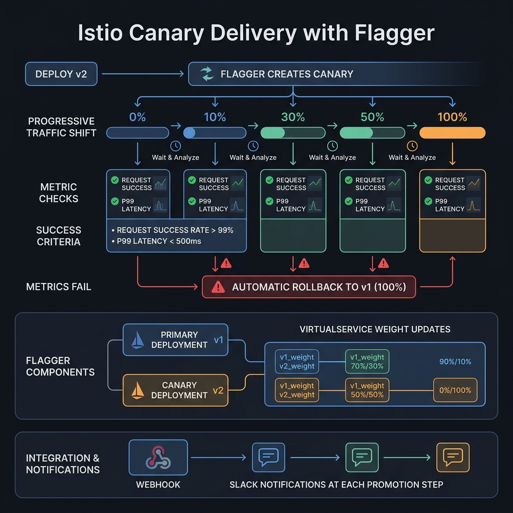

<!-- tags: kubernetes, k8s, istio, canary -->
# 🔄 Canary & Progressive Delivery

> Flagger + Istio = automated canary deployments driven by metrics analysis.

| Aspect           | Detail                                         |
| ---------------- | ---------------------------------------------- |
| **Tools**        | Flagger, Argo Rollouts, Istio VirtualService   |
| **Use case**     | Safe rollouts, automated rollback, A/B testing |
| **Go relevance** | Zero-code canary for Go microservices          |
| **CLI**          | `flagger`, `kubectl get canary`                |

📅 Created: 2026-03-20 · 🔄 Updated: 2026-04-20 · ⏱️ 15 min read

---

## 1. DEFINE

Picture canary delivery as only worth doing if it actually reduces blast radius — not just changes the color of a release. In a mesh, that ties directly to policy routing and metric gates.

### Deployment Strategies

| Strategy           | Description           | Risk      | Speed      |
| ------------------ | --------------------- | --------- | ---------- |
| **Recreate**       | Kill all → create new | 🔴 High   | ⚡ Fast    |
| **Rolling Update** | Gradual replace       | 🟡 Medium | 🐢 Slow    |
| **Blue-Green**     | Switch 100% at once   | 🟡 Medium | ⚡ Fast    |
| **Canary**         | Gradual traffic shift | 🟢 Low    | 🐢 Slowest |
| **A/B Testing**    | Header/cookie routing | 🟢 Low    | ⚡ Fast    |

### Flagger Components

| Component            | Role                          |
| -------------------- | ----------------------------- |
| **Canary CRD**       | Define rollout strategy       |
| **Primary**          | Stable version (auto-created) |
| **Canary**           | New version being tested      |
| **Metric Templates** | Custom analysis queries       |
| **Alerts**           | Slack/Teams notifications     |

### Analysis Metrics

| Metric                 | Threshold       | Description                           |
| ---------------------- | --------------- | ------------------------------------- |
| Request success rate   | > 99%           | `istio_requests_total` success/total  |
| Request duration P99   | < 500ms         | `istio_request_duration_milliseconds` |
| Custom business metric | Defined per app | Prometheus custom queries             |

### Failure Modes

| Mistake                          | Cause                      | Fix                                |
| -------------------------------- | -------------------------- | ---------------------------------- |
| Canary stuck in "Progressing"    | Metrics not available      | Check Prometheus, metric templates |
| Auto-rollback triggered          | Metrics below threshold    | Review app logs, fix bugs          |
| No traffic to canary             | VirtualService not updated | Check Flagger logs, Istio config   |

---

Those failure modes sound familiar. But there is a trap: a canary stuck in Progressing because Prometheus has no metrics means the rollout freezes, and an analysis template with a wrong metric range means a false positive. That trap appears in PITFALLS.

## 2. VISUAL

The concept has a name. In the diagram, the critical part emerges: how Flagger progressively shifts traffic, validates metrics at each step, and triggers automatic rollback on failure.



### Flagger Canary Flow

```text
                    Deploy new version
                          │
                    ┌─────▼─────┐
                    │ Flagger   │
                    │ detects   │
                    │ new image │
                    └─────┬─────┘
                          │
              ┌───────────▼───────────┐
              │    CANARY ANALYSIS    │
              │                       │
              │  Step 1: 5% traffic   │──► Analyze metrics (30s)
              │  Step 2: 10% traffic  │──► Analyze metrics (30s)
              │  Step 3: 30% traffic  │──► Analyze metrics (30s)
              │  Step 4: 50% traffic  │──► Analyze metrics (30s)
              │  Step 5: 80% traffic  │──► Analyze metrics (30s)
              │                       │
              └──────────┬────────────┘
                         │
           ┌─────────────┼─────────────┐
           │                           │
    ┌──────▼──────┐            ┌───────▼──────┐
    │  ✅ PROMOTE  │            │  ❌ ROLLBACK  │
    │             │            │              │
    │  Canary →   │            │  Revert to   │
    │  Primary    │            │  Primary     │
    │  100%       │            │  100%        │
    └─────────────┘            └──────────────┘
```

*Figure: Flagger detects an image change, progressively shifts traffic to the canary while analyzing metrics at each step. If metrics pass all thresholds, it promotes; otherwise it rolls back automatically.*

---

## 3. CODE

The diagram showed the promotion flow. Code below shows how to set up Flagger, configure canary analysis, and integrate Argo Rollouts.

### Example 1: Basic — Flagger Setup

> **Goal**: Install Flagger + configure canary analysis
> **Requires**: Istio installed, Prometheus
> **Outcome**: Automated canary with metric analysis

```bash
# ✅ Install Flagger for Istio
helm repo add flagger https://flagger.app
helm upgrade -i flagger flagger/flagger \
  --namespace istio-system \
  --set meshProvider=istio \
  --set metricsServer=http://prometheus:9090
```

```yaml
# k8s/canary.yaml — Flagger Canary definition
apiVersion: flagger.app/v1beta1
kind: Canary
metadata:
    name: go-api
    namespace: production
spec:
    targetRef:
        apiVersion: apps/v1
        kind: Deployment
        name: go-api
    # ✅ Istio VirtualService auto-managed
    service:
        port: 80
        targetPort: 8080
        gateways:
            - api-gateway
        hosts:
            - api.example.com
    analysis:
        # ✅ Canary analysis interval
        interval: 30s
        # ✅ Number of successful checks before promotion
        threshold: 5
        # ✅ Max traffic shift percentage
        maxWeight: 50
        # ✅ Traffic increment per step
        stepWeight: 10
        # ✅ Metrics analysis
        metrics:
            - name: request-success-rate
              thresholdRange:
                  min: 99 # ✅ > 99% success rate
              interval: 30s
            - name: request-duration
              thresholdRange:
                  max: 500 # ✅ P99 < 500ms
              interval: 30s
        # ✅ Custom webhook checks
        webhooks:
            - name: load-test
              type: rollout
              url: http://flagger-loadtester.production/
              metadata:
                  cmd: 'hey -z 30s -q 10 -c 2 http://go-api-canary.production:80/healthz'
```

```bash
# ✅ Deploy new version → Flagger automatically starts canary
kubectl set image deployment/go-api api=go-api:v2.0.0 -n production

# ✅ Watch canary progress
kubectl -n production get canary go-api -w
# NAME     STATUS        WEIGHT  LASTTRANSITION
# go-api   Progressing   0       ...
# go-api   Progressing   10      ... (step 1)
# go-api   Progressing   20      ... (step 2)
# go-api   Progressing   30      ... (step 3)
# go-api   Progressing   40      ...
# go-api   Progressing   50      ...
# go-api   Promoting     0       ...
# go-api   Succeeded     0       ... ← Promoted!
```

> **✅ Outcome**: Automated canary: 10% → 20% → 30% → 40% → 50% → promote.
> **⚠️ Note**: Metrics below threshold → auto rollback.

---

Canary rollout is covered. But analysis needs a metrics gate — time to evaluate.

### Example 2: Intermediate — Custom Metrics + A/B Testing

> **Goal**: Custom Prometheus metrics for analysis + header-based A/B
> **Requires**: Custom metrics from Go app
> **Outcome**: Business-metric-driven deployments

```yaml
# k8s/metric-template.yaml — Custom metric template
apiVersion: flagger.app/v1beta1
kind: MetricTemplate
metadata:
    name: error-rate
    namespace: production
spec:
    provider:
        type: prometheus
        address: http://prometheus.istio-system:9090
    query: |
        100 - (
          sum(rate(
            istio_requests_total{
              reporter="destination",
              destination_workload_namespace="{{ namespace }}",
              destination_workload="{{ target }}",
              response_code!~"5.*"
            }[{{ interval }}]
          )) /
          sum(rate(
            istio_requests_total{
              reporter="destination",
              destination_workload_namespace="{{ namespace }}",
              destination_workload="{{ target }}"
            }[{{ interval }}]
          )) * 100
        )
---
# k8s/ab-testing.yaml — A/B testing by cookie
apiVersion: flagger.app/v1beta1
kind: Canary
metadata:
    name: go-api-ab
    namespace: production
spec:
    targetRef:
        apiVersion: apps/v1
        kind: Deployment
        name: go-api
    service:
        port: 80
        targetPort: 8080
    analysis:
        interval: 1m
        threshold: 10
        iterations: 10 # ✅ A/B testing: fixed iterations, no weight
        # ✅ A/B match: route by header
        match:
            - headers:
                  x-user-type:
                      exact: 'beta'
            - headers:
                  cookie:
                      regex: '^(.*?;)?(beta=true)(;.*)?$'
        metrics:
            - name: error-rate
              templateRef:
                  name: error-rate
              thresholdRange:
                  max: 1 # ✅ Error rate < 1%
            - name: request-duration
              thresholdRange:
                  max: 500
```

> **✅ Outcome**: A/B testing by header/cookie + custom metrics analysis.
> **⚠️ Note**: A/B testing uses `iterations`, canary uses `stepWeight`.

---

Analysis is covered. But progressive delivery needs automated rollback — time to abort.

### Example 3: Advanced — Argo Rollouts + Istio

> **Goal**: Argo Rollouts replaces Flagger — integrates with ArgoCD pipeline
> **Requires**: Argo Rollouts controller, Istio
> **Outcome**: Native ArgoCD progressive delivery

```yaml
# k8s/argo-rollout.yaml
apiVersion: argoproj.io/v1alpha1
kind: Rollout
metadata:
    name: go-api
    namespace: production
spec:
    replicas: 5
    selector:
        matchLabels:
            app: go-api
    template:
        metadata:
            labels:
                app: go-api
        spec:
            containers:
                - name: api
                  image: go-api:v1.0.0
                  ports:
                      - containerPort: 8080
    strategy:
        canary:
            # ✅ Istio traffic management
            trafficRouting:
                istio:
                    virtualServices:
                        - name: go-api-vs
                          routes:
                              - primary
                    destinationRule:
                        name: go-api-dr
                        canarySubsetName: canary
                        stableSubsetName: stable
            # ✅ Analysis steps
            steps:
                - setWeight: 5
                - pause: { duration: 1m }
                - setWeight: 10
                - analysis:
                      templates:
                          - templateName: success-rate
                      args:
                          - name: service-name
                            value: go-api-canary.production.svc.cluster.local
                - setWeight: 30
                - pause: { duration: 2m }
                - setWeight: 60
                - analysis:
                      templates:
                          - templateName: success-rate
                - setWeight: 100
            # ✅ Anti-affinity — spread canary across nodes
            antiAffinity:
                preferredDuringSchedulingIgnoredDuringExecution:
                    weight: 100
---
apiVersion: argoproj.io/v1alpha1
kind: AnalysisTemplate
metadata:
    name: success-rate
spec:
    metrics:
        - name: success-rate
          interval: 30s
          successCondition: result[0] >= 0.99
          provider:
              prometheus:
                  address: http://prometheus.istio-system:9090
                  query: |
                      sum(rate(istio_requests_total{
                        destination_service_name="{{args.service-name}}",
                        response_code!~"5.*"
                      }[2m])) / sum(rate(istio_requests_total{
                        destination_service_name="{{args.service-name}}"
                      }[2m]))
```

```bash
# ✅ Trigger rollout
kubectl argo rollouts set image go-api api=go-api:v2.0.0

# ✅ Watch
kubectl argo rollouts get rollout go-api -w

# ✅ Manual promote/abort
kubectl argo rollouts promote go-api
kubectl argo rollouts abort go-api
```

> **✅ Outcome**: Native ArgoCD integration, analysis-driven promotion.
> **⚠️ Note**: Argo Rollouts and Flagger do the same job. Choose one.

---

You have walked through canary, analysis, and automated rollback. Now comes the dangerous part: stuck rollout and false positive metrics — the trap set up from the beginning.

## 4. PITFALLS

| #   | Mistake                                      | Consequence                  | Fix                                         |
| --- | -------------------------------------------- | ---------------------------- | ------------------------------------------- |
| 1   | Canary stuck waiting                         | Rollout frozen               | Check metric availability, Prometheus query |
| 2   | Load test overloads canary                   | Canary crashes, false fail   | Tune `-q` (QPS) and `-c` (concurrency)      |
| 3   | Rollback but traffic still reaches canary    | Users see errors             | Check VirtualService weight reset           |
| 4   | Flagger conflicts with manual VirtualService | Config overwritten           | Let Flagger manage VirtualService           |
| 5   | Metric query timeout                         | Analysis fails               | Increase analysis interval, optimize query  |

---

## 5. REF

| Resource             | Link                                                                                          |
| -------------------- | --------------------------------------------------------------------------------------------- |
| Flagger              | [docs.flagger.app](https://docs.flagger.app/)                                                 |
| Argo Rollouts        | [argoproj.github.io/argo-rollouts](https://argoproj.github.io/argo-rollouts/)                 |
| Progressive Delivery | [flagger.app/usage/progressive-delivery](https://docs.flagger.app/usage/progressive-delivery) |
| hey (load testing)   | [github.com/rakyll/hey](https://github.com/rakyll/hey)                                        |

---

## 6. RECOMMEND

| Extension              | When                        | Reason                   |
| ---------------------- | --------------------------- | ------------------------ |
| **Flagger + Slack**    | Alert on promotion/rollback | Real-time visibility     |
| **Kayenta**            | Advanced analysis           | ML-based canary scoring  |
| **Keptn**              | Delivery orchestration      | Multi-step quality gates |
| **Feature Flags**      | With Unleash/LaunchDarkly   | Feature-level canary     |
| **Istio Telemetry V2** | Custom metrics              | Richer analysis data     |

---

## 🔍 Debug Checklist

| # | Symptom | Cause | Debug Command |
|---|---------|-------|---------------|
| 1 | Canary stuck at `Progressing` weight 0% | Prometheus has no metrics for canary workload | `kubectl -n <ns> describe canary <name>` — check Events |
| 2 | Flagger does not detect image update | Deployment image tag unchanged (same sha) | `kubectl -n <ns> get canary <name> -o yaml` — check `status.canaryWeight` |
| 3 | Analysis failing continuously — auto rollback | Metric query syntax wrong or Prometheus endpoint unreachable | `kubectl -n istio-system logs deploy/flagger` |
| 4 | Load tester not generating traffic for canary | Webhook URL wrong or `flagger-loadtester` pod not running | `kubectl get pods -n <ns> -l app=flagger-loadtester` |
| 5 | Canary promoted but traffic still split | VirtualService not reset to 100% primary | `kubectl get virtualservice -n <ns> -o yaml` — check weights |
| 6 | Flagger conflicts with manual VirtualService | Flagger manages VS, developer edits manually → overwritten | Delete manual VS, let Flagger auto-create from Canary spec |
| 7 | Argo Rollout analysis fails on first attempt | Not enough traffic for Prometheus to compute rate | Increase `analysis.interval` or add load test webhook |

---

## 🃏 Quick Reference

| # | Pattern | Command / Rule |
|---|---------|----------------|
| 1 | View current canary status | `kubectl -n <ns> get canary <name>` |
| 2 | Watch canary in real-time | `kubectl -n <ns> get canary <name> -w` |
| 3 | View Flagger logs | `kubectl -n istio-system logs deploy/flagger --tail=50 -f` |
| 4 | Trigger canary with image update | `kubectl set image deploy/<name> <container>=<image>:<tag> -n <ns>` |
| 5 | Manual promote Argo Rollout | `kubectl argo rollouts promote <name> -n <ns>` |
| 6 | Abort/rollback Argo Rollout | `kubectl argo rollouts abort <name> -n <ns>` |
| 7 | Configure step weight 10% → max 50% | `analysis: {stepWeight: 10, maxWeight: 50, threshold: 5}` |
| 8 | A/B testing by header | `analysis.match: [{headers: {x-user-type: {exact: "beta"}}}]` + `iterations: 10` |

---

## 🎯 Interview Angle

**Relevant system design / technical questions:**
- *"How does canary deployment differ from blue-green? What are the trade-offs of each strategy?"*
- *"What does Flagger use to automatically promote/rollback? How do metric thresholds work?"*
- *"When do you use Flagger vs Argo Rollouts? What is the main difference?"*

**Points the interviewer wants to hear:**

| Topic | Talking Point |
|-------|---------------|
| Canary vs Blue-Green | Canary: gradual traffic shift, fewer resources, detects issues early. Blue-Green: full swap at once, needs 2x infra, fast rollback |
| Flagger automation | Flagger watches Deployment image change → creates primary/canary services → updates Istio VirtualService weights → analyzes metrics → promote/rollback |
| Metric-driven promotion | If `request-success-rate < 99%` or `P99 > 500ms` in the analysis window → auto rollback to primary |
| A/B testing vs Canary | Canary = progressive weight shift for all users. A/B = route specific user segment (header/cookie) with fixed iterations |
| Flagger vs Argo Rollouts | Flagger = standalone operator, integrates with multiple meshes. Argo Rollouts = native ArgoCD integration, UI dashboard, manual gates |
| Rollback triggers | Metrics below threshold, analysis failure, manual abort, `maxWeight` reached without enough successes |

**Common follow-up questions:**
- *"How do you ensure database migration compatibility with canary?"* → Expand-contract pattern: migration phase 1 (backward compat) deploys with canary, phase 2 cleanup after fully promoted.
- *"If Prometheus goes down while a canary is running, what happens?"* → Flagger cannot query metrics → analysis fails → auto rollback (fail-safe behavior).
- *"Can canary test business metrics, not just technical metrics?"* → Yes — `MetricTemplate` lets you query Prometheus custom metrics from the Go app (conversion rate, order count).

---

**Links**: [← Observability](./04-observability.md) · [→ Gateway API](./06-gateway-api.md)
