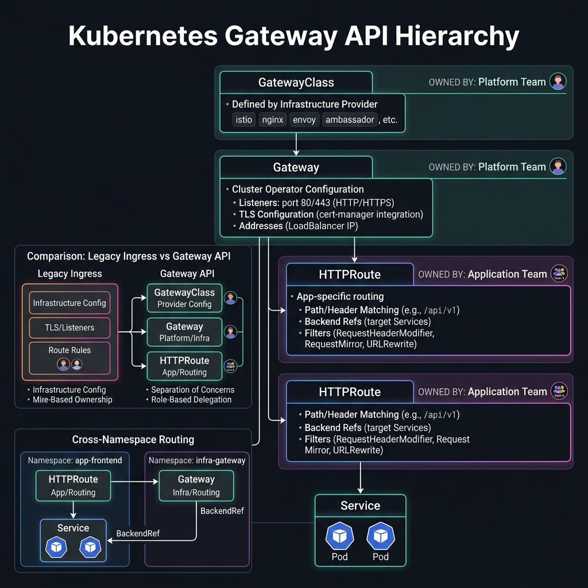

<!-- tags: kubernetes, k8s, istio, gateway -->
# 🌐 Gateway API & Multi-cluster

> K8s Gateway API replaces Ingress — multi-cluster mesh federation for global services.

| Aspect           | Detail                                        |
| ---------------- | --------------------------------------------- |
| **CRDs**         | `Gateway`, `HTTPRoute`, `GRPCRoute` (K8s sig) |
| **Use case**     | Next-gen ingress, multi-cluster traffic       |
| **Go relevance** | Gateway API controllers                       |
| **CLI**          | `istioctl`, `kubectl get gtw`                 |

📅 Created: 2026-03-20 · 🔄 Updated: 2026-04-20 · ⏱️ 15 min read

---

## 1. DEFINE

Picture the Gateway API and Ingress as where edge policy meets service mesh policy. If this boundary is not locked down properly, teams easily misplace responsibility between gateway and application routing.

### Gateway API vs Ingress vs Istio VirtualService

| Feature                  | Ingress                | Istio VirtualService    | Gateway API                     |
| ------------------------ | ---------------------- | ----------------------- | ------------------------------- |
| **Standard**             | K8s built-in           | Istio-specific CRD      | K8s SIG standard                |
| **L7 routing**           | Basic path/host        | Full L7 (headers, etc.) | Full L7                         |
| **gRPC routing**         | ❌                     | ✅                      | ✅ GRPCRoute                    |
| **Traffic splitting**    | ❌                     | ✅ Weight-based         | ✅ Weight-based                 |
| **Role separation**      | ❌                     | ❌                      | ✅ (GatewayClass/Gateway/Route) |
| **Multi-implementation** | ❌ Controller-specific | Istio only              | ✅ Pluggable                    |
| **Future**               | Deprecated direction   | Continued support       | ✅ Recommended                  |

### Gateway API Role Model

| Role                        | Resource                | Responsibility                 |
| --------------------------- | ----------------------- | ------------------------------ |
| **Infrastructure Provider** | `GatewayClass`          | Define available gateway types |
| **Cluster Operator**        | `Gateway`               | Deploy and configure gateways  |
| **App Developer**           | `HTTPRoute`/`GRPCRoute` | Define routing rules           |

### Multi-cluster Topologies

| Topology           | Description                           | Use case               |
| ------------------ | ------------------------------------- | ---------------------- |
| **Flat Network**   | All clusters share network            | Same cloud provider    |
| **Multi-primary**  | Each cluster has own istiod           | High availability      |
| **Primary-remote** | One control plane, remote data planes | Centralized management |
| **External CP**    | External istiod                       | Multi-cloud            |

### Failure Modes

| Mistake                    | Cause                            | Fix                              |
| -------------------------- | -------------------------------- | -------------------------------- |
| Gateway not programmed     | Missing GatewayClass             | Install Istio GatewayClass       |
| HTTPRoute not attached     | Gateway `allowedRoutes` mismatch | Check namespace/label selectors  |
| Cross-cluster timeout      | Network latency high             | Check inter-cluster connectivity |

---

Those failure modes sound clear. But there is a trap: a Gateway stuck in Pending because GatewayClass is not installed means no external IP, and an HTTPRoute with a wrong match means traffic drops. That trap appears in PITFALLS.

## 2. VISUAL

The definition locked the vocabulary. The visual below shows the Gateway API resource hierarchy: GatewayClass → Gateway → HTTPRoute, with role-based ownership and cross-namespace routing.



### Gateway API Architecture

```text
┌──────────────────────────────────────────────────┐
│          INFRASTRUCTURE PROVIDER                  │
│  ┌──────────────────────────────────────┐       │
│  │ GatewayClass: istio                  │       │
│  │ (Managed by Istio, auto-created)     │       │
│  └──────────────┬───────────────────────┘       │
│                 │                                │
│                 │ references                     │
│                 │                                │
│          CLUSTER OPERATOR                        │
│  ┌──────────────▼───────────────────────┐       │
│  │ Gateway: api-gw                      │       │
│  │   listeners:                         │       │
│  │     - port: 443, protocol: HTTPS     │       │
│  │     - port: 80, protocol: HTTP       │       │
│  │   addresses:                         │       │
│  │     - value: 34.120.x.x (LB IP)     │       │
│  └──────────────┬───────────────────────┘       │
│                 │                                │
│                 │ parentRefs                     │
│                 │                                │
│          APP DEVELOPER                           │
│  ┌──────────────▼───────────────────────┐       │
│  │ HTTPRoute: go-api-route              │       │
│  │   rules:                             │       │
│  │     - path: /api/v1 → go-api-v1     │       │
│  │     - path: /api/v2 → go-api-v2     │       │
│  │     - header: x-beta → go-api-beta  │       │
│  └──────────────────────────────────────┘       │
└──────────────────────────────────────────────────┘
```

*Figure: Gateway API separates responsibilities into three roles — Infrastructure Provider (GatewayClass), Cluster Operator (Gateway), and App Developer (HTTPRoute). This clean separation enables multi-tenant clusters.*

### Multi-cluster Mesh

```text
┌─────────────────────┐     ┌─────────────────────┐
│  CLUSTER A (US)     │     │  CLUSTER B (EU)     │
│                     │     │                     │
│  ┌───────────────┐  │     │  ┌───────────────┐  │
│  │ istiod (primary)│ │     │  │ istiod (primary)│ │
│  └───────┬───────┘  │     │  └───────┬───────┘  │
│          │          │     │          │          │
│  ┌───────▼───────┐  │     │  ┌───────▼───────┐  │
│  │ go-api (v1)   │  │◄───►│  │ go-api (v1)   │  │
│  │ 3 replicas    │  │ mTLS│  │ 3 replicas    │  │
│  └───────────────┘  │     │  └───────────────┘  │
│                     │     │                     │
│  East-West Gateway  │     │  East-West Gateway  │
│  (cross-cluster)    │     │  (cross-cluster)    │
└─────────────────────┘     └─────────────────────┘
```

*Figure: Multi-primary topology — each cluster runs its own istiod with a shared root CA. Cross-cluster traffic flows through east-west gateways with automatic mTLS.*

---

## 3. CODE

The diagrams showed the role model and multi-cluster topology. Code below shows how to deploy a Gateway API setup, configure multi-cluster mesh, and build a Go-based Gateway API controller.

### Example 1: Basic — Gateway API with Istio

> **Goal**: Deploy K8s Gateway API replacing Ingress
> **Requires**: Istio 1.16+ (Gateway API support)
> **Outcome**: Standard gateway routing

```bash
# ✅ Enable Gateway API CRDs
kubectl get crd gateways.gateway.networking.k8s.io || \
  kubectl apply -f https://github.com/kubernetes-sigs/gateway-api/releases/download/v1.0.0/standard-install.yaml
```

```yaml
# k8s/gateway-api.yaml
# ✅ Gateway — Cluster Operator creates
apiVersion: gateway.networking.k8s.io/v1
kind: Gateway
metadata:
    name: api-gateway
    namespace: production
    annotations:
        # ✅ Istio auto-creates deployment + service
        networking.istio.io/service-type: LoadBalancer
spec:
    gatewayClassName: istio # ✅ Istio implementation
    listeners:
        - name: https
          protocol: HTTPS
          port: 443
          tls:
              mode: Terminate
              certificateRefs:
                  - name: api-tls-cert
          allowedRoutes:
              namespaces:
                  from: Same # ✅ Only routes from same namespace
        - name: http
          protocol: HTTP
          port: 80
          allowedRoutes:
              namespaces:
                  from: Same
---
# ✅ HTTPRoute — App Developer creates
apiVersion: gateway.networking.k8s.io/v1
kind: HTTPRoute
metadata:
    name: go-api-route
    namespace: production
spec:
    parentRefs:
        - name: api-gateway
          sectionName: https
    hostnames:
        - 'api.example.com'
    rules:
        # ✅ Path-based routing
        - matches:
              - path:
                    type: PathPrefix
                    value: /api/v2
          backendRefs:
              - name: go-api-v2
                port: 80
                weight: 100
        # ✅ Header match
        - matches:
              - headers:
                    - name: x-version
                      value: beta
          backendRefs:
              - name: go-api-beta
                port: 80
        # ✅ Default + canary weight split
        - backendRefs:
              - name: go-api-v1
                port: 80
                weight: 90
              - name: go-api-v2
                port: 80
                weight: 10
---
# ✅ GRPCRoute — gRPC-specific routing
apiVersion: gateway.networking.k8s.io/v1alpha2
kind: GRPCRoute
metadata:
    name: go-grpc-route
    namespace: production
spec:
    parentRefs:
        - name: api-gateway
    rules:
        - matches:
              - method:
                    service: user.UserService
                    method: GetUser
          backendRefs:
              - name: go-grpc-user
                port: 9090
```

```bash
# ✅ Verify
kubectl get gateway api-gateway -n production
kubectl get httproute go-api-route -n production
kubectl describe gateway api-gateway -n production

# ✅ Get external IP
kubectl get gateway api-gateway -n production -o jsonpath='{.status.addresses[0].value}'
```

> **✅ Outcome**: Standard K8s Gateway API, gRPC routing, weight-based canary.
> **⚠️ Note**: Gateway API is the future standard. Istio VirtualService still works but migration is recommended.

---

Gateway API setup is covered. But HTTPRoute needs path matching — time to route.

### Example 2: Intermediate — Multi-cluster Setup

> **Goal**: Istio multi-cluster mesh (multi-primary)
> **Requires**: 2 K8s clusters, shared root CA
> **Outcome**: Cross-cluster service discovery + mTLS

```bash
# ✅ Prerequisites: 2 clusters
export CTX_CLUSTER1=cluster1
export CTX_CLUSTER2=cluster2

# ✅ Step 1: Install Istio root CA (shared)
mkdir -p certs
# Generate root CA
openssl req -newkey rsa:4096 -nodes -keyout certs/ca-key.pem \
  -x509 -days 3650 -out certs/ca-cert.pem \
  -subj "/O=Istio/CN=Root CA"

# Create intermediate CAs per cluster
for CLUSTER in cluster1 cluster2; do
  openssl req -newkey rsa:4096 -nodes \
    -keyout certs/${CLUSTER}-ca-key.pem \
    -out certs/${CLUSTER}-ca-cert.csr \
    -subj "/O=Istio/CN=${CLUSTER} Intermediate CA"

  openssl x509 -req -in certs/${CLUSTER}-ca-cert.csr \
    -CA certs/ca-cert.pem -CAkey certs/ca-key.pem \
    -CAcreateserial -days 730 \
    -out certs/${CLUSTER}-ca-cert.pem
done

# ✅ Step 2: Install CA certs as secrets
for CLUSTER in cluster1 cluster2; do
  kubectl create namespace istio-system --context ${CLUSTER}
  kubectl create secret generic cacerts -n istio-system \
    --context ${CLUSTER} \
    --from-file=ca-cert.pem=certs/${CLUSTER}-ca-cert.pem \
    --from-file=ca-key.pem=certs/${CLUSTER}-ca-key.pem \
    --from-file=root-cert.pem=certs/ca-cert.pem \
    --from-file=cert-chain.pem=certs/${CLUSTER}-ca-cert.pem
done

# ✅ Step 3: Install Istio on each cluster
for CLUSTER in cluster1 cluster2; do
  cat <<EOF | istioctl install --context ${CLUSTER} -y -f -
apiVersion: install.istio.io/v1alpha1
kind: IstioOperator
spec:
  values:
    global:
      meshID: mesh1
      multiCluster:
        clusterName: ${CLUSTER}
      network: network-${CLUSTER}
  components:
    ingressGateways:
      - name: istio-eastwestgateway
        label:
          istio: eastwestgateway
          topology.istio.io/network: network-${CLUSTER}
        enabled: true
EOF
done

# ✅ Step 4: Exchange remote secrets
istioctl create-remote-secret \
  --context ${CTX_CLUSTER2} \
  --name cluster2 | \
  kubectl apply -f - --context ${CTX_CLUSTER1}

istioctl create-remote-secret \
  --context ${CTX_CLUSTER1} \
  --name cluster1 | \
  kubectl apply -f - --context ${CTX_CLUSTER2}

# ✅ Step 5: Verify
istioctl remote-clusters --context ${CTX_CLUSTER1}
# NAME       SECRET                        STATUS
# cluster2   istio-system/istio-remote-..   synced
```

```yaml
# k8s/locality-lb.yaml — Locality-aware load balancing
apiVersion: networking.istio.io/v1beta1
kind: DestinationRule
metadata:
    name: go-api-locality
spec:
    host: go-api.production.svc.cluster.local
    trafficPolicy:
        connectionPool:
            tcp: { maxConnections: 100 }
        outlierDetection:
            consecutive5xxErrors: 5
            interval: 30s
        # ✅ Locality: prefer local cluster, failover to remote
        loadBalancer:
            localityLbSetting:
                enabled: true
                failover:
                    - from: us-east-1 # If US fails
                      to: eu-west-1 # Failover to EU
```

> **✅ Outcome**: Multi-cluster mesh with shared identity, locality-aware LB.
> **⚠️ Note**: Shared root CA is a prerequisite. Network connectivity requires the east-west gateway.

---

HTTPRoute is covered. But cross-namespace routing needs ReferenceGrant — time to authorize.

### Example 3: Advanced — Go-based Gateway API Controller

> **Goal**: Understand how a Gateway API controller works internally (Go)
> **Requires**: controller-runtime, Gateway API types
> **Outcome**: Deep understanding of Gateway API internals

```go
// controller/gateway_controller.go — Simplified Gateway API controller
package controller

import (
	"context"

	ctrl "sigs.k8s.io/controller-runtime"
	"sigs.k8s.io/controller-runtime/pkg/client"
	"sigs.k8s.io/controller-runtime/pkg/log"
	gatewayv1 "sigs.k8s.io/gateway-api/apis/v1"
)

type HTTPRouteReconciler struct {
	client.Client
}

// ✅ Reconcile HTTPRoute → configure data plane routing
func (r *HTTPRouteReconciler) Reconcile(ctx context.Context, req ctrl.Request) (ctrl.Result, error) {
	logger := log.FromContext(ctx)

	var route gatewayv1.HTTPRoute
	if err := r.Get(ctx, req.NamespacedName, &route); err != nil {
		return ctrl.Result{}, client.IgnoreNotFound(err)
	}

	logger.Info("Reconciling HTTPRoute",
		"name", route.Name,
		"hostnames", route.Spec.Hostnames,
	)

	// ✅ Process each rule
	for _, rule := range route.Spec.Rules {
		for _, match := range rule.Matches {
			if match.Path != nil {
				logger.Info("Route path",
					"type", *match.Path.Type,
					"value", *match.Path.Value,
				)
			}
		}
		// ✅ Configure upstream backends
		for _, backend := range rule.BackendRefs {
			logger.Info("Backend",
				"service", string(backend.Name),
				"port", *backend.Port,
				"weight", *backend.Weight,
			)
			// In real implementation: configure Envoy cluster/route
		}
	}

	// ✅ Update route status
	// ... set accepted/programmed conditions

	return ctrl.Result{}, nil
}

func (r *HTTPRouteReconciler) SetupWithManager(mgr ctrl.Manager) error {
	return ctrl.NewControllerManagedBy(mgr).
		For(&gatewayv1.HTTPRoute{}).
		Complete(r)
}
```

> **✅ Outcome**: Understand Gateway API controller pattern.
> **⚠️ Note**: This is simplified. Real controllers configure Envoy xDS.

---

You have walked through Gateway, HTTPRoute, and cross-namespace routing. Now comes the dangerous part: missing GatewayClass and wrong match — the trap set up from the beginning.

## 4. PITFALLS

| #   | Mistake                             | Consequence              | Fix                                       |
| --- | ----------------------------------- | ------------------------ | ----------------------------------------- |
| 1   | GatewayClass missing                | Gateway stuck in Pending | Install CRDs + Istio GatewayClass         |
| 2   | HTTPRoute not attached              | Traffic not routed       | Check `allowedRoutes` in Gateway          |
| 3   | Cross-cluster DNS resolution fails  | Service unreachable      | Verify east-west gateway + remote secrets |
| 4   | Shared CA expired                   | mTLS breaks across mesh  | Monitor cert expiry, rotation plan        |
| 5   | Locality LB not working             | Suboptimal routing       | Pods need topology labels (region/zone)   |

---

## 5. REF

| Resource              | Link                                                                                                                                             |
| --------------------- | ------------------------------------------------------------------------------------------------------------------------------------------------ |
| K8s Gateway API       | [gateway-api.sigs.k8s.io](https://gateway-api.sigs.k8s.io/)                                                                                      |
| Istio Gateway API     | [istio.io/docs/tasks/traffic-management/ingress/gateway-api](https://istio.io/latest/docs/tasks/traffic-management/ingress/gateway-api/)         |
| Multi-cluster Install | [istio.io/docs/setup/install/multicluster](https://istio.io/latest/docs/setup/install/multicluster/)                                             |
| Locality LB           | [istio.io/docs/tasks/traffic-management/locality-load-balancing](https://istio.io/latest/docs/tasks/traffic-management/locality-load-balancing/) |

---

## 6. RECOMMEND

| Extension             | When                        | Reason                         |
| --------------------- | --------------------------- | ------------------------------ |
| **Submariner**        | Cross-cluster networking    | Direct pod-to-pod connectivity |
| **Skupper**           | Virtual Application Network | Layer 7 multi-cluster          |
| **Consul Connect**    | Multi-cloud mesh            | HashiCorp ecosystem            |
| **AWS App Mesh**      | AWS native                  | EKS integration                |
| **GKE Multi-cluster** | Google Cloud                | Native multi-cluster services  |

---

## 🔍 Debug Checklist

| # | Symptom | Cause | Debug Command |
|---|---------|-------|---------------|
| 1 | Gateway stuck in `Pending` / no IP assigned | GatewayClass `istio` not installed | `kubectl get gatewayclass` — verify `istio` class exists |
| 2 | HTTPRoute not attached to Gateway | `allowedRoutes.namespaces` mismatch or sectionName wrong | `kubectl describe httproute <name> -n <ns>` — check `Parents` status |
| 3 | 404 when sending request through Gateway | HTTPRoute `hostnames` does not match request Host header | `kubectl get httproute <name> -o yaml` — check `hostnames` field |
| 4 | TLS certificate not attached | Secret does not exist or wrong namespace | `kubectl get secret <cert-name> -n <ns>` — verify `tls.crt` key |
| 5 | Weight-based routing not working | `backendRefs` weights do not sum to 100 | `kubectl get httproute -o yaml` — sum all `weight` values |
| 6 | GRPCRoute not matching request | gRPC service/method name wrong case | `kubectl describe grpcroute <name>` — verify `service` and `method` fields |
| 7 | Cross-cluster DNS not resolving | East-west gateway not exposing service or remote secret missing | `istioctl remote-clusters --context <cluster>` |

---

## 🃏 Quick Reference

| # | Pattern | Command / Rule |
|---|---------|----------------|
| 1 | List all Gateway resources | `kubectl get gateway -A` (or `kubectl get gtw -A`) |
| 2 | List HTTPRoutes and attachment status | `kubectl get httproute -A` |
| 3 | Get IP of a Gateway | `kubectl get gateway <name> -n <ns> -o jsonpath='{.status.addresses[0].value}'` |
| 4 | Install Gateway API CRDs (standard) | `kubectl apply -f https://github.com/kubernetes-sigs/gateway-api/releases/download/v1.0.0/standard-install.yaml` |
| 5 | Path match type `Exact` | `matches: [{path: {type: Exact, value: /api/v1/users}}]` |
| 6 | Path match type `PathPrefix` | `matches: [{path: {type: PathPrefix, value: /api/v1}}]` |
| 7 | TLS termination at Gateway | `listeners[].tls: {mode: Terminate, certificateRefs: [{name: tls-secret}]}` |
| 8 | Canary split with HTTPRoute weights | `backendRefs: [{name: v1, weight: 90}, {name: v2, weight: 10}]` |

---

## 🎯 Interview Angle

**Relevant system design / technical questions:**
- *"How does the Gateway API differ from K8s Ingress and Istio VirtualService? Why is Gateway API the future?"*
- *"Explain role separation in the Gateway API: GatewayClass, Gateway, HTTPRoute — who manages what?"*
- *"HTTPRoute vs VirtualService: when should you migrate from VirtualService to HTTPRoute?"*

**Points the interviewer wants to hear:**

| Topic | Talking Point |
|-------|---------------|
| Gateway API vs Ingress | Ingress lacks: traffic splitting, header routing, gRPC, role separation. Gateway API is a K8s SIG standard solving all of these |
| Gateway API vs VirtualService | VirtualService is an Istio-specific CRD. Gateway API is vendor-neutral — same spec runs with Istio, Envoy Gateway, Nginx, Cilium |
| Role separation | GatewayClass (infra provider) → Gateway (cluster ops) → HTTPRoute (app dev) — clear responsibility separation for multi-tenant |
| Migration strategy | VirtualService will be supported long-term. Migration should go service by service, no need to migrate everything at once |
| GRPCRoute | Gateway API has native GRPCRoute for gRPC method-level routing — K8s Ingress does not support it, requires vendor-specific annotations |
| Multi-cluster | East-west gateway exposes services cross-cluster via mTLS. Locality LB prefers local cluster, auto-failover |

**Common follow-up questions:**
- *"Can you use both the old Istio Gateway and K8s Gateway API at the same time?"* → Yes, they coexist — but choose one to avoid confusion.
- *"What is `parentRefs.sectionName` used for in HTTPRoute?"* → Attach a route to only one specific listener (e.g., only HTTPS, not HTTP) within the same Gateway.
- *"How do you restrict which namespaces can create HTTPRoutes attached to a Gateway?"* → `allowedRoutes.namespaces.from: Selector` with `namespaceSelector` labels.

---

**Links**: [← Canary Delivery](./05-canary-delivery.md) · [← README](./README.md)
