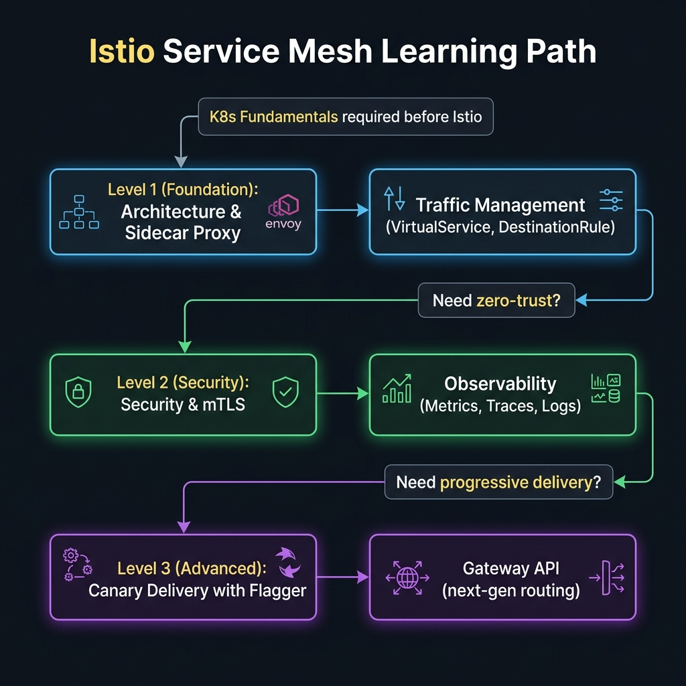

<!-- tags: overview -->
# Istio Service Mesh

> Lane hub for sidecar, traffic management, mTLS, observability, and delivery strategy within a service mesh.

| Aspect | Detail |
| --- | --- |
| **Concept** | Navigation hub for `Istio Service Mesh` |
| **Audience** | Platform engineer, SRE, architect |
| **Primary style** | Concept-First router |
| **Entry point** | Open when traffic policy, security, or cross-service observability has outgrown plain ingress/service capabilities. |

📅 Updated: 2026-04-20 · ⏱️ 6 min read

---

## 1. DEFINE

Picture `Istio Service Mesh` appearing when a cluster is under specific operational pressure and you can no longer answer with generic YAML.

A service mesh is not complex because it has many CRDs. It is complex because it intervenes in the real path of traffic, security, and telemetry. This lane helps you see the true cost of each decision.

This hub does not replace each detail article. It exists to help the reader open the right lane before diving into a specific tool, syntax, or diagram. When read in the right order, you spend less time feeling "I know many keywords but still cannot route a real problem."

### Signals & Boundaries

- Open this hub when you know the problem lies within `Istio Service Mesh`, but are not sure which article to read first.
- Use the coverage map to route by pain point rather than by file order.
- Return to this hub after each article to choose your next step with purpose.

### Coverage Map

| Entry | Role |
| --- | --- |
| [Architecture & Sidecar Proxy](01-architecture-sidecar.md) | Entry point for the `Architecture & Sidecar Proxy` lane |
| [Traffic Management](02-traffic-management.md) | Entry point for the `Traffic Management` lane |
| [Security & mTLS](03-security-mtls.md) | Entry point for the `Security & mTLS` lane |
| [Observability](04-observability.md) | Entry point for the `Observability` lane |
| [Canary & Progressive Delivery](05-canary-delivery.md) | Entry point for the `Canary & Progressive Delivery` lane |
| [Gateway API & Multi-cluster](06-gateway-api.md) | Entry point for the `Gateway API & Multi-cluster` lane |

---

## 2. VISUAL

The definition locked the hub's scope. The visual below routes by pain point — pick your entry level, skip what you already know.



### Level 1

```text
start from your current pain point
  -> Architecture & Sidecar Proxy
  -> Traffic Management
  -> Security & mTLS
  -> Observability
  -> Canary & Progressive Delivery
  -> Gateway API & Multi-cluster
```

*Figure: This hub works as a router, not a catalog to scroll through.*

### Level 2

```text
read the right lane -> reduces cross-jumping between articles
read the wrong lane -> the more you read, the more disconnected the terminology feels
```

*Figure: The real value of a router-style README is keeping the reader on the right path from the start.*

---

## 3. CODE

### Problem 1: Basic — Route by lane before reading in depth

> **Goal**: Prevent learning or review sessions from drifting into "any article will do."
> **Approach**: Choose a lane based on your current pain point.
> **Example**: Select the right cluster of articles within `Istio Service Mesh`.
> **Complexity**: Basic

```yaml
router:
  module: Istio Service Mesh
  rule: "choose lane by pain point, not by which name sounds familiar"
  suggested_path:
  - 01-architecture-sidecar.md
  - 02-traffic-management.md
  - 03-security-mtls.md
  - 04-observability.md
  - 05-canary-delivery.md
  - 06-gateway-api.md
```

This artifact does not solve the reader's problem for them; it only eliminates wrong lanes before time is burned on articles that do not serve the actual goal.

---

## 4. PITFALLS

| # | Severity | Mistake | Consequence | Fix |
| --- | --- | --- | --- | --- |
| 1 | 🔴 Fatal | Reading in file order without routing by pain point | Accumulates terminology without solving the real problem | Use the coverage map before opening any detail article |
| 2 | 🟡 Common | Treating this README as a pure link catalog | Loses the hub's navigation role | Always ask "which lane is my pain in?" |
| 3 | 🔵 Minor | Not returning to this hub after finishing an article | Ends up jumping to adjacent articles on instinct | Return to this README to choose the next step deliberately |

---

## 5. REF

| Resource | Type | Link | Note |
| --- | --- | --- | --- |
| Architecture & Sidecar Proxy | Internal | [Architecture & Sidecar Proxy](01-architecture-sidecar.md) | Directly related entry point |
| Traffic Management | Internal | [Traffic Management](02-traffic-management.md) | Directly related entry point |
| Security & mTLS | Internal | [Security & mTLS](03-security-mtls.md) | Directly related entry point |
| Observability | Internal | [Observability](04-observability.md) | Directly related entry point |

---

## 6. RECOMMEND

| Extension | When | Reason | File/Link |
| --- | --- | --- | --- |
| Architecture & Sidecar Proxy | When pain point matches this lane | Continue with the right cluster instead of reading scattered | [Architecture & Sidecar Proxy](01-architecture-sidecar.md) |
| Traffic Management | When pain point matches this lane | Continue with the right cluster instead of reading scattered | [Traffic Management](02-traffic-management.md) |
| Security & mTLS | When pain point matches this lane | Continue with the right cluster instead of reading scattered | [Security & mTLS](03-security-mtls.md) |
