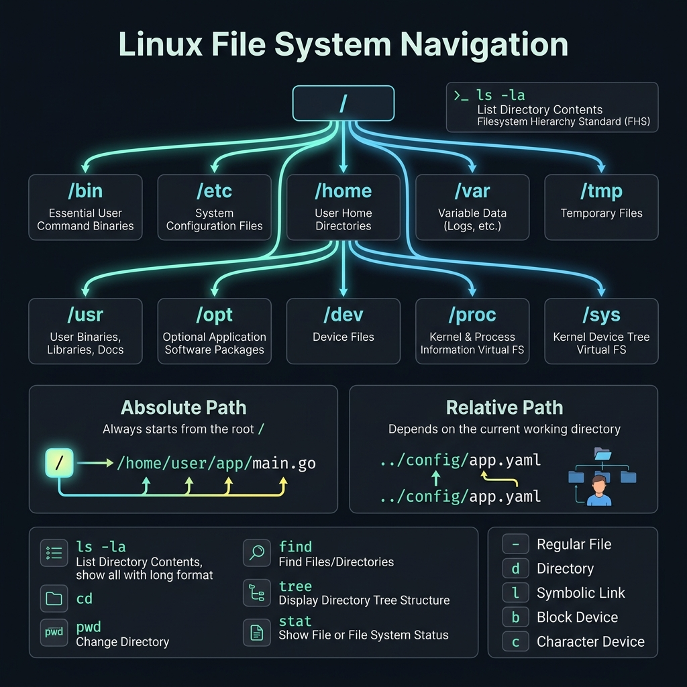

<!-- tags: linux, cli, file-system, sysadmin -->
# 📁 File System & Navigation

> Master files, directories, links, and filesystem navigation in Linux — the foundation of every on-call session.

📅 Created: 2026-03-20 · 🔄 Updated: 2026-04-20 · ⏱️ 15 min read

---

## 1. DEFINE

Picture yourself SSH-ing into an unfamiliar server during an on-call rotation. The first task is figuring out where you stand in the directory tree, which filesystem holds what, and which files you can touch without breaking the system.

### Linux File System Hierarchy

```text
/                    Root — the origin of everything
├── /bin             Essential commands (ls, cp, mv)
├── /sbin            System binaries (fdisk, iptables)
├── /etc             Configuration files
├── /home            User home directories
├── /var             Variable data (logs, caches)
│   ├── /var/log     System logs
│   └── /var/www     Web server files
├── /tmp             Temporary files (cleared on reboot)
├── /usr             User programs
│   ├── /usr/bin     User commands
│   └── /usr/lib     Libraries
├── /opt             Optional/third-party software
├── /dev             Device files
├── /proc            Process info (virtual filesystem)
├── /sys             Kernel/device info (virtual)
└── /mnt, /media     Mount points
```

### File Types

| Symbol | Type              | Example                |
| ------ | ----------------- | ---------------------- |
| `-`    | Regular file      | `text.txt`, `app.bin`  |
| `d`    | Directory         | `/home/user`           |
| `l`    | Symbolic link     | `link → target`        |
| `b`    | Block device      | `/dev/sda`             |
| `c`    | Character device  | `/dev/tty`             |
| `p`    | Named pipe (FIFO) | IPC                    |
| `s`    | Socket            | `/var/run/docker.sock` |

---

Those failure modes sound familiar. But there is a trap: `rm -rf` with a wrong path deletes the entire system, and `find -exec` without an escaped semicolon throws a syntax error. That trap appears in PITFALLS.

## 2. VISUAL

The definition locked the vocabulary. The visual below pulls navigation into the practical context where absolute versus relative paths decide whether your script runs correctly on every machine or only on yours.



```text
  Absolute path: /home/user/projects/app/main.go
                   ↑ always starts from /

  Relative path:  ../projects/app/main.go
                   ↑ from the current location

  Current dir:    .       (dot)
  Parent dir:     ..      (dot-dot)
  Home dir:       ~       (/home/username)
  Previous dir:   -       (cd -)
```

*Figure: Absolute paths start from root and work on any machine. Relative paths depend on the current directory — portable inside a project, fragile across machines.*

---

## 3. CODE

The diagram showed the path model. Code below proves how each navigation decision is enforced by real filesystem constraints, not just a clean diagram.

### Example 1: Basic Navigation

```bash
# ━━━ Navigate ━━━
cd /var/log           # absolute path
cd ../                # go up one level
cd ~                  # go to home directory
cd -                  # return to previous directory
pwd                   # print current directory

# ━━━ List (ls) ━━━
ls                    # list files
ls -la                # long format + hidden files
ls -lh                # human-readable sizes (KB, MB)
ls -lt                # sort by modification time
ls -lS                # sort by size (largest first)
ls -R                 # recursive
ls -d */              # directories only

# ━━━ Modern alternatives ━━━
# eza (better ls):
eza -la --icons --git    # icons + git status
eza --tree -L 3          # tree view, depth 3
# tree:
tree -L 2 -d             # directories only, depth 2
```

Navigation is covered. But file operations need CRUD — time to operate.

### Example 2: File Operations — CRUD

```bash
# ━━━ Create ━━━
touch file.txt            # create empty file (or update timestamp)
mkdir dir                 # create directory
mkdir -p a/b/c/d          # create nested dirs (parents auto-created)
mktemp                    # create a temp file
mktemp -d                 # create a temp directory

# ━━━ Read ━━━
cat file.txt              # print entire file
head -n 20 file.txt       # first 20 lines
tail -n 20 file.txt       # last 20 lines
tail -f /var/log/syslog   # follow in realtime
less file.txt             # scroll (q to quit)
wc -l file.txt            # count lines
file document.pdf         # detect file type

# ━━━ Copy / Move ━━━
cp file.txt backup.txt          # copy file
cp -r dir/ backup_dir/          # copy directory (recursive)
cp -a source/ dest/              # archive mode (preserves all attributes)
mv old.txt new.txt               # rename
mv file.txt /tmp/                # move
rsync -avz src/ dest/            # sync (better than cp for large transfers)

# ━━━ Delete ⚠ DANGEROUS ━━━
rm file.txt                      # delete file
rm -r dir/                       # delete directory
rm -rf dir/                      # force delete (NO CONFIRMATION)
# ⚠ NEVER: rm -rf /             → DELETES THE ENTIRE SYSTEM
# ⚠ Always verify first: echo rm -rf $VAR  → inspect what will be deleted
```

CRUD is covered. But finding files needs `find` — time to search.

### Example 3: Find — File Search

```bash
# ━━━ find: search files/directories ━━━
find / -name "*.log"                   # find by name
find / -iname "*.Log"                  # case-insensitive
find /var -type f -size +100M          # files > 100MB
find /tmp -type f -mtime +7            # modified more than 7 days ago
find /home -type f -name "*.tmp" -delete   # find + delete
find . -type f -empty                  # empty files
find . -type d -empty                  # empty directories

# Combined actions
find /var/log -name "*.log" -mtime +30 -exec rm {} \;      # delete logs > 30 days old
find . -name "*.go" -exec grep -l "TODO" {} \;              # Go files containing TODO
find . -name "*.go" | xargs grep "TODO"                     # faster version

# ━━━ fd (better find) ━━━
fd "\.go$"                            # find .go files
fd -t f -e log --size +1m             # log files > 1MB
fd -H ".env"                          # include hidden files
```

### Example 4: Links — Hard Link vs Symbolic Link

```bash
# ━━━━━━━━━━━━━━━━━━━━━━━━━━━━━━━━━━━━━━━━━
# Hard link: same inode, both point to the SAME data
# Deleting the original → hard link STILL works
# ⚠ Cannot hard link directories
# ⚠ Cannot cross filesystem boundaries
# ━━━━━━━━━━━━━━━━━━━━━━━━━━━━━━━━━━━━━━━━━
ln original.txt hardlink.txt
ls -li original.txt hardlink.txt     # same inode number

# ━━━━━━━━━━━━━━━━━━━━━━━━━━━━━━━━━━━━━━━━━
# Symbolic link (symlink): pointer → path
# Deleting the original → symlink BREAKS (dangling)
# ✅ Can link directories
# ✅ Can cross filesystem boundaries
# ━━━━━━━━━━━━━━━━━━━━━━━━━━━━━━━━━━━━━━━━━
ln -s /opt/app/config.yml ~/config.yml
ls -la ~/config.yml                  # shows -> /opt/app/config.yml
readlink -f ~/config.yml             # resolve full path

# Find broken symlinks
find / -xtype l 2>/dev/null
```

### Example 5: Combo — Disk Cleanup Script

```bash
#!/bin/bash
# ━━━ Production disk cleanup ━━━

echo "=== Disk Usage Before ==="
df -h /

echo ""
echo "=== Top 10 Largest Directories ==="
du -sh /var/* 2>/dev/null | sort -rh | head -10

echo ""
echo "=== Old Log Files (>30 days) ==="
find /var/log -name "*.log" -mtime +30 -type f -exec ls -lh {} \;

echo ""
echo "=== Temp Files ==="
find /tmp -type f -mtime +7 | wc -l
echo "files older than 7 days in /tmp"

echo ""
echo "=== Empty Directories ==="
find /var -type d -empty 2>/dev/null | head -10

# Cleanup (uncomment to execute)
# find /var/log -name "*.log.gz" -mtime +90 -delete
# find /tmp -type f -mtime +7 -delete
# journalctl --vacuum-time=30d
```

---

You have walked through navigation, CRUD, and find. Now comes the dangerous part: destructive `rm` and syntax errors — the trap set up from the beginning of this article.

## 4. PITFALLS

Knowing how to do it right is only half the story. The other half is the places where it is very easy to get almost right, then pay the price when the cluster or the OS starts shaking.

| #   | Mistake                                   | Consequence                  | Fix                                             |
| --- | ----------------------------------------- | ---------------------------- | ------------------------------------------------ |
| 1   | `rm -rf /` or `rm -rf $UNDEFINED_VAR/`   | Deletes the entire system    | Always echo first, use `set -u`                  |
| 2   | `cp` without `-r` for directories         | Error: "omitting directory"  | Use `cp -r` or `rsync`                           |
| 3   | Dangling symlink                          | Broken reference             | Check with `find -xtype l`                       |
| 4   | Spaces in filenames                       | `rm my file.txt` deletes 2 files | Quote paths: `rm "my file.txt"`              |
| 5   | `find -delete` in wrong position          | Deletes unintended files     | `-delete` must come last; test with `-print` first |

---

You have walked through File System and the traps. The resources below help go deeper.

## 5. REF

| Resource                   | Link                                                                                        |
| -------------------------- | ------------------------------------------------------------------------------------------- |
| Linux Filesystem Hierarchy | [tldp.org/LDP/Linux-Filesystem-Hierarchy](https://tldp.org/LDP/Linux-Filesystem-Hierarchy/) |
| `man find`                 | `man find` or [man7.org](https://man7.org/linux/man-pages/man1/find.1.html)                 |
| fd — modern find           | [github.com/sharkdp/fd](https://github.com/sharkdp/fd)                                      |

---

## 6. RECOMMEND

After this article, read the topic closest to your current decision so the production mental model does not fragment.

| Tool            | Replaces      | Reason                                      |
| --------------- | ------------- | ------------------------------------------- |
| **`eza`**       | `ls`          | Colors, icons, git integration              |
| **`fd`**        | `find`        | Simpler syntax, faster, respects .gitignore |
| **`bat`**       | `cat`, `less` | Syntax highlighting, line numbers           |
| **`zoxide`**    | `cd`          | Smart jump to frequent directories          |
| **`rsync`**     | `cp` (large)  | Delta transfer, resume, SSH support         |
| **`trash-cli`** | `rm`          | Moves to trash instead of permanent delete  |

---

**Links**: [← README](./README.md) · [→ Text Processing](./02-text-processing.md)
