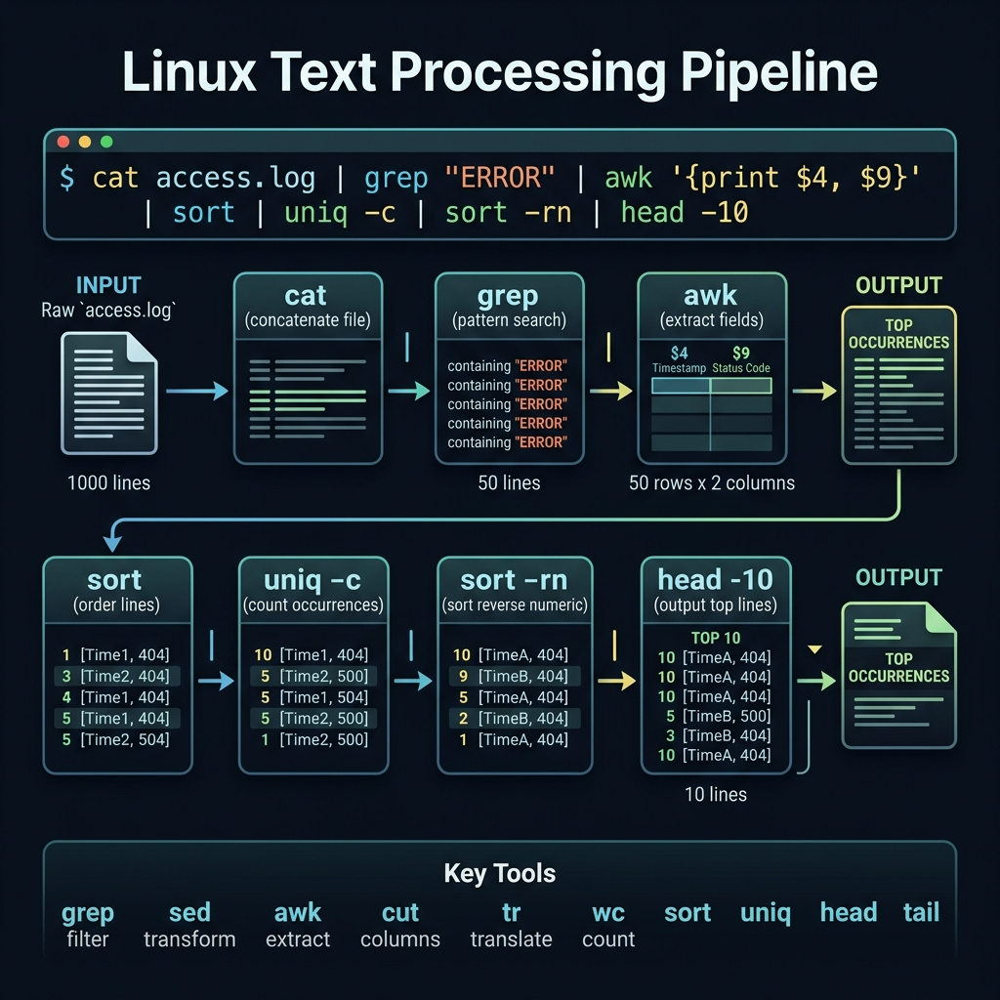

<!-- tags: linux, cli, text-processing, grep -->
# 🔍 Text Processing — grep, awk, sed, sort

> "grep + awk + sed = Linux superpowers" — extract, transform, and filter text from files and streams.

📅 Created: 2026-03-20 · 🔄 Updated: 2026-04-20 · ⏱️ 15 min read

---

## 1. DEFINE

Picture an incident where the thing that saves you is not an IDE but a few sharp text-processing commands that cut thousands of log lines down to the exact 10 lines you need to see. This lane exists for precisely that moment.

| Tool      | Purpose                      | When                       |
| --------- | ---------------------------- | -------------------------- |
| **grep**  | Find lines matching a pattern | Filter logs, search code   |
| **awk**   | Extract + transform columns  | Parse structured text      |
| **sed**   | Stream editor — find/replace | Modify files, bulk rename  |
| **sort**  | Sort lines                   | Order output               |
| **cut**   | Extract columns              | Simple column extraction   |
| **tr**    | Translate characters         | Case convert, delete chars |
| **wc**    | Count lines/words/chars      | Statistics                 |
| **uniq**  | Remove duplicates            | Deduplicate (requires sorted input) |
| **xargs** | Build commands from stdin    | Parallel processing        |

---

Those failure modes sound clear. But there is a trap: a greedy regex captures too much, and `sed -i` without a backup means data loss. That trap appears in PITFALLS.

## 2. VISUAL

Theory looks fine on paper. The visual below pulls it into the operational context where a single pipeline decides whether you find the root cause in 30 seconds or waste 30 minutes scrolling raw logs.



```text
  Pipeline pattern ("|" — pipe):

  cat access.log | grep "ERROR" | awk '{print $1, $4}' | sort | uniq -c | sort -rn

  access.log ──→ grep "ERROR"     ← filter ERROR lines
               ──→ awk '{print}'   ← extract IP + time
               ──→ sort            ← sort
               ──→ uniq -c         ← count duplicates
               ──→ sort -rn        ← sort by count DESC
```

*Figure: A single pipe chain reduces thousands of log lines to a ranked list of offending IPs — each stage narrows the haystack until only the needle remains.*

---

## 3. CODE

The diagram showed the pipeline rhythm. Code below proves how each tool enforces a specific constraint, not just a clean chain of arrows.

### Example 1: grep — Text Search

```bash
# ━━━ Basic grep ━━━
grep "error" app.log                    # find lines containing "error"
grep -i "error" app.log                 # case-insensitive
grep -n "error" app.log                 # show line numbers
grep -c "error" app.log                 # count matches
grep -v "DEBUG" app.log                 # invert — exclude DEBUG lines
grep -w "error" app.log                 # whole word only (won't match "errors")

# ━━━ Recursive ━━━
grep -rn "TODO" ./src/                  # search in all files
grep -rn "TODO" --include="*.go" ./     # only .go files
grep -rl "password" /etc/               # print filenames only

# ━━━ Regex ━━━
grep -E "error|warn|fatal" app.log      # Extended regex — OR
grep -P "\d{4}-\d{2}-\d{2}" app.log    # Perl regex — date pattern
grep -o "https://[^ ]*" page.html      # print only the match (not full line)

# ━━━ Context ━━━
grep -A 3 "error" app.log              # 3 lines After match
grep -B 2 "error" app.log              # 2 lines Before match
grep -C 5 "panic" app.log              # 5 lines Context (before+after)

# ━━━ ripgrep (better grep) ━━━
rg "TODO" --type go                    # faster, respects .gitignore
rg "error" -g "*.log" -C 3            # glob filter + context
rg "func \w+\(" --type go -l          # Go function definitions
```

grep basics are covered. But transforming columns needs awk — time to parse.

### Example 2: awk — Extract + Transform

```bash
# ━━━ Basic awk ━━━
awk '{print $1}' file.txt               # print column 1
awk '{print $1, $3}' file.txt           # print columns 1 and 3
awk '{print NR, $0}' file.txt           # NR = line number, $0 = entire line
awk -F: '{print $1}' /etc/passwd        # -F: = delimiter is ":"

# ━━━ Filter ━━━
awk '$3 > 100' data.txt                 # lines where column 3 > 100
awk '/ERROR/ {print $0}' app.log        # lines containing "ERROR"
awk 'NR>=10 && NR<=20' file.txt         # lines 10 through 20

# ━━━ Calculations ━━━
awk '{sum += $2} END {print "Total:", sum}' sales.txt          # sum of column 2
awk '{sum += $2; n++} END {print "Avg:", sum/n}' data.txt      # average
awk '{if ($3 > max) max=$3} END {print "Max:", max}' data.txt  # maximum

# ━━━ Format output ━━━
awk '{printf "%-20s %10.2f\n", $1, $2}' data.txt              # formatted table
awk 'BEGIN {OFS=","} {print $1, $2, $3}' data.txt              # CSV output

# ━━━ Real-world ━━━
# Top 10 IPs from access log:
awk '{print $1}' access.log | sort | uniq -c | sort -rn | head -10

# Disk usage by user:
du -sh /home/* 2>/dev/null | sort -rh

# Process memory usage:
ps aux | awk '{print $4, $11}' | sort -rn | head -10
```

awk is covered. But in-stream editing needs sed — time to transform.

### Example 3: sed — Stream Editor

```bash
# ━━━ Find & Replace ━━━
sed 's/old/new/' file.txt               # replace first occurrence per line
sed 's/old/new/g' file.txt              # replace ALL occurrences (global)
sed -i 's/old/new/g' file.txt           # in-place edit ⚠ modifies file!
sed -i.bak 's/old/new/g' file.txt       # in-place + backup

# ━━━ Delete lines ━━━
sed '/pattern/d' file.txt               # delete matching lines
sed '1d' file.txt                       # delete first line
sed '$d' file.txt                       # delete last line
sed '10,20d' file.txt                   # delete lines 10–20

# ━━━ Insert / Append ━━━
sed '3i\NEW LINE' file.txt              # insert before line 3
sed '3a\NEW LINE' file.txt               # append after line 3
sed '1i\#!/bin/bash' script.sh          # add shebang

# ━━━ Advanced ━━━
sed -n '10,20p' file.txt                # print lines 10–20 only
sed 's/[[:space:]]*$//' file.txt        # remove trailing whitespace
sed '/^$/d' file.txt                    # remove empty lines
sed 's/\t/  /g' file.txt               # tabs → 2 spaces

# ━━━ Multi-command ━━━
sed -e 's/foo/bar/g' -e 's/baz/qux/g' file.txt
```

### Example 4: sort, cut, uniq, wc, tr, xargs

```bash
# ━━━ sort ━━━
sort file.txt                # alphabetical
sort -n file.txt             # numeric
sort -r file.txt             # reverse
sort -k2 -t: file.txt       # sort by column 2, delimiter ":"
sort -u file.txt             # sort + unique
sort -rh sizes.txt           # human-readable reverse (10G, 5M, 1K)

# ━━━ cut ━━━
cut -d: -f1 /etc/passwd      # field 1, delimiter ":"
cut -c1-10 file.txt          # characters 1–10
echo "a,b,c" | cut -d, -f2  # "b"

# ━━━ uniq (requires sorted input!) ━━━
sort file.txt | uniq          # remove duplicates
sort file.txt | uniq -c       # count occurrences
sort file.txt | uniq -d       # only duplicates

# ━━━ wc ━━━
wc -l file.txt               # count lines
wc -w file.txt               # count words
wc -c file.txt               # count bytes
find . -name "*.go" | wc -l  # count .go files

# ━━━ tr ━━━
echo "hello" | tr a-z A-Z    # HELLO (uppercase)
echo "hello  world" | tr -s ' '  # squeeze spaces
cat file.txt | tr -d '\r'    # remove Windows \r

# ━━━ xargs ━━━
find . -name "*.log" | xargs rm                  # delete found files
find . -name "*.go" | xargs grep "TODO"           # search in found files
echo "1 2 3" | xargs -n1 echo "Number:"          # per-item processing
find . -name "*.jpg" | xargs -P4 -I{} convert {} {}.png  # parallel convert
```

### Example 5: Combo — Log Analysis Pipeline

```bash
#!/bin/bash
# ━━━ Production log analysis ━━━

LOG="/var/log/nginx/access.log"

echo "=== Top 10 IPs ==="
awk '{print $1}' "$LOG" | sort | uniq -c | sort -rn | head -10

echo ""
echo "=== HTTP Status Code Distribution ==="
awk '{print $9}' "$LOG" | sort | uniq -c | sort -rn

echo ""
echo "=== Top 10 Slowest Requests (>1s) ==="
awk '$NF > 1.0 {printf "%s %s %s %.2fs\n", $1, $6, $7, $NF}' "$LOG" \
    | sort -t' ' -k4 -rn | head -10

echo ""
echo "=== Error Rate (4xx + 5xx) ==="
total=$(wc -l < "$LOG")
errors=$(awk '$9 >= 400' "$LOG" | wc -l)
echo "$errors/$total = $(echo "scale=2; $errors*100/$total" | bc)%"

echo ""
echo "=== Requests Per Minute (last 10 min) ==="
awk '{print $4}' "$LOG" | sed 's/\[//' | cut -d: -f1-3 | uniq -c | tail -10
```

---

You have walked through grep, awk, and sed. Now comes the dangerous part: greedy regex and in-place edits — the trap set up from the beginning of this article.

## 4. PITFALLS

Errors usually do not sit in syntax. They sit in operational boundaries and forgotten failure modes. The table below collects exactly those mistakes.

| #   | Mistake                                | Consequence                  | Fix                          |
| --- | -------------------------------------- | ---------------------------- | ---------------------------- |
| 1   | `sed -i` without backup               | Data loss if pattern is wrong | Always use `sed -i.bak`     |
| 2   | `uniq` on unsorted data               | Duplicates remain            | `sort` before `uniq`         |
| 3   | `grep` count = 0 returns exit code 1  | Script fails on `set -e`    | Check `$?` or append `\|\| true` |
| 4   | `awk` default delimiter is whitespace  | Unexpected column splits     | Use `-F:` for custom delimiter |
| 5   | `xargs` with spaces in filenames      | Treats each word as a file   | Use `xargs -0` + `find -print0` |

---

You have walked through Text Processing and the traps. The resources below help go deeper.

## 5. REF

| Resource       | Link                                                                                  |
| -------------- | ------------------------------------------------------------------------------------- |
| grep manual    | `man grep`                                                                            |
| AWK one-liners | [catonmat.net/awk-one-liners](https://catonmat.net/awk-one-liners-explained-part-one) |
| sed one-liners | [catonmat.net/sed-one-liners](https://catonmat.net/sed-one-liners-explained-part-one) |
| ripgrep        | [github.com/BurntSushi/ripgrep](https://github.com/BurntSushi/ripgrep)                |

---

## 6. RECOMMEND

After this article, read the topic closest to your current decision so the production mental model does not fragment.

| Tool               | Replaces   | Reason                          |
| ------------------ | ---------- | ------------------------------- |
| **`ripgrep` (rg)** | `grep`     | 10x faster, .gitignore aware    |
| **`sd`**           | `sed`      | Simpler syntax `sd 'old' 'new'` |
| **`jq`**           | awk (JSON) | Parse/transform JSON            |
| **`yq`**           | awk (YAML) | Parse/transform YAML            |
| **`miller` (mlr)** | awk (CSV)  | CSV/JSON/TSV processing         |

---

**Links**: [← File System](./01-file-system.md) · [→ Process Management](./03-process-management.md)
