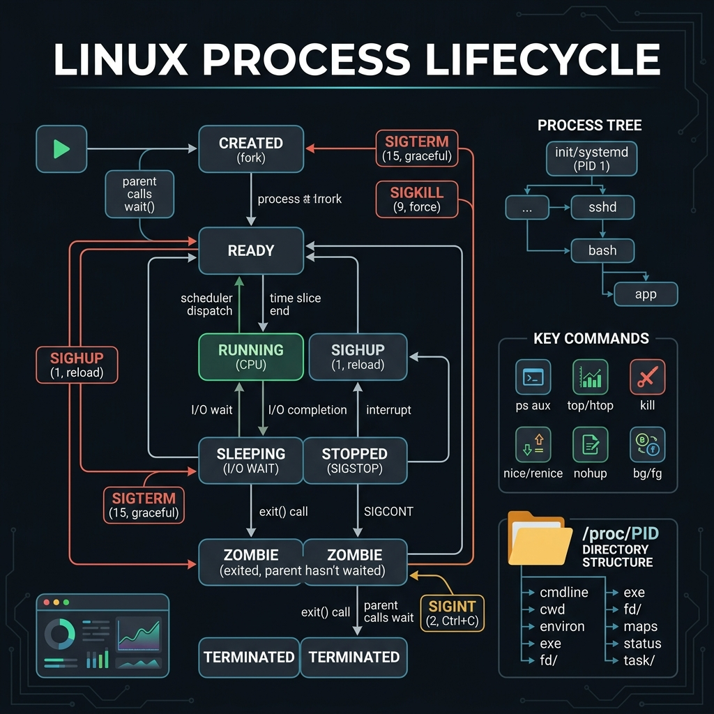
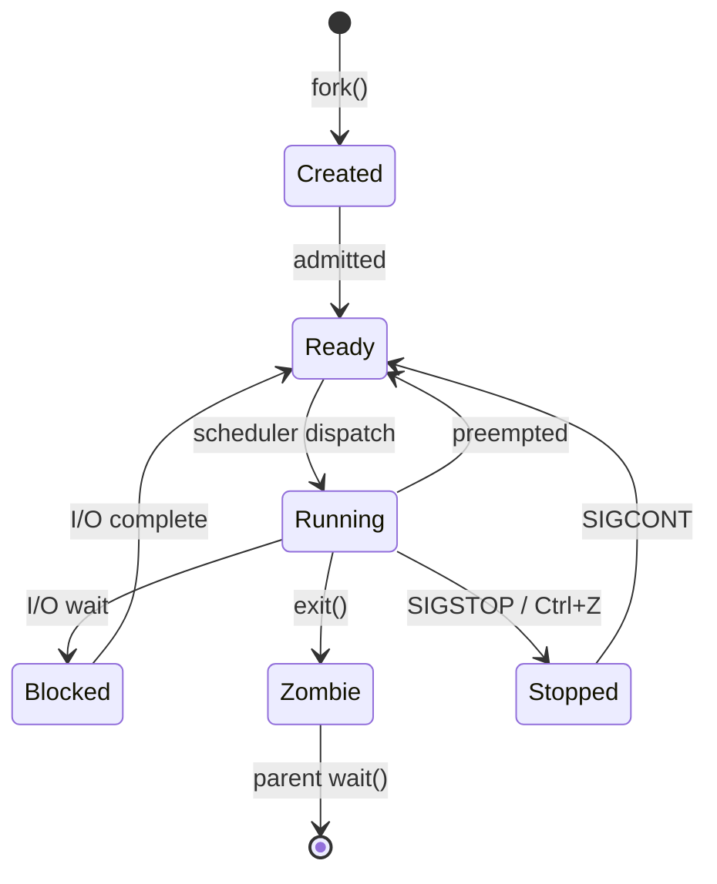

<!-- tags: linux, cli, processes, sysadmin -->
# ⚙️ Process Management

> Monitor, manage, and debug processes — "Engineers don't guess — they check processes first."

📅 Created: 2026-03-20 · 🔄 Updated: 2026-04-20 · ⏱️ 15 min read

---

## 1. DEFINE

Picture an application running slow or hanging completely. Guessing is the fastest way to waste even more time. Process management starts with seeing the right PID, signal, thread, and resource before touching `kill`.

| Concept     | Description                              |
| ----------- | ---------------------------------------- |
| **Process** | A running instance of a program          |
| **PID**     | Process ID — unique identifier           |
| **PPID**    | Parent Process ID                        |
| **Daemon**  | Background process (no terminal)         |
| **Zombie**  | Process finished but parent has not called `wait()` |
| **Orphan**  | Parent died → adopted by init (PID 1)    |
| **Signal**  | IPC mechanism — SIGTERM, SIGKILL, SIGHUP |

### Process States

```text
  RUNNING (R) → actively executing / in run queue
  SLEEPING (S) → waiting for event (IO, timer)
  STOPPED (T) → suspended (Ctrl+Z)
  ZOMBIE (Z) → terminated but not reaped
  DEAD (X) → should never be seen
```

---

Those failure modes sound easy to avoid. But there is a trap: `kill -9` does not let the process clean up — leaving orphan files and stale locks — and zombie processes consume the PID table. That trap appears in PITFALLS.

## 2. VISUAL

The definition locked the vocabulary. The visual below shows how processes transition through states and how signals control their lifecycle.





*Figure: A process moves from Created to Running via the scheduler. If the parent never calls wait(), the process stays Zombie — consuming a PID slot but no CPU.*

---

## 3. CODE

The diagram showed the state model. Code below shows how to inspect, control, and debug real processes on a live system.

### Example 1: View Processes — ps, top, htop

```bash
# ━━━ ps: snapshot processes ━━━
ps aux                              # all processes (BSD syntax)
ps -ef                              # all processes (UNIX syntax)
ps aux --sort=-%mem | head -20      # top 20 by memory
ps aux --sort=-%cpu | head -20      # top 20 by CPU
ps -u username                      # processes of a specific user
ps -p 1234                          # specific PID
ps -C nginx                        # processes named "nginx"
ps aux | grep "[n]ginx"            # grep nginx (trick: [n] avoids matching grep itself)

# ━━━ Process tree ━━━
pstree                              # process hierarchy
pstree -p                           # with PIDs
pstree -u                           # with user changes

# ━━━ top: live monitoring ━━━
top                                 # interactive
top -o %CPU                         # sort by CPU
top -o %MEM                         # sort by memory
top -p 1234                         # monitor specific PID
top -bn1                            # batch mode (1 iteration, for scripts)

# ━━━ htop: visual process monitor ━━━
htop                                # interactive, tree view, colors
# F5: tree view | F6: sort by | F9: kill | F4: filter

# ━━━ System overview ━━━
uptime                              # load average (1m, 5m, 15m)
free -h                             # memory usage
vmstat 1 5                          # virtual memory stats (1s interval, 5 times)
```

Process listing is covered. But sending signals needs kill — time to dispatch.

### Example 2: Kill & Signal

```bash
# ━━━ Signals ━━━
# SIGTERM (15): graceful shutdown — default signal
# SIGKILL (9):  force kill — CANNOT be caught
# SIGHUP (1):   reload config — nginx, apache
# SIGINT (2):   interrupt — Ctrl+C
# SIGSTOP (19): pause
# SIGCONT (18): resume

# ━━━ kill commands ━━━
kill <PID>                    # SIGTERM (graceful)
kill -9 <PID>                 # SIGKILL (force — last resort! ⚠)
kill -HUP <PID>               # reload config
kill -STOP <PID>               # pause process
kill -CONT <PID>               # resume process
killall nginx                 # kill all by name
pkill -f "python app.py"     # kill by command pattern

# ━━━ Why NOT use kill -9 first? ━━━
# 1. SIGKILL prevents cleanup (temp files, locks, connections)
# 2. Always try SIGTERM first → wait 5-10s → SIGKILL only if needed
# 3. Zombie processes CANNOT be killed with -9 → kill the parent instead
```

Signals are covered. But background jobs need control — time to manage.

### Example 3: Job Control — bg, fg, nohup, disown

```bash
# ━━━ Background / Foreground ━━━
./long-task.sh &              # run in background (& at the end)
jobs                          # list background jobs
fg %1                        # bring job 1 to foreground
bg %1                        # resume job 1 in background
Ctrl+Z                       # suspend foreground process
Ctrl+C                       # interrupt (SIGINT)

# ━━━ nohup: survive logout ━━━
nohup ./script.sh &           # survive terminal close
nohup ./script.sh > output.log 2>&1 &   # with redirect

# ━━━ disown: detach from terminal ━━━
./long-task.sh &
disown %1                     # detach from shell

# ━━━ screen / tmux: persistent sessions ━━━
tmux new -s mysession         # new session
tmux attach -t mysession      # reattach
tmux ls                       # list sessions
# Ctrl+B, D → detach (keeps running)
```

### Example 4: Resource Monitoring

```bash
# ━━━ CPU ━━━
mpstat 1 5                   # CPU statistics per second
sar -u 1 5                   # system activity report
nproc                        # number of CPU cores

# ━━━ Memory ━━━
free -h                      # total/used/free/cached
cat /proc/meminfo            # detailed memory info

# ━━━ Per-process resources ━━━
pidstat -p <PID> 1           # CPU/memory per process
/proc/<PID>/status           # process details
ls -la /proc/<PID>/fd        # open file descriptors
strace -p <PID>              # system calls (debug)
lsof -p <PID>                # open files by process
lsof -i :8080                # process using port 8080
```

### Example 5: Combo — Process Debugging Workflow

```bash
#!/bin/bash
# ━━━ Debug: app is slow/unresponsive ━━━

APP="myapp"

echo "=== 1. Find the process ==="
ps aux | grep "[${APP:0:1}]${APP:1}"

echo ""
echo "=== 2. CPU & Memory usage ==="
ps aux | awk -v app="$APP" '$11 ~ app {printf "PID: %s CPU: %s%% MEM: %s%%\n", $2, $3, $4}'

echo ""
echo "=== 3. Open connections ==="
PID=$(pgrep -f "$APP" | head -1)
if [ -n "$PID" ]; then
    echo "PID: $PID"
    ls /proc/$PID/fd 2>/dev/null | wc -l
    echo "open file descriptors"

    echo ""
    echo "=== 4. Network connections ==="
    ss -tnp | grep "$PID"

    echo ""
    echo "=== 5. Thread count ==="
    ls /proc/$PID/task 2>/dev/null | wc -l
    echo "threads"
fi

echo ""
echo "=== 6. System load ==="
uptime
free -h
```

---

You have walked through processes, signals, and monitoring. Now comes the dangerous part: forced kill and zombies — the trap set up from the beginning of this article.

## 4. PITFALLS

Knowing how to do it right is only half the story. The other half is the places where it is very easy to get almost right, then pay the price when the cluster or the OS starts shaking.

| #   | Mistake                           | Consequence                     | Fix                              |
| --- | --------------------------------- | ------------------------------- | -------------------------------- |
| 1   | `kill -9` as the first signal     | Skips cleanup: orphan files, stale locks | Always try `kill` (SIGTERM) first |
| 2   | Zombie processes                  | Consume PID table slots         | Kill the PARENT, not the zombie  |
| 3   | `nohup` without `&`              | Process remains in foreground   | Always append `&`                |
| 4   | `grep process` matches itself    | False match in `ps` output      | Use `ps aux \| grep "[n]ginx"`   |
| 5   | `top` load average > CPU cores   | System is overloaded            | Find the bottleneck first        |

---

You have walked through Process Management and the traps. The resources below help go deeper.

## 5. REF

| Resource   | Type     | Link                                                    | Notes                              |
| ---------- | -------- | ------------------------------------------------------- | ---------------------------------- |
| `man ps`   | Official | https://man7.org/linux/man-pages/man1/ps.1.html         | Snapshot process list and flags    |
| `man kill` | Official | https://man7.org/linux/man-pages/man1/kill.1.html       | Signal semantics and dispatch      |
| `htop`     | Official | https://htop.dev/                                       | Visual process monitoring          |

---

## 6. RECOMMEND

After this article, read the topic closest to your current decision so the production mental model does not fragment.

| Tool          | Replaces | Reason                           |
| ------------- | -------- | -------------------------------- |
| **`htop`**    | `top`    | Visual, tree view, mouse support |
| **`btop`**    | `htop`   | Modern, beautiful TUI            |
| **`glances`** | `top`    | All-in-one monitoring            |
| **`tmux`**    | `screen` | Modern terminal multiplexer      |

---

**Links**: [← Text Processing](./02-text-processing.md) · [→ Permissions](./04-permissions-ownership.md)
