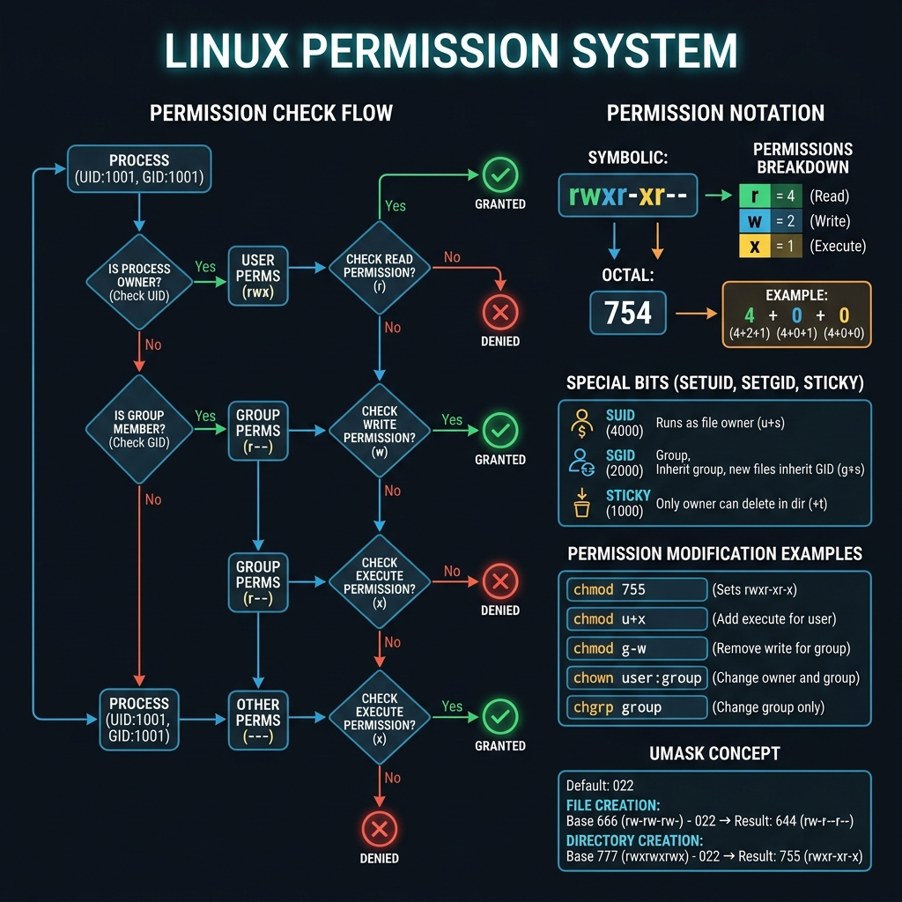

<!-- tags: linux, cli, permissions, security -->
# 🔒 Permissions & Ownership

> chmod, chown, umask, ACL — control who can read, write, and execute every file on the system.

📅 Created: 2026-03-20 · 🔄 Updated: 2026-04-20 · ⏱️ 15 min read

---

## 1. DEFINE

A permission error rarely announces itself clearly. It usually shows up as "why won't this file open?" or "the service runs but cannot read the secret." This article is about that exact friction point.

### Permission Model

```text
  -rwxr-xr--  1  user  group  4096  Mar 18  file.txt
  │├┘├┘├┘     │   │      │
  │ │  │  │   │   │      └── group owner
  │ │  │  │   │   └── file owner
  │ │  │  │   └── hard link count
  │ │  │  └── Others (everyone else)
  │ │  └── Group permissions
  │ └── Owner permissions
  └── File type (- = file, d = dir, l = link)

  r = read (4)    w = write (2)    x = execute (1)
  rwx = 7          rw- = 6          r-x = 5          r-- = 4
```

### Special Permissions

| Bit            | Name         | File               | Directory                          |
| -------------- | ------------ | ------------------ | ---------------------------------- |
| **SUID** (4)   | Set User ID  | Runs as file owner | —                                  |
| **SGID** (2)   | Set Group ID | Runs as file group | New files inherit group            |
| **Sticky** (1) | Sticky bit   | —                  | Only owner can delete (e.g., /tmp) |

---

Those failure modes sound basic. But there is a trap: `chmod 777` means world-writable, which is a security risk, and a recursive `chown` on the wrong path changes permissions across the entire system. That trap appears in PITFALLS.

## 2. VISUAL

Theory sounds fine on paper. The visual below shows how the kernel checks owner, group, and other permissions — and how special bits change the execution context.



```text
  Permission check flow (Linux kernel):

  User requests access to file
    │
    ├── Is user the OWNER?
    │     └── Yes → apply OWNER bits (rwx)
    │
    ├── Is user in the file's GROUP?
    │     └── Yes → apply GROUP bits (rwx)
    │
    └── Otherwise → apply OTHERS bits (rwx)

  Special bits override:
    SUID → process runs as file OWNER (not the caller)
    SGID → process runs as file GROUP / new files inherit group
    Sticky → only file owner can delete in shared directories
```

*Figure: The kernel checks owner first, then group, then others — it stops at the first match. SUID/SGID override the effective user/group during execution.*

---

## 3. CODE

The diagram showed the decision flow. Code below shows how each permission constraint is enforced on a live system.

### Example 1: chmod — Change Permissions

```bash
# ━━━ Numeric mode (octal) ━━━
chmod 755 script.sh        # rwxr-xr-x
chmod 644 config.yml       # rw-r--r--
chmod 600 id_rsa           # rw------- (SSH keys!)
chmod 700 private_dir/     # rwx------

# ━━━ Symbolic mode ━━━
chmod u+x script.sh        # owner + execute
chmod g+w file.txt         # group + write
chmod o-r file.txt         # others - read
chmod a+r file.txt         # all + read

# ━━━ Recursive ━━━
chmod -R 755 /var/www/
chmod -R u+rw project/

# ━━━ Special permissions ━━━
chmod 4755 /usr/bin/sudo    # SUID — runs as root
chmod 2755 /shared/dir      # SGID — new files inherit group
chmod 1777 /tmp              # Sticky — only owner can delete
```

Permission basics are covered. But changing ownership needs chown — time to assign.

### Example 2: chown / chgrp — Ownership

```bash
chown user file.txt                  # change owner
chown user:group file.txt            # change owner + group
chown -R user:group /var/www/        # recursive
chown --reference=ref.txt file.txt   # copy ownership from reference

chgrp developers project/
chgrp -R www-data /var/www/

# Common patterns
chown root:root /etc/nginx/nginx.conf
chown www-data:www-data /var/www/ -R
chown $USER:$USER ~/project/ -R
```

### Example 3: umask — Default Permissions

```bash
# umask = bits to REMOVE from default
# File default: 666 | Dir default: 777
umask                    # show current (usually 0022)
umask 0022               # files: 644, dirs: 755 (standard)
umask 0077               # files: 600, dirs: 700 (strict)

echo "umask 0027" >> ~/.bashrc   # make permanent
```

### Example 4: Production Security Patterns

```bash
# ━━━ SSH Keys ━━━
chmod 700 ~/.ssh
chmod 600 ~/.ssh/id_rsa              # private key — MUST be 600
chmod 644 ~/.ssh/id_rsa.pub
chmod 600 ~/.ssh/authorized_keys

# ━━━ Web Server ━━━
chown -R www-data:www-data /var/www/
find /var/www -type f -exec chmod 644 {} \;   # files: rw-r--r--
chmod 400 /var/www/.env              # secrets: owner read only

# ━━━ Application secrets ━━━
chmod 600 /etc/app/database.yml
chown root:root /etc/ssl/private/server.key
chmod 400 /etc/ssl/private/server.key
```

---

You have walked through permissions, ownership, and security patterns. Now comes the dangerous part: the 777 trap and recursive chown — the trap set up from the beginning.

## 4. PITFALLS

| #   | Mistake                     | Consequence                          | Fix                              |
| --- | --------------------------- | ------------------------------------ | -------------------------------- |
| 1   | SSH key with chmod 644      | `Permissions too open` → rejected    | Use `chmod 600`                  |
| 2   | `chmod 777` on everything   | World-writable — security hole       | Use minimum required permissions |
| 3   | Web directory owned by root | App cannot write uploads or logs     | `chown www-data:www-data`        |
| 4   | SUID on shell scripts       | Privilege escalation risk            | SUID only on compiled binaries   |
| 5   | `chmod -R 755` on files     | Regular files gain execute bit       | `find -type f -exec chmod 644`   |

---

## 5. REF

| Resource      | Type     | Link                                                         | Notes                    |
| ------------- | -------- | ------------------------------------------------------------ | ------------------------ |
| `man chmod`   | Official | https://man7.org/linux/man-pages/man1/chmod.1.html           | Numeric and symbolic modes |
| `man chown`   | Official | https://man7.org/linux/man-pages/man1/chown.1.html           | Ownership changes        |
| `man setfacl` | Official | https://man7.org/linux/man-pages/man1/setfacl.1.html         | ACL for fine-grained access |

---

## 6. RECOMMEND

| Tool                      | Description                                     |
| ------------------------- | ----------------------------------------------- |
| **`setfacl` / `getfacl`** | Access Control Lists — fine-grained permissions |
| **`sudo`**                | Execute as another user (usually root)          |
| **`visudo`**              | Safely edit the sudoers file                    |

---

**Links**: [← Process Management](./03-process-management.md) · [→ Networking](./05-networking.md)
