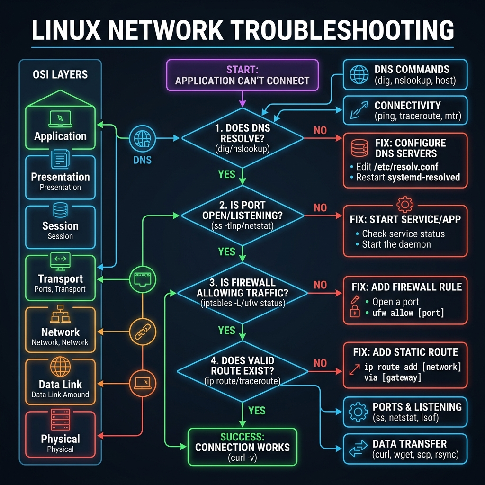
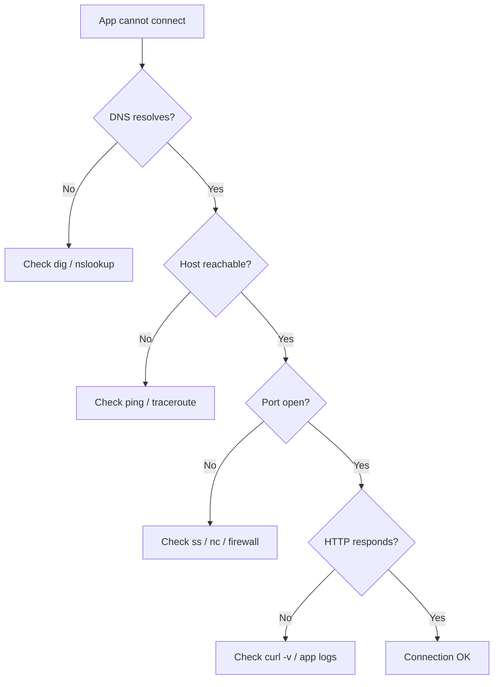

<!-- tags: linux, cli, networking, sysadmin -->
# 🌐 Networking

> "80% of outages are networking." — ss, curl, ping, traceroute, dig, ip, nc.

📅 Created: 2026-03-20 · 🔄 Updated: 2026-04-20 · ⏱️ 15 min read

---

## 1. DEFINE

You can have the right application and the right config, but a single wrong port, route, or DNS record kills connectivity just the same. Networking commands exist to decompose "cannot connect" into layers you can actually inspect.

| Tool                   | Purpose                                |
| ---------------------- | -------------------------------------- |
| **ss**                 | Socket statistics — ports, connections |
| **curl**               | HTTP requests — test APIs              |
| **ping**               | ICMP — basic connectivity              |
| **traceroute**         | Route path — where traffic stops       |
| **dig** / **nslookup** | DNS resolution                         |
| **nc** (netcat)        | TCP/UDP connections — port scanning    |
| **ip**                 | Network interfaces, routing            |
| **wget**               | Download files                         |
| **nmap**               | Port scanning (security)               |

---

Those failure modes sound familiar. But there is a trap: firewall rule order matters — a wrong rule blocks traffic silently — and stale DNS cache means connecting to the wrong IP. That trap appears in PITFALLS.

## 2. VISUAL

The concept has a name. In the diagram, the critical part emerges: a systematic decision tree that eliminates guesswork when connectivity fails.





*Figure: Debug connectivity layer by layer — DNS first, then ICMP reachability, then port, then HTTP. Skipping layers wastes time on the wrong hypothesis.*

---

## 3. CODE

The diagram showed the debug path. Code below shows how each layer is inspected with specific commands.

### Example 1: ss — Socket Statistics (replaces netstat)

```bash
# ━━━ Listening ports ━━━
ss -tulnp                    # TCP + UDP listening, numeric, show process
ss -tlnp                     # TCP only
ss -ulnp                     # UDP only

# ━━━ Connections ━━━
ss -tn                       # current TCP connections
ss -tn state established     # only established
ss -tn state time-wait       # TIME_WAIT (connection pool issues)
ss -tn dst :443              # connections to port 443

# ━━━ Count connections per state ━━━
ss -tan | awk '{print $1}' | sort | uniq -c | sort -rn

# ━━━ Find process on port ━━━
ss -tlnp | grep :8080
# or
lsof -i :8080
```

Socket statistics are covered. But HTTP testing needs curl — time to request.

### Example 2: curl — HTTP Client

```bash
# ━━━ Basic requests ━━━
curl http://localhost:8080                  # GET
curl -X POST http://localhost/api -d '{"key":"val"}' -H "Content-Type: application/json"
curl -X PUT http://localhost/api/1 -d '{"key":"new"}'
curl -X DELETE http://localhost/api/1

# ━━━ Headers & Auth ━━━
curl -I https://google.com                 # HEAD only (headers)
curl -H "Authorization: Bearer TOKEN" http://api/data
curl -u user:pass http://api/data          # Basic auth

# ━━━ Debug ━━━
curl -v https://google.com                 # verbose (headers + body)
curl -w "HTTP Code: %{http_code}\nTime: %{time_total}s\n" -o /dev/null -s https://google.com
curl --connect-timeout 5 --max-time 10 http://slow-server/

# ━━━ Download ━━━
curl -O https://example.com/file.tar.gz    # save as original filename
curl -o output.tar.gz https://example.com/file.tar.gz  # custom filename
curl -L https://short.url                  # follow redirects

# ━━━ API testing loop ━━━
for i in $(seq 1 100); do
    curl -s -o /dev/null -w "%{http_code} %{time_total}s\n" http://api/health
done
```

curl is covered. But DNS debugging needs dig — time to resolve.

### Example 3: ping, traceroute, dig

```bash
# ━━━ ping: connectivity check ━━━
ping google.com                    # continuous
ping -c 5 google.com              # 5 packets
ping -c 3 -W 2 10.0.0.1           # timeout 2s

# ━━━ traceroute: path tracing ━━━
traceroute google.com              # ICMP path
traceroute -T -p 443 google.com   # TCP traceroute to port 443
mtr google.com                    # interactive traceroute + ping

# ━━━ DNS ━━━
dig google.com                     # DNS lookup
dig +short google.com             # IP only
dig @8.8.8.8 google.com           # query specific DNS server
dig -x 142.250.196.14             # reverse DNS
nslookup google.com               # simpler DNS lookup
host google.com                   # even simpler

# ━━━ nc (netcat): Swiss army knife ━━━
nc -zv host 80                    # port check
nc -zv host 1-1000               # port range scan
nc -l 8080                       # listen on port (simple server)
echo "GET /" | nc host 80        # manual HTTP request
```

### Example 4: ip — Network Configuration

```bash
# ━━━ Interfaces ━━━
ip addr                           # all interfaces + IPs
ip addr show eth0                 # specific interface
ip link                           # link status (up/down)
ip link set eth0 up               # bring up interface

# ━━━ Routing ━━━
ip route                          # routing table
ip route get 8.8.8.8             # how to reach an IP
ip route add 10.0.0.0/24 via 192.168.1.1   # add route

# ━━━ ARP / Neighbors ━━━
ip neigh                          # ARP table
```

### Example 5: Combo — Network Debugging Workflow

```bash
#!/bin/bash
# ━━━ Debug: app not reachable ━━━

HOST="myapp.example.com"
PORT=8080

echo "=== 1. DNS Resolution ==="
dig +short "$HOST"

echo ""
echo "=== 2. Ping ==="
ping -c 3 -W 2 "$HOST"

echo ""
echo "=== 3. Port Check ==="
nc -zv -w3 "$HOST" "$PORT" 2>&1

echo ""
echo "=== 4. HTTP Check ==="
curl -sS -o /dev/null -w "HTTP %{http_code} in %{time_total}s\n" \
    --connect-timeout 5 "http://${HOST}:${PORT}/health"

echo ""
echo "=== 5. Local Ports ==="
ss -tlnp | grep ":$PORT"

echo ""
echo "=== 6. Route ==="
traceroute -m 15 "$HOST" 2>/dev/null | head -15

echo ""
echo "=== 7. Connection States ==="
ss -tn | awk '{print $1}' | sort | uniq -c | sort -rn
```

---

You have walked through ss, curl, and DNS. Now comes the dangerous part: firewall order and stale DNS — the trap set up from the beginning.

## 4. PITFALLS

| #   | Mistake                    | Consequence               | Fix                                       |
| --- | ------------------------- | ------------------------- | ----------------------------------------- |
| 1   | `netstat` is deprecated    | Missing features          | Use `ss` instead                          |
| 2   | Firewall blocking silently | Connection times out      | `iptables -L` / `firewall-cmd --list-all` |
| 3   | Stale DNS cache            | Connects to wrong IP      | `systemd-resolve --flush-caches`          |
| 4   | curl without `-L`          | Misses redirect responses | Use `-L` to follow redirects              |
| 5   | ping works but HTTP fails  | Port or app issue         | Check port + firewall + app logs          |

---

## 5. REF

| Resource    | Type     | Link                                                    | Notes                       |
| ----------- | -------- | ------------------------------------------------------- | --------------------------- |
| `man ss`    | Official | https://man7.org/linux/man-pages/man8/ss.8.html         | Socket statistics and ports |
| `curl docs` | Official | https://curl.se/docs/                                   | HTTP client and debugging   |
| `man ip`    | Official | https://man7.org/linux/man-pages/man8/ip.8.html         | Interface, route, neighbor  |

---

## 6. RECOMMEND

| Tool            | Description                                     |
| --------------- | ----------------------------------------------- |
| **`httpie`**    | Better curl for APIs — `http GET api.com/users` |
| **`mtr`**       | traceroute + ping combined                      |
| **`nmap`**      | Network/port scanner                            |
| **`tcpdump`**   | Packet capture                                  |
| **`wireshark`** | GUI packet analysis                             |

---

**Links**: [← Permissions](./04-permissions-ownership.md) · [→ Disk & Storage](./06-disk-storage.md)
