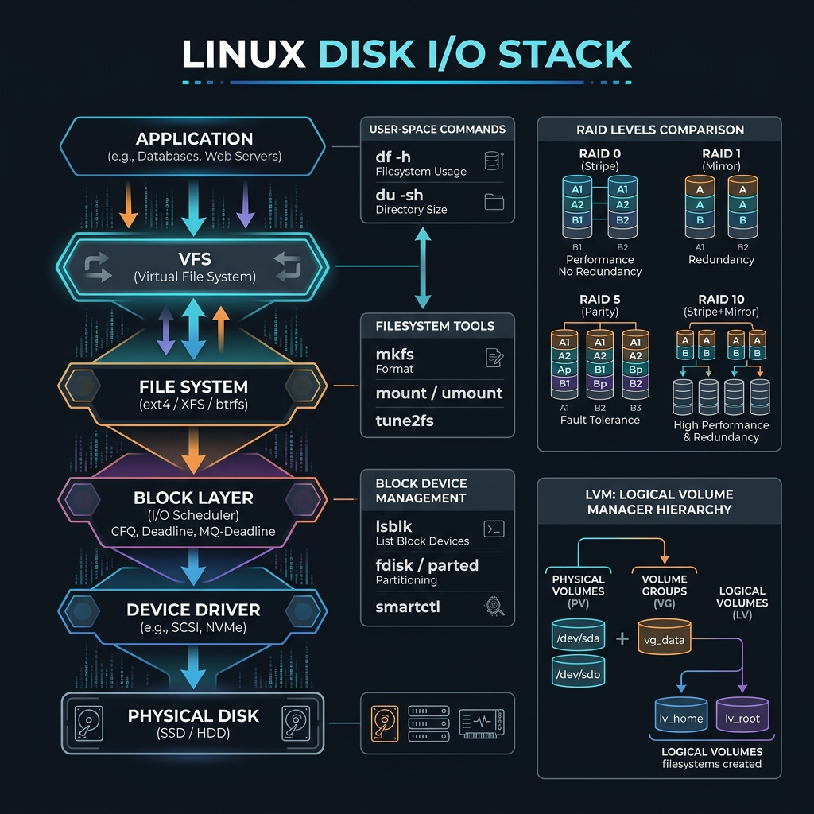

<!-- tags: linux, cli, storage, sysadmin -->
# 💾 Disk & Storage

> "Log files fill up disks faster than anything else!" — df, du, lsblk, mount.

📅 Created: 2026-03-20 · 🔄 Updated: 2026-04-20 · ⏱️ 15 min read

---

## 1. DEFINE

A full disk is not just a 100% number on a dashboard. It triggers a cascade of secondary failures: logs stop writing, the database stalls, deploys fail. This article locks down the commands you should run before cleaning anything.

| Tool       | Purpose                      |
| ---------- | ---------------------------- |
| **df**     | Disk free — filesystem usage |
| **du**     | Disk usage — directory sizes |
| **lsblk**  | List block devices           |
| **mount**  | Mount filesystems            |
| **fdisk**  | Partition management         |
| **iostat** | IO statistics                |

---

Those failure modes sound clear. But there is a trap: `df -h` misses inode exhaustion — the disk reports free space but nothing can write — and mounting to the wrong path sends data to the root filesystem. That trap appears in PITFALLS.

## 2. VISUAL

The definition locked the vocabulary. The visual below shows how I/O requests travel from application through VFS, filesystem, and block layer down to physical disk.



### Disk I/O Stack

```text
Application
    │ read()/write()
    ▼
Kernel VFS
    │
    ▼
Page Cache (RAM)   ←── cache hit: fast ✅
    │ cache miss
    ▼
Block Device Driver
    │
    ▼
SSD / HDD          ←── IO: slow ⚠️
```

### df vs du

```text
df -h     →  Disk Free  (filesystem level — how much space used/free)
du -sh *  →  Disk Usage (directory level — which dir is large)

df: /dev/sda1  50G  20G  30G  40%  /
du: 8.5G   /var/log    ← this folder using 8.5G!
    2.1G   /home
```

*Figure: df reports the filesystem summary. du drills into individual directories. Start with df to confirm the problem, then du to find the culprit.*

---

## 3. CODE

The visual showed the I/O stack and the df-vs-du split. Code below proves how each inspection command translates into actionable cleanup decisions.

### Example 1: df, du — Disk Usage

```bash
# ━━━ df: filesystem usage ━━━
df -h                              # human-readable
df -hT                             # include filesystem type
df -i                              # inode usage (can run out!)

# ━━━ du: directory sizes ━━━
du -sh /var/log                    # total size of directory
du -sh /var/*                      # each subdirectory
du -sh * | sort -rh | head -20     # top 20 largest
du -sh --max-depth=1 /             # top-level sizes

# ━━━ Find largest files ━━━
find / -type f -size +100M -exec ls -lh {} \; 2>/dev/null | sort -k5 -rh | head -20
```

df basics are covered. But block devices need lsblk — time to inspect the hardware.

### Example 2: lsblk, mount

```bash
lsblk                             # tree of disks + partitions
lsblk -f                          # include filesystem + UUID
mount                             # all mounted filesystems
mount /dev/sdb1 /mnt/data         # mount partition
umount /mnt/data                  # unmount
fdisk -l                          # list all partitions
```

### Example 3: Combo — Disk Cleanup

```bash
#!/bin/bash
echo "=== Current Usage ==="
df -h / | tail -1

echo "=== Largest Directories ==="
du -sh /var/* 2>/dev/null | sort -rh | head -10

echo "=== Journal Size ==="
journalctl --disk-usage

# Cleanup (uncomment):
# journalctl --vacuum-time=30d
# journalctl --vacuum-size=500M
# apt-get autoremove -y
# docker system prune -af
# find /var/log -name "*.gz" -mtime +30 -delete
# find /tmp -type f -mtime +7 -delete
```

---

You have walked through df, du, and mount. Now comes the dangerous part: inode exhaustion and mount mistakes — the trap set up from the beginning.

## 4. PITFALLS

| #   | Mistake                              | Consequence                     | Fix                                  |
| --- | ------------------------------------ | ------------------------------- | ------------------------------------ |
| 1   | Inode exhaustion (df shows free space) | Cannot create new files        | `df -i` to check inodes             |
| 2   | Docker images filling disk           | Disk full from unused layers    | `docker system prune -af`            |
| 3   | Deleted file still consuming space   | Process holds the file handle   | `lsof +D /var/log` → restart process |

---

## 5. REF

| Resource    | Type     | Link                                                        | Notes               |
| ----------- | -------- | ----------------------------------------------------------- | -------------------- |
| `man df`    | Official | https://man7.org/linux/man-pages/man1/df.1.html             | Filesystem usage     |
| `man du`    | Official | https://man7.org/linux/man-pages/man1/du.1.html             | Directory usage      |
| `man lsblk` | Official | https://man7.org/linux/man-pages/man8/lsblk.8.html         | Block device topology |

---

## 6. RECOMMEND

| Tool        | Description                    |
| ----------- | ------------------------------ |
| **`ncdu`**  | Interactive disk usage viewer  |
| **`duf`**   | Better `df` — modern, colorful |
| **`iotop`** | IO monitoring per process      |

---

**Links**: [← Networking](./05-networking.md) · [→ systemd & Services](./07-systemd-services.md)
