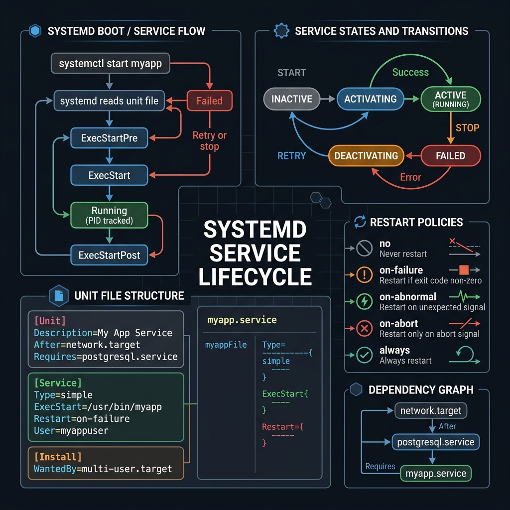
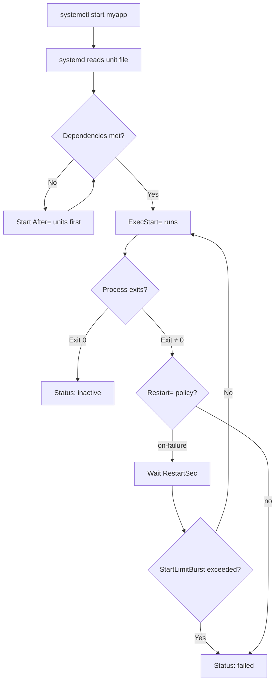

<!-- tags: linux, cli, systemd, devops -->
# 🔧 systemd & Services

> "systemd is Linux's master control." — Manage services, boot sequences, and timers.

📅 Created: 2026-03-20 · 🔄 Updated: 2026-04-20 · ⏱️ 15 min read

---

## 1. DEFINE

Sometimes the problem is not inside the app. It sits in the unit file, the restart policy, or the service dependency chain. This lane is for those moments when service management itself becomes the root cause.

| Concept     | Description                                            |
| ----------- | ------------------------------------------------------ |
| **systemd** | Init system + service manager (PID 1)                  |
| **Unit**    | Resource managed by systemd (.service, .timer, .mount) |
| **Target**  | Group of units (like runlevels)                        |
| **Journal** | Centralized logging (journalctl)                       |

### Unit Types

| Type       | Description                        | Example           |
| ---------- | ---------------------------------- | ----------------- |
| `.service` | Daemon/process                     | nginx.service     |
| `.timer`   | Scheduled tasks (cron replacement) | backup.timer      |
| `.socket`  | Socket activation                  | docker.socket     |
| `.mount`   | Mount points                       | home.mount        |
| `.target`  | Group of units                     | multi-user.target |

---

Those failure modes sound easy to avoid. But there is a trap: `Restart=always` with a crashing app creates a 100% CPU loop, and a single syntax error in the unit file prevents the service from starting. That trap appears in PITFALLS.

## 2. VISUAL

Theory sounds fine on paper. The visual below shows the exact boot flow, service states, unit file structure, and restart policies that determine whether your service self-heals at 3 AM.





*Figure: systemd resolves dependencies, runs the process, and applies the restart policy on failure. Without StartLimitBurst, a crashing service restarts forever.*

---

## 3. CODE

The diagram showed the lifecycle. Code below shows how to manage, create, and debug services on a live system.

### Example 1: systemctl — Service Management

```bash
# ━━━ Service lifecycle ━━━
systemctl start nginx          # start service
systemctl stop nginx           # stop service
systemctl restart nginx        # stop + start
systemctl reload nginx         # reload config (no downtime)
systemctl status nginx         # health check ⭐

# ━━━ Boot management ━━━
systemctl enable nginx         # start on boot
systemctl disable nginx        # don't start on boot
systemctl enable --now nginx   # enable + start immediately
systemctl is-enabled nginx     # check if enabled

# ━━━ List services ━━━
systemctl list-units --type=service              # running services
systemctl list-units --type=service --state=failed   # FAILED services
systemctl list-unit-files --type=service         # all services + status

# ━━━ System ━━━
systemctl reboot               # reboot
systemctl poweroff             # shutdown
systemctl daemon-reload        # reload unit files after editing
```

systemctl basics are covered. But custom services need unit files — time to write one.

### Example 2: Custom Service Unit

```bash
# /etc/systemd/system/myapp.service
cat << 'EOF' > /etc/systemd/system/myapp.service
[Unit]
Description=My Go Application
After=network.target postgresql.service
Wants=postgresql.service

[Service]
Type=simple
User=appuser
Group=appuser
WorkingDirectory=/opt/myapp
ExecStart=/opt/myapp/bin/server
ExecReload=/bin/kill -HUP $MAINPID
Restart=on-failure
RestartSec=5
StartLimitBurst=3
StartLimitIntervalSec=60

# Security hardening
NoNewPrivileges=true
ProtectSystem=strict
ProtectHome=true
ReadWritePaths=/opt/myapp/data /var/log/myapp

# Environment
EnvironmentFile=/opt/myapp/.env
Environment=GIN_MODE=release

# Logging
StandardOutput=journal
StandardError=journal
SyslogIdentifier=myapp

[Install]
WantedBy=multi-user.target
EOF

systemctl daemon-reload
systemctl enable --now myapp
systemctl status myapp
```

Unit files are covered. But scheduled tasks need timers — time to replace cron.

### Example 3: systemd Timer (cron replacement)

```bash
# /etc/systemd/system/backup.timer
cat << 'EOF' > /etc/systemd/system/backup.timer
[Unit]
Description=Daily backup timer

[Timer]
OnCalendar=*-*-* 02:00:00
Persistent=true
RandomizedDelaySec=300

[Install]
WantedBy=timers.target
EOF

# /etc/systemd/system/backup.service
cat << 'EOF' > /etc/systemd/system/backup.service
[Unit]
Description=Backup job

[Service]
Type=oneshot
ExecStart=/opt/scripts/backup.sh
EOF

systemctl daemon-reload
systemctl enable --now backup.timer
systemctl list-timers                  # verify
```

### Example 4: journalctl — Centralized Logs

```bash
# ━━━ View logs ━━━
journalctl -u nginx                    # logs of specific service
journalctl -u nginx -f                 # follow (like tail -f)
journalctl -u nginx --since "1 hour ago"
journalctl -u nginx --since "2024-01-01" --until "2024-01-02"
journalctl -u nginx -p err             # only errors
journalctl -u nginx -n 100            # last 100 lines

# ━━━ Priority levels ━━━
journalctl -p emerg                    # 0 — system unusable
journalctl -p alert                    # 1 — immediate action
journalctl -p crit                     # 2 — critical
journalctl -p err                      # 3 — errors
journalctl -p warning                  # 4 — warnings

# ━━━ Boot logs ━━━
journalctl -b                          # current boot
journalctl -b -1                       # previous boot
journalctl --list-boots                # all boots

# ━━━ Maintenance ━━━
journalctl --disk-usage                # journal space used
journalctl --vacuum-time=30d           # keep only 30 days
journalctl --vacuum-size=500M          # limit to 500MB
```

---

You have walked through systemctl, unit files, and timers. Now comes the dangerous part: restart loops and syntax errors — the trap set up from the beginning.

## 4. PITFALLS

| #   | Mistake                             | Consequence                  | Fix                                    |
| --- | ----------------------------------- | ---------------------------- | -------------------------------------- |
| 1   | Edit unit file without daemon-reload | Changes have no effect       | Run `systemctl daemon-reload`          |
| 2   | Service restart loop                | CPU spins at 100%            | Set `RestartSec` + `StartLimitBurst`   |
| 3   | Permission denied on ExecStart      | Service fails to start       | Check `User=` in the unit file         |
| 4   | Journal fills the disk              | Logging stops system-wide    | `journalctl --vacuum-size=500M`        |
| 5   | `enable` does not mean `start`      | Service waits until next boot | Use `enable --now` for both            |

---

## 5. REF

| Resource         | Type     | Link                                                                | Notes                        |
| ---------------- | -------- | ------------------------------------------------------------------- | ---------------------------- |
| systemd docs     | Official | https://www.freedesktop.org/software/systemd/man/latest/            | Unit, service, timer refs    |
| `man systemctl`  | Official | https://man7.org/linux/man-pages/man1/systemctl.1.html              | Service lifecycle control    |
| `man journalctl` | Official | https://man7.org/linux/man-pages/man1/journalctl.1.html             | Centralized log inspection   |

---

## 6. RECOMMEND

| Tool                  | Description                 |
| --------------------- | --------------------------- |
| **`systemd-analyze`** | Boot performance analysis   |
| **`systemd-resolve`** | DNS debugging               |
| **`loginctl`**        | Session management          |
| **`timedatectl`**     | Time/timezone management    |

---

**Links**: [← Disk & Storage](./06-disk-storage.md) · [→ Logs & Troubleshooting](./08-logs-troubleshooting.md)
