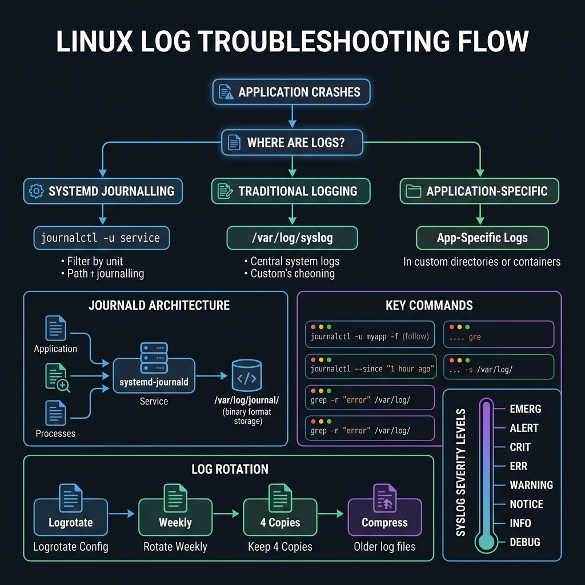
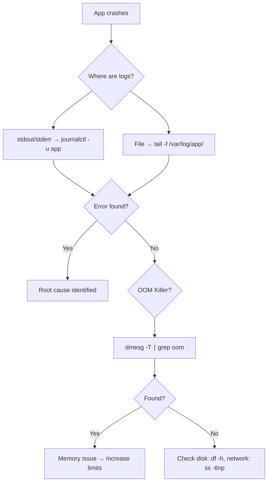

<!-- tags: linux, cli, logging, debugging -->
# 📋 Logs & Troubleshooting

> "Metrics show symptoms. Logs show root cause." — journalctl, tail, dmesg, logrotate.

📅 Created: 2026-03-20 · 🔄 Updated: 2026-04-20 · ⏱️ 15 min read

---

## 1. DEFINE

Logs are useful only when you know which layer to inspect first: application log, systemd journal, kernel message, or rotation policy. Troubleshooting through logs is a signal-routing skill, not a "read more text" exercise.

| Tool           | Purpose                                |
| -------------- | -------------------------------------- |
| **journalctl** | systemd journal — centralized          |
| **tail -f**    | Follow file in realtime                |
| **less**       | Paginated viewing — search, navigate   |
| **dmesg**      | Kernel ring buffer (hardware, drivers) |
| **logrotate**  | Automatic log rotation                 |

### Log Locations

| Log    | Path                                          | Content           |
| ------ | --------------------------------------------- | ----------------- |
| System | `/var/log/syslog` or `/var/log/messages`      | General system    |
| Auth   | `/var/log/auth.log` or `/var/log/secure`      | Login attempts    |
| Kernel | `/var/log/kern.log` or `dmesg`                | Hardware, drivers |
| Nginx  | `/var/log/nginx/access.log`, `error.log`      | Web server        |
| App    | `/var/log/myapp/` or stdout → journal         | Application       |

---

Those failure modes sound basic. But there is a trap: `/var/log` filling the disk stops system logging entirely, and `journalctl --no-pager` without a filter drowns you in output. That trap appears in PITFALLS.

## 2. VISUAL

The concept has a name. In the diagram, the critical part emerges: where to look first when your app crashes, and how journald, syslog, and logrotate fit together.





*Figure: Route the debug path by log source — journal for systemd services, file-based for legacy apps, dmesg for kernel-level kills. Each branch narrows the hypothesis.*

---

## 3. CODE

The diagram showed the routing decision. Code below shows how to inspect, filter, and maintain logs on a live system.

### Example 1: Viewing Logs

```bash
# ━━━ tail: realtime following ━━━
tail -f /var/log/syslog                    # follow syslog
tail -f /var/log/nginx/error.log           # follow nginx errors
tail -n 100 /var/log/syslog                # last 100 lines
tail -f /var/log/*.log                     # follow multiple files

# ━━━ less: paginated viewing ━━━
less /var/log/syslog
# /pattern    → search forward
# ?pattern    → search backward
# n           → next match
# N           → previous match
# G           → end of file
# g           → beginning
# F           → follow mode (like tail -f)

# ━━━ grep: filter logs ━━━
grep -i "error" /var/log/syslog            # case-insensitive errors
grep -i "error\|warn\|fatal" app.log      # multiple patterns
grep -i "error" app.log | tail -20        # last 20 errors
zgrep "error" /var/log/syslog.*.gz        # search compressed logs

# ━━━ journalctl: systemd journal ━━━
journalctl -u nginx -f                    # follow service logs
journalctl -u nginx --since "1 hour ago"
journalctl -p err                         # only errors
journalctl -k                             # kernel messages (= dmesg)

# ━━━ dmesg: kernel messages ━━━
dmesg                                     # all kernel messages
dmesg -T                                  # human-readable timestamps
dmesg | grep -i "error\|fail\|oom"       # hardware problems
dmesg -w                                  # follow mode
```

journalctl is covered. But log rotation needs logrotate — time to manage file growth.

### Example 2: logrotate — Auto Rotation

```bash
# /etc/logrotate.d/myapp
cat << 'EOF' > /etc/logrotate.d/myapp
/var/log/myapp/*.log {
    daily                    # rotate daily
    missingok                # no error if missing
    rotate 30                # keep 30 rotated files
    compress                 # gzip old logs
    delaycompress            # compress previous rotation
    notifempty               # skip if empty
    create 0640 appuser appgroup
    sharedscripts
    postrotate
        systemctl reload myapp 2>/dev/null || true
    endscript
}
EOF

# Test: logrotate -d /etc/logrotate.d/myapp    # dry run
# Force: logrotate -f /etc/logrotate.d/myapp   # force rotate
```

logrotate is covered. But a real incident needs a structured debug workflow — time to combine.

### Example 3: Combo — Production Troubleshooting

```bash
#!/bin/bash
# ━━━ "Why did the app crash?" ━━━

APP="myapp"

echo "=== 1. Service status ==="
systemctl status "$APP" --no-pager -l

echo ""
echo "=== 2. Recent errors (last 1 hour) ==="
journalctl -u "$APP" -p err --since "1 hour ago" --no-pager | tail -30

echo ""
echo "=== 3. OOM Killer? ==="
dmesg -T | grep -i "oom\|killed process" | tail -5

echo ""
echo "=== 4. Disk space ==="
df -h / | tail -1

echo ""
echo "=== 5. Memory ==="
free -h

echo ""
echo "=== 6. Recent auth failures ==="
grep "Failed password" /var/log/auth.log 2>/dev/null | tail -5

echo ""
echo "=== 7. System errors (last boot) ==="
journalctl -b -p err --no-pager | tail -20
```

---

You have walked through journalctl, rotation, and debugging. Now comes the dangerous part: log overflow and unfiltered output — the trap set up from the beginning.

## 4. PITFALLS

| #   | Mistake                             | Consequence                | Fix                                                |
| --- | ----------------------------------- | -------------------------- | -------------------------------------------------- |
| 1   | Logs fill the disk                  | System logging stops       | logrotate + `journalctl --vacuum-size`             |
| 2   | App logs only to stdout             | Logs lost on restart       | Redirect: `ExecStart=... >> /var/log/app.log 2>&1` |
| 3   | Cannot grep compressed logs         | Old errors invisible       | Use `zgrep` or `zcat`                              |
| 4   | Inconsistent timezone in logs       | Timestamps do not correlate | Unify with `timedatectl set-timezone`              |

---

## 5. REF

| Resource         | Type     | Link                                                        | Notes                       |
| ---------------- | -------- | ----------------------------------------------------------- | --------------------------- |
| `man journalctl` | Official | https://man7.org/linux/man-pages/man1/journalctl.1.html     | systemd journal query       |
| `man logrotate`  | Official | https://man7.org/linux/man-pages/man8/logrotate.8.html      | Rotation policy and testing |
| `man dmesg`      | Official | https://man7.org/linux/man-pages/man1/dmesg.1.html          | Kernel message inspection   |

---

## 6. RECOMMEND

| Tool            | Description                                                    |
| --------------- | -------------------------------------------------------------- |
| **`lnav`**      | Log file navigator — TUI, syntax highlighting                  |
| **`multitail`** | Multiple log files in split view                               |
| **`GoAccess`**  | Real-time web log analyzer                                     |
| **`ELK Stack`** | Elasticsearch + Logstash + Kibana — production log aggregation |

---

**Links**: [← systemd](./07-systemd-services.md) · [→ Package Management](./09-package-management.md)
