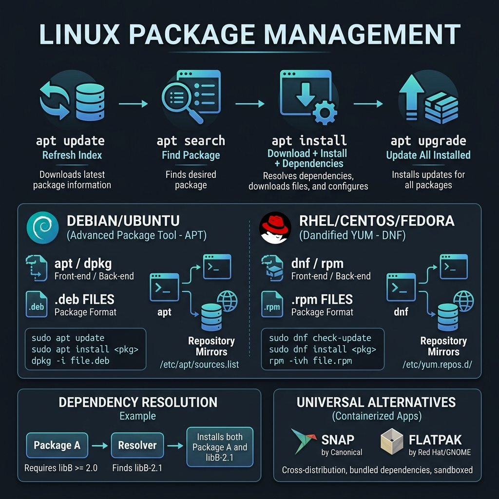
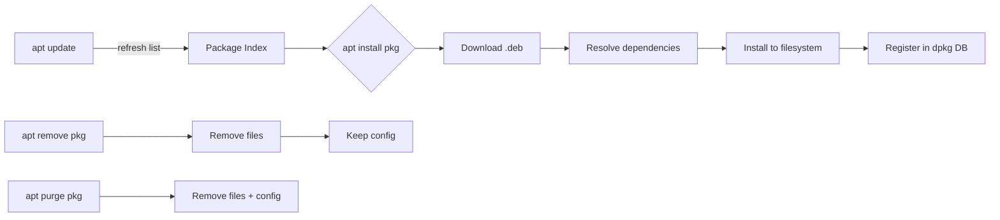

<!-- tags: linux, cli, packages, devops -->
# 📦 Package Management

> Install, update, and remove software across Linux distributions.

📅 Created: 2026-03-20 · 🔄 Updated: 2026-04-20 · ⏱️ 15 min read

---

## 1. DEFINE

Package management looks simple on a local machine. On a production server, every install and remove touches reproducibility, the dependency chain, and the risk profile of a running environment.

| Distro                 | Package Manager   | Format         |
| ---------------------- | ----------------- | -------------- |
| **Debian/Ubuntu**      | `apt` (apt-get)   | `.deb`         |
| **RHEL/Fedora/CentOS** | `dnf` (yum)       | `.rpm`         |
| **Arch**               | `pacman`          | `.pkg.tar.zst` |
| **Alpine**             | `apk`             | `.apk`         |
| **Any**                | `snap`, `flatpak` | Universal      |

---

Those failure modes sound familiar. But there is a trap: `apt upgrade` without confirmation on a production server means unplanned downtime, and PPA package conflicts create dependency hell. That trap appears in PITFALLS.

## 2. VISUAL

The definition locked the vocabulary. The visual below shows the apt lifecycle, Debian vs RHEL ecosystems, dependency resolution, and universal alternatives like snap and flatpak.





*Figure: apt update refreshes the index, install resolves the dependency tree before writing files, and purge removes everything including config. Skipping update before install means the index is stale.*

---

## 3. CODE

The diagram showed the install lifecycle. Code below shows the actual commands for each distribution family.

### Example 1: apt (Debian/Ubuntu)

```bash
# ━━━ Basics ━━━
apt update                        # refresh package list
apt upgrade                       # upgrade all packages
apt install nginx                 # install package
apt remove nginx                  # remove package
apt purge nginx                   # remove + config files
apt autoremove                    # remove unused dependencies

# ━━━ Search & Info ━━━
apt search nginx                  # search packages
apt show nginx                    # package info
apt list --installed              # all installed
apt list --upgradable             # available upgrades
dpkg -l | grep nginx              # check installed

# ━━━ Fix broken ━━━
apt --fix-broken install
dpkg --configure -a               # fix unconfigured packages
```

apt basics are covered. But RHEL systems need dnf — time to switch distro families.

### Example 2: dnf / yum (RHEL/Fedora/CentOS)

```bash
dnf update                        # upgrade all
dnf install nginx                 # install
dnf remove nginx                  # remove
dnf search nginx                  # search
dnf info nginx                    # info
dnf list installed                # all installed
dnf clean all                     # clear cache
dnf history                       # transaction history
dnf history undo 10               # undo transaction 10
```

### Example 3: Universal — snap, flatpak

```bash
# ━━━ snap ━━━
snap install code --classic       # install VS Code
snap list                         # installed snaps
snap refresh                      # update all snaps
snap remove code                  # uninstall

# ━━━ flatpak ━━━
flatpak install flathub org.gimp.GIMP
flatpak list
flatpak update
```

---

You have walked through apt, dnf, and universal packages. Now comes the dangerous part: unattended upgrades and PPA conflicts — the trap set up from the beginning.

## 4. PITFALLS

| #   | Mistake                             | Consequence                  | Fix                                                           |
| --- | ----------------------------------- | ---------------------------- | ------------------------------------------------------------- |
| 1   | `apt upgrade` on production         | Unplanned service restarts   | Test on staging first                                         |
| 2   | Forgetting `apt update` before install | Stale cache → package not found | Always run `apt update` first                              |
| 3   | `dpkg` lock file                    | Cannot install anything      | `sudo rm /var/lib/dpkg/lock-frontend` + `dpkg --configure -a` |
| 4   | Mixed repositories                  | Dependency conflicts         | Pin versions, avoid PPAs on production                        |

---

## 5. REF

| Resource       | Type     | Link                                      | Notes                         |
| -------------- | -------- | ----------------------------------------- | ----------------------------- |
| APT user guide | Official | https://wiki.debian.org/AptCLI            | Debian/Ubuntu package workflow |
| DNF docs       | Official | https://dnf.readthedocs.io/               | RHEL/Fedora package management |
| Flatpak docs   | Official | https://docs.flatpak.org/                 | Universal desktop packaging    |

---

## 6. RECOMMEND

| Extension          | When                    | Reason                        |
| ------------------ | ----------------------- | ----------------------------- |
| Review CODE section | Before production usage | Code snippets are copy-ready |
| Read PITFALLS       | Before any upgrade      | Avoid common mistakes         |
| Combine with tools  | Real workflow           | Higher efficiency when paired |

---

**Links**: [← Logs](./08-logs-troubleshooting.md) · [→ Shell Scripting](./10-shell-scripting.md)
