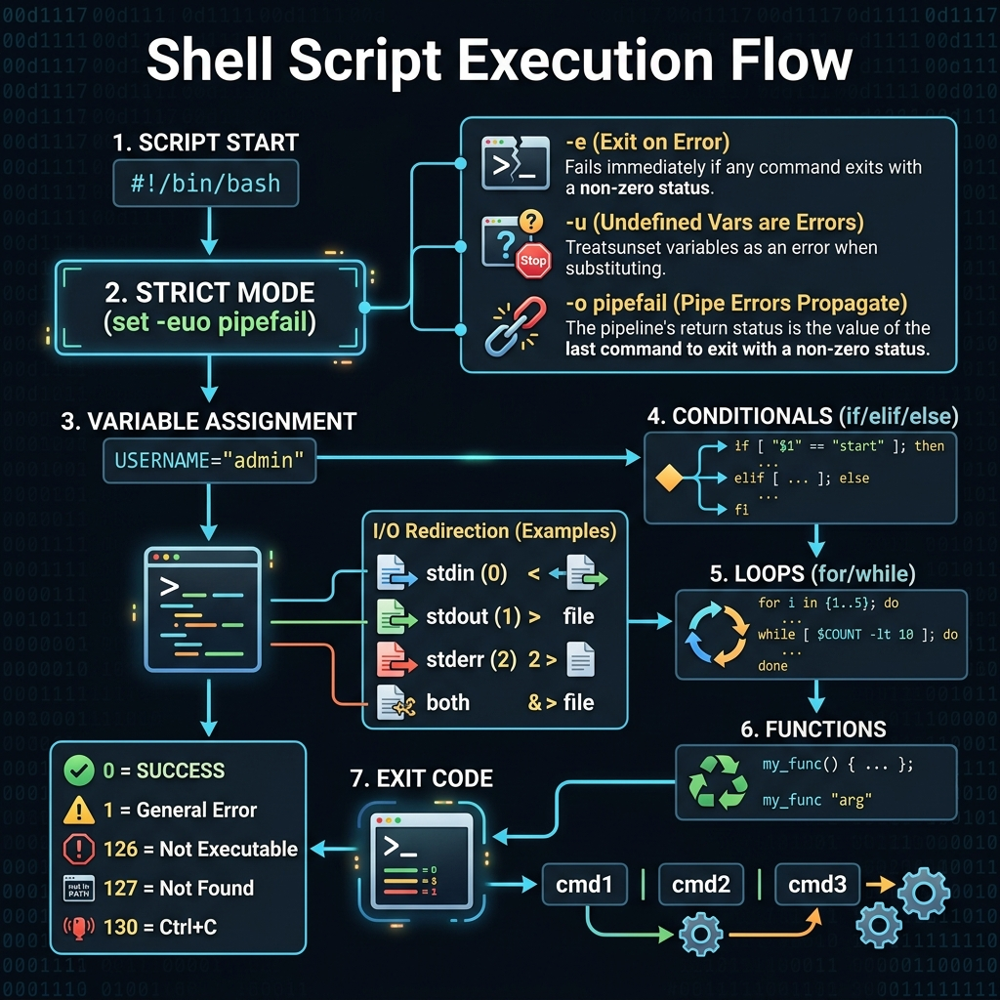
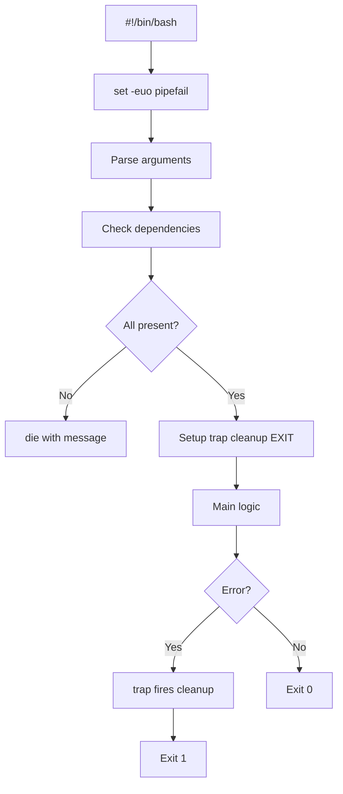

<!-- tags: linux, cli, bash, shell-scripting -->
# 🖥️ Shell Scripting — Bash

> Write automation scripts — variables, loops, functions, error handling.

📅 Created: 2026-03-20 · 🔄 Updated: 2026-04-20 · ⏱️ 15 min read

---

## 1. DEFINE

Shell scripts start earning their keep the moment repetitive tasks begin eating on-call or deploy time. But a good script must survive errors and production environments, not just "work on my machine."

| Concept       | Description                            |
| ------------- | -------------------------------------- |
| **Shebang**   | `#!/bin/bash` — specifies interpreter  |
| **Exit code** | 0 = success, 1–255 = error             |
| **Pipe**      | `cmd1 \| cmd2` — stdout → stdin        |
| **Redirect**  | `>` write, `>>` append, `2>` stderr   |
| **Subshell**  | `$(command)` — capture output          |
| **Glob**      | `*`, `?`, `[abc]` — filename expansion |

---

Those failure modes sound clear. But there is a trap: an unquoted variable causes word splitting bugs, and missing `set -e` lets the script continue silently after an error. That trap appears in PITFALLS.

## 2. VISUAL

Theory sounds clean on paper. The visual below shows the execution flow from shebang to exit code — including strict mode, I/O redirection, and the pipe chain model.





*Figure: A production-grade script starts with strict mode, validates dependencies, sets a cleanup trap, then runs the main logic. The trap fires on any exit — clean or dirty.*

---

## 3. CODE

The diagram showed the script skeleton. Code below shows how each stage is implemented with real Bash patterns.

### Example 1: Bash Fundamentals

```bash
#!/bin/bash
set -euo pipefail    # ⭐ ALWAYS use this!
# -e: exit on error
# -u: error on undefined variable
# -o pipefail: pipe failure = script failure

# ━━━ Variables ━━━
NAME="World"
COUNT=42
ITEMS=("apple" "banana" "cherry")    # array
echo "Hello $NAME, count: $COUNT"
echo "First: ${ITEMS[0]}, All: ${ITEMS[@]}, Count: ${#ITEMS[@]}"

# ━━━ Special variables ━━━
echo "$0"     # script name
echo "$1"     # first argument
echo "$@"     # all arguments
echo "$#"     # number of arguments
echo "$?"     # last exit code
echo "$$"     # current PID

# ━━━ String operations ━━━
STR="Hello World"
echo "${#STR}"              # length: 11
echo "${STR,,}"             # lowercase: hello world
echo "${STR^^}"             # uppercase: HELLO WORLD
echo "${STR/World/Linux}"   # replace: Hello Linux
echo "${STR:0:5}"           # substring: Hello

# ━━━ Default values ━━━
PORT="${PORT:-8080}"            # default if unset
DB_HOST="${DB_HOST:?'DB_HOST is required'}"  # error if unset
```

Bash basics are covered. But control flow needs conditions — time to branch.

### Example 2: Control Flow

```bash
#!/bin/bash

# ━━━ if/elif/else ━━━
if [ -f "/etc/nginx/nginx.conf" ]; then
    echo "Nginx config exists"
elif [ -f "/etc/apache2/apache2.conf" ]; then
    echo "Apache config exists"
else
    echo "No web server found"
fi

# ━━━ Test operators ━━━
# Files: -f (file), -d (dir), -e (exists), -r (readable), -w (writable), -x (executable)
# Strings: -z (empty), -n (not empty), == , !=
# Numbers: -eq, -ne, -gt, -ge, -lt, -le

# ━━━ for loop ━━━
for file in /var/log/*.log; do
    echo "Processing: $file ($(wc -l < "$file") lines)"
done

for i in {1..10}; do echo "Count: $i"; done

for server in web1 web2 web3; do
    echo "Checking $server..."
    ping -c 1 -W 2 "$server" >/dev/null 2>&1 && echo "UP" || echo "DOWN"
done

# ━━━ while loop ━━━
while read -r line; do
    echo "Line: $line"
done < input.txt

# ━━━ case ━━━
case "$1" in
    start)   echo "Starting...";;
    stop)    echo "Stopping...";;
    restart) echo "Restarting...";;
    *)       echo "Usage: $0 {start|stop|restart}"; exit 1;;
esac
```

Control flow is covered. But functions need error handling — time to structure.

### Example 3: Functions + Error Handling

```bash
#!/bin/bash
set -euo pipefail

# ━━━ Functions ━━━
log() {
    local level="$1"; shift
    echo "[$(date +'%Y-%m-%d %H:%M:%S')] [$level] $*" >&2
}

die() { log "ERROR" "$@"; exit 1; }

check_dependency() {
    command -v "$1" >/dev/null 2>&1 || die "$1 is not installed"
}

# ━━━ Trap — cleanup on exit ━━━
TMPDIR=$(mktemp -d)
cleanup() {
    log "INFO" "Cleaning up $TMPDIR"
    rm -rf "$TMPDIR"
}
trap cleanup EXIT    # always runs, even on error

# ━━━ Usage ━━━
check_dependency "curl"
check_dependency "jq"

log "INFO" "Starting script"
log "WARN" "This is a warning"

# ━━━ Retry pattern ━━━
retry() {
    local max_attempts=$1; shift
    local delay=$1; shift
    local attempt=1

    while [ $attempt -le $max_attempts ]; do
        if "$@"; then return 0; fi
        log "WARN" "Attempt $attempt/$max_attempts failed, retrying in ${delay}s..."
        sleep "$delay"
        attempt=$((attempt + 1))
    done
    return 1
}

retry 3 5 curl -sf http://localhost:8080/health || die "Health check failed"
```

### Example 4: Combo — Deployment Script

```bash
#!/bin/bash
set -euo pipefail

# ━━━ Config ━━━
APP_NAME="myapp"
APP_DIR="/opt/$APP_NAME"
REPO="git@github.com:user/myapp.git"
BRANCH="${1:-main}"

log() { echo "[$(date +'%H:%M:%S')] $*"; }
die() { log "❌ $*"; exit 1; }

# ━━━ Pre-checks ━━━
log "🔍 Pre-deployment checks..."
[ "$(id -u)" -eq 0 ] || die "Must run as root"
command -v git >/dev/null || die "git not installed"
systemctl is-active --quiet "$APP_NAME" || log "⚠ $APP_NAME not running"

# ━━━ Backup ━━━
log "💾 Backing up..."
BACKUP="/opt/backups/${APP_NAME}_$(date +%Y%m%d_%H%M%S)"
cp -a "$APP_DIR" "$BACKUP"

# ━━━ Deploy ━━━
log "📦 Pulling $BRANCH..."
cd "$APP_DIR"
git fetch origin
git checkout "$BRANCH"
git pull origin "$BRANCH"

log "🔨 Building..."
go build -o "bin/$APP_NAME" ./cmd/server

log "🔄 Restarting service..."
systemctl restart "$APP_NAME"
sleep 3

# ━━━ Health check ━━━
log "❤️ Health check..."
if curl -sf http://localhost:8080/health >/dev/null; then
    log "✅ Deployment successful!"
else
    log "❌ Health check failed! Rolling back..."
    cp -a "$BACKUP"/* "$APP_DIR/"
    systemctl restart "$APP_NAME"
    die "Rollback completed. Check logs: journalctl -u $APP_NAME"
fi
```

---

You have walked through Bash, control flow, and functions. Now comes the dangerous part: word splitting and missing error handling — the trap set up from the beginning.

## 4. PITFALLS

| #   | Mistake                        | Consequence                    | Fix                                     |
| --- | ------------------------------ | ------------------------------ | --------------------------------------- |
| 1   | No `set -euo pipefail`         | Script continues after errors  | Always add on line 2                    |
| 2   | Unquoted variables: `$VAR`     | Word splitting breaks paths    | Always quote: `"$VAR"`                  |
| 3   | `[ ]` vs `[[ ]]`              | `[ ]` word-splits unexpectedly | Use `[[ ]]` — safer, no word splitting  |
| 4   | `` `cmd` `` backticks          | Cannot nest, hard to read      | Use `$(cmd)` — nestable and clear       |
| 5   | No error handling              | Silent failures in production  | `trap cleanup EXIT`, check `$?`         |
| 6   | `rm -rf $UNSET/` → `rm -rf /` | Deletes everything             | `set -u` catches undefined variables    |

---

## 5. REF

| Resource                 | Link                                                                                          |
| ------------------------ | --------------------------------------------------------------------------------------------- |
| Bash Guide               | [mywiki.wooledge.org/BashGuide](https://mywiki.wooledge.org/BashGuide)                        |
| ShellCheck               | [shellcheck.net](https://www.shellcheck.net/) — lint bash scripts                             |
| Google Shell Style Guide | [google.github.io/styleguide/shellguide](https://google.github.io/styleguide/shellguide.html) |

---

## 6. RECOMMEND

| Tool             | Description                          |
| ---------------- | ------------------------------------ |
| **`shellcheck`** | Static analysis for shell scripts    |
| **`shfmt`**      | Shell formatter                      |
| **`bats`**       | Bash Automated Testing System        |
| **`zsh`**        | Better interactive shell (oh-my-zsh) |
| **`fish`**       | User-friendly shell                  |

---

**Links**: [← Package Management](./09-package-management.md) · [→ Git Workflow](./11-git-workflow.md)
