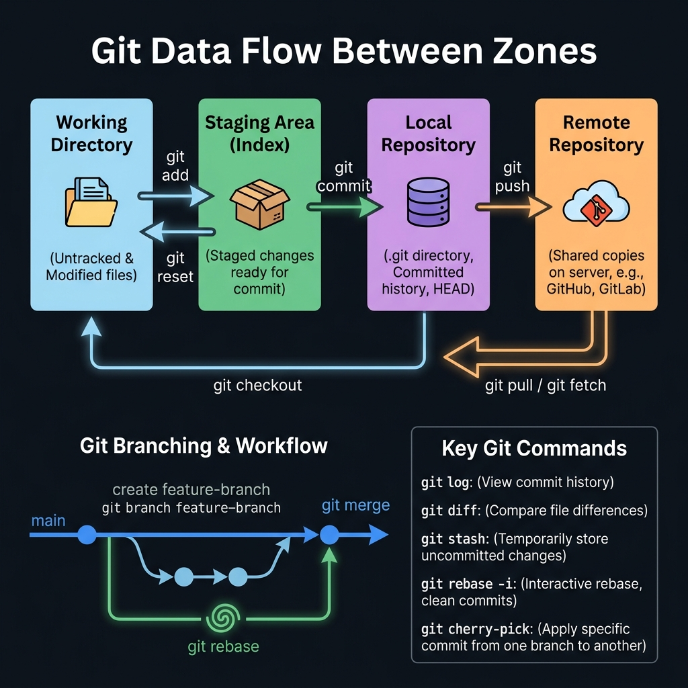
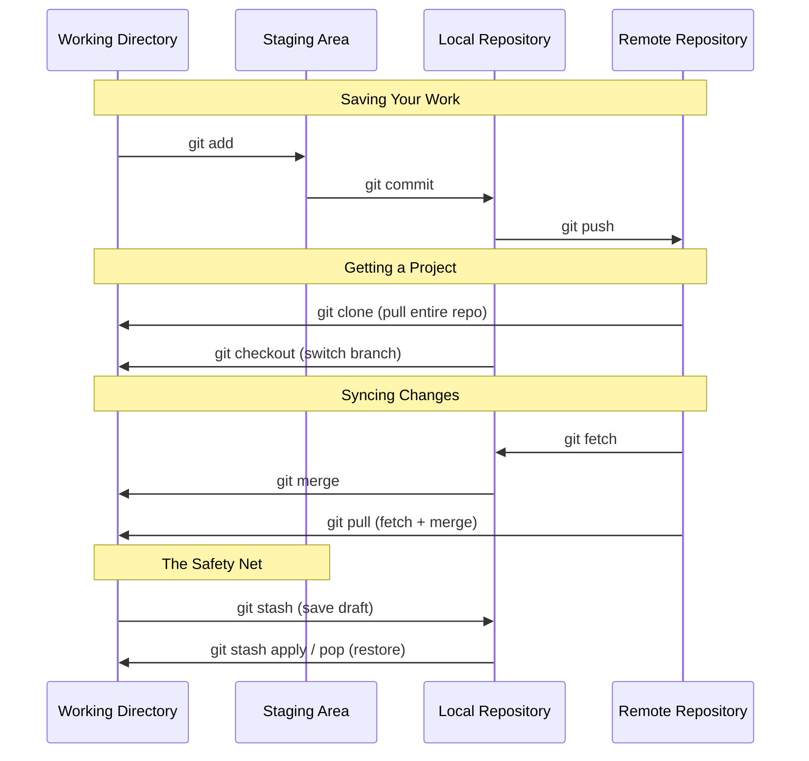

<!-- tags: linux, cli, git, version-control -->
# 🐙 Git Workflow: Essential Commands

> "The part that causes problems isn't the commands themselves — it's not knowing where your code sits after running one."

📅 Created: 2026-03-22 · 🔄 Updated: 2026-04-20 · ⏱️ 10 min read

| Aspect              | Detail                                                 |
| ------------------- | ------------------------------------------------------ |
| **Complexity**      | 🌟🌟                                                   |
| **Use case**        | Version control, collaboration, source code management |
| **Target Audience** | DevOps, Backend/Frontend Engineers                     |

---

## 1. DEFINE

Git on the terminal is powerful, but under pressure it is also where high-impact mistakes happen fast. A good workflow exists to keep git operations in a low-surprise state.

Git has hundreds of commands, but most daily workflows use only a small subset. The biggest difficulty is not remembering syntax — it is **not knowing where your code sits** across Git's four zones:

1. **Working Directory**: The actual files on disk that you are editing.
2. **Staging Area**: A holding zone where changes wait to be committed (like a draft before printing).
3. **Local Repository**: The Git database on your machine (the `.git` directory), containing all versions and commit history.
4. **Remote Repository**: The centralized code store on a server (GitHub, GitLab, Bitbucket).

Every Git command is fundamentally about moving code between these four zones.

Those failure modes sound easy to avoid. But there is a trap: `git push -f` overwrites the remote branch and teammates lose their commits, and rebasing a shared branch duplicates commits. That trap appears in PITFALLS.

## 2. VISUAL

The definition locked the vocabulary. The visual below shows the four-zone data flow model and the commands that move changes between working directory, staging area, local repo, and remote.



### Data Flow Between Git Zones



*Figure: Master this diagram and you will never run a blind command. Every Git operation is a movement between these four zones.*

## 3. CODE

The code below follows the exact flow between working directory, staging area, local repository, and remote repository so you can see where each command moves your changes.

### 1. Saving Your Work

- **`git add`**: Move files from *Working Directory* to *Staging Area*.
    ```bash
    git add main.go          # stage a specific file
    git add .                # stage all changed files
    ```
- **`git commit`**: Save staged files into *Local Repository* with a message.
    ```bash
    git commit -m "feat: implement user authentication"
    ```
- **`git push`**: Upload commits from *Local Repository* to *Remote Repository*.
    ```bash
    git push origin main
    ```

### 2. Getting a Project

- **`git clone`**: Pull the entire *Remote Repository* to your machine for the first time.
    ```bash
    git clone https://github.com/user/project.git
    ```
- **`git checkout`** (or `git switch`): Switch branches, updating the *Working Directory* to match.
    ```bash
    git checkout feature/payment
    git checkout -b fix/bug-123  # create + switch in one step
    ```

### 3. Syncing Changes

- **`git fetch`**: Download the latest changes from *Remote* to *Local Repository* without touching your *Working Directory*. This is a safe inspection operation.
    ```bash
    git fetch origin
    ```
- **`git merge`**: Incorporate fetched changes (or another branch) into your current branch.
    ```bash
    git merge origin/main
    ```
- **`git pull`**: Runs `git fetch` followed by `git merge` in one step. Faster but risks conflicts landing directly in your work-in-progress.
    ```bash
    git pull origin main
    ```

### 4. The Safety Net

When you are mid-task but need to switch branches for an urgent fix, and your code is not ready to commit:

- **`git stash`**: Save uncommitted changes to an invisible drawer.
    ```bash
    git stash -m "WIP: payment implementation"
    ```
- **`git stash apply`**: Restore changes from the drawer (keeps the backup).
- **`git stash pop`**: Restore changes and **delete** the stash entry.

---

You have walked through git zones, branching, and sync. Now comes the dangerous part: force push and shared-branch rebase — the trap set up from the beginning.

## 4. PITFALLS

| #   | Mistake                              | Consequence                                                     | Fix                                                                              |
| --- | ------------------------------------ | --------------------------------------------------------------- | -------------------------------------------------------------------------------- |
| 1   | Forgetting `git pull` before push    | `non-fast-forward` rejection — remote has newer commits         | Always `git pull --rebase` before pushing                                        |
| 2   | Committing secret keys or tokens     | Credentials exposed on public GitHub within seconds             | `git rm --cached <file>` + add to `.gitignore`. Use `trufflehog` or `git-secrets` |
| 3   | `git push -f` without care           | Overwrites remote history — teammates lose their commits        | Use `--force-with-lease` instead. Enable branch protection.                      |
| 4   | `git pull` with a dirty working dir  | Complex conflicts mixed with work-in-progress                   | `git stash` → `git pull` → `git stash pop` for clean separation                 |

---

## 5. REF

| Resource                   | Link                                                          |
| -------------------------- | ------------------------------------------------------------- |
| Git Documentation          | [git-scm.com/doc](https://git-scm.com/doc)                    |
| Atlassian Git Tutorial     | [atlassian.com/git](https://www.atlassian.com/git/tutorials)  |
| Dangit, Git! (rescue guide) | [dangitgit.com](https://dangitgit.com/)                       |
| Learn Git Branching (game) | [learngitbranching.js.org](https://learngitbranching.js.org/) |

---

## 6. RECOMMEND

| Tool                     | When                               | Reason                                                     |
| ------------------------ | ---------------------------------- | ---------------------------------------------------------- |
| **lazygit**              | Fast Git interaction in terminal   | TUI with keyboard shortcuts, stage individual lines easily |
| **GitKraken / Tower**    | Managing complex branch graphs     | Visual branch tree, drag-and-drop merge/rebase             |
| **GitHub CLI (`gh`)**    | Working with PRs without a browser | `gh pr create` keeps focus in the terminal                 |
| **Conventional Commits** | Team collaboration workflow        | Standardized messages (`feat:`, `fix:`) for changelogs     |

---

**Links**: [← Shell Scripting](./10-shell-scripting.md) · [→ Linux Directory Structure](./12-linux-directory-structure.md)
