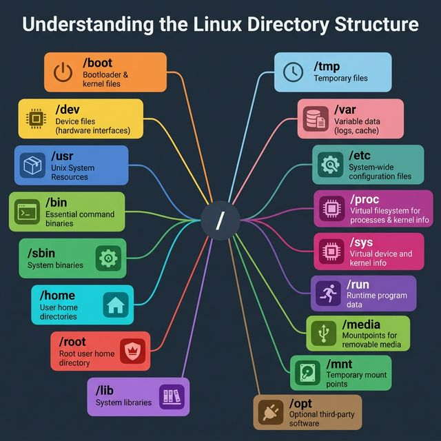

<!-- tags: linux, cli, file-system, sysadmin -->
# 📂 Understanding the Linux Directory Structure

> Every directory in Linux exists for a specific reason. Understanding this structure is the first step to never getting lost when administering a system.

📅 Created: 2026-03-22 · 🔄 Updated: 2026-04-20 · ⏱️ 12 min read

| Aspect         | Detail                                                 |
| -------------- | ------------------------------------------------------ |
| **Complexity** | 🌟🌟                                                   |
| **Use case**   | System Administration, DevOps, Backend Development     |
| **Keywords**   | FHS, Root, /etc, /var, /home, /proc, /sys, /dev, mount |

---

## 1. DEFINE

Understanding the Linux filesystem hierarchy is the fastest way to stop guessing on an unfamiliar server. If you do not know what `/etc`, `/var`, `/proc`, and `/dev` are responsible for, every debugging step that follows slows down.

Linux organizes everything into a single directory tree starting from `/` (root). Unlike Windows with `C:\` and `D:\` drives, Linux merges all resources — configuration files, hardware devices, kernel information — into one tree following the **FHS (Filesystem Hierarchy Standard)**.

| Group                  | Directory        | Role                                                                        |
| ---------------------- | ---------------- | --------------------------------------------------------------------------- |
| **System Boot**        | `/boot`          | Bootloader, kernel files — without it, the system cannot start              |
| **Device Files**       | `/dev`           | Hardware interfaces — disks (`sda`), terminals (`tty`), random (`urandom`) |
| **System Resources**   | `/usr`           | Programs, libraries, and shared data for the entire system                  |
| **Essential Binaries** | `/bin`, `/sbin`  | Basic commands (`ls`, `cp`) and admin commands (`fdisk`, `iptables`)        |
| **User Data**          | `/home`, `/root` | Personal directories — `/home/user` for regular users, `/root` for superuser |
| **Libraries**          | `/lib`, `/lib64` | Shared libraries supporting binaries in `/bin` and `/sbin`                  |
| **Temporary**          | `/tmp`           | Temporary files — cleared on reboot                                         |
| **Variable Data**      | `/var`           | Logs (`/var/log`), cache (`/var/cache`), mail, spool — data that changes constantly |
| **Configuration**      | `/etc`           | **All** system config files: nginx, ssh, fstab, hostname...                 |
| **Runtime Data**       | `/run`           | PID files, sockets — runtime data for currently running processes           |
| **Virtual FS**         | `/proc`, `/sys`  | Window into the kernel: CPU, memory, process, and device information        |
| **Mount Points**       | `/media`, `/mnt` | USB, CD-ROM (auto-mount at `/media`), manual mounts (`/mnt`)               |
| **Third-party**        | `/opt`           | Third-party software: Google Chrome, Slack, custom apps                     |

---

Those failure modes sound basic. But there is a trap: installing software into `/usr/local` without a package manager creates orphan packages, and `/tmp` cleanup policies cause unexpected data loss. That trap appears in PITFALLS.

## 2. VISUAL



*Figure: Linux directory hierarchy radiating from root — each branch serves a specific purpose: /etc for configuration, /var for logs and cache, /proc and /sys for kernel virtual filesystems, /dev for hardware interfaces.*

### Linux Directory Tree

```mermaid
flowchart TD
    ROOT["/"] --> BOOT["/boot<br/>Bootloader & Kernel"]
    ROOT --> DEV["/dev<br/>Device Files"]
    ROOT --> USR["/usr<br/>System Resources"]
    ROOT --> BIN["/bin → /sbin<br/>Essential Binaries"]
    ROOT --> HOME["/home<br/>User Directories"]
    ROOT --> ROOT_DIR["/root<br/>Root Home"]
    ROOT --> LIB["/lib → /lib64<br/>System Libraries"]
    ROOT --> TMP["/tmp<br/>Temporary Files"]
    ROOT --> VAR["/var<br/>Logs, Cache, Spool"]
    ROOT --> ETC["/etc<br/>Configuration"]
    ROOT --> RUN["/run<br/>Runtime Data"]
    ROOT --> PROC["/proc<br/>Process Info (Virtual)"]
    ROOT --> SYS["/sys<br/>Kernel Info (Virtual)"]
    ROOT --> MEDIA["/media → /mnt<br/>Mount Points"]
    ROOT --> OPT["/opt<br/>Third-party Software"]

    style ROOT fill:#e74c3c,color:#fff,font-weight:bold
    style BOOT fill:#e67e22,color:#fff
    style DEV fill:#f1c40f,color:#333
    style USR fill:#3498db,color:#fff
    style BIN fill:#2ecc71,color:#fff
    style HOME fill:#1abc9c,color:#fff
    style ROOT_DIR fill:#c0392b,color:#fff
    style LIB fill:#9b59b6,color:#fff
    style TMP fill:#5dade2,color:#fff
    style VAR fill:#e91e63,color:#fff
    style ETC fill:#00bcd4,color:#fff
    style RUN fill:#8e44ad,color:#fff
    style PROC fill:#e84393,color:#fff
    style SYS fill:#e84393,color:#fff
    style MEDIA fill:#27ae60,color:#fff
    style OPT fill:#795548,color:#fff
```



*Figure: Everything in Linux is a file — including hardware devices, processes, and kernel parameters. This directory tree is the map that helps you find exactly what you need.*

---

## 3. CODE

The diagram showed the structure. Code below shows how to explore, inspect, and extract information from each major directory.

### 1. Explore the Filesystem

```bash
# View the root directory tree (1 level deep)
tree -L 1 /
# /
# ├── bin -> usr/bin
# ├── boot
# ├── dev
# ├── etc
# ├── home
# ├── lib -> usr/lib
# ├── media
# ├── mnt
# ├── opt
# ├── proc
# ├── root
# ├── run
# ├── sbin -> usr/sbin
# ├── sys
# ├── tmp
# ├── usr
# └── var

# Check size of each top-level directory
du -sh /* 2>/dev/null | sort -rh | head -10
```

### 2. /etc — Configuration Is King

```bash
# View hostname
cat /etc/hostname

# View DNS resolvers
cat /etc/resolv.conf

# View boot-time mount points
cat /etc/fstab

# View system users
cat /etc/passwd | head -5

# View OS information
cat /etc/os-release

# Find config files containing a specific keyword
grep -rn "listen" /etc/nginx/
```

### 3. /proc — Window into the Kernel

```bash
# CPU info
cat /proc/cpuinfo | grep "model name" | head -1

# Memory info
cat /proc/meminfo | head -5

# Inspect a specific process (PID 1 = systemd)
ls /proc/1/
# → cmdline  cwd  environ  exe  fd  maps  status ...

# Uptime (seconds)
cat /proc/uptime

# Load average
cat /proc/loadavg
```

### 4. /var — Where Production Logs Live

```bash
# View system logs
tail -f /var/log/syslog        # Debian/Ubuntu
tail -f /var/log/messages      # RHEL/CentOS

# View auth/login logs
tail -f /var/log/auth.log

# Check log sizes (often the culprit when disk is full)
du -sh /var/log/*  | sort -rh | head -10

# View nginx access log
tail -f /var/log/nginx/access.log
```

### 5. /dev — Talking to Hardware

```bash
# List block devices (disks, partitions)
lsblk
# NAME   MAJ:MIN RM   SIZE RO TYPE MOUNTPOINT
# sda      8:0    0   100G  0 disk
# ├─sda1   8:1    0   512M  0 part /boot
# └─sda2   8:2    0  99.5G  0 part /

# Generate random data (kernel entropy)
head -c 32 /dev/urandom | base64

# Discard output (black hole)
command_that_spams 2>/dev/null

# View current terminal
tty
# → /dev/pts/0
```

### 6. Go: Reading System Info from /proc

```go
package main

import (
    "fmt"
    "os"
    "strings"
)

// ReadProcInfo reads system information directly from /proc.
// This is how many monitoring tools (htop, prometheus node_exporter) work.
func ReadProcInfo() {
    // Read hostname
    hostname, _ := os.ReadFile("/proc/sys/kernel/hostname")
    fmt.Printf("Hostname: %s", hostname)

    // Read uptime
    uptime, _ := os.ReadFile("/proc/uptime")
    fmt.Printf("Uptime: %s seconds\n", strings.Fields(string(uptime))[0])

    // Read load average
    loadavg, _ := os.ReadFile("/proc/loadavg")
    fmt.Printf("Load Average: %s", loadavg)

    // Read memory info
    meminfo, _ := os.ReadFile("/proc/meminfo")
    lines := strings.Split(string(meminfo), "\n")
    for _, line := range lines[:3] { // MemTotal, MemFree, MemAvailable
        fmt.Println(line)
    }
}

// ListOpenFiles lists file descriptors of a process.
// Equivalent to: ls -la /proc/<pid>/fd
func ListOpenFiles(pid int) {
    fdPath := fmt.Sprintf("/proc/%d/fd", pid)
    entries, err := os.ReadDir(fdPath)
    if err != nil {
        fmt.Printf("Cannot read /proc/%d/fd: %v\n", pid, err)
        return
    }
    fmt.Printf("Process %d has %d open file descriptors\n", pid, len(entries))
}
```

---

You have walked through the hierarchy, FHS, and major directories. Now comes the dangerous part: orphan installs and tmp cleanup — the trap set up from the beginning.

## 4. PITFALLS

| #   | Mistake                                         | Consequence                                             | Fix                                                                   |
| --- | ----------------------------------------------- | ------------------------------------------------------- | --------------------------------------------------------------------- |
| 1   | Deleting files in `/tmp` while a process uses them | Process crashes or behaves unexpectedly                | Use `lsof +D /tmp` to check before deleting                           |
| 2   | Editing `/etc/passwd` directly                  | Wrong format → entire system cannot log in, even root  | Always use `vipw` (safe editor with validation)                        |
| 3   | Not monitoring `/var/log` disk usage            | Logs grow until the disk is full → cascading crashes   | Configure `logrotate`, set `maxsize` and retention. Monitor with `df -h` |
| 4   | Confusing `/dev/sda` with `/dev/sda1`           | Formatting the entire disk instead of one partition    | Always verify with `lsblk` before `mkfs`, `dd`, or `fdisk`            |
| 5   | Mounting a filesystem onto a directory with data | Existing data becomes hidden (not lost, but inaccessible) | Mount onto empty directories. Use `findmnt` to check current mounts  |

---

## 5. REF

| Resource                            | Link                                                                                        |
| ----------------------------------- | ------------------------------------------------------------------------------------------- |
| Filesystem Hierarchy Standard (FHS) | [refspecs.linuxfoundation.org](https://refspecs.linuxfoundation.org/FHS_3.0/fhs/index.html) |
| Linux man-pages: hier(7)            | `man 7 hier` or [man7.org](https://man7.org/linux/man-pages/man7/hier.7.html)               |
| ArchWiki: File Permissions          | [wiki.archlinux.org](https://wiki.archlinux.org/title/File_permissions_and_attributes)      |
| The Linux Documentation Project     | [tldp.org](https://tldp.org/LDP/Linux-Filesystem-Hierarchy/html/)                           |

---

## 6. RECOMMEND

| Extension                        | When                               | Reason                                                              |
| -------------------------------- | ----------------------------------- | ------------------------------------------------------------------- |
| **LVM (Logical Volume Manager)** | Production server needs disk resize | Expand/shrink partitions online without unmounting                   |
| **Docker Overlay FS**            | Container storage                   | Understand how Docker layers work on `/var/lib/docker`              |
| **tmpfs / ramfs**                | High-performance temp storage       | Mount `/tmp` on RAM for fast I/O, auto-cleans on reboot             |
| **inotify / fanotify**           | File monitoring                     | Watch filesystem changes in real-time — the foundation of hot-reload |

---

**Links**: [← Git Workflow](./11-git-workflow.md) · [→ User Management](./13-user-management.md) · [← README](./README.md)
