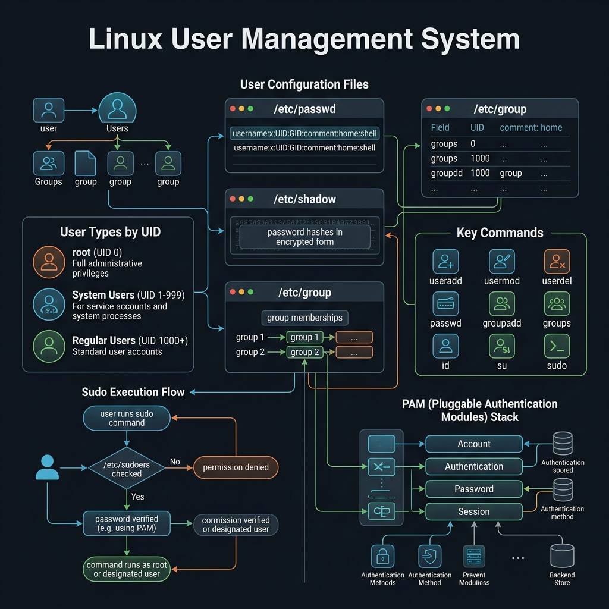

<!-- tags: linux, cli, user-management, security -->
# 👤 User Management

> Manage users, groups, sudo privileges, and sessions on Linux.

📅 Created: 2026-03-27 · 🔄 Updated: 2026-04-20 · ⏱️ 12 min read

| Aspect         | Detail                                              |
| -------------- | --------------------------------------------------- |
| **Category**   | User & Session Management                           |
| **Use case**   | Account management, access control, system security |
| **Key cmds**   | `whoami`, `sudo`, `su`, `passwd`, `useradd`, `exit` |

---

## 1. DEFINE

When access and identity on a server become the problem, a few wrong user management commands can blow the system wide open or lock it down entirely. This lane starts at that boundary.

### User Types

| Type        | UID Range | Description                                  |
| ----------- | --------- | -------------------------------------------- |
| **root**    | 0         | Superuser, full control over the system      |
| **system**  | 1–999     | Service accounts, no direct login            |
| **regular** | 1000+     | Normal users, created by admin               |

### Key Configuration Files

| File              | Purpose                                    |
| ----------------- | ------------------------------------------ |
| `/etc/passwd`     | User list (username:UID:GID:...)          |
| `/etc/shadow`     | Hashed passwords (root-readable only)     |
| `/etc/group`      | Group list                                 |
| `/etc/sudoers`    | sudo privilege configuration               |
| `/etc/login.defs` | Password policy, default UID range         |

---

Those failure modes sound familiar. But there is a trap: an overly broad `sudo NOPASSWD` rule enables privilege escalation, and `userdel` without removing the home directory leaves data residue. That trap appears in PITFALLS.

## 2. VISUAL

The concept has a name. In the diagram, the critical part emerges: how /etc/passwd, /etc/shadow, and /etc/group interact — and how sudo flows through PAM for privilege escalation.



```text
┌─────────────────────────────────────────────────────┐
│                   Linux User System                  │
├─────────────────────────────────────────────────────┤
│                                                      │
│  ┌──────────┐     ┌──────────┐     ┌──────────┐    │
│  │  root     │     │  admin   │     │   dev    │    │
│  │  UID: 0   │     │UID: 1000 │     │UID: 1001│    │
│  │  sudo: ✅ │     │ sudo: ✅ │     │ sudo: ❌│    │
│  └─────┬────┘     └─────┬────┘     └─────┬────┘    │
│        │                │                 │          │
│        ▼                ▼                 ▼          │
│  ┌─────────────────────────────────────────────┐    │
│  │                /etc/passwd                    │    │
│  │  root:x:0:0:root:/root:/bin/bash             │    │
│  │  admin:x:1000:1000:Admin:/home/admin:/bin/bash│   │
│  │  dev:x:1001:1001:Dev:/home/dev:/bin/bash     │    │
│  └─────────────────────────────────────────────┘    │
│                        │                             │
│                        ▼                             │
│  ┌─────────────────────────────────────────────┐    │
│  │             /etc/shadow (hashed)             │    │
│  │  root:$6$...:19000:0:99999:7:::             │    │
│  │  admin:$6$...:19000:0:99999:7:::            │    │
│  └─────────────────────────────────────────────┘    │
│                                                      │
│  Groups: ┌────────┐  ┌────────┐  ┌──────────┐      │
│          │  root  │  │ sudo   │  │ docker   │      │
│          │ GID: 0 │  │GID: 27 │  │GID: 999  │      │
│          └────────┘  └────────┘  └──────────┘      │
└─────────────────────────────────────────────────────┘
```

*Figure: Users map to UIDs in /etc/passwd. Passwords live hashed in /etc/shadow. Group membership controls what resources each user can access.*

---

## 3. CODE

The diagram showed the user-group-password relationship. Code below shows how to inspect, create, modify, and secure user accounts on a live system.

### 3.1 View Current User Info

```bash
# === whoami — display current username ===
whoami
# Output: admin

# === id — display UID, GID, and groups ===
id
# Output: uid=1000(admin) gid=1000(admin) groups=1000(admin),27(sudo),999(docker)

# View only UID
id -u
# Output: 1000

# View only group names
id -Gn
# Output: admin sudo docker

# === who — who is logged into the system ===
who
# Output: admin   pts/0   2026-03-27 10:00 (192.168.1.100)

# === w — more detail than who (load average, idle time) ===
w
```

### 3.2 Run Commands as Root — `sudo`

```bash
# === sudo — run a command with root privileges ===
# ⚠️ Requires the USER's password (not root's)
sudo apt update

# Run a command as a different user
sudo -u postgres psql

# Open a root shell (no need to know root's password)
sudo -i

# Run without password prompt (if configured in sudoers)
sudo -n systemctl restart nginx

# === Check who has sudo access ===
sudo -l

# ✅ Best practice: always use sudo instead of logging in as root
# ✅ Every sudo command is logged to /var/log/auth.log
```

### 3.3 Switch Users — `su`

```bash
# === su — Switch User ===

# Switch to root (requires root's password)
su -
# ⚠️ The "-" is important: loads root's full environment

# Switch to another user
su - deploy

# Run one command as another user then return
su - deploy -c "whoami"
# Output: deploy

# ✅ su vs sudo comparison:
# su  → requires the TARGET user's password
# sudo → requires the CURRENT user's password + must be in sudoers
```

### 3.4 Password Management — `passwd`

```bash
# === passwd — change password ===

# Change your own password
passwd

# Root changes another user's password (no old password needed)
sudo passwd deploy

# ✅ Lock an account (disable login)
sudo passwd -l deploy

# Unlock an account
sudo passwd -u deploy

# View password status
sudo passwd -S deploy
# Output: deploy P 03/27/2026 0 99999 7 -1
# P = password set, L = locked, NP = no password

# ⚠️ Force user to change password on next login
sudo passwd -e deploy

# === chage — password aging policy ===
sudo chage -l deploy

# Require password change every 90 days
sudo chage -M 90 deploy

# Set account expiration date
sudo chage -E 2026-12-31 deploy
```

### 3.5 Create and Manage Users

```bash
# === useradd — create user (low-level, manual) ===
# ⚠️ Does not create home dir or set password by default (distro-dependent)
sudo useradd deploy

# Create user with full options
sudo useradd -m -d /home/deploy -s /bin/bash -G sudo,docker -c "Deploy User" deploy
# -m: create home directory
# -d: specify home directory path
# -s: default shell
# -G: add to supplementary groups
# -c: comment/description

# Set password for new user
sudo passwd deploy

# === adduser — create user (interactive, user-friendly) ===
# ✅ Auto-creates home dir, prompts for password, full name, etc.
sudo adduser developer

# === usermod — modify user ===
# Add user to a group
sudo usermod -aG docker deploy
# -a: append (do not remove existing groups)
# -G: supplementary groups

# Change default shell
sudo usermod -s /bin/zsh deploy

# Change home directory
sudo usermod -d /opt/deploy -m deploy
# -m: move contents from old home to new

# Rename user
sudo usermod -l new_name old_name

# Lock account
sudo usermod -L deploy

# === userdel — delete user ===
# Delete user but keep home directory
sudo userdel deploy

# Delete user + home directory + mail spool
sudo userdel -r deploy
# ⚠️ Cannot undo! Backup before deleting
```

### 3.6 Group Management

```bash
# === groupadd — create group ===
sudo groupadd developers
sudo groupadd -g 2000 devops  # specify GID

# === groupmod — modify group ===
sudo groupmod -n new_name old_name  # rename group

# === groupdel — delete group ===
sudo groupdel developers
# ⚠️ Cannot delete a primary group that still has members

# === gpasswd — manage group membership ===
sudo gpasswd -a deploy docker   # add user to group
sudo gpasswd -d deploy docker   # remove user from group

# === groups — view user's groups ===
groups deploy
# Output: deploy : deploy sudo docker

# List all groups on the system
cat /etc/group | cut -d: -f1
```

### 3.7 Session Management — `exit`, `logout`

```bash
# === exit — leave current shell/session ===
exit
# Or Ctrl+D

# === logout — leave login shell ===
logout

# ✅ Difference:
# exit   → exits any shell type (login, sub-shell, script)
# logout → exits only login shells (ssh session, tty)
```

---

You have walked through users, groups, and sudoers. Now comes the dangerous part: sudo wildcards and incomplete cleanup — the trap set up from the beginning.

## 4. PITFALLS

| # | Mistake                                    | Fix                                                    |
| - | ------------------------------------------ | ------------------------------------------------------- |
| 1 | `usermod -G` removes all existing groups   | Always use `-aG` (append) instead of `-G`              |
| 2 | `useradd` without `-m` → no home directory | Use `useradd -m` or `adduser` (auto-creates home)      |
| 3 | Editing `/etc/sudoers` directly with syntax error | Always use `visudo` — validates syntax before saving |
| 4 | `su` without `-` does not load full env    | Use `su -` (login shell) instead of plain `su`         |
| 5 | Deleting a user who is still logged in     | `pkill -u username` first, then `userdel -r`           |

---

## 5. REF

| Resource                        | Link                                                      |
| ------------------------------- | --------------------------------------------------------- |
| Linux Users & Groups            | https://wiki.archlinux.org/title/Users_and_groups         |
| sudo manual                     | https://man7.org/linux/man-pages/man8/sudo.8.html         |
| useradd manual                  | https://man7.org/linux/man-pages/man8/useradd.8.html      |
| Linux PAM                       | https://wiki.archlinux.org/title/PAM                      |
| DigitalOcean: Linux Users Guide | https://www.digitalocean.com/community/tutorials/how-to-add-and-delete-users-on-ubuntu |

---

## 6. RECOMMEND

| Extension               | When                           | Reason                                     |
| ----------------------- | ------------------------------ | ------------------------------------------ |
| **LDAP/AD integration** | Enterprise with many servers   | Centralized user management                |
| **SSH key-based auth**  | Disable password login         | Stronger security than passwords           |
| **fail2ban**             | Public-facing servers          | Block SSH brute-force attempts             |
| **ACL (Access Control List)** | Fine-grained permissions | More granular than chmod/chown             |
| **PAM modules**         | Custom auth policies           | Two-factor auth, password complexity rules |

---

**Links**: [← Linux Directory Structure](./12-linux-directory-structure.md) · [→ Archiving & Compression](./14-archiving-compression.md)
