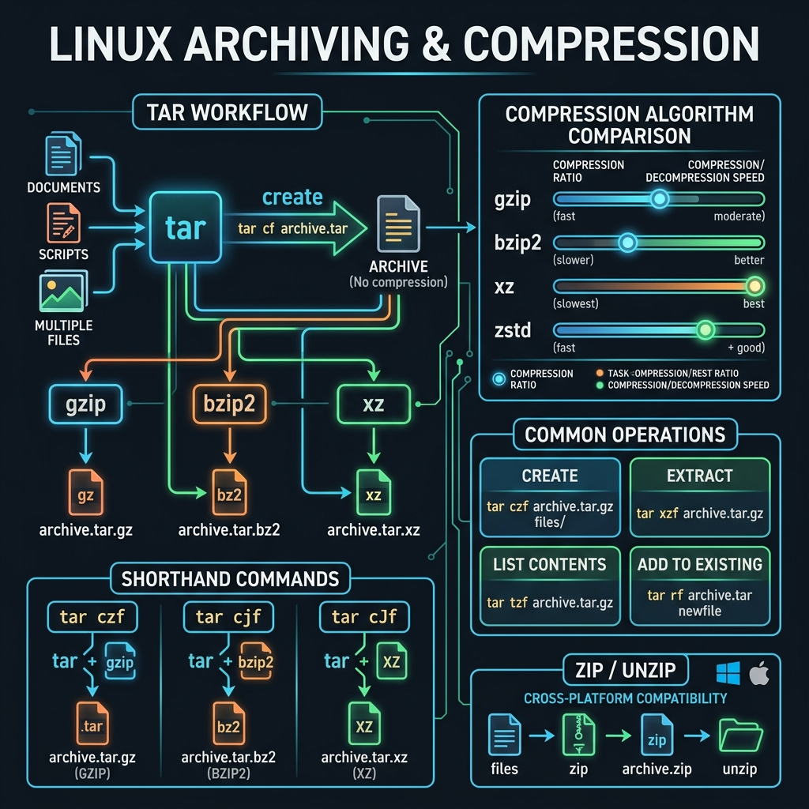

<!-- tags: linux, cli, archiving, compression -->
# 📦 Archiving & Compression

> Package, compress, and extract files and directories with tar, gzip, zip, and other common tools.

📅 Created: 2026-03-27 · 🔄 Updated: 2026-04-20 · ⏱️ 10 min read

| Aspect         | Detail                                            |
| -------------- | ------------------------------------------------- |
| **Category**   | File Archiving & Compression                      |
| **Use case**   | Backup, transfer, deploy, log rotation            |
| **Key cmds**   | `tar`, `gzip`, `zip`, `unzip`, `bzip2`, `xz`     |

---

## 1. DEFINE

Backup, transfer, and long-term artifact storage usually begin with archive and compression commands. Choosing the wrong format or the wrong flag can cost both time and data.

### Archive vs Compress

| Term                   | Meaning                              | Example         |
| ---------------------- | ------------------------------------- | --------------- |
| **Archive**            | Bundle many files into one            | `tar`           |
| **Compress**           | Reduce file size                      | `gzip`, `bzip2` |
| **Archive + Compress** | Bundle then compress (most common)    | `tar.gz`, `.tgz` |

### Compression Algorithm Comparison

| Tool     | Extension    | Speed           | Ratio     | Notes                            |
| -------- | ------------ | --------------- | --------- | -------------------------------- |
| `gzip`   | `.gz`        | ⚡ Fast         | Good      | Most common, balanced            |
| `bzip2`  | `.bz2`       | 🐢 Slow         | Very good | Better ratio than gzip           |
| `xz`     | `.xz`        | 🐌 Very slow    | Best      | Used by kernel/distro ISOs       |
| `zip`    | `.zip`       | ⚡ Fast         | Good      | Cross-platform (Win/Mac/Linux)   |
| `zstd`   | `.zst`       | ⚡⚡ Very fast  | Very good | Developed by Facebook, newest    |

---

Those failure modes sound clear. But there is a trap: extracting a tar with absolute paths overwrites system files, and `gzip` without `-k` deletes the source file. That trap appears in PITFALLS.

## 2. VISUAL

Theory sounds fine on paper. The visual below shows the tar workflow, compression algorithm trade-offs, and common operations for daily archive management.



```text
                    TAR WORKFLOW

    📁 project/              tar (archive only)
    ├── src/           ─────────────────────►  📦 project.tar
    ├── docs/                                      │
    └── README.md                                  │ gzip
                                                   ▼
                                              📦 project.tar.gz
                                              (smaller by ~60-70%)

    ┌──────────────────────────────────────────────────┐
    │          COMPRESSION COMPARISON (1GB data)       │
    ├──────────┬──────────┬───────────┬────────────────┤
    │ gzip     │ 350 MB   │ 5 sec     │ ████████░░ 65% │
    │ bzip2    │ 280 MB   │ 25 sec    │ ███████░░░ 72% │
    │ xz       │ 220 MB   │ 60 sec    │ ██████░░░░ 78% │
    │ zstd     │ 300 MB   │ 2 sec     │ ████████░░ 70% │
    └──────────┴──────────┴───────────┴────────────────┘
```

*Figure: tar bundles files without compression. Adding gzip shrinks the archive by 60–70%. zstd offers the best speed-to-ratio trade-off for modern workflows.*

---

## 3. CODE

The visual showed the trade-offs. Code below shows how each tool is used in practice.

### 3.1 `tar` — The Swiss Army Knife of Archiving

```bash
# ━━━ Create archive (no compression) ━━━
tar -cf archive.tar folder/
# -c: create  -f: filename

# ━━━ Create archive + gzip (most common) ━━━
tar -czf project.tar.gz project/
# -z: gzip compression

# ━━━ Create archive + bzip2 (stronger compression) ━━━
tar -cjf project.tar.bz2 project/

# ━━━ Create archive + xz (strongest compression) ━━━
tar -cJf project.tar.xz project/

# ━━━ Verbose — watch progress ━━━
tar -czvf backup.tar.gz /var/www/ 2>&1 | tail -5

# ━━━ Exclude files/patterns ━━━
tar -czf deploy.tar.gz project/ \
    --exclude='*.log' \
    --exclude='node_modules' \
    --exclude='.git' \
    --exclude='*.tmp'

# ━━━ Archive only files changed after a date ━━━
tar -czf incremental.tar.gz --newer='2026-03-01' /var/www/
```

### 3.2 `tar` — Extracting

```bash
# ━━━ Extract .tar.gz ━━━
tar -xzf project.tar.gz

# ━━━ Extract into a specific directory ━━━
tar -xzf project.tar.gz -C /opt/deploy/

# ━━━ Extract .tar.bz2 ━━━
tar -xjf project.tar.bz2

# ━━━ Extract .tar.xz ━━━
tar -xJf project.tar.xz

# ━━━ List archive contents (without extracting) ━━━
tar -tzf project.tar.gz

# ━━━ Extract a single file ━━━
tar -xzf project.tar.gz project/README.md
```

### 3.3 `gzip` / `gunzip` — Single File Compression

```bash
# ━━━ Compress (deletes source, creates .gz) ━━━
gzip access.log
# Result: access.log → access.log.gz (source deleted)

# Keep the source file
gzip -k access.log

# ━━━ Decompress ━━━
gunzip access.log.gz
# Or: gzip -d access.log.gz

# ━━━ Compression level (1=fast, 9=max compression) ━━━
gzip -9 large-file.sql       # maximum compression
gzip -1 quick-transfer.dat   # fastest compression

# ━━━ Read compressed files without decompressing ━━━
zcat access.log.gz           # like cat
zless access.log.gz          # like less
zgrep "ERROR" access.log.gz  # grep inside compressed file
```

### 3.4 `zip` / `unzip` — Cross-Platform

```bash
# ━━━ Create zip archive ━━━
zip -r project.zip project/
# -r: recursive (required for directories)

# ━━━ Add file to existing zip ━━━
zip project.zip newfile.txt

# ━━━ Zip with password ━━━
zip -e -r secret.zip documents/

# ━━━ Exclude patterns ━━━
zip -r project.zip project/ -x "*.git*" "*.log" "node_modules/*"

# ━━━ Extract zip ━━━
unzip project.zip
unzip project.zip -d /opt/deploy/    # into specific directory
unzip -l project.zip                 # list contents (no extract)
unzip project.zip "project/config.yaml"   # extract single file
unzip -o project.zip                 # overwrite all
```

### 3.5 Real-World Scenarios

```bash
# ━━━ Scenario 1: Backup database + compress ━━━
pg_dump mydb | gzip > backup_$(date +%Y%m%d).sql.gz

# Restore
gunzip -c backup_20260327.sql.gz | psql mydb

# ━━━ Scenario 2: Deploy artifact ━━━
tar -czf deploy-v1.2.3.tar.gz \
    --exclude='*.test.go' \
    --exclude='.env*' \
    bin/ config/ migrations/

ssh deploy@server "mkdir -p /opt/app/releases/v1.2.3"
scp deploy-v1.2.3.tar.gz deploy@server:/tmp/
ssh deploy@server "tar -xzf /tmp/deploy-v1.2.3.tar.gz -C /opt/app/releases/v1.2.3/"

# ━━━ Scenario 3: Manual log rotation ━━━
find /var/log/app/ -name "*.log" -mtime +7 -exec gzip {} \;
find /var/log/app/ -name "*.log.gz" -mtime +30 -delete

# ━━━ Scenario 4: Transfer over SSH (pipe tar) ━━━
# No temp file needed — stream directly
tar -czf - /var/www/html/ | ssh user@backup "tar -xzf - -C /backup/"
```

---

You have walked through tar, compression, and real-world scenarios. Now comes the dangerous part: absolute path extraction and source deletion — the trap set up from the beginning.

## 4. PITFALLS

| # | Mistake                                | Fix                                                         |
| - | -------------------------------------- | ----------------------------------------------------------- |
| 1 | Forgetting `-r` when zipping a directory | Always use `zip -r archive.zip folder/`                   |
| 2 | `tar -czf` overwrites instead of appending | Use `-rf` to append, or extract → add → re-tar           |
| 3 | `gzip file` deletes the source         | Use `gzip -k` to keep the original                         |
| 4 | Absolute paths stored in tar           | Use `-C` or `cd` first: `tar -czf a.tar.gz -C /var www`   |
| 5 | Compressing already-compressed files   | Ineffective — skip binary/media files during compression   |

---

## 5. REF

| Resource                 | Link                                                    |
| ------------------------ | ------------------------------------------------------- |
| GNU tar manual           | https://www.gnu.org/software/tar/manual/                |
| gzip manual              | https://man7.org/linux/man-pages/man1/gzip.1.html       |
| Zstandard (Facebook)     | https://facebook.github.io/zstd/                        |
| ArchWiki: Compression    | https://wiki.archlinux.org/title/Archiving_and_compression |
| Compression benchmark    | https://quixdb.github.io/squash-benchmark/              |

---

## 6. RECOMMEND

| Extension              | When                             | Reason                                |
| ---------------------- | -------------------------------- | ------------------------------------- |
| **zstd**               | Need fast compression + good ratio | Faster than gzip with better ratio  |
| **pigz**               | Compressing large files on multi-core | Parallel gzip, uses all CPU cores  |
| **rsync + compression** | Incremental sync/backup         | Transfers only diffs, auto-compresses |
| **logrotate**          | Automatic log file management    | Auto compress + rotate on schedule   |
| **borgbackup**         | Backup with deduplication        | Compress + dedup + encryption        |

---

**Links**: [← User Management](./13-user-management.md) · [→ Help & Reference](./15-help-reference.md)
