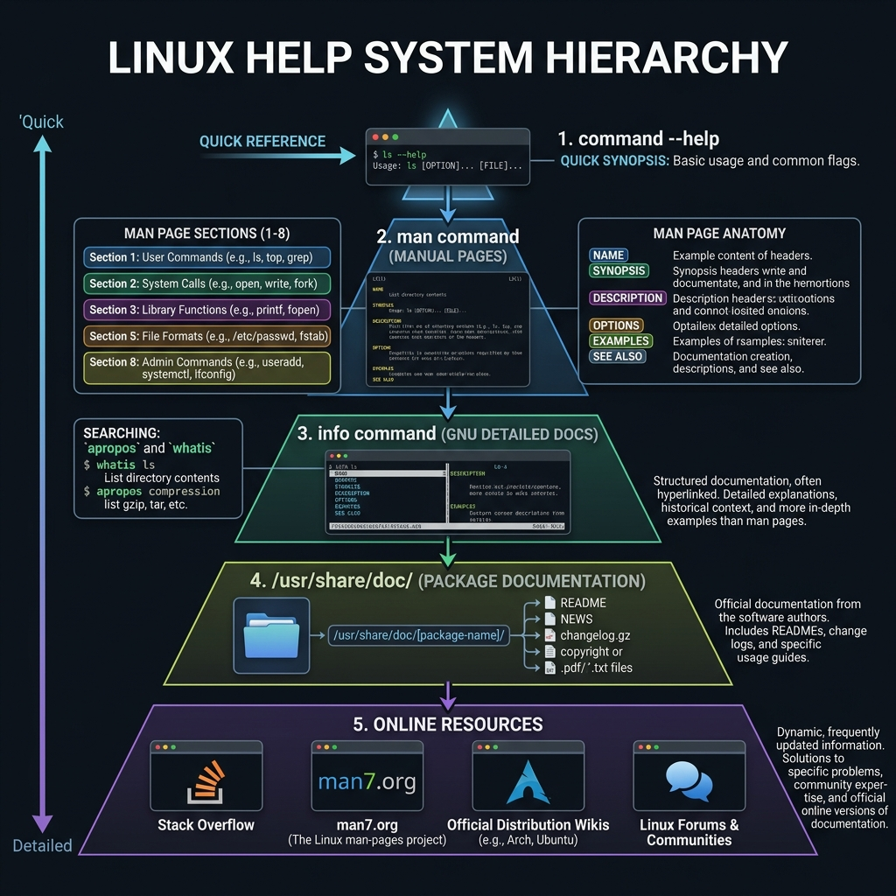

<!-- tags: linux, cli, help, reference -->
# ❓ Help & Reference

> Look up commands, read manuals, find binary locations, and manage command history.

📅 Created: 2026-03-27 · 🔄 Updated: 2026-04-20 · ⏱️ 8 min read

| Aspect         | Detail                                                 |
| -------------- | ------------------------------------------------------ |
| **Category**   | Help System & Command Reference                       |
| **Use case**   | Look up command usage, find binaries, review history   |
| **Key cmds**   | `man`, `whatis`, `which`, `whereis`, `history`, `type` |

---

## 1. DEFINE

Nobody memorizes every command. The more important skill is knowing how to look things up fast without breaking your debug rhythm. This help/reference article serves exactly that purpose.

Linux ships with a powerful built-in help system — from manual pages (man) to built-in help, command location, and history tracking. Mastering these commands lets you **self-serve quickly** without leaving the terminal.

### Lookup Command Comparison

| Command     | Purpose                                | Example Output                                 |
| ----------- | -------------------------------------- | ---------------------------------------------- |
| `man`       | Full manual                            | Detailed manual page with sections             |
| `--help`    | Quick help (built-in)                  | List of main options                           |
| `whatis`    | One-line description                   | `cp (1) - copy files and directories`          |
| `which`     | Path to executable                     | `/usr/bin/python3`                             |
| `whereis`   | Binary + source + manual               | `git: /usr/bin/git /usr/share/man/man1/git.1`  |
| `type`      | Command type (alias/builtin/external)  | `ls is aliased to 'ls --color=auto'`           |
| `history`   | Previously run commands                | Numbered list of past commands                 |

---

Those failure modes sound easy to avoid. But there is a trap: a missing man page means the command exists but has no docs, and `--help` flag behavior differs between distros. That trap appears in PITFALLS.

## 2. VISUAL

The definition locked the vocabulary. The visual below shows the five-level help hierarchy — from quick --help synopses to man page sections and online resources.



```text
┌──────────────────────────────────────────────────────┐
│                 HELP SYSTEM HIERARCHY                 │
├──────────────────────────────────────────────────────┤
│                                                       │
│   Fastest              ──►  Slowest (most detailed)   │
│                                                       │
│   type cmd                                            │
│     └─ "What kind of command is this?"                │
│          │                                            │
│   whatis cmd                                          │
│     └─ "What IS this command?" (1 line)               │
│          │                                            │
│   cmd --help                                          │
│     └─ "HOW do I use it?" (options list)              │
│          │                                            │
│   man cmd                                             │
│     └─ "EVERYTHING about this command" (full manual)  │
│          │                                            │
│   info cmd                                            │
│     └─ "The most detailed guide" (hyperlinked)        │
│                                                       │
└──────────────────────────────────────────────────────┘

┌──────────────────────────────────────────────────────┐
│              MAN PAGE SECTIONS                        │
├───────┬──────────────────────────────────────────────┤
│   1   │ User commands (ls, cp, grep)                 │
│   2   │ System calls (open, read, fork)              │
│   3   │ Library functions (printf, malloc)           │
│   4   │ Special files (/dev/null)                    │
│   5   │ Config file formats (/etc/passwd)            │
│   6   │ Games                                        │
│   7   │ Miscellaneous (man, regex)                   │
│   8   │ System admin commands (mount, iptables)      │
└───────┴──────────────────────────────────────────────┘
```

*Figure: Start with type for instant classification. Escalate through whatis → --help → man → info as you need more detail. Most daily lookups stop at --help.*

---

## 3. CODE

The visual showed the escalation path. Code below shows how to use each lookup tool effectively.

### 3.1 `man` — Manual Pages

```bash
# ━━━ View a basic manual ━━━
man ls
# Opens the manual viewer (uses less — j/k to scroll, q to quit)

# ━━━ View a specific section ━━━
# When a name has multiple sections (e.g., printf)
man 1 printf   # user command
man 3 printf   # C library function

# ━━━ Search inside the manual ━━━
# In the man viewer, press / then type a keyword
man grep
# /recursive ← search for "recursive" in the manual

# ━━━ Search for manual pages by keyword ━━━
man -k "copy file"
# Output:
# cp (1)                - copy files and directories
# install (1)           - copy files and set attributes
# rsync (1)             - a fast, versatile, remote file-copying tool

# Equivalent:
apropos "copy file"

# ━━━ List all man pages for a command ━━━
man -f passwd
# Output:
# passwd (1)  - change user password
# passwd (5)  - the password file

# ━━━ Export man page to text ━━━
man ls | col -b > ls_manual.txt
```

### 3.2 `--help` — Quick Help

```bash
# ━━━ Quick help for any command ━━━
ls --help
grep --help
docker --help

# Pipe through less if output is long
tar --help | less

# Some commands use -h instead of --help
curl -h
```

### 3.3 `whatis` — One-Line Description

```bash
# ━━━ View a short description ━━━
whatis cp
# Output: cp (1) - copy files and directories

whatis tar gzip ls
# Output:
# tar (1)  - an archiving utility
# gzip (1) - compress or expand files
# ls (1)   - list directory contents

# ⚠️ If "nothing appropriate" error → rebuild the database:
sudo mandb
```

### 3.4 `which` — Find Executable Path

```bash
# ━━━ Find binary path ━━━
which python3
# Output: /usr/bin/python3

which node
# Output: /home/user/.nvm/versions/node/v20.11.0/bin/node

# ━━━ Find all versions ━━━
which -a python
# Output:
# /usr/bin/python
# /usr/local/bin/python

# ✅ Use case: check which version a command is using
which go && go version
```

### 3.5 `whereis` — Find Binary + Source + Manual

```bash
# ━━━ Full search: binary, source, man page ━━━
whereis git
# Output: git: /usr/bin/git /usr/share/man/man1/git.1.gz

whereis nginx
# Output: nginx: /usr/sbin/nginx /usr/share/nginx /usr/share/man/man8/nginx.8.gz

# ━━━ Binary only ━━━
whereis -b python3

# ━━━ Manual page only ━━━
whereis -m ls
```

### 3.6 `type` — Classify a Command

```bash
# ━━━ Determine command type ━━━
type ls
# Output: ls is aliased to 'ls --color=auto'

type cd
# Output: cd is a shell builtin

type python3
# Output: python3 is /usr/bin/python3

type if
# Output: if is a shell keyword

# ━━━ View all definitions ━━━
type -a echo
# Output:
# echo is a shell builtin        ← builtin (takes priority)
# echo is /usr/bin/echo           ← external binary

# ✅ Classification:
# alias    → shortcut (alias ll='ls -la')
# builtin  → built into the shell (cd, echo, pwd)
# keyword  → shell keyword (if, for, while)
# file     → external executable (/usr/bin/grep)
# function → shell function
```

### 3.7 `history` — Command History

```bash
# ━━━ View full history ━━━
history

# ━━━ View last N commands ━━━
history 20

# ━━━ Search history ━━━
history | grep "docker"

# ✅ Reverse search (MOST IMPORTANT):
# Press Ctrl+R then type a keyword
# (reverse-i-search)`dock`: docker compose up -d
# Enter to run, Ctrl+R to find next match

# ━━━ Re-run commands from history ━━━
!!          # re-run the last command
!1003       # run command number 1003
!docker     # run the most recent docker command
!$          # last argument of the previous command

# ━━━ Practical example ━━━
cat /etc/shadow
# Permission denied
sudo !!
# → sudo cat /etc/shadow  ✅

# ━━━ Clear history (security) ━━━
history -c          # clear history in current session
history -d 1005     # delete a specific entry
> ~/.bash_history   # truncate the file

# ━━━ Configure history (~/.bashrc) ━━━
export HISTSIZE=10000        # commands in memory
export HISTFILESIZE=20000    # commands in file
export HISTCONTROL=ignoredups:erasedups   # no duplicates
export HISTCONTROL=ignorespace            # skip space-prefixed
export HISTTIMEFORMAT="%Y-%m-%d %H:%M:%S  "   # add timestamps
```

### 3.8 `alias` — Create Shortcuts

```bash
# ━━━ View all aliases ━━━
alias

# ━━━ Create temporary alias (lost on shell exit) ━━━
alias update='sudo apt update && sudo apt upgrade -y'
alias gs='git status'
alias dc='docker compose'

# ━━━ Create permanent alias (add to ~/.bashrc or ~/.zshrc) ━━━
echo "alias ll='ls -alF'" >> ~/.bashrc
source ~/.bashrc

# ━━━ Remove alias ━━━
unalias ll
```

---

You have walked through man, help, and type. Now comes the dangerous part: missing man pages and distro differences — the trap set up from the beginning.

## 4. PITFALLS

| # | Mistake                                  | Fix                                                    |
| - | ---------------------------------------- | ------------------------------------------------------- |
| 1 | `which` cannot find aliases or builtins  | Use `type` instead — it understands aliases + builtins |
| 2 | `man -k` returns "nothing appropriate"   | Run `sudo mandb` to rebuild the database               |
| 3 | History lost after exiting               | Set `HISTSIZE` + `HISTFILESIZE` in `.bashrc`           |
| 4 | Sensitive commands saved in history      | Prefix with space (if `HISTCONTROL=ignorespace`)       |
| 5 | `!!` expands incorrectly in zsh          | Zsh needs `setopt BANG_HIST` or use `fc -e -`          |

---

## 5. REF

| Resource                       | Link                                                    |
| ------------------------------ | ------------------------------------------------------- |
| man-pages project              | https://www.kernel.org/doc/man-pages/                   |
| GNU Bash Manual — History      | https://www.gnu.org/software/bash/manual/html_node/Bash-History-Builtins.html |
| tldr-pages (simplified man)    | https://tldr.sh/                                        |
| cheat.sh (instant cheatsheets) | https://cheat.sh/                                       |
| ExplainShell                   | https://explainshell.com/                               |

---

## 6. RECOMMEND

| Extension              | When                            | Reason                                      |
| ---------------------- | ------------------------------- | ------------------------------------------- |
| **tldr**               | Need faster lookup than man     | Practical examples, skips unnecessary detail |
| **fzf + history**      | More efficient history search   | Fuzzy search replaces basic Ctrl+R          |
| **cheat.sh**           | Online lookup without installing | `curl cheat.sh/tar` — instant cheatsheet   |
| **bat (replaces cat)** | Better file/manual reading      | Syntax highlighting, line numbers           |
| **zsh + oh-my-zsh**    | Powerful auto-completion        | Plugins for history, alias, completion      |

---

**Links**: [← Archiving & Compression](./14-archiving-compression.md)
