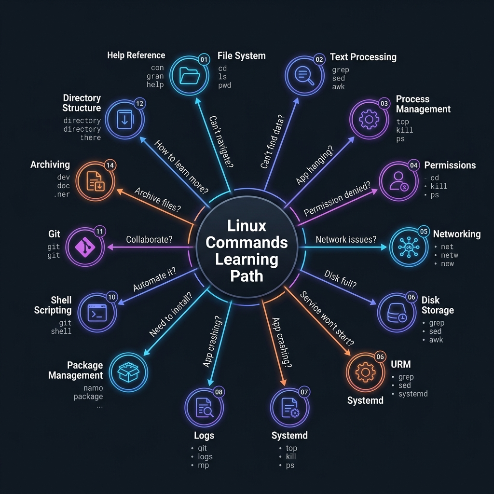
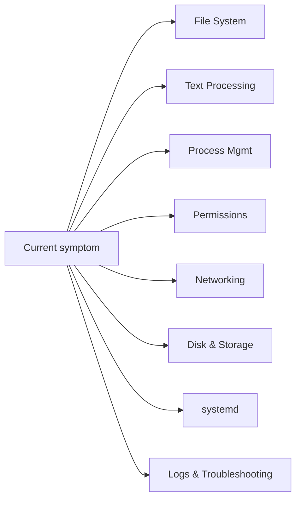

<!-- tags: overview -->
# Linux Commands

> Hub for command-line and troubleshooting lanes from a production support perspective — not just memorizing commands.

| Aspect | Detail |
| --- | --- |
| **Concept** | Navigation hub for `Linux Commands` |
| **Audience** | Backend engineer, DevOps engineer, SRE |
| **Primary style** | Concept-First router |
| **Entry point** | Open when you are in a shell and need to route quickly to the right command group by symptom. |

📅 Updated: 2026-04-20 · ⏱️ 6 min read

---

## 1. DEFINE

Picture a server that is slow, a port that will not open, a disk that is full, or a service that dies at 3 AM. At that moment, the problem is not missing commands. The problem is choosing the wrong command group first and losing 20 precious minutes on a useless debug branch.

This hub does not replace individual articles. It exists to help you open the right lane before wandering into tools, syntax, or specific diagrams. Reading in the right order reduces the feeling of "knowing many keywords but still unable to route the real problem."

### Signals & Boundaries

- Open this hub when you know the issue lives inside `Linux Commands` but are unsure which article to read first.
- Use the coverage map to route by pain point, not by file order.
- Return here after each article to pick the next step with intention.

### Coverage Map

| Entry | Role |
| --- | --- |
| [File System & Navigation](01-file-system.md) | Entry point for lane `File System & Navigation` |
| [Text Processing — grep, awk, sed, sort](02-text-processing.md) | Entry point for lane `Text Processing` |
| [Process Management](03-process-management.md) | Entry point for lane `Process Management` |
| [Permissions & Ownership](04-permissions-ownership.md) | Entry point for lane `Permissions & Ownership` |
| [Networking](05-networking.md) | Entry point for lane `Networking` |
| [Disk & Storage](06-disk-storage.md) | Entry point for lane `Disk & Storage` |
| [systemd & Services](07-systemd-services.md) | Entry point for lane `systemd & Services` |
| [Logs & Troubleshooting](08-logs-troubleshooting.md) | Entry point for lane `Logs & Troubleshooting` |
| [Package Management](09-package-management.md) | Entry point for lane `Package Management` |
| [Shell Scripting — Bash](10-shell-scripting.md) | Entry point for lane `Shell Scripting` |
| [Git Workflow: Essential Commands](11-git-workflow.md) | Entry point for lane `Git Workflow` |
| [Linux Directory Structure](12-linux-directory-structure.md) | Entry point for lane `Linux Directory Structure` |
| [User Management](13-user-management.md) | Entry point for lane `User Management` |
| [Archiving & Compression](14-archiving-compression.md) | Entry point for lane `Archiving & Compression` |
| [Help & Reference](15-help-reference.md) | Entry point for lane `Help & Reference` |

---

## 2. VISUAL

The definition locked the hub's scope. The visual below helps route by lane instead of scrolling a dry link list.





*Figure: Route by current symptom — file issues go to File System, grep/awk needs go to Text Processing, hanging processes go to Process Management, and so on.*

---

## 3. CODE

The diagram showed the routing rhythm. The artifact below turns the hub into a short worksheet so the team or learner can pick the right entry gate.

### Problem 1: Basic — Route the lane before reading deep

> **Goal**: Prevent study or review from drifting into "open whichever article looks interesting."
> **Approach**: Choose lane by current pain point.
> **Example**: Pick the right cluster to read in `Linux Commands`.
> **Complexity**: Basic

```yaml
router:
  module: Linux Commands
  rule: "choose lane by symptom, not by familiar name"
  suggested_path:
  - 01-file-system.md
  - 02-text-processing.md
  - 03-process-management.md
  - 04-permissions-ownership.md
  - 05-networking.md
  - 06-disk-storage.md
```

This artifact does not solve the problem for you. It trims wrong lanes before your time is spent on articles that do not serve your current goal.

---

## 4. PITFALLS

| # | Severity | Mistake | Consequence | Fix |
| --- | --- | --- | --- | --- |
| 1 | 🔴 Fatal | Reading by file order instead of routing by pain point | Accumulates terminology without solving the real problem | Use the coverage map before opening a detail article |
| 2 | 🟡 Common | Treating the README as a pure link catalog | Loses the hub's routing purpose | Always ask "which lane matches my current pain?" |
| 3 | 🔵 Minor | Finishing an article without returning to the hub | Jumps to an adjacent article by instinct | Return to the README to pick the next step |

---

## 5. REF

| Resource | Type | Link | Notes |
| --- | --- | --- | --- |
| File System & Navigation | Internal | [File System & Navigation](01-file-system.md) | Directly related entry point |
| Text Processing | Internal | [Text Processing](02-text-processing.md) | Directly related entry point |
| Process Management | Internal | [Process Management](03-process-management.md) | Directly related entry point |
| Permissions & Ownership | Internal | [Permissions & Ownership](04-permissions-ownership.md) | Directly related entry point |

---

## 6. RECOMMEND

Once you know which lane you are in, the next step is to open the first article of that lane instead of wandering into a new topic.

| Next step | When | Reason | File/Link |
| --- | --- | --- | --- |
| File System & Navigation | When the pain point matches this lane | Continue into the right cluster | [File System & Navigation](01-file-system.md) |
| Text Processing | When the pain point matches this lane | Continue into the right cluster | [Text Processing](02-text-processing.md) |
| Process Management | When the pain point matches this lane | Continue into the right cluster | [Process Management](03-process-management.md) |
