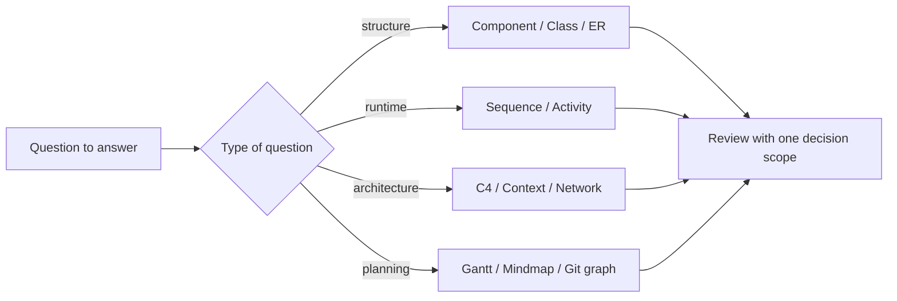
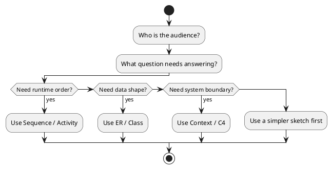
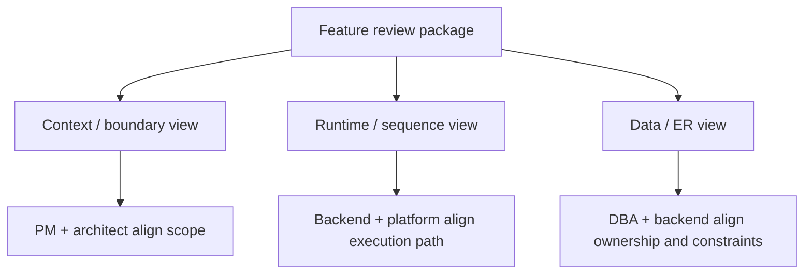

<!-- tags: diagram, reference -->
# 📐 What Is A Diagram?

> A good diagram does not replace thinking. It compresses thinking so others understand faster and decide sooner.

📅 Created: 2026-03-31 · 🔄 Updated: 2026-04-20 · ⏱️ 12 min read

| Aspect | Detail |
| ------ | ------ |
| **Focus** | Communication artifact |
| **When to use** | When you need to reduce ambiguity across multiple people |
| **Related** | Architecture, Product, Review |

---

## 1. DEFINE

Picture a design review where everyone shares the same feeling: talking for twenty minutes yet still not understanding each other, because each person holds a different mental model. A good diagram appears at exactly the right moment to compress that thinking into something the whole group can look at together.

| Variant | When to use | Scope |
| ------- | ----------- | ----- |
| Explainer diagram | Explaining a concept or flow | One core message |
| Design diagram | Making design decisions | Boundary, interaction, assumption |
| Reference diagram | Onboarding and long-term docs | Stable naming + clear zoom level |

**Core insight**:
- A diagram does not replace thinking. It compresses thinking so others understand faster.
- Every diagram must answer one clear question — for example, who calls whom, which modules depend on each other, or which steps the user goes through.
- If a single diagram tries to describe structure, runtime, data, and planning at the same time, it will almost certainly fail.

Those failure modes sound familiar. But there is a trap: drawing before knowing what question you are answering produces a beautiful but meaningless diagram. That trap appears in PITFALLS.

## 2. VISUAL

### Before vs After

The image below shows the fundamental value proposition of diagrams. Without one, each person at the table holds a different mental model — the discussion generates heat but no alignment. With one, the entire group converges on the same picture and can decide faster.


*Image: A diagram does not make the team smarter. It compresses their thinking onto one surface so disagreements become visible and resolvable instead of hidden and recurring.*

### Preview UI

Seeing the output first locks the diagram shape before you touch any practice work.



*Figure: Minimal Mermaid render so you see the target shape before moving to the practice section.*

The concept sounds familiar, but only when you see it visually do you notice where this diagram's scope ends.

```text
Question: "Who calls whom over time?" => Sequence
Question: "Which module depends on which?" => Component/Class
Question: "What steps does the user go through?" => Flowchart/User journey
Question: "How does the system connect?" => C4 / Context / Network
```

## 3. CODE

The diagram above showed the scope. Code and snippets below reveal how this diagram is applied in a real review or design doc.

### Mermaid Practice Block

The block below holds the same shape as the preview, in raw Mermaid so you can copy it into the Mermaid Live Editor or your docs and customize.

````md

````

### Example 1: Basic — Diagram-first in a design review

> **Goal**: Turn a vague debate into a reviewable artifact.
> **Approach**: Start from the question that needs deciding, then choose the diagram type instead of picking a tool first.
> **Example**: `Are we trying to clarify the payment service boundary or the runtime order of checkout?`


> **Conclusion**: When a review stalls, the first question is not "Mermaid or Excalidraw?" but "what does this diagram need to answer?"

Diagram-first review covered. But choosing a diagram needs a framework — let us organize.

### Example 2: Intermediate — Checklist for choosing a diagram before drawing

> **Goal**: Standardize how the team picks the right diagram and reduce pointless redraws.
> **Approach**: Use a short checklist to identify audience, scope, and zoom level.
> **Example**: `Reviewer is the backend lead, question is service boundary, review window is 10 minutes.`



> **Conclusion**: This checklist is especially useful when multiple people edit the same document. It forces the team to speak the same language about the diagram's objective.

In PlantUML, a flow checklist like this is built-in syntax. If the same repo also needs `mindmap`, `C4`, or icon libraries, PlantUML can continue with `@startmindmap` and `stdlib` packages such as `C4`, `office`, or `logos`.

Checklist covered. But review packs with multiple zoom levels need discipline — let us compose.

### Example 3: Advanced — Multi-zoom review pack for a single feature

> **Goal**: Prove that a good diagram rarely stands alone in a complex design review.
> **Approach**: Organize a pack of context, runtime, and data views so each stakeholder sees the right layer of information.
> **Example**: `Checkout feature needs PM to see the journey, backend to see the sequence, and DBA to see the ER.`



> **Conclusion**: At the advanced level, a diagram's value is no longer in a single beautiful picture but in how multiple pictures coordinate to reduce cognitive load for the right audience.

You have walked through review, checklist, and zoom levels. Now comes the dangerous part: purposeless diagrams — the trap set up at the beginning.

## 4. PITFALLS

Knowing a diagram type is one thing. Keeping it from drifting into redundancy or wrong scope is another. The table below captures the most common slips.

| # | Mistake | Consequence | Fix |
|---|---------|-------------|-----|
| 1 | Drawing before knowing what question to answer | Diagram has many arrows but helps no decision | Write the target question at the top of the file before drawing |
| 2 | Mixing multiple concerns in one diagram | Reader must separate meanings, cognitive load spikes | One diagram = one primary scope |
| 3 | Polishing style too early | Time wasted on colors while the logic is still wrong | Lock semantics first, polish later |

You have walked through Diagram fundamentals and its traps. The resources below help you go deeper.

## 5. REF

| Resource | Link |
| -------- | ---- |
| C4 model | https://c4model.com/ |
| Mermaid docs | https://mermaid.js.org/ |
| PlantUML | https://plantuml.com/ |

## 6. RECOMMEND

Once you see where this diagram type is strong and where it breaks, the next step is to open the right adjacent lane rather than jumping randomly to another type.

| Next step | When | Reason |
| --------- | ---- | ------ |
| Diagram taxonomy | When you do not know the full diagram ecosystem | Helps choose the right type before going deep |
| Choosing diagram | When you are torn between flowchart and sequence | A practical decision guide beats raw definitions |
| Diagram anti-patterns | When you want to audit existing diagrams | Learning from failure modes is faster |

---

**Links**: ← Previous · [→ Next](./02-diagram-taxonomy.md)
