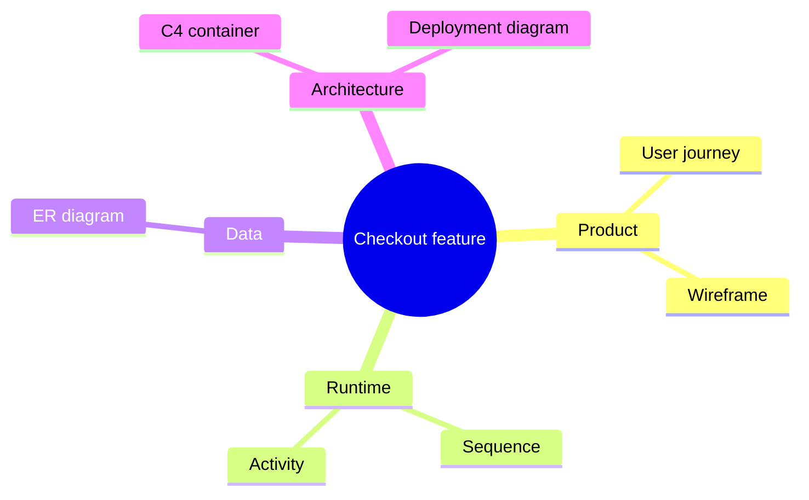
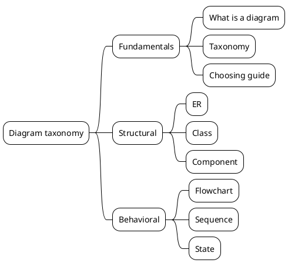
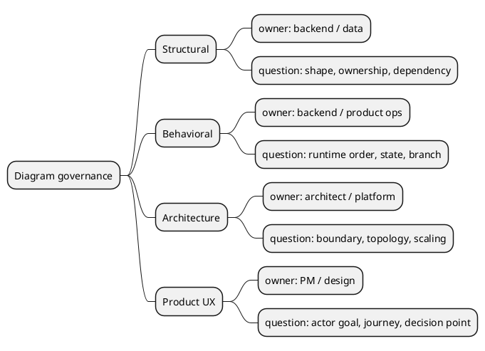

<!-- tags: diagram, reference -->
# 🗂️ Diagram Taxonomy

> A good taxonomy helps the team communicate precisely: needing a sequence is fundamentally different from needing a component diagram.

📅 Created: 2026-03-31 · 🔄 Updated: 2026-04-20 · ⏱️ 14 min read

| Aspect | Detail |
| ------ | ------ |
| **Focus** | Classification and navigation |
| **When to use** | When you need to choose the right diagram family before going deep |
| **Related** | Learning path, Review, Tooling |

---

## 1. DEFINE

You open a drawing tool and realize there are far too many diagram types that all sound reasonable: flowchart, sequence, C4, ER, journey, deployment. Pick the wrong type at the start, and you will draw extensively yet still fail to answer the question that needs settling.

| Variant | When to use | Scope |
| ------- | ----------- | ----- |
| Structural | Describing static shape and dependencies | ER, class, component, deployment |
| Behavioral | Describing runtime order or state transitions | Flowchart, sequence, state, activity |
| Planning / Reference | Describing roadmaps, mappings, or cheatsheets | Gantt, mindmap, git graph, tools guide |

**Core insight**:
- Picking the wrong diagram type causes more pointless arguments than a badly drawn diagram.
- Taxonomy also organizes a knowledge base so newcomers do not get lost among dozens of formats.
- Without a taxonomy, the same topic scatters across multiple folders with vague logic.

Those failure modes sound clear. But there is a trap: classifying by tool instead of intent means the team says "draw Mermaid" instead of choosing the right diagram type. That trap appears in PITFALLS.

## 2. VISUAL

### Complete Taxonomy Tree

The image below shows the full taxonomy: every diagram type organized into four families (Structural, Behavioral, Architecture, Planning/Product). Seeing the complete tree first prevents the common trap of learning one type deeply while being blind to the others.


*Image: Four families, not four hundred types. Every diagram you will ever draw falls into one of these branches. The taxonomy prevents confusion between types that look similar but answer different questions.*

### Preview UI

Seeing the output first locks the diagram shape before you touch any practice work.



*Figure: Same feature, different questions, different diagram families. Taxonomy prevents using the wrong tool for the wrong question.*

```text
Structural  -> shape / dependency / ownership
Behavioral -> time / transition / interaction
Architecture -> system boundary / container / topology
Product/UX -> user journey / discovery / ideation
Planning -> roadmap / mindmap / workflow
```

## 3. CODE

The visual showed what to draw. The section below shows how to package and use it in practice.

### Mermaid Practice Block

````md

````

### Example 1: Basic — Map taxonomy for a checkout feature

> **Goal**: Show that each question requires a different diagram type.
> **Approach**: Take a single feature and decompose it into multiple perspectives.
> **Example**: `Checkout may need user journey, sequence, ERD, and deployment diagram — each answers a different question.`


> **Conclusion**: Same feature, different audiences, different diagrams. Taxonomy prevents using the wrong tool for the wrong question.

Taxonomy overview covered. But intent mapping needs a decision matrix — let us choose.

### Example 2: Intermediate — Taxonomy rule for a docs repo

> **Goal**: Turn taxonomy into a folder-organization rule, not just theory.
> **Approach**: Map each diagram family to a topic folder and state its scope.
> **Example**: `Structural contains ER/Class/Component; Behavioral contains Flowchart/Sequence/State.`



> **Conclusion**: When taxonomy is encoded into the docs tree, navigation becomes far more natural for new readers.

PlantUML handles `mindmap` as built-in syntax, ideal for taxonomy and decomposition. When richer notation is needed, pull in `stdlib` packages within the same ecosystem.

Intent mapping covered. But audience adaptation needs depth — let us adjust.

### Example 3: Advanced — Taxonomy-driven governance for design docs

> **Goal**: Turn taxonomy into a review and storage rule, not just a table to skim.
> **Approach**: Attach each diagram type to a question, audience, and artifact owner.
> **Example**: `Sequence owned by backend; deployment by platform; user journey by product/design.`



> **Conclusion**: When taxonomy is tied to ownership and review questions, the team produces fewer duplicate or misplaced diagrams.

You have walked through taxonomy, intent mapping, and audience. Now comes the dangerous part: tool-first classification — the trap set up at the beginning.

## 4. PITFALLS

Diagrams usually break not because of the tool, but because the initial question or zoom level was set wrong.

| # | Mistake | Consequence | Fix |
|---|---------|-------------|-----|
| 1 | Classifying by tool instead of intent | Team says "draw Mermaid" instead of choosing the right type | Classify by the question to answer |
| 2 | Taxonomy too complex | Readers cannot remember which category to use | Keep 5–8 diagram families clear and distinct |
| 3 | Inconsistent zoom level within a group | Structural diagrams sometimes too business, sometimes too implementation | State each group's scope in the README |

## 5. REF

| Resource | Link |
| -------- | ---- |
| Mermaid diagrams | https://mermaid.js.org/syntax/examples.html |
| C4 model | https://c4model.com/ |
| PlantUML reference | https://plantuml.com/guide |

## 6. RECOMMEND

After this article, the next step is opening the right adjacent article for the problem at hand.

| Next step | When | Reason |
| --------- | ---- | ------ |
| Choosing diagram | When taxonomy is clear but choosing for a specific case is hard | Need additional rules by audience and decision |
| Diagram README | When you want to navigate the full track | See the big learning path |
| Architecture diagrams | When you need to zoom out to system-level | Common in architecture reviews |

---

**Links**: [← Previous](./01-what-is-diagram.md) · [→ Next](./03-choosing-diagram.md)
